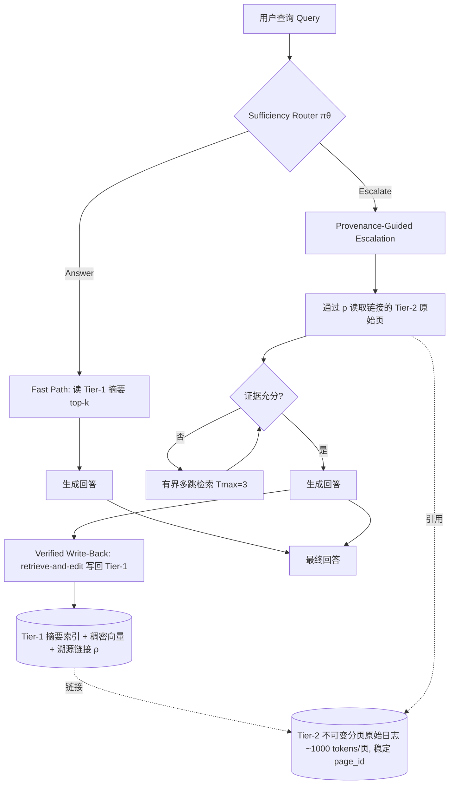

# 从有损到可验证：面向智能体的来源感知分层记忆

## 一、论文基础元数据
- **原文标题**：From Lossy to Verified: A Provenance-Aware Tiered Memory for Agents
- **中文译版**：从有损到可验证：面向智能体的来源感知分层记忆
- **发表渠道**：arXiv 预印本（等级：待补充，截至分析时未标注具体会议/期刊录用信息）
- **发表时间**：2025 年
- **链接**：arXiv:2602.17913
- **作者及核心机构**：Qiming Zhu、Shunian Chen、Rui Yu、Zhehao Wu、Benyou Wang（具体机构待补充，据作者背景推测涉及香港中文大学（深圳）等团队）
- **研究领域**：人工智能 → 大语言模型智能体 / 长时程记忆系统（Agent Long-Term Memory）
- **关联数据集**：
  - **LoCoMo**：长时程多轮对话记忆基准（语言：英文，规模待补充）
  - **LongMemEval**：长时记忆评估基准（语言：英文，规模待补充）
  - 标注方式：均依赖 LLM judge 或人工对回答正确性 / 可恢复性 (S/R) 进行标注

## 二、论文综合评价

### 2.1 量化评分（1-5分，5分为最优）

| 评价维度 | 评分 | 备注 |
| -------- | ---- | ---- |
| 📚 理论基础 | ⭐⭐⭐⭐ | 形式化 write-before-query barrier，理论框架清晰 |
| 🎯 问题核心性 | ⭐⭐⭐⭐⭐ | 直击 Agent 长时记忆压缩与可验证性根本矛盾 |
| 💡 方法创新性 | ⭐⭐⭐⭐ | 来源链接+按需升级+验证写回，组合新颖 |
| ⚙️ 技术壁垒 | ⭐⭐⭐⭐ | Router 两阶段训练与溯源链接构建具工程门槛 |
| 🧪 实验严谨性 | ⭐⭐⭐⭐ | 双基准对比多基线，含消融与错误分析 |
| 🔧 落地可行性 | ⭐⭐⭐⭐ | 显著降 token 与延迟，具备生产可用路径 |
| 🚀 应用前景 | ⭐⭐⭐⭐⭐ | 对话助理、企业知识库、审计场景需求旺盛 |
| 📊 综合评分 | 4.3 | 理论扎实、工程落地路径明确，实验仍在预印本阶段 |

### 2.2 定性综合评价（≤300字）

> 本文聚焦智能体长时程记忆的核心矛盾——写入时压缩先于查询发生，导致关键证据被不可逆丢弃且无法审计。作者形式化该问题为 "write-before-query barrier" 与推理时证据分配问题，提出 **TierMem** 双层记忆框架：Tier-2 为不可变分页原始日志作为真源，Tier-1 为带 **provenance links** 的摘要索引。推理时采用 Fast Path / Escalation / Verified Write-Back 三段协议，并由轻量级 sufficiency router 决定是否升级。在 LoCoMo 与 LongMemEval 上，TierMem 在接近 raw-only 准确率（0.851 vs 0.873）的前提下，输入 token 降低 54.1%、延迟降低 60.7%，并保持可审计可追溯。差异化优势在于把"语义层可损但必须可溯源"作为一等设计原则，将记忆检索从静态缓存升级为按需分配证据的推理过程。关键结论：可验证的分层记忆是兼顾忠实性与成本的有效路径。

## 三、领域本体论映射

| 核心维度 | 具体内容 |
| -------- | -------- |
| 核心研究对象 | 大语言模型智能体的长时程记忆系统（Long-Term Agent Memory） |
| 核心技术路径 | 双层记忆（原始日志层 + 摘要索引层）+ 显式 provenance links + 轻量 sufficiency router + 按需升级检索 |
| 数据/载体形态 | 长时多轮对话轨迹；Tier-2 为固定分页（约 1000 token）的不可变原始日志；Tier-1 为摘要文本 + 稠密向量 + 溯源指针 |
| 核心功能目标 | 在保证回答忠实性与可审计性的前提下，降低长时程记忆检索的 token 消耗与延迟 |
| 验证核心指标 | 回答准确率、Upgrade Rate（R-rate）、Hard Recall、输入 token 数、查询延迟、USR（Unverifiable Omission Rate） |

## 四、核心问题与解决方案

### 4.1 待解决的核心问题

1. **领域级根本问题**：Agent 长时程记忆必须压缩（受上下文长度与成本限制），但压缩发生**在查询之前**（write-before-query barrier），写入时无法预知未来查询，必然产生不可验证的信息遗漏（unverifiable omissions）。
2. **现有方法痛点**：
   - 摘要式记忆（Mem0、LightMem、MemOS 等）成本低但信息有损，容易丢失关键实体、数值、否定词与归因关系；LoCoMo 上 summary-only 错误率高达 24.5%，其中信息缺失占 41.3%、过度泛化占 28.8%。
   - raw-only（直接喂原始日志）虽然忠实度高（LoCoMo 0.873），但 token 与延迟成本巨大，且长上下文易退化。
   - 现有摘要无法追溯，无法验证生成答案是否基于事实，审计困难。
3. **工程落地卡点**：
   - 缺乏在"何时用摘要、何时回原始日志"之间做动态决策的机制。
   - 缺乏摘要到原始证据的稳定、可复用引用（引用漂移问题）。
   - 长对话下写时压缩策略一旦失误，无法事后修正。

### 4.2 核心解决方案

- **理论框架**：将长时记忆检索重构为**推理时证据分配问题**（inference-time evidence allocation），而非写入时一次性压缩；形式化 write-before-query barrier 并引入"可验证性"作为设计目标。
- **核心架构**：**Provenance-Linked 2-Tier Memory (TierMem)**
  - **Tier-2（\(\mathcal{M}_R\)）**：不可变分页原始日志，固定约 1000 token / 页，稳定 page_id，作为审计真源。
  - **Tier-1（\(\mathcal{M}_S\)）**：语义缓存/摘要索引，含摘要文本、稠密 embedding 和 **provenance links \(\rho\)**（指向支撑该摘要的 Tier-2 页 ID）。
  - **同步构建约束**：不存在没有可追溯源头的摘要条目。
- **关键技术**：
  1. **Fast Path**：检索 Tier-1 top-k，router 判 Answer 则直接生成。
  2. **Provenance-Guided Escalation**：router 判 Escalate 时，先通过 \(\rho\) 读取链接的原始页；不足则进行有界多跳检索（\(T_{max}=3\)）。
  3. **Verified Write-Back**：升级成功后，把已验证细节以 retrieve-and-edit 方式写回 Tier-1，并保留来源链。
  4. **Policy Router \(\pi_\theta\)**：输入 query + Tier-1 摘要，输出 Answer/Escalate；两阶段训练 SFT（蒸馏 GPT-5 思维+动作，仅保留与 oracle 标签一致的样本）+ GRPO（成本感知对齐，奖励 = 正确性 − λ_cost·升级成本 − λ_waste·不必要升级惩罚）。
- **创新机制**：
  - 显式 **provenance links** 打通摘要与证据，杜绝"无源摘要"。
  - **Verification-then-write-back** 形成正循环：更多已验证内容进入廉价层，随时间扩大 Fast Path 覆盖率且不损准确率。
  - **分页不可变 + 稳定 ID** 解决上下文增长导致的引用漂移。

### 4.3 核心优势（量化+定性）

1. **性能优势**：LoCoMo 上 Router 达 0.851 准确率，接近 raw-only 的 0.873；LongMemEval 上通过选择性升级缓解摘要方法的压缩损失（Mem0 UOR 约 29.6%）。
2. **效率优势**：输入 token 降低 **54.1%**（3396 vs 7398），延迟降低 **60.7%**（6.76s vs 17.18s）；Router 开销约 678 tokens，匹配 GPT-4.1-mini 准确率且延迟更低。
3. **工程优势**：不可变日志 + provenance links 提供可审计性；轻量 Router（SFT+GRPO）工程开销可控；verified write-back 机制可在生产中持续降本。

## 五、方法与技术架构

### 5.1 核心架构设计

> TierMem 由两层记忆与三段推理协议组成。Tier-2 保存不可变原始分页日志，Tier-1 保存带溯源指针的摘要缓存。每次查询先经 Router 判定，若摘要充分则走 Fast Path 直接回答；否则按 provenance links 升级到 Tier-2，必要时做有界多跳检索；升级成功后把验证结果写回 Tier-1 并在其后保留来源链。

### 5.2 关键技术实现细节

| 技术模块 | 实现路径 | 工程注意事项 |
| -------- | -------- | ------------ |
| Tier-2 不可变分页日志 | 按固定大小约 1000 tokens 分页，每页分配稳定 page_id，写入即封存 | 页粒度影响验证精度；需防止页边界切断关键实体/数值 |
| Tier-1 摘要索引 | 同步生成摘要 + 稠密 embedding + provenance links \(\rho\)（指向支撑页 ID） | 摘要生成质量决定 Fast Path 上限；embedding 模型 / 索引策略待补充 |
| Sufficiency Router \(\pi_\theta\) | 输入 query + Tier-1 摘要，输出 Answer/Escalate；SFT 蒸馏 GPT-5，再 GRPO 成本感知对齐 | 标签由 hindsight 比较 summary-only 与 raw-grounded 得到，S/R 两类样本，双失败丢弃 |
| Provenance-Guided Escalation | 优先读取 \(\rho\) 链接页；不足再作有界多跳检索（\(T_{max}=3\)） | 多跳预算与召回平衡；避免过度升级（R→S 错误）导致成本上升 |
| Verified Write-Back | 升级成功后 retrieve-and-edit 回写 Tier-1，保留来源链 | 需保证写入不回退正确率；编辑冲突/陈旧内容处理待补充 |
| 依赖组件 | LLM（GPT-5 蒸馏来源、GPT-4.1-mini 对比）、稠密检索器、LLM judge | 各模型版本与推理成本需计入 TCO |

### 5.3 架构优缺点

- **优点**：
  - 双层职责清晰：语言层可损但必须可溯源（source of truth vs. derivative index）。
  - provenance links 使摘要成为"可回查证据的索引项"，杜绝无源断言，强化审计。
  - 按需升级在准确率与成本间取得良好折衷，Fast Path 覆盖率随时间上升。
  - 分页不可变设计解决引用漂移，证据单元静态稳定。
- **缺点**：
  - 溯源链接仅到页（~1000 tokens）粒度，验证精度可能受限。
  - Router 存在 false cache hits（占错误集 34.3%），会误导 Fast Path 直接回答。
  - 架构描述中页大小、embedding 模型、检索策略等超参需根据场景调优。
  - 未涉及多跳溯源的更远链、更新/冲突消解、隐私与安全考量。

## 六、实验设计与结果分析

### 6.1 实验基础设置

| 维度 | 内容 |
| ---- | ---- |
| 数据集 | LoCoMo（长时对话记忆）、LongMemEval（长时记忆评估） |
| 基线方法 | Mem0、LightMem、O-mem、MemOS、MemR3、GAM，以及 raw-only、summary-only 上下界 |
| 实验环境 | 待补充（论文未在给定摘要中披露具体硬件 / LLM 版本） |
| 评价指标 | 回答准确率、Upgrade Rate (R-rate)、Hard Recall、输入 token 数、查询延迟、UOR（不可验证遗漏率） |

### 6.2 核心实验结果

| 方法 | 核心指标1（LoCoMo 准确率） | 核心指标2（UOR / 升级率） | 工程指标（token / 延迟） |
| ---- | --------- | --------- | -------------------- |
| raw-only（上界） | 0.873 | — | 7398 tokens / 17.18s |
| summary-only（下界） | 错误率 24.5% | UOR 较高（如 Mem0 约 29.6%） | 低 token，低延迟 |
| Mem0 | 待补充 | UOR ≈ 29.6% | 待补充 |
| LightMem / O-mem / MemOS / MemR3 / GAM | 待补充 | 待补充 | 待补充 |
| **TierMem（本文）** | **0.851** | R-rate 39.0%，Hard Recall 71.7% | **3396 tokens / 6.76s**（Router 开销约 678 tokens） |

### 6.3 消融实验/鲁棒性分析

| 实验变体 | 指标变化 | 核心结论 |
| -------- | -------- | -------- |
| Linked vs. No-Linked（来源指针消融） | 总体 +1.5 pp；升级路径 Acc@R 从 77.5% → 81.7%；Answer 路径不变 | Provenance links 实质提升升级后的 grounding 质量，不损 Fast Path |
| Router 训练：SFT → SFT+GRPO | R-rate 达 39.0%，Hard Recall 71.7%，匹配 GPT-4.1-mini 且延迟更低 | 成本感知对齐有效控制不必要升级 |
| 错误分析（summary-only） | 错误率 24.5%；信息缺失 41.3%、过度泛化 28.8% | 写时压缩是根本误差来源 |
| 错误分析（Router） | false cache hits 占错误集 34.3%；55.7% 属于"已正确升级但下游仍错" | Router 误判与下游生成质量是主要瓶颈 |
| R→S 错误 | 保守过升级，成本增加但通常不损正确性 | 偏好倾向可接受，属安全侧偏差 |

### 6.4 实验结论（工程视角）

TierMem 在标准长时记忆基准上实现了"接近 raw-only 准确率 + 显著成本下降"的折衷，验证了"按需升级 + 验证写回"路线的工程有效性。关键在于：① provenance links 对升级路径收益明确（+4.2 pp Acc@R）；② Router 成本极低（约 678 tokens），可视为可插拔的前置决策模块；③ 主要剩余瓶颈是 Router 的 false cache hits 和升级后的下游生成质量，二者均属可迭代优化项。整体方案对生产环境的可迁移性较好，但完整 TCO 还需结合具体 LLM 与检索后端实测。

## 七、领域贡献与创新点

| 贡献层级 | 具体内容 |
| -------- | -------- |
| 理论贡献 | 形式化 **write-before-query barrier** 与推理时证据分配问题，明确摘要式记忆不可验证遗漏的本质 |
| 方法/架构贡献 | 提出 TierMem 双层来源感知记忆、显式 provenance links \(\rho\)、三阶段推理协议（Fast Path / Escalation / Verified Write-Back） |
| 数据/工具贡献 | 构建 S/R 标签（summary 充分 / raw 可恢复）用于 Router 训练；贡献 router 训练流程（SFT+GRPO）；具体数据集/工具开源信息待补充 |
| 实验/验证贡献 | 在 LoCoMo 与 LongMemEval 上与 Mem0、LightMem、O-mem、MemOS、MemR3、GAM 等基线对比，并提供来源指针消融与详细错误分析 |
| 工程落地贡献 | 证明接近 raw-only 准确率下的 54.1% token 与 60.7% 延迟降低，为可审计长时记忆提供可生产化路径 |

## 八、局限性与风险

| 维度 | 具体描述 | 应对思路 |
| ---- | -------- | -------- |
| 学术局限性 | 预印本阶段（截至分析时未披露正式录用）；Tier-2 溯源粒度为页级（~1000 tokens），未到片段级；未涉及多跳溯源链、更新冲突消解 | 提升溯源粒度至 span 级；扩展多跳溯源；引入版本/冲突管理机制 |
| 工程落地风险 | Router 存在 false cache hits（占错误集 34.3%），可能给出无证据支持的回答；升级后下游生成仍可能出错（占 55.7%）；LLM judge 依赖与成本未量化 | 引入冗余校验或置信度门槛；在 Fast Path 输出附溯源提示；对关键场景强制升级 |
| 伦理/合规风险 | 不可变原始日志可能长期保留用户敏感对话，存在隐私与合规风险；写回机制可能固化偏见或错误信息 | 设计可裁剪 / 可遗忘机制（GDPR 合规）；审计写回来源；对 PII 做脱敏或加密 |

## 九、未来研究/落地方向

| 方向类型 | 具体内容 | 优先级 |
| -------- | -------- | ------ |
| 科研拓展 | 提升写入层关键细节保留率（缓解信息缺失 / 过度泛化）；改进 sufficiency 判断模型以减少 false cache hits；多跳溯源链与冲突消解理论 | 高 |
| 工程优化 | Router 蒸馏到更小模型以进一步降本；探索 span 级 provenance 以提升验证精度；引入缓存淘汰与隐私裁剪机制 | 高 |
| 跨领域适配 | 拓展至多模态 Agent 记忆、代码助手历史、企业知识库审计、医疗/法律等强可追溯需求场景 | 中 |

## 十、关键词与术语表

| 语言 | 关键词 |
| ---- | ------ |
| 中文 | 智能体长时记忆、来源可追溯、分层记忆、推理时证据分配、验证写回、充分性路由、不可验证遗漏、写前查询屏障 |
| 英文 | Agent Long-Term Memory, Provenance-Aware, Tiered Memory, Inference-Time Evidence Allocation, Verified Write-Back, Sufficiency Router, Unverifiable Omissions, Write-Before-Query Barrier |
| 领域专属术语 | **Write-Before-Query Barrier**：写入时压缩先于查询发生、无法预知未来信息需求的结构性缺陷；**Provenance Links (\(\rho\))**：Tier-1 摘要条目指向支撑该摘要的 Tier-2 页 ID 的显式指针；**Verified Write-Back**：升级成功后把已验证细节写回摘要层并保留来源链的机制；**UOR**：不可验证遗漏率；**R-rate**：升级率（Escalation Rate）；**SFT/GRPO**：监督微调 / 群体相对策略优化 |

## 十一、参考文献与关联资源

- **核心参考文献**：Mem0、LightMem、O-mem、MemOS、MemR3、GAM 等相关工作（具体引用条目待补充）
- **补充阅读**：LongMemEval、LoCoMo 基准论文；RAG 与溯源（provenance）相关研究
- **开源代码/工具**：论文中未在给定摘要中披露；待补充

## 十二、阅读者批注

1. **科研启发**：将"记忆检索"从静态缓存问题重构为"推理时证据分配问题"，这一视角转换具有可迁移价值——同样可应用于 RAG、代码库检索、企业知识管理等需要"按需深层检索"的场景。provenance links 的显式建模值得在更细粒度上（span-level）延伸研究。
2. **工程落地思考**：Router 开销仅约 678 tokens，具备作为独立可插拔模块的工程价值；生产环境可将 Tier-2 存储于对象存储 + 向量库指引导航，Tier-1 走内存/Redis。需重点关注 false cache hits 的业务后果，建议对高价值问题强制升级或加置信度门槛。
3. **待验证/存疑点**：① 页级溯源（~1000 tokens）的验证精度是否足以支撑强审计场景；② write-back 的长期收敛性——大量写回是否会导致 Tier-1 摘要与原始证据出现语义漂移；③ 多轮写回后 Fast Path 覆盖率与准确率的演化曲线；④ LLM judge 作为标签来源的偏差与可重复性。
4. **个人/团队应用场景**：可优先在需要"可审计对话记忆"的客服 / 医疗问诊 / 法律咨询 Agent 中试点；对成本敏感的消费级对话助理，可重点测试 Fast Path 覆盖率的增长曲线与 TCO。

## 十三、阅读元信息

| 维度 | 内容 |
| ---- | ---- |
| 阅读日期 | 2026-09-30 20:47 |
| 阅读人 | xPaperReader AI |
| 文档编号 | arxiv-2602.17913 |
| 版本迭代 | v1.0 |