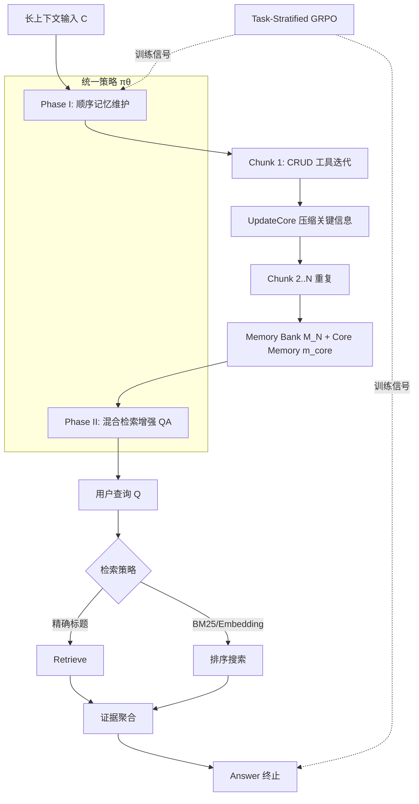

# 学会记忆：面向长上下文推理的记忆智能体端到端训练

## 一、论文基础元数据

| 维度 | 内容 |
| ---- | ---- |
| 原文标题 | Learning to Remember: End-to-End Training of Memory Agents for Long-Context Reasoning |
| 中文译版 | 学会记忆：面向长上下文推理的记忆智能体端到端训练 |
| 发表渠道 | arXiv 预印本（未标注同行评审等级，待补充） |
| 发表时间 | 2025 年（具体月日待补充） |
| 链接 | arXiv:2602.18493 |
| 作者及核心机构 | Kehao Zhang, Shangtong Gui, Sheng Yang, Wei Chen, Yang Feng（具体机构待补充，据作者背景推测涉及国内高校/研究机构） |
| 研究领域 | 一级领域：人工智能 / 自然语言处理；二级子领域：长上下文推理、记忆增强智能体、强化学习与 LLM 智能体训练 |
| 关联数据集 | **Ledger-QA**（自建合成诊断基准）：训练集 H=10，200 样本、6000+ 问题；测试 horizon H=2～500；语言为英文对话+结构化交易记录；标注为程序化生成的真值 ledger 与 8 类聚合问题答案；另使用 TTL、AR、LoCoMo 等长上下文 QA 基准（规模待补充） |

## 二、论文综合评价

### 2.1 量化评分（1-5分，5分为最优）

| 评价维度 | 评分 | 备注 |
| -------- | ---- | ---- |
| 📚 理论基础 | ⭐⭐⭐⭐⭐ | MDP 建模 + GRPO 强化学习框架，理论扎实 |
| 🎯 问题核心性 | ⭐⭐⭐⭐⭐ | 直击长上下文"查询时被动处理"根本痛点 |
| 💡 方法创新性 | ⭐⭐⭐⭐⭐ | Task-Stratified GRPO 实现 one-to-many 记忆优化 |
| ⚙️ 技术壁垒 | ⭐⭐⭐⭐ | 两阶段嵌套采样训练，复现成本较高 |
| 🧪 实验严谨性 | ⭐⭐⭐⭐ | 消融充分、基线多样，但部分基线配置被改写 |
| 🔧 落地可行性 | ⭐⭐⭐ | 延迟仍高于 RAG/Concat，依赖特定硬件 |
| 🚀 应用前景 | ⭐⭐⭐⭐ | 主动记忆管理范式具备广泛迁移潜力 |
| 📊 综合评分 | 4.3 | 选题前沿、方法闭环、实验系统，工程延迟是主要短板 |

### 2.2 定性综合评价（≤300字）

> 本文提出统一记忆智能体 **UMA**，将长上下文推理从"查询时被动检索"重构为"问题未知时主动记忆构建 + 多问题复用"的两阶段范式。核心价值在于：首次用端到端强化学习把 query-agnostic 的记忆维护与下游多问题 QA 效用直接打通，并以 **Task-Stratified GRPO** 解决"记忆一次性构建、多问题共享"的 one-to-many 信用分配难题。配套发布的 **Ledger-QA** 为长时程状态跟踪提供了透明可控的诊断基准。关键结论：显式记忆维护贡献 +13.3 分，RL 训练贡献 +16.2 分，端到端联合训练优于分阶段 +11.2 分；UMA-Specialist 在 H=500 时得分 25.00，为 MemAgent（11.54）的 2 倍以上。差异化优势在于把"记住什么、何时更新、如何检索"统一为一个可学习策略，而非外挂固定记忆模块。

## 三、领域本体论映射

| 核心维度 | 具体内容 |
| -------- | -------- |
| 核心研究对象 | 长上下文推理中的记忆智能体（Memory Agent）与外部结构化记忆管理策略 |
| 核心技术路径 | MDP 建模 → 统一策略 πθ → 两阶段（顺序记忆维护 + 混合检索 QA）→ Task-Stratified GRPO 端到端训练 |
| 数据/载体形态 | 长对话流 + 结构化 key-value Memory Bank（CRUD 操作）+ core memory 摘要 + 原始上下文 chunk |
| 核心功能目标 | 在问题未知时主动构建可复用记忆，支撑多问题长时程状态跟踪与证据聚合 |
| 验证核心指标 | 聚合 QA 准确率（TTL/AR/Ledger-QA）、judge 准确率、端到端耗时、Memory Bank 规模与增速、R² 扩展性拟合度 |

## 四、核心问题与解决方案

### 4.1 待解决的核心问题

1. **领域级根本问题**：长上下文 LLM 与 RAG 均属"查询时被动处理"——上下文被当作静态原料，推理延迟到 query 到达才启动，缺乏跨会话的持久状态维护能力。
2. **现有方法痛点**：
   - RAG 重复处理检索段落，导致状态跟踪、矛盾消解、证据聚合任务上准确率下降与计算冗余；
   - 现有记忆智能体多针对单个已知问题优化记忆，无法应对"记忆先构建、后被多个独立 QA 共享"的 one-to-many 场景；
   - 长时程状态跟踪缺乏透明、可控的诊断基准。
3. **工程落地卡点**：
   - 记忆构建阶段无法细粒度归因到单个 CRUD 操作，会话级奖励导致信用分配粗糙；
   - 延迟与扩展性依赖特定硬件；
   - 长期记忆可能保留敏感个人信息，合规风险高。

### 4.2 核心解决方案

- **理论框架**：将记忆智能体建模为 MDP，状态 = core memory + 结构化 Memory Bank + 当前焦点 + 交互历史；动作分为记忆阶段（Add/Update/Delete/Retrieve/List/UpdateCore）与 QA 阶段（BM25/Embedding/Retrieve/List/Answer）。
- **核心架构**：**UMA（Unified Memory Agent）** 两阶段流程——Phase I 顺序记忆维护（逐 chunk CRUD，末以 UpdateCore 压缩关键信息）；Phase II 混合检索增强 QA（结合 Memory Bank 精确检索 + 原始上下文 BM25/Embedding 检索）。
- **关键技术**：
  - 终端动作 `UpdateCore` 与 `Answer` 由纯文本响应隐式触发，而非显式工具调用；
  - **Task-Stratified GRPO**：嵌套轨迹采样（G 条记忆轨迹 × M 个 QA 会话），记忆奖励 = 工具有效性 + 下游 QA 平均结果；两层优势归一化（记忆会话全局归一化，QA 会话按同一问题分组归一化）。
- **创新机制**：把 query-agnostic 记忆构建与多问题 QA 效用端到端联合，消除问题难度差异对优势估计的干扰。

### 4.3 核心优势（量化+定性）

1. **性能优势**：16k 预算下 UMA-Generalist 在 TTL/AR 上取得最高聚合分；UMA-Specialist 在 Ledger-QA H=500 达 25.00（MemAgent 11.54）；消融中端到端比分离训练高 11.2 分，RL 比无 RL 高 16.2 分。
2. **效率优势**：528k token、10 查询下 UMA-Generalist 耗时 107.3s，比 Mem1 快 3.4×、比 MemAgent 快 44.3×、比 Mem-T 快 80.2×；H=500 时 Memory Bank 仅 283.96 KB，为原始上下文的 24.3%。
3. **工程优势**：记忆构建随输入规模近似线性增长（R²=0.995）；Ledger-QA 中 92.2% 的 QA trace 仅依赖 Memory Bank，结构化记忆是默认访问路径，可显著降低原始上下文依赖。

## 五、方法与技术架构

### 5.1 核心架构设计

> UMA 将一次长上下文处理拆为两个阶段：Phase I 在问题未知时逐 chunk 维护结构化记忆；Phase II 针对每个用户查询，基于完整记忆与原始上下文混合检索作答。统一策略 πθ 同时驱动两阶段，通过 Task-Stratified GRPO 联合优化。

输入拼接格式：`[系统指令 I_sys, 核心记忆 m_core, 当前焦点 x_t, 交互历史 h_t]`

### 5.2 关键技术实现细节

| 技术模块 | 实现路径 | 工程注意事项 |
| -------- | -------- | ------------ |
| 顺序记忆维护（Phase I） | 逐 chunk 迭代调用 A_mem 工具（Add/Update/Delete/Retrieve/List），结果写入历史，最终 UpdateCore 压缩 | Update 占 Add/Update 写入的 32.2%，需防止状态陈旧/冲突 |
| 混合检索 QA（Phase II） | 焦点切换至用户查询，调用 A_qa（BM25/Embedding/Retrieve/List/Answer） | 92.2% QA trace 仅用 Memory Bank，需保证结构化索引质量 |
| Task-Stratified GRPO | 嵌套采样 G 条记忆轨迹 × M 个 QA 会话；记忆奖励 = 工具奖励 + 下游 QA 平均；QA 奖励 λ=0.5 | 两层优势归一化需严格按问题分组，避免难度泄漏 |
| 终端动作隐式触发 | UpdateCore / Answer 由纯文本响应触发，非显式工具调用 | 解析逻辑需鲁棒，防止误触发或漏触发 |
| Ledger-QA 数据生成 | 采样日期+消费意图 → LLM 联合生成对话+交易记录 → 程序化生成 8 类聚合问题 → 可选 LLM 改写 | 依赖 LLM 与 JSON 解析，可能引入噪声；日期/意图采样影响泛化 |
| 依赖组件 | Qwen/Qwen3-4B-Instruct-2507 为统一骨干；特殊记忆模型按原配置（Mem1 7B、Mem-α 4B、Mem-T 4B） | 基线 QA 模块统一替换为 4B 以保证公平，但需谨慎解读 |

### 5.3 架构优缺点

- **优点**：
  - 两阶段解耦清晰，记忆构建与 QA 复用职责分明；
  - 结构化 + 语义混合检索兼顾精确证据与模糊召回；
  - 端到端强化学习使记忆策略直接对齐下游效用，避免人工设计记忆规则；
  - Memory Bank 体积可控（24.3% 原始上下文），扩展性近似线性。
- **缺点**：
  - 延迟显著高于 Concat/RAG，难以满足低延迟在线场景；
  - 会话级奖励无法细粒度归因到单个 CRUD 操作，信用分配仍有提升空间；
  - 单智能体 + 固定工具接口，灵活性与可扩展性受限；
  - Ledger-QA 为合成基准，与真实世界完整代理存在 gap。

## 六、实验设计与结果分析

### 6.1 实验基础设置

| 维度 | 内容 |
| ---- | ---- |
| 数据集 | Ledger-QA（自建，训练 H=10，200 样本/6000+ 问题，测试 H=2～500）；TTL、AR、LoCoMo（长上下文 QA 基准，规模待补充） |
| 基线方法 | Concat、RAG、MemAgent、MemAgent-woq、A-MEM、Mem1、Mem-α、Mem-T |
| 实验环境 | 预算 16k token（对比 8k/32k），10 查询；硬件细节待补充 |
| 评价指标 | 聚合 QA 准确率（TTL/AR/Ledger-QA）、judge 准确率、端到端耗时、Memory Bank 条目数/体积、扩展性 R² |

### 6.2 核心实验结果

| 方法 | 核心指标1（Ledger-QA H=500 得分） | 核心指标2（TTL/AR 聚合分） | 工程指标（528k token / 10 查询耗时） |
| ---- | --------- | --------- | -------------------- |
| Concat | 待补充 | 待补充 | 快于 UMA（具体待补充） |
| RAG | 待补充 | 待补充 | 快于 UMA（具体待补充） |
| Mem1 | 待补充 | 待补充 | ~365s（UMA 的 3.4×） |
| MemAgent | 11.54 | 待补充 | ~4754s（UMA 的 44.3×） |
| Mem-T | 待补充 | 待补充 | ~8609s（UMA 的 80.2×） |
| **UMA-Generalist** | 零样本迁移可用 | **最高聚合分** | **107.3s** |
| **UMA-Specialist** | **25.00** | 任务适配后进一步提升 | 待补充 |

> 注：Mem1/MemAgent/Mem-T 耗时为按倍率反推的近似值，原始数据待补充。

### 6.3 消融实验/鲁棒性分析

| 实验变体 | 指标变化 | 核心结论 |
| -------- | -------- | -------- |
| 去掉 Phase I 显式记忆维护 | -13.3 分 | 显式记忆维护是性能关键来源 |
| 去掉 RL 训练 | -16.2 分 | 强化学习训练贡献显著 |
| 全局优势归一化（替代任务分层） | -5.9 分 | 按问题分层归一化消除难度差异有效 |
| 分离训练记忆与 QA | -11.2 分 | 端到端联合训练优于分阶段 |
| 关闭原始上下文检索 | TTL/AR 大降，Ledger-QA 小降 | 结构化记忆是默认路径，原始上下文对通用任务仍重要 |
| 预算 16k vs 8k vs 32k | 16k 优于 8k；32k 增益有限、成本更高 | 16k 为性价比最优点 |

### 6.4 实验结论（工程视角）

- **显式记忆维护 + RL 端到端训练是双引擎**，二者缺一都会导致 10 分以上性能衰减；
- **任务分层优势归一化是必要设计**，否则问题难度差异会污染梯度信号；
- **结构化 Memory Bank 已成为主访问路径**（92.2%），原始上下文检索退居辅助，意味着工程上可优先优化记忆索引质量；
- **16k 预算是甜点**，盲目扩大上下文窗口收益递减；
- **延迟仍是最大工程瓶颈**，比 RAG/Concat 慢，但比同类记忆智能体快 1～2 个数量级，适合离线/准实时长时程场景。

## 七、领域贡献与创新点

| 贡献层级 | 具体内容 |
| -------- | -------- |
| 理论贡献 | 将 one-to-many 记忆优化问题形式化为 MDP，并提出 Task-Stratified GRPO 解决嵌套信用分配 |
| 方法/架构贡献 | UMA 统一两阶段记忆智能体：顺序记忆维护 + 混合检索增强 QA，终端动作隐式触发 |
| 数据/工具贡献 | Ledger-QA 合成诊断基准，支持 H=2～500 长时程状态跟踪评测，完全透明可控 |
| 实验/验证贡献 | 在 TTL/AR/Ledger-QA 上系统对比 8 类基线，提供完整消融与效率-扩展性分析 |
| 工程落地贡献 | 证明主动学习式记忆管理可作为长上下文窗口和查询时检索的互补方案，Memory Bank 体积仅 24.3% 原始上下文 |

## 八、局限性与风险

| 维度 | 具体描述 | 应对思路 |
| ---- | -------- | -------- |
| 学术局限性 | 单智能体、固定工具接口；Ledger-QA 为合成诊断基准；会话级奖励无法细粒度归因到单个 CRUD 操作 | 探索多智能体协作、可学习工具接口、细粒度过程奖励 |
| 工程落地风险 | 延迟明显高于 RAG/Concat；扩展性依赖特定硬件；记忆形成错误占比 64.9%（H=50 时 57 个错误中） | 优化推理引擎、引入缓存与异步记忆维护、加强写入校验 |
| 伦理/合规风险 | 长期记忆可能保留敏感个人信息，存在隐私泄露与滥用风险 | 知情同意、最小化存储、保留期限、访问控制、可检查/更正/删除；Ledger-QA 全合成无真实财务记录 |

## 九、未来研究/落地方向

| 方向类型 | 具体内容 | 优先级 |
| -------- | -------- | ------ |
| 科研拓展 | 细粒度过程奖励（CRUD 级信用分配）、多智能体记忆协作、真实世界长期记忆基准 | 高 |
| 工程优化 | 降低端到端延迟（异步记忆、增量压缩）、Memory Bank 索引加速、错误写入检测与回滚 | 高 |
| 跨领域适配 | 向多轮客服、个人助理、医疗/法律长文档跟踪、Agent 长期任务规划迁移 | 中 |

## 十、关键词与术语表

| 语言 | 关键词 |
| ---- | ------ |
| 中文 | 长上下文推理、记忆智能体、统一记忆智能体、任务分层 GRPO、结构化记忆库、混合检索、端到端强化学习、长时程状态跟踪 |
| 英文 | Long-Context Reasoning, Memory Agent, Unified Memory Agent (UMA), Task-Stratified GRPO, Memory Bank, Hybrid Retrieval, End-to-End RL, Long-Horizon State Tracking |
| 领域专属术语 | **UMA**：统一记忆智能体，两阶段（记忆维护+QA）共享一个策略；**Task-Stratified GRPO**：按记忆会话与问题分组分别归一化优势的 GRPO 变体；**Ledger-QA**：面向账本式累积状态跟踪的合成诊断基准；**Core Memory**：高层摘要记忆，用于跨 chunk 状态推进；**Memory Bank**：结构化 key-value 外部记忆，支持 CRUD；**UpdateCore/Answer**：隐式终端动作，由纯文本响应触发；**one-to-many 记忆**：一次构建、多问题复用的记忆优化设定 |

## 十一、参考文献与关联资源

- **核心参考文献**：GRPO（DeepSeek 系）、MemAgent、Mem1、Mem-α、Mem-T、A-MEM、LoCoMo、TTL/AR 长上下文基准（具体引用待补充）
- **补充阅读**：检索增强生成（RAG）综述、LLM 智能体强化学习、长上下文窗口扩展技术
- **开源代码/工具**：待补充（论文未在提供片段中给出代码仓库链接）

## 十二、阅读者批注

1. **科研启发**：将"记忆构建"与"记忆使用"统一到一个 RL 策略中，并通过任务分层优势归一化解决多问题复用难题，这一思路可迁移到任何"先建资源、后多任务消费"的场景（如知识库构建、代码索引、Agent 工具链预热）。
2. **工程落地思考**：UMA 的延迟虽比同类记忆智能体快 1～2 个数量级，但仍慢于 RAG/Concat；实际部署建议采用"离线记忆维护 + 在线混合检索"的异步架构，把 Phase I 放在低峰期执行。
3. **待验证/存疑点**：
   - 基线 QA 模块被统一替换为 Qwen3-4B，虽然提升公平性，但可能低估原基线（如 Mem-α 原用 Qwen3-32B）的真实能力，需谨慎解读对比结论；
   - Ledger-QA 为合成基准，H=50 时 judge 准确率仅 45.71%，与真实场景的泛化 gap 需进一步验证；
   - 记忆形成错误占 64.9%，说明写入质量控制仍是薄弱环节，论文未给出系统性解决方案。
4. **个人/团队应用场景**：适用于需要跨会话持久跟踪的 Agent 场景，如个人财务助手、长期项目状态跟踪、多轮客服工单聚合、法律/医疗长文档证据链维护。

## 十三、阅读元信息

| 维度 | 内容 |
| ---- | ---- |
| 阅读日期 | 2026-09-30 20:50 |
| 阅读人 | xPaperReader AI |
| 文档编号 | arxiv-2602.18493 |
| 版本迭代 | v1.0 |