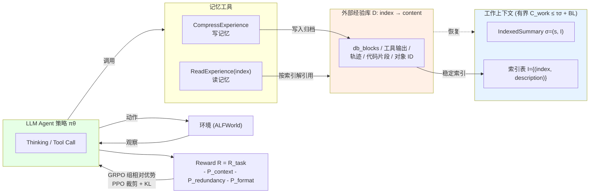

# Memex(RL)：通过索引经验记忆扩展长程 LLM 智能体

## 一、论文基础元数据
- **原文标题**：Memex(RL): Scaling Long-Horizon LLM Agents via Indexed Experience Memory
- **中文译版**：Memex(RL)：通过索引经验记忆扩展长程 LLM 智能体
- **发表渠道**：arXiv 预印本（待补充：未标注具体会议/期刊等级）
- **发表时间**：2025 年
- **链接**：arXiv:2603.04257
- **作者及核心机构**：Zhenting Wang、Huancheng Chen、Jiayun Wang、Wei Wei（机构信息待补充）
- **研究领域**：
  - 一级领域：人工智能 / 大语言模型
  - 二级子领域：LLM Agent、长程任务决策、强化学习（RL）、上下文/记忆管理
- **关联数据集**：修改版 ALFWorld（训练集 3553 个任务；语言：英文；标注：环境交互式任务，含隐藏命令/隐藏初始观测等改造以强化记忆依赖）

## 二、论文综合评价
### 2.1 量化评分（1-5分，5分为最优）

| 评价维度 | 评分 | 备注 |
| -------- | ---- | ---- |
| 📚 理论基础 | ⭐⭐⭐⭐⭐ | 给出两个形式化命题，含最优性等价与有界性证明 |
| 🎯 问题核心性 | ⭐⭐⭐⭐⭐ | 直击长程 Agent 上下文膨胀与证据丢失核心矛盾 |
| 💡 方法创新性 | ⭐⭐⭐⭐⭐ | 索引摘要+外部全保真归档+RL学压缩检索，范式新 |
| ⚙️ 技术壁垒 | ⭐⭐⭐⭐ | 需 MoE 大模型 RL 训练栈、INT4+QAT、分段信用分配 |
| 🧪 实验严谨性 | ⭐⭐⭐ | 仅修改版 ALFWorld 单一环境，缺少多任务/多基线对比 |
| 🔧 落地可行性 | ⭐⭐⭐⭐ | 接口与训练流程清晰，但外部记忆库运维成本未展开 |
| 🚀 应用前景 | ⭐⭐⭐⭐ | 面向长程 Agent 通用痛点，跨开放任务仍待验证 |
| 📊 综合评分 | 4.3 | 理论扎实、机制新颖，实验覆盖尚浅，属高潜力方向 |

### 2.2 定性综合评价（≤300字）
> 该文针对长程 LLM Agent 在固定上下文窗口下"轨迹膨胀—远距证据失活"的根本矛盾，提出索引经验记忆（Indexed Experience Memory）：工作上下文只保留紧凑的索引化摘要 σ=(s, I)，全保真证据（工具输出、轨迹、对象 ID 等）归档至外部存储 D 并以稳定索引引用，通过 `CompressExperience` 压缩、`ReadExperience` 按需解引用。MemexRL 进一步用奖励塑形（上下文溢出、冗余工具调用、格式错误惩罚）+ 组相对优势 PPO 优化压缩与检索策略。理论证明 B-有界解引用可无损等价全上下文最优策略，且工作上下文有界、压缩比随历史线性增长。实验上成功率 24.22%→85.61%，峰值上下文 16934→9634 tokens。差异化在于"压缩不丢证据、按索引精确回访"，将记忆管理内化为可学习策略。

## 三、领域本体论映射
| 核心维度 | 具体内容 |
| -------- | -------- |
| 核心研究对象 | 长程工具型 LLM Agent 的上下文/经验记忆管理 |
| 核心技术路径 | 索引化经验记忆 + 强化学习（GRPO/PPO 混合）策略优化 |
| 数据/载体形态 | 环境交互轨迹、工具调用输出、结构化经验块（db_blocks）、索引化摘要 |
| 核心功能目标 | 在固定上下文窗口下支持无限历史长度、证据可精确回访的长程决策 |
| 验证核心指标 | 任务成功率、峰值工作上下文 tokens、压缩比、惩罚值、压缩/读取调用次数 |

## 四、核心问题与解决方案
### 4.1 待解决的核心问题
1. **领域级根本问题**：LLM Agent 在长程任务中轨迹持续累积（观察、动作、推理、工具输出），受固定上下文窗口约束，导致上下文膨胀、推理成本上升；同时远处证据即使保留在上下文中也难以被有效利用。
2. **现有方法痛点**：依赖上下文截断或有损摘要压缩（如 MemGPT、MemoryBank、MEM1、MemAgent、Memory-R1、SUPO、ReSum、FoldGRPO、AgentFold），会不可逆丢失后续子任务可能需要的精确证据（日志、思考过程、对象 ID、中间工具输出）。
3. **工程落地卡点**：如何在压缩上下文的同时不丢失可精确回访的证据；如何自动学习"何时压缩、压缩什么、如何索引、何时读取"而非固定启发式；如何将记忆管理效率纳入可训练信号而非人工规则。

### 4.2 核心解决方案
- **理论框架**：将记忆定义为 `(IndexedSummary, D)`：IndexedSummary σ=(s, I)，s 为可执行进度状态，I={(index, description)} 将语义描述绑定外部索引；D: index→content 保存全保真证据。给出**命题1**（B-有界解引用可匹配全上下文最优策略）与**命题2**（工作上下文有界、压缩比至少线性增长）的双重理论保证。
- **核心架构**：Memex 智能体循环 + 外部经验库 D；操作集合为 `CompressExperience`（写记忆）与 `ReadExperience(index)`（读记忆）；工作上下文重写为 `[system, task, IndexedSummary]`。
- **关键技术**：
  - 软触发压缩（每步附加上下文状态，接近阈值时警告，不强制压缩，由 RL 学习时机）；
  - 奖励塑形：`R = R_task - P_context - P_redundancy - P_format`；
  - 轨迹按压缩边界分段，各段独立训练共享最终奖励，GRPO 做信用分配；
  - PPO-style 裁剪目标 + KL 正则（π_ref），组相对归一化优势 `A^(g)`；
  - 两阶段训练：监督 warm-start + RL refine（message-only 接口）。
- **创新机制**：压缩上下文但不丢弃证据；用稳定索引按需恢复；代理不仅学习"何时压缩"，还学习"归档什么、如何索引、何时精确读取"。

### 4.3 核心优势（量化+定性）
1. **性能优势**：修改版 ALFWorld 上任务成功率从 24.22% 提升至 85.61%（提升 3.5 倍以上）；rollout 成功率从约 20% 升至 90% 以上；总惩罚从约 -0.4 改善到约 -0.1。
2. **效率优势**：峰值工作上下文从 16934.46 tokens 降至 9634.47 tokens（减少约 43%，接近 8000 tokens 惩罚阈值）；理论上压缩比 ρ 随完整历史增长至少线性增长，工作上下文与有效上下文计算均有界。
3. **工程优势**：message-only 统一接口降低工程复杂度；token-in-token-out agent loop 避免轮次间重新 tokenization；INT4 推理 + QAT 大幅降低 rollout 成本；RL 使 `ReadExperience` 从约 1 次升至 6~7 次、`CompressExperience` 从约 6.5 次降至约 3 次，代理更选择性压缩并偏向显式检索而非反复改写上下文。

## 五、方法与技术架构
### 5.1 核心架构设计
> 系统由三部分组成：**上下文内紧凑状态**（σ = 可执行进度 s + 索引表 I）、**外部全保真经验库 D**（index→content 映射）、**Memex 智能体循环**（通过 CompressExperience/ReadExperience 两个记忆工具与主 Agent 交互）。工作上下文始终被重写为 `[system, task, IndexedSummary]`，压缩时把选定内容写入 D 并绑定稳定索引，需要时按索引解引用追加原始证据。RL 层通过组采样、组相对优势、PPO 裁剪与 KL 正则学习压缩/检索策略。

### 5.2 关键技术实现细节
| 技术模块 | 实现路径 | 工程注意事项 |
| -------- | -------- | ------------ |
| CompressExperience | 将选定内容写入外部 D，工作上下文重写为 `[system, task, IndexedSummary]`，绑定稳定索引 | 摘要截断至 300 tokens（本实验设置），迫使细节进入结构化 db_blocks；索引需保证稳定可解析 |
| ReadExperience(index) | 按索引解引用，将精确归档内容追加回上下文；每步解引用数 ≤ B | 需控制单块长度 L 与解引用次数以保证有界上下文；避免索引解码歧义 |
| 奖励塑形 | `R = R_task - P_context - P_redundancy - P_format`；P_context 溢出、P_redundancy 重复工具调用、P_format 格式错误 | 阈值设 8K，上下文窗口 32K；惩罚系数需与任务奖励平衡以免过度抑制探索 |
| 软触发压缩 | 每步附加上下文状态，接近阈值时警告但不强制压缩 | 让策略学习主动压缩时机；避免硬触发导致的非最优决策 |
| 分段轨迹 + GRPO | 按压缩边界分段，各段独立训练共享最终奖励，组相对归一化优势 | 早期压缩决策需获得梯度信号，避免信用分配退化 |
| PPO-style 优化 | 组采样 G 个 rollout，裁剪 surrogate + KL 正则（π_ref） | clip ratio 2.0，KL 惩罚 λ_KL=0.001；超参 G、η、β 需调优 |
| 两阶段训练 | 监督 warm-start（示范 σ/Blocks） + RL refine（message-only 接口） | 预训练策略需具备较强工具使用能力（如 Qwen3-30B-A3B-Thinking-2507） |
| 深度技术依赖 | INT4 推理 rollout + QAT 反向传播；TIS 截断重要性采样；token-in-token-out agent loop | MoE 架构（30B，128 专家，top-8 路由，约 3B 激活）；优化器 Adam，lr 5e-6，weight decay 0.1，batch 32 |
| 依赖组件 | Slime 训练框架，Qwen3 MoE 基座，ALFWorld 环境 | 多轮 agent 循环需避免轮次间重新 tokenization |

### 5.3 架构优缺点
- **优点**：
  1. 工作上下文有界（C_work ≤ τσ + BL），有效计算成本可控，支持无损长期运行；
  2. 压缩不丢证据，通过稳定索引支持精确回访，避免有损摘要的证据丢失；
  3. 压缩与检索是 RL 可学习策略，而非固定启发式，灵活适应任务；
  4. 提供理论保证（最优性等价 + 有界性），工程含义明确；
  5. message-only 接口使部署协议简单、与现有工具调用框架兼容。
- **缺点**：
  1. 理论依赖较强的 B-bounded decision-sufficiency 假设，少量解引用足以恢复决策证据；
  2. 外部经验库的构建、检索效率、长期维护与存储成本未充分展开；
  3. 索引质量与稳定性依赖模型能力与训练稳定性，早期训练可能因索引混乱导致检索失败；
  4. 需要两阶段训练（warm-start + RL），训练管线复杂；
  5. 实验仅在修改版 ALFWorld 单一环境验证，泛化性存疑。

## 六、实验设计与结果分析
### 6.1 实验基础设置
| 维度 | 内容 |
| ---- | ---- |
| 数据集 | 修改版 ALFWorld（训练集 3553 个任务）；四项刻意改造：①隐藏可执行命令（移除有效动作列表与对象 ID）；②隐藏初始观测（迫使显式 `look`）；③`look` 每 episode 限一次；④CompressExperience 摘要截断至 300 tokens |
| 基线方法 | 待补充（未在给定材料中列出对比基线；相关工作提及 MemGPT、MemoryBank、MEM1、MemAgent、Memory-R1、SUPO、ReSum、FoldGRPO、AgentFold 作为差异化对象，但未提供统一对比结果） |
| 实验环境 | 基础模型 Qwen3-30B-A3B-Thinking-2507（MoE，30B 总参，128 专家 top-8，约 3B 激活）；训练框架 Slime；INT4 推理 + QAT 反向传播（前向 INT4，梯度 BF16 累积）；上下文窗口 32K，惩罚阈值 8K；优化器 Adam，lr 5e-6，weight decay 0.1，KL λ=0.001；batch 32，GRPO group size 8 |
| 评价指标 | 任务成功率、峰值工作上下文 tokens、总惩罚值、CompressExperience/ReadExperience 调用次数、压缩比 ρ（理论指标） |

### 6.2 核心实验结果
| 方法 | 核心指标1（任务成功率） | 核心指标2（峰值工作上下文） | 工程指标（算力/耗时） |
| ---- | --------- | --------- | -------------------- |
| RL 前（初始策略） | 24.22% | 16934.46 tokens | 待补充（训练 rollout 成功率约 20%，总惩罚约 -0.4） |
| RL 训练后（MemexRL） | 85.61% | 9634.47 tokens | INT4 推理 + QAT；峰值上下文接近 8K 惩罚阈值；总惩罚约 -0.1 |
| 提升幅度 | +3.5 倍以上 | -43% | 待补充 |

### 6.3 消融实验/鲁棒性分析
| 实验变体 | 指标变化 | 核心结论 |
| -------- | -------- | -------- |
| 训练中 CompressExperience 调用频率 | 每 episode 约 6.5 次 → 约 3 次 | RL 使代理更选择性压缩，避免频繁改写上下文 |
| 训练中 ReadExperience 调用频率 | 约 1 次 → 约 6–7 次 | RL 使代理更多依赖显式检索而非重跑工具，索引化经验记忆机制被真正激活 |
| 任务成功率（rollout，训练过程） | 约 20% → 90%+ | Memex RL 能有效教会模型使用 Memex 智能体循环 |
| 总惩罚幅度 | -0.4 → 约 -0.1 | 任务执行更优，峰值工作上下文被策略性压缩 |
| 理论命题验证 | 命题1（J(π_IEM)=J(π*)）、命题2（C_work ≤ τσ+BL, ρ→∞） | 提供最优性等价与有界性的形式化保证（未提供数值消融） |

> 说明：给定材料未提供结构化消融实验对照表（如去掉 P_context、去掉 ReadExperience 的对照结果），上述分析主要来自训练曲线与行为统计。真正的消融对比标记为**待补充**。

### 6.4 实验结论（工程视角）
- 在人为强化记忆依赖的长程 ALFWorld 中，MemexRL 同时实现"成功率提升"与"上下文峰值下降"的双赢；
- 训练过程显示模型逐渐从"频繁压缩+远离检索"迁移到"选择性压缩+积极检索"的行为模式，说明 RL 有效内化了记忆管理策略；
- 峰值上下文稳定贴近 8K 惩罚阈值，说明奖励塑形对上下文预算控制有直接可观测的约束作用；
- 由于缺乏多环境、多基线、结构化消融，结论的泛化性和方法必要性的工程证据强度受限。

## 七、领域贡献与创新点
| 贡献层级 | 具体内容 |
| -------- | -------- |
| 理论贡献 | 提出两条形式化命题：命题1（B-有界解引用可匹配全上下文最优策略，J(π_IEM)=J(π*)）；命题2（工作上下文有界 C_work ≤ τσ + BL，压缩比 ρ 随完整历史增长至少线性增长） |
| 方法/架构贡献 | 提出 Indexed Experience Memory 记忆范式（IndexedSummary + 外部全保真存储 D）；提出 MemexRL 训练框架（奖励塑形 + 组相对优势 + PPO 裁剪 + KL 正则 + 分段信用分配） |
| 数据/工具贡献 | 构造修改版 ALFWorld 长程记忆依赖评测环境（隐藏命令、隐藏初始观测、限制 look、摘要截断 300 tokens） |
| 实验/验证贡献 | 在强化记忆依赖环境中验证成功率 24.22%→85.61%、峰值上下文 16934→9634 tokens；展示 RL 行为迁移（压缩↓检索↑） |
| 工程落地贡献 | message-only 统一接口、token-in-token-out agent loop、INT4+QAT 高效 rollout、软触发压缩等工程实践，对长程 Agent 系统设计具有参考价值 |

## 八、局限性与风险
| 维度 | 具体描述 | 应对思路 |
| ---- | -------- | -------- |
| 学术局限性 | 理论依赖 B-bounded decision-sufficiency 假设（少量解引用足以恢复决策证据），该假设在开放复杂任务中未必成立；实验仅在单一修改版 ALFWorld，跨任务/跨环境泛化未验证；缺少结构化消融实验 | 在更开放任务集（WebArena、SWE-bench 类）验证；放宽假设构造近似最优界；补充系统性消融 |
| 工程落地风险 | 外部经验库的构建、检索效率、长期维护与存储成本未展开；索引质量/稳定性依赖模型能力；两阶段训练（warm-start+RL）管线复杂；MoE+RL 训练资源需求高 | 设计分层/向量化索引与压缩存档策略；加入索引一致性校验与回退机制；蒸馏小模型承载推理 |
| 伦理/合规风险 | 外部经验库可能持久化用户敏感数据、工具输出中的隐私信息；长期记忆可能导致信息泄露或不当复用 | 引入记忆脱敏、访问控制、可删除/可审计机制；对归档内容实施分级与生命周期管理 |

## 九、未来研究/落地方向
| 方向类型 | 具体内容 | 优先级 |
| -------- | -------- | ------ |
| 科研拓展 | 放宽 B-bounded 假设、探索非有界决策充分性下的近似最优记忆策略；在开放多任务环境验证泛化；引入信息论度量研究压缩-检索最优边界 | 高 |
| 工程优化 | 构建高效外部经验库（向量/混合索引）；降低存储与检索延迟；将 Memex 思路蒸馏至更小模型；设计索引冲突与一致性维护协议 | 高 |
| 跨领域适配 | 迁移至代码 Agent（SWE-bench）、网页 Agent（WebArena）、多模态 Agent、企业长流程自动化场景 | 中 |

## 十、关键词与术语表
| 语言 | 关键词 |
| ---- | ------ |
| 中文 | 长程 LLM 智能体、索引经验记忆、上下文压缩、按需解引用、强化学习、信用分配、工作上下文有界、经验库 |
| 英文 | Long-Horizon LLM Agents, Indexed Experience Memory, Context Compression, On-demand Dereference, Reinforcement Learning, Credit Assignment, Bounded Working Context, Experience Store |
| 领域专属术语 | **IndexedSummary（σ=(s,I)）**：上下文内紧凑状态，s 为可执行进度，I 为索引-描述绑定表；**D: index→content**：外部全保真经验库；**CompressExperience**：将选定内容写入 D 并重写工作上下文的写记忆操作；**ReadExperience(index)**：按索引解引用恢复原始证据的读记忆操作；**B-bounded decision-sufficiency**：存在选择器返回至多 B 个索引即可恢复决策所需证据的充分性假设；**MemexRL**：训练压缩/检索策略的 RL 框架；**GRPO**：组相对策略优化；**TIS（Truncated Importance Sampling）**：截断重要性采样；**QAT**：量化感知训练 |

## 十一、参考文献与关联资源
- **核心参考文献**：
  - MemGPT（分层记忆与虚拟上下文管理）
  - MemoryBank（长期记忆）
  - MEM1、MemAgent、Memory-R1（Agent 记忆相关）
  - SUPO、ReSum、FoldGRPO、AgentFold（长程 Agent 训练与上下文折叠）
  - GRPO / PPO（RL 优化算法）
  - ALFWorld（交互式任务环境）
- **补充阅读**：待补充（完整参考文献列表未在给定材料中提供）
- **开源代码/工具**：
  - 训练框架 Slime（文中提及）
  - Qwen3-30B-A3B-Thinking-2507（基座模型）
  - 代码仓库信息待补充

## 十二、阅读者批注
1. **科研启发**：
   - "压缩但不丢弃、用索引按需精确回访"这一思想可推广到 RAG、长文档推理、多轮对话记忆等场景；
   - 将"记忆管理效率"直接纳入 RL 回报（P_context / P_redundancy / P_format）的设计值得借鉴，可视为对 Agent 系统"过程奖励"的一种高效形式化；
   - 分段轨迹 + 共享最终奖励的信用分配思路，对超长程任务的 RL 训练具有通用参考价值。
2. **工程落地思考**：
   - 外部经验库是核心工程资产，需重点设计索引结构、检索路径、存储生命周期与一致性协议；
   - INT4 推理 + QAT 反向传播对降低长程 rollout 成本非常关键，可作为同类系统的默认配置参考；
   - message-only 接口与 token-in-token-out loop 是工程实现简洁性的两个关键选择，值得复用；
   - 软触发压缩（警告而非强制）的工程实现是让策略学习主动时机的关键，简单但有效。
3. **待验证/存疑点**：
   - B-bounded decision-sufficiency 在真实开放任务中是否成立？B 的合适量级如何确定？
   - 外部经验库规模增大后，检索延迟与索引冲突如何影响端到端性能？
   - 缺少与 MemGPT / Memory-R1 / AgentFold 等在统一环境的数值对比，差异化优势的实验证据强度待加强；
   - 摘要截断至 300 tokens 是任务特化设置，是否通用？
4. **个人/团队应用场景**：
   - 长流程企业自动化（多轮工具调用、跨会话任务）；
   - 代码仓库级 Agent 任务（需保留文件片段、日志、编译错误的精确证据）；
   - 多会话客服/研究助手，需要长期稳定可回访经验；
   - 可作为现有 Agent 框架（如 ReAct/LangGraph）的记忆层扩展组件。

## 十三、阅读元信息
| 维度 | 内容 |
| ---- | ---- |
| 阅读日期 | 2026-09-30 20:52 |
| 阅读人 | xPaperReader AI |
| 文档编号 | arxiv-2603.04257 |
| 版本迭代 | v1.0 |