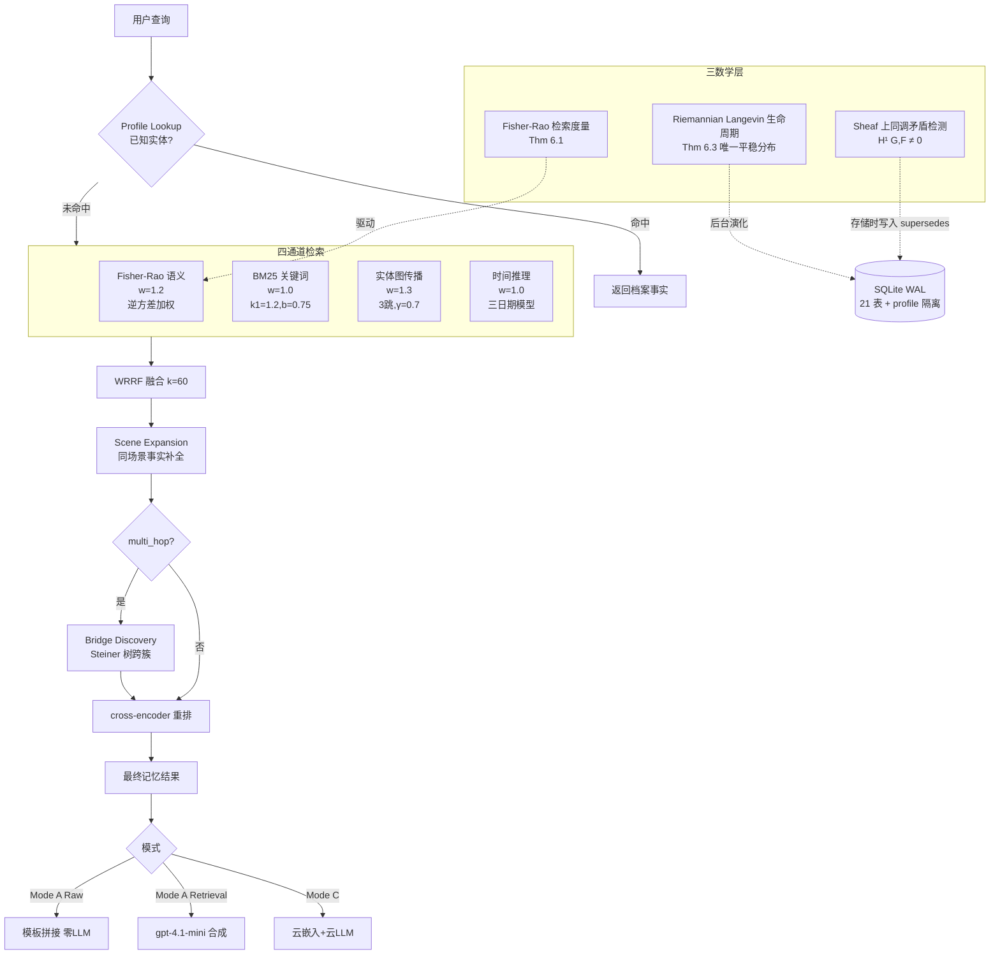

# SuperLocalMemory V3：零LLM企业级Agent记忆的信息几何基础

## 一、论文基础元数据
- **原文标题**：SuperLocalMemory V3: Information-Geometric Foundations for Zero-LLM Enterprise Agent Memory
- **中文译版**：SuperLocalMemory V3：零LLM企业级Agent记忆的信息几何基础
- **发表渠道**：arXiv 预印本（等级：预印本，尚未标注正式会议/期刊录用信息）
- **发表时间**：2025年（arXiv ID 2603.14588）
- **链接**：arXiv:2603.14588
- **作者及核心机构**：Varun Pratap Bhardwaj（Accenture 高级经理/解决方案架构师，独立研究）
- **研究领域**：一级领域：人工智能/大语言模型系统；二级子领域：Agent 长期记忆系统、信息几何检索、企业合规 AI 架构
- **关联数据集**：LoCoMo（10 个多会话双人对话，1,986 道问题，涵盖 single-hop / multi-hop / temporal / open-domain 四类，英文，LLM-as-Judge 1–5 Likert 标注，≥4 视为正确）

## 二、论文综合评价
### 2.1 量化评分（1-5分，5分为最优）

| 评价维度 | 评分 | 备注 |
| -------- | ---- | ---- |
| 📚 理论基础 | ⭐⭐⭐⭐⭐ | 深度融合信息几何、sheaf 上同调与 Riemannian Langevin，理论功底扎实 |
| 🎯 问题核心性 | ⭐⭐⭐⭐ | 直击 Agent 记忆三大缺口：不确定性、矛盾检测与生命周期 |
| 💡 方法创新性 | ⭐⭐⭐⭐⭐ | 首次将三种数学框架统一引入 Agent 记忆系统，路径独特 |
| ⚙️ 技术壁垒 | ⭐⭐⭐⭐ | 数学推导与本地化系统集成门槛高，复现需理论+工程双重能力 |
| 🧪 实验严谨性 | ⭐⭐⭐ | 仅 LoCoMo 单基准，Mode C 仅 81 题，部分结论自相矛盾 |
| 🔧 落地可行性 | ⭐⭐⭐⭐ | Mode A 全本地零 LLM，SQLite+CPU 即可运行，MIT 开源 |
| 🚀 应用前景 | ⭐⭐⭐⭐ | 契合 EU AI Act 数据主权需求，企业合规场景商业价值高 |
| 📊 综合评分 | 4.1 | 理论创新突出、定位清晰，但实验覆盖与内部一致性有待加强 |

### 2.2 定性综合评价（≤300字）
> 本文定位为「数学可解释 + 本地合规」的 Agent 记忆路线，用信息几何重构检索（Fisher–Rao 按维度方差加权）、用 sheaf 上同调做形式化矛盾检测、用黎曼流形上的 Langevin 动力学实现自组织生命周期。差异化优势在于**零 LLM / 数据不出设备**的企业合规基因（对齐 EU AI Act 2026 全面执行），同时数学层在困难检索场景带来平均 **+12.7pp**、最难对话 **+19.9pp** 的可测增益，Mode A Retrieval 达 74.8%（超越 Mem0 64.2%）。关键结论：知识发现/检索已大体解决，但零-LLM 答案合成为主要瓶颈（Raw 60.4%，与 Retrieval 存在约 15pp 差距）；sheaf 与 Fisher 在 LoCoMo 上未充分激活，实际价值需长期部署与矛盾密集场景验证。

## 三、领域本体论映射
| 核心维度 | 具体内容 |
| -------- | -------- |
| 核心研究对象 | 企业级 AI Agent 的持久化长期记忆系统（检索、一致性、生命周期） |
| 核心技术路径 | 信息几何（Fisher–Rao 度量）+ 代数拓扑（sheaf 上同调）+ 随机微分方程（Riemannian Langevin）+ 四通道混合检索与 WRRF 融合 |
| 数据/载体形态 | 多会话对话记忆单元（fact/entity/scene），SQLite 21 张表持久化，768d/3072d 嵌入向量 + profile 隔离 |
| 核心功能目标 | 零 LLM 本地化检索；跨上下文矛盾检测；无手工参数的自组织遗忘/保留 |
| 验证核心指标 | LoCoMo 上 LLM-as-Judge 准确率（Mode A Raw / A Retrieval / Mode C）、消融增益（pp）、检索质量（72–78%） |

## 四、核心问题与解决方案
### 4.1 待解决的核心问题
1. **领域级根本问题**：Agent 记忆缺乏形式化数学基础，不确定性、矛盾与生命周期三要素均无收敛性保证与代数判据。
2. **现有方法痛点**：
   - **不确定性盲检索**：cosine 相似度平等对待各嵌入维度，忽视每维置信度；cosine 近邻随 \(N\) 线性膨胀（Prop 7.1/7.2 集中屏障）。
   - **生命周期靠启发式**：固定 TTL、指数衰减、访问阈值等，无收敛保证、需手工调参。
   - **静默矛盾**：跨上下文矛盾无形式化检测机制，规模增长后矛盾呈 \(O(N^2)\) 膨胀。
3. **工程落地卡点**：企业数据主权与合规要求（EU AI Act 2024/1689 将于 2026-08-02 全面执行）使云端 LLM 依赖方案难以直接落地；现有系统基本未处理合规。

### 4.2 核心解决方案
- **理论框架**：以信息几何（Fisher 信息矩阵对角高斯流形）、层论上同调（cellular sheaf）、Riemannian Langevin 动力学三支柱统一记忆的检索、一致性、生命周期。
- **核心架构**：三模式（A/B/C）+ 四通道检索（Fisher–Rao 语义、BM25、实体图传播、时间推理）+ 三补充阶段（Profile Lookup、Scene Expansion、Bridge Discovery）+ WRRF（\(k=60\)）融合 + cross-encoder 重排。
- **关键技术**：
  - Fisher–Rao 逆方差加权检索，具度量性、充分统计不变性、\(\Theta(d)\) 可计算性（Thm 6.1）。
  - Sheaf 上同调 \(H^1(G,\mathcal{F})\neq 0\) 作为矛盾代数判据，存储时写入 `supersedes` 边。
  - Riemannian Langevin 记忆动力学，证明唯一平稳分布（Thm 6.3），消除手工衰减参数。
- **创新机制**：graduated ramp 冷启动（前 10 次访问由 cosine 渐变为 Fisher 评分）；渐进披露最优深度 \(D^*(N)=\Theta(\log N)\)（Thm 6.5）；有效记忆数上界 \(|\mathcal{M}_{\text{eff}}|\le C d^{d-1}\)（Thm 6.6）。

### 4.3 核心优势（量化+定性）
1. **性能优势**：数学层全开 vs 纯工程基线平均 **+12.7pp**，最难对话 conv-44 **+19.9pp**；Mode A Retrieval 74.8%（超 Mem0 64.2%）；Open-domain Mode A Retrieval 达 **85.0%**，全场最高。
2. **效率优势**：Mode A 全本地 CPU 检索（Azure ACI 2 vCPU/4GB），成本约 **$9–15**，无网络依赖；Fisher \(\Theta(d)\) 复杂度优于全协方差 \(O(d^3)\)。
3. **工程优势**：MIT 开源；SQLite WAL + 21 张表 + profile 隔离；预缓存权重实现检索期零联网，满足 EU AI Act 数据主权要求。

## 五、方法与技术架构
### 5.1 核心架构设计
> 系统整体分为「检索层—一致性层—生命周期层」三层数学机制，外加四通道融合与三补充阶段。Mode A 全程本地（nomic-embed 768d + BGE reranker）；Mode B 引入本地 Ollama LLM 合成答案；Mode C 使用云嵌入（3072d）+ gpt-4.1-mini。

### 5.2 关键技术实现细节
| 技术模块 | 实现路径 | 工程注意事项 |
| -------- | -------- | ------------ |
| Fisher–Rao 语义通道 | 对角高斯流形上 μ+σ² 表征，逆方差加权评分；cold-start 前 10 次访问由 cosine 渐变激活 | 对角协方差假设，忽略维度间相关性；冷启动数据退化为 cosine；全协方差 \(O(d^3)\) 高维不可行 |
| BM25 关键词通道 | Okapi BM25（k1=1.2, b=0.75），token 持久化 | 需与语义通道权重平衡（w=1.0）；去掉它 −6.5pp |
| 实体图传播通道 | 规范实体知识图，查询实体种子激活，3 跳传播 γ=0.7；multi_hop 时启用 Bridge Discovery 构 Steiner 树 | 实体规范化/消歧质量是关键，需摄入期消歧 |
| 时间推理通道 | 三日期模型（观察时间、参考时间、有效窗口），过期惩罚 | 时间标注缺失时有效性判定失效；LoCoMo 上贡献仅 −0.2pp |
| Sheaf 上同调矛盾检测 | 记忆库建模为 cellular sheaf，顶点=上下文、边=共享实体；\(H^1\neq 0\) 触发 `supersedes` 边；阈值 τ=0.45 | 需在写入路径同步计算，避免写放大；LoCoMo 矛盾稀少故增益 −1.7pp |
| Riemannian Langevin 生命周期 | Poincaré 球上 SDE，漂移由 Fisher 信息支配，Fokker–Planck 证明唯一平稳分布；状态维 d=8 | 当前检索仍处欧氏空间，Poincaré 主要用于生命周期理论；后台演化需调度资源 |
| WRRF 融合 + 重排 | 加权倒数排名融合（k=60）+ bge-reranker-v2-m3 cross-encoder | cross-encoder 是最大单点（去除 −30.7pp），但算力占比高 |
| 依赖组件 | SQLite WAL（21 表）、nomic-embed-text-v1.5（768d）、bge-reranker-v2-m3、可选 text-embedding-3-large（3072d）、gpt-4.1-mini | Mode A 预缓存权重、检索期断网；Mode C 需用户 API Key 与数据处理协议 |

### 5.3 架构优缺点
- **优点**：
  - 数学层与工程层解耦，可在不改变部署的前提下按需启用。
  - 三种模式覆盖「合规优先—效果折中—性能上限」的完整频谱。
  - 本地优先设计天然契合数据主权与离线部署诉求。
- **缺点**：
  - cross-encoder 成为性能与算力双瓶颈（单项贡献 −30.7pp）。
  - 冷启动阶段 Fisher 退化为 cosine，理论优势需长期部署才显现。
  - Sheaf / Fisher 在现有基准上未充分激活，理论与实测存在落差。
  - 对角协方差假设削弱信息几何的完备性；检索与生命周期使用不同几何空间，理论未完全统一。

## 六、实验设计与结果分析
### 6.1 实验基础设置
| 维度 | 内容 |
| ---- | ---- |
| 数据集 | LoCoMo（10 个多会话对话，1,986 题；single-hop/multi-hop/temporal/open-domain） |
| 基线方法 | Mem0（64.2%）、Zep v3（85.2%）、纯工程四通道基线、Mode C 云系统 |
| 实验环境 | Azure ACI，2 vCPU / 4GB RAM，111 容器，SQLite；本地 nomic-embed-text-v1.5（768d）+ bge-reranker-v2-m3；Mode C 云嵌入 text-embedding-3-large（3072d）+ gpt-4.1-mini |
| 评价指标 | LLM-as-Judge，1–5 Likert，≥4 记为正确 |

### 6.2 核心实验结果
| 方法 | 核心指标1（LoCoMo 准确率） | 核心指标2（Open-domain） | 工程指标（算力/耗时） |
| ---- | --------- | --------- | -------------------- |
| Mem0（基线） | 64.2% | — | 云依赖 |
| Zep v3（基线） | 85.2%（conv-30 子集） | — | 云依赖 |
| Mode A Raw（本文） | 60.4%（1,276 题，全零 LLM） | — | 2 vCPU/4GB，CPU 本地，部分对话超时 |
| Mode A Retrieval（本文） | **74.8%** | **85.0%** | 检索全本地，答案由 gpt-4.1-mini 合成 |
| Mode C（本文） | **87.7%**（conv-30，n=81） | — | 云嵌入 3072d + gpt-4.1-mini；CE off 时反升至 90.1% |

### 6.3 消融实验/鲁棒性分析
| 实验变体 | 指标变化 | 核心结论 |
| -------- | -------- | -------- |
| 去 cross-encoder | **−30.7pp** | 重排器是系统最大单点，也是算力瓶颈 |
| 去 Fisher–Rao | −10.8pp | 信息几何语义加权对检索质量贡献显著 |
| 去全部数学层 | −7.6pp | 数学层整体增益可观（与通道消融叠加口径不同） |
| 去 BM25 | −6.5pp | 关键词通道仍不可替代 |
| 去 sheaf 一致性 | −1.7pp | LoCoMo 矛盾稀少，代数优势未充分激活 |
| 去实体图 | −1.0pp | 多跳场景受益，平均口径贡献小幅 |
| 去时间推理 | −0.2pp | 当前基准对时间信号敏感性低 |
| 数学层全开 vs 纯工程 | **+12.7pp**（平均） | 难例收益更大（conv-44 +19.9pp），检索越难收益越高 |

### 6.4 实验结论（工程视角）
- 系统核心价值在**检索侧**：Mode A Retrieval 74.8% 已超越 Mem0，且检索全本地、无云依赖。
- **答案合成是主要瓶颈**：Raw 60.4% 与 Retrieval 74.8% 存在约 15pp 差距（原文称 20pp，存在表述不一致需核对）。
- 数学层对**困难场景**最具价值，但 Fisher/sheaf 需要长期部署与矛盾密集数据才能完全激活。
- cross-encoder 与 Fisher 是两个最关键组件，前者影响更大但代价更高；企业部署时需权衡算力预算。
- Mode C 的 CE off 反升（87.7%→90.1%）提示重排器在云嵌入下可能过拟合或引入噪声，需进一步诊断。

## 七、领域贡献与创新点
| 贡献层级 | 具体内容 |
| -------- | -------- |
| 理论贡献 | 首次将信息几何、sheaf 上同调与 Riemannian Langevin 三者统一到 Agent 记忆；给出 Thm 6.1/6.3/6.5/6.6 与 Prop 7.1/7.2 等可证结果 |
| 方法/架构贡献 | 四通道 + 三补充阶段的混合检索；WRRF 融合；三模式分层设计；Fisher/sheaf/Langevin 三数学层解耦 |
| 数据/工具贡献 | MIT 开源实现；SQLite 21 表 schema；Mode A 预缓存权重包 |
| 实验/验证贡献 | LoCoMo 上系统的三模式对比与八项消融；量化「数学层 +12.7pp」与「难例 +19.9pp」的经验规律 |
| 工程落地贡献 | 零 LLM / 数据主权 / 合规路线；2 vCPU/4GB 低成本部署（$9–15）；对齐 EU AI Act 数据不出设备要求 |

## 八、局限性与风险
| 维度 | 具体描述 | 应对思路 |
| ---- | -------- | -------- |
| 学术局限性 | 仅 LoCoMo 单基准、双人对话；Mode C 仅 conv-30 的 81 题；原文 20pp vs 实测 15pp 表述不一致 | 扩展 LongMemEval、MemoryAgentBench；多用户/多项目场景；统一口径复核 |
| 工程落地风险 | Mode A 原始答案精度低（60.4%）；Fisher 冷启动退化为 cosine；对角协方差假设；Poincaré 仅用于生命周期理论，检索仍在欧氏空间 | 引入 Mode B 本地 LLM 合成；graduated ramp 长期激活；原生双曲嵌入 |
| 伦理/合规风险 | EU AI Act 2026-08-02 全面执行前需满足数据主权；Mode C 依赖用户 API Key 与数据处理协议 | Mode A 零云架构从设计层面隔离数据；补全 DPA 与审计日志 |

## 九、未来研究/落地方向
| 方向类型 | 具体内容 | 优先级 |
| -------- | -------- | ------ |
| 科研拓展 | LongMemEval / MemoryAgentBench 多基准验证；原生双曲嵌入；Hopfield 第五检索通道集成；sheaf 在矛盾密集场景的量化评估 | 高 |
| 工程优化 | 答案合成改进（模板化格式、查询自适应片段选择、Mode B 本地 LLM）；摄入期实体消歧；查询自适应通道选择；Agentic 充分性验证 | 高 |
| 跨领域适配 | 多用户/多项目企业场景；强合规行业（金融/医疗/政务）的本地记忆方案 | 中 |

## 十、关键词与术语表
| 语言 | 关键词 |
| ---- | ------ |
| 中文 | 智能体记忆、信息几何、Fisher–Rao 度量、层上同调、黎曼朗之万动力学、零 LLM、数据主权、企业合规、混合检索、矛盾检测、记忆生命周期 |
| 英文 | Agent Memory, Information Geometry, Fisher–Rao Metric, Sheaf Cohomology, Riemannian Langevin Dynamics, Zero-LLM, Data Sovereignty, Enterprise Compliance, Hybrid Retrieval, Contradiction Detection, Memory Lifecycle |
| 领域专属术语 | **Fisher–Rao 距离**：基于 Fisher 信息矩阵的统计流形测地距离，按维度置信度加权；**Cellular Sheaf**：图上的层结构，顶点承载数据、边承载约束；**\(H^1(G,\mathcal{F})\)**：一阶上同调，非零表示局部无法消解的整体矛盾；**Riemannian Langevin 动力学**：流形上带 Fisher 漂移的随机微分方程，用于记忆保留/遗忘；**WRRF**：加权倒数排名融合；**Graduated Ramp**：Fisher 评分从 cosine 渐进激活的冷启动机制；**supersedes 边**：检测到矛盾时写入的替代关系边；**Mode A/B/C**：零 LLM 全本地 / 本地 LLM / 云端增强三种部署模式 |

## 十一、参考文献与关联资源
- **核心参考文献**：待补充（原文参考文献细节未在分析中给出）
- **补充阅读**：Mem0、Zep v3、LoCoMo 基准、EU AI Act 2024/1689 相关文档
- **开源代码/工具**：SuperLocalMemory V3（MIT 开源，Mode A 含预缓存权重）；nomic-embed-text-v1.5；bge-reranker-v2-m3；SQLite（WAL 模式）

## 十二、阅读者批注
1. **科研启发**：将信息几何、层论与随机微分方程引入 Agent 记忆是一个高价值的跨学科范式，值得追踪其在多用户、矛盾密集、长期部署条件下的定量表现；「数学层收益随检索难度递增」这一经验规律具有普适研究价值。
2. **工程落地思考**：Mode A 的零 LLM / 零云架构在合规敏感行业中具备直接落地价值，但 60% 原始精度可能难满足生产要求；建议优先落点放在「检索增强 + 外部可信 LLM 合成」的混合模式（即 Mode A Retrieval 形态）。
3. **待验证/存疑点**：
   - 原文称答案合成造成 20pp 差距，但 74.8%−60.4% 实为 15pp，需核对口径。
   - Mode C 在关闭 cross-encoder 后反升（87.7%→90.1%），与消融中 CE 贡献 −30.7pp 的结论表面矛盾，需澄清实验条件差异。
   - Mode C 仅 81 题，统计效力有限。
   - Fisher 在冷启动退化为 cosine，其宣传的核心优势在短期实验中难以体现。
4. **个人/团队应用场景**：企业知识管理、合规敏感行业（金融/医疗/政务）的本地 Agent 记忆底座；可作为 RAG 系统的检索侧替代方案，尤其适合无法上云的私有部署环境。

## 十三、阅读元信息
| 维度 | 内容 |
| ---- | ---- |
| 阅读日期 | 2026-09-30 20:55 |
| 阅读人 | xPaperReader AI |
| 文档编号 | arxiv-2603.14588 |
| 版本迭代 | v1.0 |