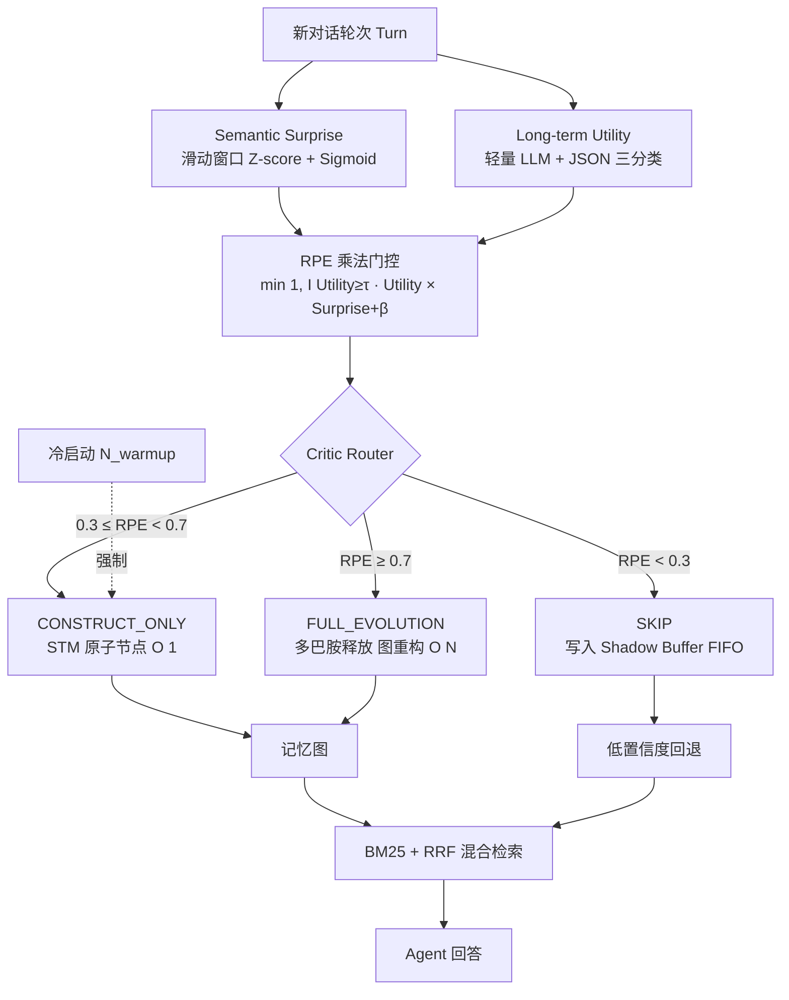

# D-MEM：基于奖励预测误差路由的多巴胺门控智能体记忆

## 一、论文基础元数据
- **原文标题**：D-MEM: Dopamine-Gated Agentic Memory via Reward Prediction Error Routing
- **中文译版**：D-MEM：基于奖励预测误差路由的多巴胺门控智能体记忆
- **发表渠道**：arXiv 预印本（arXiv 2603.14597，未标注会议/期刊等级，待补充）
- **发表时间**：2025 年（具体月份待补充）
- **链接**：arXiv: https://arxiv.org/abs/2603.14597
- **作者及核心机构**：Yuru Song、Qi Xin（核心机构待补充）
- **研究领域**：
  - 一级领域：人工智能 / 大语言模型
  - 二级子领域：LLM Agent 长期记忆系统、认知启发式 Agent 架构、检索增强生成（RAG）
- **关联数据集**：

| 数据集 | 规模 | 语言 | 标注 |
| ------ | ---- | ---- | ---- |
| LoCoMo | 长程多会话对话（原始干净版本） | 英文 | 原始 QA 证据轮次 |
| LoCoMo-Noise | 在 LoCoMo 上注入噪声，主评估 ρ=0.75 | 英文 | 保留原 needle 位置，注入 Filler/Status/Tangent 三类噪声 |

## 二、论文综合评价

### 2.1 量化评分（1-5分，5分为最优）

| 评价维度 | 评分 | 备注 |
| -------- | ---- | ---- |
| 📚 理论基础 | ⭐⭐⭐⭐ | 借用神经科学 RPE 与多巴胺门控，类比合理但偏工程化 |
| 🎯 问题核心性 | ⭐⭐⭐⭐⭐ | 直击 Agentic Memory 的 O(N²) 成本与噪声污染痛点 |
| 💡 方法创新性 | ⭐⭐⭐⭐⭐ | RPE 乘法门控 + 三级 Critic Router + Shadow Buffer 组合新颖 |
| ⚙️ 技术壁垒 | ⭐⭐⭐ | 依赖轻量 LLM 效用分类，阈值与门控工程化程度中等 |
| 🧪 实验严谨性 | ⭐⭐⭐ | 消融充分，但数据集/模型单一，噪声为合成近似 |
| 🔧 落地可行性 | ⭐⭐⭐⭐ | 80% token 节省，冷启动与退避机制具备落地性 |
| 🚀 应用前景 | ⭐⭐⭐⭐⭐ | 长时自治 Agent、端侧语音助手、多智能体记忆前景广阔 |
| 📊 综合评分 | 4.1 | 概念新颖、工程实用，但需更多数据集与真实噪声验证 |

> 综合评分计算：前 7 项星值分别为 4、5、5、3、3、4、5，均值 = 29/7 ≈ 4.14，保留 1 位小数为 **4.1**。

### 2.2 定性综合评价（≤300字）

> D-MEM 将神经科学中 VTA 多巴胺的"奖励预测误差（RPE）"门控机制移植到 LLM Agent 长期记忆，核心理念是：**仅对高惊喜且高长期效用的信息触发昂贵的记忆演化**，其余轮次以 O(1) 建节点或直接跳过。其差异优势在于：①三级 Critic Router 把记忆操作从"全量同步 O(N²)"变为"稀疏路由"；②Utility 安全网 β=0.4 避免高价值低惊喜信息被误剪；③BM25+RRF 混合检索与 Shadow Buffer 回退，弥补剪枝带来的召回损失。关键结论：在 LoCoMo-Noise（ρ=0.75）上 token 降低约 80%（319K vs 1648K），Overall/Multi-hop/Adversarial F1 全面优于 A-MEM；干净 LoCoMo 上多跳提升 15.7 个百分点。主要代价是单跳事实召回下降（21.6% vs 44.7%），属可校准的效率—准确率权衡。

## 三、领域本体论映射

| 核心维度 | 具体内容 |
| -------- | -------- |
| 核心研究对象 | LLM Agent 长期记忆系统在噪声对话流中的写入与演化策略 |
| 核心技术路径 | 生物启发 RPE 门控 + Critic Router 三级路由 + 混合检索回退 |
| 数据/载体形态 | 多会话对话时间线（turn 序列）、原子记忆节点、演进记忆图、向量+BM25 索引 |
| 核心功能目标 | 在保持复杂推理能力的同时，将记忆写入门控成本降低、抑制上下文污染 |
| 验证核心指标 | Overall F1、Multi-hop F1、Adversarial F1、Single-hop F1、Token 消耗、Skip 率、路由分布 |

## 四、核心问题与解决方案

### 4.1 待解决的核心问题

1. **领域级根本问题**：
   LLM Agent 长期记忆的可扩展性瓶颈。现有记忆系统（如 A-MEM）对每一轮输入都执行同步全量追加与演化，记忆图规模与演化开销随对话轮次呈 \(O(N^2)\) 增长，难以支撑长时自治 Agent。

2. **现有方法痛点**：
   - 每一句话都进入昂贵的记忆演化流程，写延迟高；
   - API token 成本失控（LoCoMo-Noise 下 A-MEM 达 1,648K）；
   - 大量低价值内容污染记忆图与检索上下文；
   - 现有基准 LoCoMo 过于理想化，缺少真实对话中的寒暄、状态更新、离题噪声。

3. **工程落地卡点**：
   - 无法判断"哪一轮值得记住"的通用准则缺失；
   - 盲目剪枝会造成简单事实型召回损失（单跳性能下降）；
   - Utility 分类本身仍需每轮调用 LLM，且阈值 \(\theta_{low}\) 需人工调参。

### 4.2 核心解决方案

- **理论框架**：将生物多巴胺系统的"奖励预测误差"作为记忆巩固的门控信号，只在信息同时具备 **高语义意外性（Surprise）** 与 **高长期效用（Utility）** 时才触发记忆演化。
- **核心架构**：RPE 门控 → Critic Router 三级路由 → 检索增强回退。
- **关键技术**：
  - 滑动窗口 Z-score + sigmoid 归一化的语义意外性度量（缓解嵌入各向异性）；
  - 轻量 LLM + JSON schema 的 Utility 三分类（Transient / Short-Term / Persistent）；
  - 乘法门控 RPE 公式与 β=0.4 效用安全网；
  - 阈值 \(\theta_{low}=0.3\)、\(\theta_{high}=0.7\) 的三级路由；
  - BM25 + RRF 混合检索与 Shadow Buffer FIFO 回退。
- **创新机制**：把"是否记忆"从规则判断升级为生物可解释的连续 RPE 信号，并以冷启动 warmup 保护与安全网 β 防止极端剪枝。

### 4.3 核心优势（量化+定性）

1. **性能优势**：
   - LoCoMo-Noise（ρ=0.75）：Overall F1 0.369 vs A-MEM 0.336；Multi-hop 0.412 vs 0.365；Adversarial 0.412 vs 0.388；
   - 干净 LoCoMo：Multi-hop 42.7% vs 27.0%，提升 **15.7 个百分点**。
2. **效率优势**：
   - Token 消耗 319K vs 1,648K，降低约 **80%**；
   - CONSTRUCT_ONLY 主导路由，FULL_EVOLUTION 稀疏执行，是节省的直接来源。
3. **工程优势**：
   - SKIP 路径零写延迟，天然抑制上下文污染；
   - Shadow Buffer 为低置信度场景提供零成本回退；
   - 冷启动 warmup 保护避免开场寒暄触发昂贵演化。

## 五、方法与技术架构

### 5.1 核心架构设计

> 整体流程：每轮新输入先并行计算 **Semantic Surprise**（滑动窗口 Z-score）与 **Long-term Utility**（轻量 LLM 三分类），两者经乘法门控合成 RPE；再由 Critic Router 依据 RPE 落入三级路由之一：SKIP（缓存至 Shadow Buffer）、CONSTRUCT_ONLY（STM 建原子节点）、FULL_EVOLUTION（触发多巴胺释放、深度图重构）。检索侧采用 BM25 + RRF 混合召回，并在低置信度时回退到 Shadow Buffer。

### 5.2 关键技术实现细节

| 技术模块 | 实现路径 | 工程注意事项 |
| -------- | -------- | ------------ |
| Semantic Surprise | 滑动窗口内计算嵌入 Z-score，经 sigmoid 归一化 | 需缓解嵌入各向异性；窗口大小和归一化参数影响稳定性 |
| Long-term Utility | 轻量 LLM 调用 + 受限 JSON schema，输出 Transient / Short-Term / Persistent；Transient 强制 Utility=0 | 每轮仍有 LLM 开销，可用蒸馏/嵌入估计器替代 |
| RPE 乘法门控 | \(RPE=\min(1, \mathbb{I}(U\ge\tau)\cdot[U\times(S+\beta)])\)，β=0.4 | β 提供效用安全网，防止高价值低惊喜被误剪 |
| Critic Router | 双阈值 θ_low=0.3、θ_high=0.7 划分 SKIP / CONSTRUCT_ONLY / FULL_EVOLUTION | 阈值需按噪声率校准；可引入自适应控制 |
| 冷启动保护 | N_warmup 轮内强制 CONSTRUCT_ONLY | 防止开场寒暄触发 FULL_EVOLUTION 造成浪费 |
| 检索增强 | BM25 + RRF 混合检索 | 补足实体级精度，避免纯向量召回漏实体 |
| Shadow Buffer | FIFO 缓存 SKIP 内容，低置信度时回退 | 缓存容量与淘汰策略需权衡内存与召回 |
| 依赖组件 | 轻量 LLM（如 GPT-4o-mini）、嵌入模型、BM25 索引、RRF 融合层 | 模型版本漂移会影响 Utility 分类稳定性 |

### 5.3 架构优缺点

- **优点**：
  - 把"是否记忆"从启发式规则变为可解释的连续 RPE 信号；
  - 三级路由使成本与信息价值成正比，天然抗噪声；
  - 安全网 β + Shadow Buffer + 冷启动三重护栏，降低剪枝风险；
  - Token 成本下降 80% 且复杂推理不降反升。
- **缺点**：
  - 单跳事实召回明显下降（21.6% vs A-MEM 44.7%）；
  - Utility 分类仍依赖 LLM 调用，每轮有固定开销；
  - 阈值 θ_low 需人工校准，对噪声率敏感；
  - 对开放域问题的表现亦偏弱（0.085 vs 0.111）。

## 六、实验设计与结果分析

### 6.1 实验基础设置

| 维度 | 内容 |
| ---- | ---- |
| 数据集 | LoCoMo（无噪声）、LoCoMo-Noise（ρ=0.75，三类噪声 40% Filler / 30% Status / 30% Tangent） |
| 基线方法 | A-MEM（同步记忆演化）等 |
| 实验环境 | 模型 GPT-4o-mini（其余硬件环境待补充） |
| 评价指标 | Overall F1、Multi-hop F1、Adversarial F1、Single-hop F1、Open 类 F1、Token 消耗 |

### 6.2 核心实验结果

**噪声环境 LoCoMo-Noise，ρ=0.75**

| 方法 | Overall F1 | Multi-hop F1 | Adversarial F1 | 工程指标 Token |
| ---- | ---------- | ------------ | -------------- | -------------- |
| A-MEM 同步 | 0.336 | 0.365 | 0.388 | 1,648K |
| D-MEM | **0.369** | **0.412** | **0.412** | **319K** |

**干净 LoCoMo**

| 方法 | Overall F1 | Multi-hop F1 | Single-hop F1 |
| ---- | ---------- | ------------ | ------------- |
| A-MEM | 35.9% | 27.0% | 44.7% |
| D-MEM | **37.4%** | **42.7%** | 21.6% |

### 6.3 消融实验/鲁棒性分析

| 实验变体 | 指标变化 | 核心结论 |
| -------- | -------- | -------- |
| v1 线性 RPE | skip 仅 9.6% | 过滤不足，几乎不省成本 |
| v2 严格剪枝 | skip 68.5%，Overall 0.291 | 过度剪枝导致整体性能下滑 |
| v3 Utility 安全网（β=0.4） | 路由平衡 | 引入安全网后路由更均衡，但对抗性场景仍弱 |
| v4 最终版（加 BM25 + Shadow Buffer） | Overall 0.369，Adversarial 0.412，Token 319K | 检索增强与回退机制补齐对抗短板，成本反降 |

**机制发现**：
- SKIP 集中在 Utility < 0.3 区域，说明 **Utility 而非 Surprise 是主门控**；
- 反直觉现象：真实轮次 skip 率 53.9% > 噪声轮次 43.2%，因部分噪声语法合理、上下文可信，而真实对话含大量寒暄；
- RPE 分解显示 CONSTRUCT_ONLY 主导，FULL_EVOLUTION 稀疏执行，即 80% token 节省的直接来源。

### 6.4 实验结论（工程视角）

从工程视角看，D-MEM 用三层护栏（β 安全网、Shadow Buffer 回退、冷启动 warmup）实现了"用更少的 token 换更强的复杂推理与抗噪能力"这一非对称收益；其代价集中体现在简单事实召回上，可通过将 \(\theta_{low}\) 从 0.3 下调至约 0.2 或引入自适应阈值控制来恢复。整体方案对长时 Agent 记忆的可扩展性具有可操作指导意义，但泛化性仍需在真实对话日志与多模型上进一步验证。

## 七、领域贡献与创新点

| 贡献层级 | 具体内容 |
| -------- | -------- |
| 理论贡献 | 将神经科学 RPE 门控系统化引入 LLM Agent 记忆写入决策，提供"是否记忆"的可解释连续信号 |
| 方法/架构贡献 | 提出 D-MEM：RPE 乘法门控 + beta 效用安全网 + Critic Router 三级路由 + Shadow Buffer 回退 |
| 数据/工具贡献 | 构建 LoCoMo-Noise 基准，含三类配额化噪声与不变 needle 位置，可复现 |
| 实验/验证贡献 | 系统消融（v1→v4）揭示 Utility 是主门控；给出 token 节省 80% 与多跳提升 15.7 个百分点的量化证据 |
| 工程落地贡献 | 提出蒸馏/嵌入估计器两条 Utility 轻量化路径，适配端侧与延迟敏感场景 |

## 八、局限性与风险

| 维度 | 具体描述 | 应对思路 |
| ---- | -------- | -------- |
| 学术局限性 | 噪声分布受控（40/30/30 配额），与真实对话动态存在偏差；单数据集、单模型验证 | 引入真实人机交互日志噪声、扩展多数据集与多模型 |
| 工程落地风险 | θ_low=0.3 在 75% 噪声下校准，低噪声场景过度剪枝导致单跳召回下降 | 下调 θ_low 至约 0.2 或引入在线噪声率估计的自适应阈值 |
| 伦理/合规风险 | 长期记忆系统会持续留存用户对话，存在隐私与记忆持久性合规问题；Utility 分类若偏差可能放大信息取舍偏见 | 需引入记忆遗忘机制、用户可控擦除与偏差审计（论文未充分展开，待补充） |

## 九、未来研究/落地方向

| 方向类型 | 具体内容 | 优先级 |
| -------- | -------- | ------ |
| 科研拓展 | 扩展至多智能体场景，共享记忆图并协作更新 | 高 |
| 科研拓展 | 引入真实交互日志中的自然噪声，构建更拟真的记忆评测 | 高 |
| 工程优化 | Utility 分类器知识蒸馏为紧凑任务分类器，或改用纯嵌入估计器降低延迟 | 高 |
| 工程优化 | 自适应阈值控制：在线估计噪声率动态调节 θ_low，免人工调参 | 中 |
| 跨领域适配 | 端侧语音助手等延迟敏感场景（依赖纯嵌入估计器方案） | 中 |

## 十、关键词与术语表

| 语言 | 关键词 |
| ---- | ------ |
| 中文 | 多巴胺门控、奖励预测误差、智能体记忆、长期记忆、噪声鲁棒性、三级路由、语义意外性、长期效用 |
| 英文 | Dopamine-Gated, Reward Prediction Error (RPE), Agentic Memory, Long-term Memory, LoCoMo-Noise, Critic Router, Semantic Surprise, Long-term Utility |
| 领域专属术语 | **RPE（Reward Prediction Error）**：奖励预测误差，本文中为 Surprise 与 Utility 的乘法门控信号；**Critic Router**：基于双阈值的三级路由决策器；**Shadow Buffer**：FIFO 缓存 SKIP 内容，低置信度时回退；**A-MEM**：现有同步全量演化的基线记忆系统；**LoCoMo / LoCoMo-Noise**：长程对话记忆基准及其噪声饱和版本 |

## 十一、参考文献与关联资源

- **核心参考文献**：
  - A-MEM（作为主要对比基线，同步记忆演化系统）
  - LoCoMo 长程对话记忆基准
- **补充阅读**：
  - 神经科学 VTA 多巴胺 RPE 门控相关文献（论文引用，具体条目待补充）
  - BM25 与 Reciprocal Rank Fusion（RRF）原始文献
- **开源代码/工具**：
  - 论文正文未明确给出开源仓库；相关实现待补充

## 十二、阅读者批注

1. **科研启发**：
   将生物神经调质机制（多巴胺/RPE）形式化为可计算门控信号的思路，可迁移到更广义的 Agent 决策问题（工具调用、规划触发、主动学习触发）。"Utility 主门控、Surprise 次门控"的实证结论值得进一步理论化。
2. **工程落地思考**：
   80% token 节省在长时对话产品中价值巨大。落地时应先自测目标场景的噪声率，再校准 θ_low；优先推进 Utility 分类器的蒸馏或嵌入版，以消除每轮 LLM 调用开销。
3. **待验证/存疑点**：
   - 仅用 GPT-4o-mini 验证，跨模型泛化性未知；
   - 噪声为 GPT-4o-mini 合成，是否存在模型偏差影响结论；
   - 单跳性能下降 21.6% vs 44.7% 的幅度较大，实际产品是否可接受待评估；
   - 多智能体共享记忆图的扩展路径尚属展望。
4. **个人/团队应用场景**：
   长时对话客服 Agent、端侧语音助手、多轮角色扮演 NPC、需要跨会话记忆的个人助理，均可将 D-MEM 的门控思路作为记忆写入层组件引入。

## 十三、阅读元信息

| 维度 | 内容 |
| ---- | ---- |
| 阅读日期 | 2026-09-30 20:57 |
| 阅读人 | xPaperReader AI |
| 文档编号 | arxiv-2603.14597 |
| 版本迭代 | v1.0 |