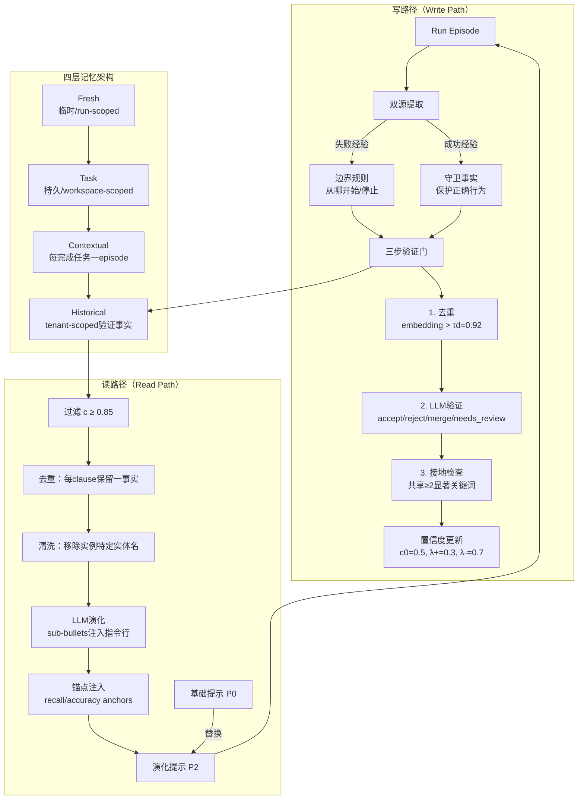

# 编译式记忆：不是更多信息，而是为语言智能体提供更精确的指令

## 一、论文基础元数据

- **原文标题**：Compiled Memory: Not More Information, but More Precise Instructions for Language Agents
- **中文译版**：编译式记忆：不是更多信息，而是为语言智能体提供更精确的指令
- **发表渠道**：预印本（arXiv），未经同行评审（具体等级待补充）
- **发表时间**：2025年
- **链接**：arXiv:2603.15666（DOI待补充）
- **作者及核心机构**：James Rhodes、George Kang（核心机构待补充）
- **研究领域**：一级领域——人工智能 / 大语言模型；二级子领域——语言智能体记忆管理、提示工程、经验学习
- **关联数据集**：
  - **CUAD**：510份合同、41类条款类型，英文，仅使用正例标注；编译流程使用1,140训练文档
  - **HotpotQA**：多跳问答，每个问题10段上下文（2 gold + 8 distractor），约75% bridge、25% comparison；来源于v3多目标提取，约3,000配对观测

## 二、论文综合评价

### 2.1 量化评分（1-5分，5分为最优）

| 评价维度 | 评分 | 备注 |
| -------- | ---- | ---- |
| 📚 理论基础 | ⭐⭐⭐⭐ | 提出认识论成熟度分层与训练信号约束理论 |
| 🎯 问题核心性 | ⭐⭐⭐⭐⭐ | 直击记忆效用而非容量，问题定位精准 |
| 💡 方法创新性 | ⭐⭐⭐⭐ | 编译式记忆替代RAG，四层蒸馏架构新颖 |
| ⚙️ 技术壁垒 | ⭐⭐⭐ | 验证门+置信度+接地检查，本质仍属提示工程 |
| 🧪 实验严谨性 | ⭐⭐⭐ | 两基准两模型，但消融n=1、token长度未控制 |
| 🔧 落地可行性 | ⭐⭐⭐⭐ | 零标注零梯度，工程易集成，但需人工兜底 |
| 🚀 应用前景 | ⭐⭐⭐⭐ | 智能体记忆管理热点方向，增益适中偏保守 |
| 📊 综合评分 | 3.9 | 机制证据扎实，创新明确，但增益幅度与实验严谨性待补强 |

### 2.2 定性综合评价（≤300字）

> 本论文定位为语言智能体记忆管理的机制性研究，提出 Atlas——一种将验证经验编译为系统提示指令的"编译式记忆"机制。其核心价值在于将记忆范式从"容量/检索"（MemGPT/Mem0/Zep路线）推进到"效用/行为改变"，主张记忆是蒸馏而非存储，交付是指令重写而非RAG。差异化优势体现在四层认识论成熟度架构（Fresh→Task→Contextual→Historical）、三步验证门（去重/LLM验证/接地检查）以及置信度过程化更新机制。关键结论为"训练信号约束"：系统精确学到被教的内容，读取路径受写入路径输入约束。CUAD上F1 +8.7pp、HotpotQA上Joint F1 +3.16pp，跨模型迁移到Claude Sonnet 4.5仍有+2.31pp增益。作者诚实定位为"机制证据"而非SOTA声明，最小干预、零标注、零梯度是其工程亮点，但增益幅度中等、消融与长度控制不足是主要短板。

## 三、领域本体论映射

| 核心维度 | 具体内容 |
| -------- | -------- |
| 核心研究对象 | 语言智能体的持久记忆机制与其对下游任务行为的改变能力 |
| 核心技术路径 | 经验提取→三步验证→置信度累积→LLM提示演化（指令重写） |
| 数据/载体形态 | 智能体运行轨迹（episode/run）；结构化事实（factKey、置信度、有效期、佐证计数）；演化提示文本（约960→1570 tokens） |
| 核心功能目标 | 将错误/成功经验编译为更精确的指令，永久替换基础系统提示，提升下一轮任务表现 |
| 验证核心指标 | Token-level F1、Precision、Recall、Joint F1/EM、Answer F1、Supporting-Fact F1、配对t检验p值与Cohen's d |

## 四、核心问题与解决方案

### 4.1 待解决的核心问题

1. **领域级根本问题**：语言智能体如何在不进行微调、不增加推理上下文的条件下，从自身运行经验中实现有界自我改进？现有记忆系统关注"保留更多信息"，但信息量≠行为改变量。
2. **现有方法痛点**：
   - MemGPT/Mem0/Zep侧重记忆容量与检索效率，但未解决"什么经验值得进入持久记忆"；
   - Reflexion限于单episode自评反馈，无法跨episode验证与持久化；
   - ExpeL在推理时注入回忆洞察，带来额外上下文成本且缺少验证门；
   - 错误经验回放甚至可能损害性能，噪声事实增益微弱（20条噪声仅+1.0pp）。
3. **工程落地卡点**：LLM校准问题使抽取错误可能被编译为永久指令并传播；语义验证缺失使接地检查仅为词汇启发式；演化提示长度约为基础提示5倍，增益归属未分离。

### 4.2 核心解决方案

- **理论框架**：记忆是蒸馏而非存储；交付是指令重写而非RAG；训练信号约束（系统精确学习被教内容，不多不少）。
- **核心架构**：四层蒸馏架构（Fresh→Task→Contextual→Historical）+ 双路径（写路径提取验证 / 读路径提示演化）。
- **关键技术**：双源提取（失败→边界规则，成功→守卫事实）、三步验证门（去重τd=0.92 / LLM裁决accept-reject-merge-needs_review / 接地检查k_min=2）、置信度过程化更新（λ+=0.3, λ-=0.7，初始c0=0.5）。
- **创新机制**：事实作为sub-bullets注入相关指令行、原文保留；按主要失败方向注入补偿锚点（CUAD recall anchors、HotpotQA accuracy anchors）；最终提示P2替换基础提示P0，推理时零额外上下文成本。

### 4.3 核心优势（量化+定性）

1. **性能优势**：CUAD Token F1 +8.7pp、Precision +12.5pp；HotpotQA Joint F1 +3.16pp、Supporting-Fact EM +4.47pp；跨模型迁移至Claude Sonnet 4.5仍获+2.31pp Joint F1，6/6 run胜出。
2. **效率优势**：无需标注数据、无需梯度更新、无需人工提示工程；推理时无额外上下文成本（P2替换P0而非追加）。
3. **工程优势**：验证门+置信度+接地检查三重机制抑制幻觉与静默晋升；needs_review不静默提升，保留人工审核接口。

## 五、方法与技术架构

### 5.1 核心架构设计

Atlas采用"写入-验证-演化-替换"闭环。写入端从episode中双源提取（失败→边界规则，成功→守卫事实）；验证端通过三步门与置信度累积筛选；演化端由LLM将高置信事实作为sub-bullets注入指令行，并针对主要失败方向注入锚点；最终演化提示替换基础提示，进入下一轮运行。

### 5.2 关键技术实现细节

| 技术模块 | 实现路径 | 工程注意事项 |
| -------- | -------- | ------------ |
| 双源提取 | 失败→边界规则；成功→守卫事实；事实丰富度单调非减 | 需区分episode成功/失败信号定义，避免错误归因 |
| 去重门 | Embedding相似度阈值τd=0.92 | 阈值影响事实多样性与冗余权衡，过高会造成信息丢失 |
| LLM验证门 | 批量B=10，裁决accept/reject/merge/needs_review | LLM失败时标needs_review，绝不静默晋升；需人工兜底队列 |
| 接地检查 | 候选事实与源episode共享≥2显著关键词 | 仅词汇启发式，非语义蕴含，需警惕捏造绕过 |
| 置信度更新 | c0=0.5；支持c←1-(1-c)λ+；矛盾c←c·λ- | 一次支持→0.85，两次→0.955；0.95遇矛盾→0.665触发审查 |
| 提示演化 | LLM将事实作为sub-bullets加入指令行，原文保留 | 需验证sub-bullet不破坏原有指令语义，注意token膨胀（约960→1570） |
| 锚点注入 | CUAD recall anchors；HotpotQA accuracy anchors | 针对主要失败方向补偿，避免过度拟合单一失败模式 |
| 依赖组件 | LLM（GPT-4o用于编译与推理，Claude Sonnet 4.5用于跨模型验证）；embedding模型 | 需处理LLM调用成本、失败重试、批量裁决一致性 |

### 5.3 架构优缺点

- **优点**：
  1. 闭环自改进，零标注、零梯度、零人工提示工程；
  2. 推理时无额外上下文成本（P2替换P0）；
  3. 三重验证机制（去重/LLM/接地）有效抑制噪声事实与静默晋升；
  4. 事实丰富度单调非减，确保知识仅累积不衰减；
  5. 补偿锚点定向修复主要失败模式。
- **缺点**：
  1. 演化提示约为基础提示5倍（960→1570 tokens），增益归属未分离；
  2. 接地检查为词汇启发式，非语义蕴含，易被表面关键词绕过；
  3. 抽取错误可被编译为永久指令，错误传播风险；
  4. LLM校准问题未完全解决，needs_review仍依赖人工；
  5. CUAD组件消融为n=1，统计效力不足。

## 六、实验设计与结果分析

### 6.1 实验基础设置

| 维度 | 内容 |
| ---- | ---- |
| 数据集 | CUAD（510合同、41条款类型、仅正例）；HotpotQA（多跳QA，10段上下文/问题，2 gold + 8 distractor） |
| 基线方法 | Base prompt（P0）与 Evolved prompt（P2）配对对比；对比对象为MemGPT/Mem0/Zep/Reflexion/ExpeL等机制定位 |
| 实验环境 | GPT-4o（主实验）；Claude Sonnet 4.5（跨模型泛化验证）；6 runs × 500样本，n=3,000配对观测 |
| 评价指标 | Token-level F1/EM/Precision/Recall、FN Rate、Joint F1/EM、Answer F1/EM、Supporting-Fact F1/EM、p值、Cohen's d |

### 6.2 核心实验结果

| 方法 | 核心指标1 | 核心指标2 | 工程指标（算力/耗时） |
| ---- | --------- | --------- | -------------------- |
| GPT-4o Base (CUAD) | Token F1 61.9% | Precision 58.5% | 基础提示约960 tokens |
| GPT-4o Evo (CUAD) | Token F1 70.5%（+8.7pp） | Precision 71.0%（+12.5pp） | 演化提示约1570 tokens，推理无额外成本 |
| GPT-4o Base (HotpotQA) | Joint F1 48.64% | Supp. Fact F1 60.01% | — |
| GPT-4o Evo (HotpotQA) | Joint F1 51.80%（+3.16pp） | Supp. Fact F1 63.18%（+3.17pp） | — |
| Claude Sonnet 4.5 Base | Joint F1 52.61% | Answer F1 81.69% | 使用GPT-4o编译的同一演化提示 |
| Claude Sonnet 4.5 Evo | Joint F1 54.93%（+2.31pp） | Supp. Fact F1 65.47%（+2.37pp） | 跨模型迁移，6/6 run胜出 |

补充：CUAD完整C1–C5（1,140文档、23 facts）F1 +9.1pp；HotpotQA v3（45 facts，18 selected）。

### 6.3 消融实验/鲁棒性分析

| 实验变体 | 指标变化 | 核心结论 |
| -------- | -------- | -------- |
| CUAD 组件消融（n=1） | 4干净事实 +6.7pp vs 20噪声事实 +1.0pp | 数据质量 > 数据数量，验证门是关键 |
| CUAD 精度-only规则 | 召回崩溃 | 仅精度规则不足，需强制覆盖+召回锚点 |
| CUAD 强制覆盖+召回锚点 | 召回恢复且精度再升 | 锚点定向补偿可约束召回损失（最终-1.3pp） |
| HotpotQA v2（仅答案事实） | Answer F1升，Supp. Fact F1退化 | 单目标训练信号约束下会损害未覆盖维度 |
| HotpotQA v3（多目标提取） | Answer F1 +1.21pp，Supp. Fact F1 +3.17pp，Joint F1 +2.13→+3.16pp | 明确归因目标可精确恢复退化，验证训练信号约束 |
| 跨模型（Claude） | Answer F1 +0.32pp（ns），Supp. Fact F1 +2.37pp | 收益集中于模型自身能力缺口维度，指令编码任务需求而非模型形状 |

### 6.4 实验结论（工程视角）

CUAD与HotpotQA在任务类型、错误模式、编译事实类型和增益分布上差异显著（CUAD偏精度，HotpotQA偏平衡Joint F1），但同一"验证经验编译"机制均带正向提升，支持其作为通用机制原型的结论。效应量d≈0.14（HotpotQA）、d=0.27（CUAD），属于中低效应量；极端p值来自3,000配对观测而非增益幅度。工程视角要点：编译式记忆的收益上限由训练信号维度决定，系统学到的是被教内容；跨模型迁移可行但收益受模型自身剩余能力缺口约束；token膨胀未做长度控制实验，增益来源未完全归因。

## 七、领域贡献与创新点

| 贡献层级 | 具体内容 |
| -------- | -------- |
| 理论贡献 | 提出"记忆是蒸馏而非存储、交付是指令重写而非RAG"的范式转换；提出"训练信号约束"定理性观察——系统精确学到被教内容，不多不少 |
| 方法/架构贡献 | 四层认识论成熟度架构（Fresh/Task/Contextual/Historical）；三步验证门（去重/LLM/接地）；置信度过程化更新公式（λ+=0.3, λ-=0.7）；双源提取（边界规则/守卫事实） |
| 数据/工具贡献 | 编译流程产出的结构化事实集（CUAD 338→25 selected，覆盖23条款；HotpotQA v3 45→18 selected）；待补充是否开源 |
| 实验/验证贡献 | 在两基准（CUAD/HotpotQA）、两模型家族（GPT-4o/Claude Sonnet 4.5）上验证机制通用性；跨模型使用GPT-4o编译提示迁移至Claude；训练信号约束v2 vs v3消融实验 |
| 工程落地贡献 | 零标注、零梯度、零人工提示工程的闭环自改进路径；推理时零额外上下文成本（P2替换P0）；needs_review人工兜底接口 |

## 八、局限性与风险

| 维度 | 具体描述 | 应对思路 |
| ---- | -------- | -------- |
| 学术局限性 | CUAD仅用正例，recall anchors可能增加假阳性；CUAD组件消融n=1，需n≥3正式消融；接地为关键词重叠k_min=2，非语义蕴含；演化提示约5倍长度，增益是否来自内容特异性或token量未分离；效应量中低（d≈0.14），无法与微调竞争 | 补充负例评估与正式消融；引入语义蕴含验证；设计等长控制实验分离token与内容效应；扩大基准与模型覆盖 |
| 工程落地风险 | 抽取错误会变成编译指令并传播；LLM校准问题使needs_review依赖人工审核；约1570 token演化提示增加推理成本；跨模型迁移仅覆盖Claude与GPT-4o | 建立人工审查采样流程；引入对抗性接地检查；探索事实压缩与去冗；扩展更多模型家族验证 |
| 伦理/合规风险 | 编译后的指令可能固化偏见或错误模式；租户级Historical记忆涉及数据隔离与隐私；合同（CUAD）与QA场景中错误事实可能引发法律或信息误导 | 设置事实有效期与回滚机制；强化tenant隔离；建立事实审计日志与可解释追踪 |

## 九、未来研究/落地方向

| 方向类型 | 具体内容 | 优先级 |
| -------- | -------- | ------ |
| 科研拓展 | 语义蕴含替代词汇接地；token长度控制实验；负例评估与假阳性分析；正式n≥3消融；训练信号约束的理论形式化 | 高 |
| 工程优化 | 事实压缩与去冗以控制提示膨胀；LLM裁决校准与批量一致性优化；needs_review人工审核工作流；事实版本管理与回滚 | 高 |
| 跨领域适配 | 将编译式记忆扩展至代码生成、工具调用、多智能体协作；多语言与多模态场景；与其他记忆系统（MemGPT/Mem0）混合架构 | 中 |

## 十、关键词与术语表

| 语言 | 关键词 |
| ---- | ------ |
| 中文 | 编译式记忆、语言智能体、指令重写、验证门、置信度过程、训练信号约束、边界规则、守卫事实、提示演化 |
| 英文 | Compiled Memory, Language Agents, Instruction Rewriting, Verification Gate, Confidence Process, Training Signal Constraint, Boundary Rules, Guard Facts, Prompt Evolution, Atlas |
| 领域专属术语 | **Atlas**（本文提出的编译式记忆系统）；**Evolved Prompt / P2**（经事实演化后的系统提示，替换基础提示P0）；**Fresh/Task/Contextual/Historical**（四层记忆的认识论成熟度）；**Boundary Rule**（失败经验编译成的"从哪开始/停止"规则）；**Guard Fact**（困难成功经验编译成的保护正确行为的事实）；**Grounding Check**（候选事实与源episode共享≥2显著关键词的接地验证）；**Training Signal Constraint**（系统精确学到训练信号所教内容、不多不少的机制属性） |

## 十一、参考文献与关联资源

- **核心参考文献**：
  - MemGPT（记忆分页与容量管理）
  - Mem0 / Zep（记忆检索与保留）
  - Reflexion（单episode自评反馈）
  - ExpeL（推理时注入回忆洞察）
  - DSPy / OPRO / APE（提示变体搜索）
- **补充阅读**：CUAD合同条款抽取基准、HotpotQA多跳QA基准、LLM置信度校准相关文献（待补充具体条目）
- **开源代码/工具**：待补充（论文未在提供内容中明确开源地址）

## 十二、阅读者批注

1. **科研启发**：将"记忆"从容量问题重新定义为"行为改变"问题是本篇最大启发。"训练信号约束"是一个可被形式化、可被推广到其他自改进系统的强命题——它暗示任何自我改进闭环的上限由监督信号维度决定，这对RLHF、self-play、自动课程学习等方向都有借鉴意义。
2. **工程落地思考**：P2替换P0、推理零额外成本是极具工程吸引力的设计。但token膨胀约5倍（960→1570）意味着若在长系统提示场景应用，需先做事实压缩。needs_review队列是必要的安全阀，但在生产环境中需评估人工审核的边际成本能否被收益覆盖。
3. **待验证/存疑点**：①增益是否纯粹来自更多token？需等长控制实验；②效应量d≈0.14属小效应，3000配对观测放大显著性，实际业务收益需实测；③接地检查仅词汇层面，语义等价但词汇不同的捏造事实可能漏检；④CUAD仅正例，precision提升是否有假阳性代价未量化。
4. **个人/团队应用场景**：适合在垂直领域智能体（法律合同抽取、金融报告QA、客服话术优化）中作为轻量级自改进层；不建议替代微调，而应作为"零标注冷启动增强"手段；可先在高频失败模式固定的任务上试点边界规则编译。

## 十三、阅读元信息

| 维度 | 内容 |
| ---- | ---- |
| 阅读日期 | 2026-09-30 21:00 |
| 阅读人 | xPaperReader AI |
| 文档编号 | arxiv-2603.15666 |
| 版本迭代 | v1.0 |