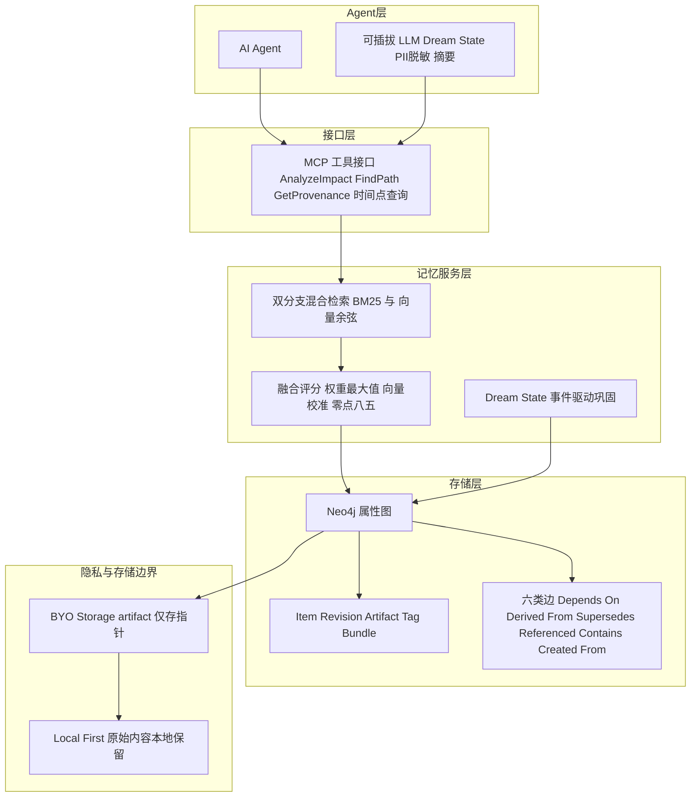

# 面向 AI Agent 的图原生认知记忆：版本化记忆架构的形式化信念修正语义

## 一、论文基础元数据
- **原文标题**：Graph-Native Cognitive Memory for AI Agents: Formal Belief Revision Semantics for Versioned Memory Architectures
- **中文译版**：面向 AI Agent 的图原生认知记忆：版本化记忆架构的形式化信念修正语义
- **发表渠道**：arXiv 预印本（等级：预印本，未经同行评审）
- **发表时间**：2025 年
- **链接**：arXiv:2603.17244
- **作者及核心机构**：Young Bin Park（核心机构：待补充）
- **研究领域**：一级领域：人工智能 / 大语言模型 Agent；二级子领域：Agent 记忆架构、知识表示与信念修正、图数据库系统
- **关联数据集**：
  - LoCoMo-Plus：n=401（主评估）、n=200（预富集基线消融），语言为英语，标注情况待补充
  - LongMemEval：时间推理与知识更新基准，规模待补充
  - MemoryAgentBench：四能力框架基准，规模待补充
  - MemBench、Mem2ActBench、MEMTRACK、PERSONAMEM：计划接入，规模与标注待补充

## 二、论文综合评价

### 2.1 量化评分（1-5分，5分为最优）

| 评价维度 | 评分 | 备注 |
| -------- | ---- | ---- |
| 📚 理论基础 | ⭐⭐⭐⭐⭐ | AGM 公设映射严谨，两层信念模型清晰 |
| 🎯 问题核心性 | ⭐⭐⭐⭐⭐ | 直击 Agent 记忆与 LLM 紧耦合的核心痛点 |
| 💡 方法创新性 | ⭐⭐⭐⭐ | 图原生版本化与 AGM 映射具原创性，MCP 部分较常见 |
| ⚙️ 技术壁垒 | ⭐⭐⭐⭐ | 属性图语义、混合检索融合与时序查询有工程门槛 |
| 🧪 实验严谨性 | ⭐⭐⭐ | 仅部分结果，评估多为路线图，独立复现差距较大 |
| 🔧 落地可行性 | ⭐⭐⭐⭐ | Neo4j+MCP+可插拔 LLM，落地路径清晰 |
| 🚀 应用前景 | ⭐⭐⭐⭐⭐ | Agent 记忆基础设施需求强，应用前景广阔 |
| 📊 综合评分 | 4.3 | 架构与形式化扎实，实验验证不足，长期潜力大 |

> 综合评分计算：前 7 项平均值为 (5+5+4+4+3+4+5)/7 ≈ 4.29，保留 1 位小数记为 4.3。

### 2.2 定性综合评价（≤300字）
> 本文定位为 AI Agent 记忆基础设施的系统性架构论文，核心价值在于将“记忆”从 LLM 上下文与框架私有结构中解耦，转为一等公民的图原生、版本化存储。其差异化优势有三：一是用 Item-Revision-Tag 模型实现“不可变修订 + 可变指针”，天然支持审计、回滚与时间点查询；二是将 AGM 信念修正语义映射为 Revision、Contraction、Expansion 等图操作，并有意违反 Recovery 公设以保留历史；三是提出认知记忆与资产管理原语同构的洞见，使同一属性图可同时管理记忆与工作产物。关键结论是：在 LoCoMo-Plus 上召回准确率已达 98.5%，剩余瓶颈在答案模型推理而非检索；但完整实验与跨系统对比仍属路线图，独立复现结果低于官方报告，提示配置敏感性与验证不足。

## 三、领域本体论映射

| 核心维度 | 具体内容 |
| -------- | -------- |
| 核心研究对象 | AI Agent 的持久化认知记忆系统及其信念演化机制 |
| 核心技术路径 | 属性图数据库 + 版本化 Item-Revision + AGM 信念修正 + MCP 标准接口 + 可插拔 LLM |
| 数据/载体形态 | 图节点（Project/Space/Item/Revision/Artifact/Tag/Bundle）、边、URI（kref://）、摘要/主题/关键词/embedding、artifact 指针 |
| 核心功能目标 | 实现模型无关、可移植、可审计、支持选择性回忆与信念修正的 Agent 记忆基础设施 |
| 验证核心指标 | LoCoMo-Plus 准确率、召回准确率、AGM 公设合规率、检索融合参数与消融表现 |

## 四、核心问题与解决方案

### 4.1 待解决的核心问题
1. **领域级根本问题**：当前 Agent 记忆与 LLM 紧耦合，记忆被绑定在 prompt 上下文、模型缓冲或框架专用结构中，导致供应商锁定、升级脆弱、不可移植；上下文窗口只是注意力容量，并非真正记忆，不支持选择性回忆、结构化关系与持久存储。
2. **现有方法痛点**：Transformer 注意力复杂度为 \(O(n^2d)\)，随上下文增长成本急剧上升；检索式记忆可近似 \(O(\log N)+O(k^2d)\)，但现有方案缺乏统一的版本、URI、依赖边与治理审计能力。多 Agent 协调需要可追溯“为什么相信/决策”，而多数记忆框架无法提供时间点信念重建。
3. **工程落地卡点**：记忆与模型解耦后，如何保证信念一致性、如何避免被取代的旧修订通过向量相似检索泄漏、如何实现本地优先与 BYO-Storage、如何在不复制原始内容的前提下支持跨平台统一身份，均是落地难点。

### 4.2 核心解决方案
- **理论框架**：以 AGM 信念修正理论为基础，将记忆图定义为 \(G=(I,R,E,\tau)\)，信念基 \(\mathcal{B}(\tau)=\bigcup_{t\in dom(\tau)}\varphi(\tau(t))\)，并区分完整图 \(G\) 与 Agent 检索表面 \(\mathcal{B}_{retr}(\tau)\)。
- **核心架构**：LLM-Memory 解耦架构。记忆存于标准属性图数据库（Neo4j），通过 MCP 暴露模型无关工具接口，LLM 组件（Dream State、PII 脱敏、摘要）可插拔；参考实现为 Kumiho。
- **关键技术**：Item-Revision 不可变快照模型、可变 Tag 指针、六类边（Depends_On、Derived_From、Supersedes、Referenced、Contains、Created_From）、六类记忆（工作、情景、语义、程序、关联、元记忆）、双分支混合检索（BM25 + 向量余弦）、Dream State 事件驱动巩固、Local-First / Summary-to-Cloud 隐私架构。
- **创新机制**：将 Revision、Contraction、Expansion 映射为图操作；通过 `Supersedes` 链支持 Darwiche-Pearl 迭代修正；通过时间标签 \(\tau_T\) 支持“某时刻相信什么”；故意违反 Recovery 公设，将收缩实现为归档而非擦除，以保留完整历史并支持显式回滚。

### 4.3 核心优势（量化+定性）
1. **性能优势**：LoCoMo-Plus（n=401，GPT-4o）准确率 93.3%，召回准确率 98.5%；AGM 合规测试 49 个场景、7 个公设全部 100% 通过；预富集基线为 61.6%（n=200），完整系统上界为 93.3%。
2. **效率优势**：检索式记忆近似 \(O(\log N)+O(k^2d)\)，且 \(k \ll n\)，相比 Transformer 注意力 \(O(n^2d)\) 在长程记忆场景下具备显著扩展优势；双分支检索在同一 Cypher 查询中通过 `UNION ALL` 完成，减少系统往返。
3. **工程优势**：模型无关、供应商中立；本地优先与 BYO-Storage 只存 artifact 指针，不复制、缓存或代理原始内容；不可变修订支持审计、回滚与时间查询；MCP 标准接入使平台无关部署成为可能。

## 五、方法与技术架构

### 5.1 核心架构设计
> 系统以属性图数据库为记忆底座，向上通过 MCP 暴露工具接口，向下由 Dream State 事件流驱动巩固。Agent 不直接操作数据库，而是通过 MCP 图操作完成记忆检索、溯源、影响分析与时间点查询。完整图包含所有 Revision（含 deprecated/archived），Agent 检索表面仅暴露 active tag 引用且 item 非 deprecated 的 Revision，从而在架构级维护 Consistency 公设。

### 5.2 关键技术实现细节

| 技术模块 | 实现路径 | 工程注意事项 |
| -------- | -------- | ------------ |
| Item-Revision 模型 | Item 为命名、类型化记忆单元；Revision 为不可变快照，含 summary、topics、keywords、schema version、可选 embedding | 修订不可改，只能新增；需维护 schema 版本兼容与迁移策略 |
| 可变 Tag 指针 | Tag 指向某 Revision，支持 `current`、`initial` 等视图；回滚即重定向 Tag | Tag 重定向需原子性；时间索引 Tag 用于重建任意时刻信念 |
| AGM 图操作 | Revision：新增 Revision + `Supersedes` 边 + 重定向 Tag；Contraction：移除 Tag 或软弃用，默认从检索面排除但保留图内；Expansion：新增内容并打 Tag | 默认过滤 deprecated；`include_deprecated=true` 仅操作员审计；需保证 Success、Inclusion、Vacuity、Consistency、Extensionality、Relevance、Core-Retainment 公设 |
| 双分支混合检索 | BM25 fulltext 与向量余弦相似度在同一 Cypher 查询中 `UNION ALL`；融合公式 \(S(q,m)=w(m)\cdot \max(s_\ell(m), s_v(m))\)，向量校准 \(\beta=0.85\)；类型权重 item 1.0、revision 0.9、artifact 0.8 | superseded 不自动排除以保留时间查询；冲突结果返回 Agent 推理层；向量索引需每租户隔离 |
| MCP 工具接口 | 暴露图操作：`AnalyzeImpact`、`FindPath`、`GetProvenance` 及时间点查询 | MCP 本身非差异化，差异化在推理/溯源图操作广度；需处理工具调用错误与权限 |
| Dream State 事件驱动巩固 | 处理 `revision.created`、`edge.created`、`revision.deprecated` 事件流；游标持久化在 `_dream_state`，支持中断恢复；定时、游标空闲、记忆数阈值或显式 API/MCP 调用触发 | 提示注入风险；仅处理元数据并设置护栏；需幂等处理与失败重试 |
| 隐私与 BYO-Storage | Local-First：聊天、语音、图像、工具输出、PII 留本地；上云仅 PII 脱敏摘要、提取事实、主题关键词、artifact 指针、embedding；artifact 只存指针 | 脱敏无形式保证、有假阴性；嵌入反演与元数据再识别仍未解决；受监管数据建议专用脱敏模型或规则前置过滤 |
| 依赖组件 | Neo4j 属性图数据库、MCP 协议、可插拔 LLM、向量索引、BM25 全文索引 | 版本兼容、多租户隔离、备份与恢复、图查询性能调优 |

### 5.3 架构优缺点
- **优点**：
  - 记忆与 LLM 解耦，模型可插拔，避免供应商锁定。
  - 不可变 Revision + 可变 Tag 实现审计、回滚与时间点查询。
  - AGM 公设在完整信念基上成立，检索表面继承一致性，防止旧修订泄漏。
  - 认知记忆与资产管理原语同构，同一图管理记忆与工作产物，降低系统复杂度。
  - 本地优先与 BYO-Storage 有利于数据主权与合规。
- **缺点**：
  - 隐私保证依赖 LLM 脱敏，非形式化，存在假阴性与嵌入反演风险。
  - 检索表面继承信念一致性，但不继承确定性排序，因混合评分会重排。
  - K*7、K*8 仅为论证支持，未完全形式化；Recovery 公设被有意违反，需接受与非经典信念修正的差异。
  - 完整实验与跨系统对比尚属路线图，独立复现与官方结果存在差距。
  - 章节编号混乱，内容似为节选，整体论文完整性待确认。

## 六、实验设计与结果分析

### 6.1 实验基础设置

| 维度 | 内容 |
| ---- | ---- |
| 数据集 | LoCoMo-Plus（主评估 n=401；消融下界 n=200）；计划加入 LongMemEval、MemoryAgentBench、MemBench、Mem2ActBench、MEMTRACK、PERSONAMEM |
| 基线方法 | 预富集基线（61.6%，n=200）；计划受控重评 Graphiti、Mem0、Hindsight；检索消融对比 RRF、凸组合 |
| 实验环境 | GPT-4o（主结果）；相同基础设施与 LLM 配置下的跨系统比较（计划） |
| 评价指标 | 准确率、召回准确率、AGM 公设合规率、目标类型准确率、时间顺序推理表现、检索融合参数 β 与类型权重影响 |

### 6.2 核心实验结果

| 方法 | 核心指标1（准确率） | 核心指标2（召回准确率） | 工程指标（算力/耗时） |
| ---- | --------- | --------- | -------------------- |
| 预富集基线（n=200） | 61.6% | 待补充 | 待补充 |
| 独立复现（n=401） | 约 80% 中段 | 待补充 | 待补充 |
| 本文方法 / 完整系统（n=401，GPT-4o） | 93.3% | 98.5% | 待补充 |
| AGM 合规测试 | 49 场景、7 公设 100% 通过 | — | 待补充 |
| 目标类问题 | 85% | — | 待补充 |

> 注：以上结果中，官方完整系统 93.3% 与独立复现约 80% 中段存在明显差距，提示配置与复现敏感性。实验部分主要为第 16.1 节“评估路线图”，完整实验报告待补充。

### 6.3 消融实验/鲁棒性分析

| 实验变体 | 指标变化 | 核心结论 |
| -------- | -------- | -------- |
| summary-only | 待补充（计划） | 计划消融，用于隔离摘要贡献 |
| +events | 待补充（计划） | 事件提供事实锚点 |
| +implications | 待补充（计划） | implications 提供语义桥，弥补抽象语义缺口 |
| full system | 上界 93.3%（n=401） | 完整系统上界；下界预富集基线 61.6%（n=200） |
| 检索分支隔离 | 待补充（计划） | 分析 β∈[0.5,1.0]、类型权重，并与 RRF、凸组合比较 |
| AGM 场景鲁棒性 | 49 场景、7 公设 100% 通过 | 覆盖 simple、multi-item、chain、temporal、adversarial 五类 |
| 目标类型问题 | 85% | 目标类问题显著低于整体，需目标感知前瞻索引 |
| 时间顺序上下文排序 | 待补充（计划） | 当前按相关度排序；改为按时间排序可能改善时间进展与叙事