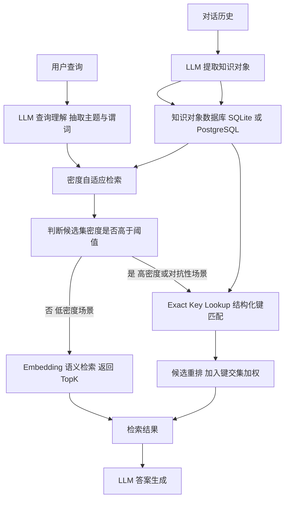

# 事实即一等对象：面向持久化LLM记忆的知识对象

## 一、论文基础元数据
- **原文标题**：Facts as First Class Objects: Knowledge Objects for Persistent LLM Memory
- **中文译版**：事实即一等对象：面向持久化LLM记忆的知识对象
- **发表渠道**：arXiv 预印本（等级：待补充，尚未正式发表）
- **发表时间**：2025 年
- **链接**：arXiv:2603.17781
- **作者及核心机构**：Oliver Zahn, Simran Chana（核心机构待补充）
- **研究领域**：一级领域——人工智能/自然语言处理；二级子领域——LLM 记忆架构、知识表示与检索增强生成（RAG）
- **关联数据集**：
  - BEIR 基准（多领域检索基准，标准 benchmark）
  - SciFact（科学事实检索数据集）
  - 对抗性事实语料（自定义构造，语义近但事实不同的对抗样本，规模待补充）
  - 多跳推理 / 跨域合成评测集（规模待补充）

## 二、论文综合评价

### 2.1 量化评分（1-5分，5分为最优；所有评分均以数字表示）

| 评价维度 | 评分 | 备注 |
| -------- | ---- | ---- |
| 📚 理论基础 | 4.0 | 存储-处理分离理念清晰，但理论深度偏工程 |
| 🎯 问题核心性 | 5.0 | 直击上下文腐烂与压缩丢失的本质痛点 |
| 💡 方法创新性 | 4.0 | KO 哈希寻址+密度自适应检索，范式层面有新意 |
| ⚙️ 技术壁垒 | 3.0 | 实现依赖标准数据库与哈希，门槛较低 |
| 🧪 实验严谨性 | 4.0 | 跨模型压缩对比充分，但部分统计细节缺失 |
| 🔧 落地可行性 | 4.0 | 数据库+LLM 即可复现，提取准确性是瓶颈 |
| 🚀 应用前景 | 5.0 | 对长期记忆型 Agent 与 RAG 集成价值显著 |
| 📊 综合评分 | 4.1 | 问题切入精准、实验覆盖面广，工程价值高，但理论深度与细节披露不足 |

### 2.2 定性综合评价（≤300字）

> 本文针对 LLM 长上下文记忆在真实生产环境中的系统性失效——压缩平均破坏 60% 事实、54% 项目约束，且无错误信号——提出 **知识对象（Knowledge Objects, KOs）** 作为一等实体：离散、哈希寻址的 `(subject, predicate, object, provenance)` 元组，外置于 SQLite/PostgreSQL，实现 O(1) 无损查找。核心设计原则是 **存储与处理分离**，将事实从散文中解放出来，避免每次查询重处理带来的压缩衰减。配套的 **密度自适应检索** 在嵌入相似度与结构化精确键匹配之间智能切换，解决对抗性事实下嵌入检索 P@1 仅 20% 的困境。实验显示 KO 在扩展性、抗压缩、抗目标漂移、跨模型鲁棒性上全面超越 In-Context 与 RAG，成本降低 252 倍，并证明压缩损失是 **架构性属性** 而非模型特定限制。整体为持久化 LLM 记忆提供了可落地的新范式，但多跳推理（0.79）与跨域合成（4.6/5）尚未完全解决。

## 三、领域本体论映射

| 核心维度 | 具体内容 |
| -------- | -------- |
| 核心研究对象 | LLM 外部持久化记忆的事实存储与检索机制 |
| 核心技术路径 | 哈希寻址事实三元组 + 密度自适应检索（嵌入 vs 精确键混合） |
| 数据/载体形态 | 结构化 `(subject, predicate, object, provenance)` 元组，存储于 SQLite/PostgreSQL，单条约 100 字节 |
| 核心功能目标 | 实现无损、O(1)、持久、跨会话、跨模型的事实记忆 |
| 验证核心指标 | 检索准确率（P@1/NDCG@10）、压缩鲁棒性、目标漂移抵抗、查询成本（$/query）、多跳/跨域合成质量 |

## 四、核心问题与解决方案

### 4.1 待解决的核心问题
1. **领域级根本问题**：LLM 作为自身记忆体时，上下文窗口有限、短暂、压缩有损；即便在 97.5% 上下文使用率下基准准确率仍达 100%，也无法避免生产环境中的系统性记忆丢失。
2. **现有方法痛点**：
   - **上下文记忆**：填满后压缩平均破坏 60% 事实、54% 项目约束，且无错误信号，模型静默回退到"合理默认"行为。
   - **RAG**：语义嵌入在对抗性事实（语义近但事实不同）下 P@1 仅 20%，接近随机水平。
   - **跨模型普遍性**：Claude Sonnet 4.5/4.6、Opus、GPT-5.4 在 5× 压缩下准确率均低于 50%，GPT-5.4 在 2× 即归零，说明是 **架构性缺陷**。
3. **工程落地卡点**：
   - 从非结构化对话中准确提取结构化 KO。
   - 阈值 τ、λ 需要调参，影响泛化性。
   - 事实更新/冲突解决、多跳推理尚未完善。

### 4.2 核心解决方案
- **理论框架**：存储与处理分离（Separation of Storage and Processing）——LLM 只负责推理、查询理解、答案生成与新 KO 提取，外部存储负责事实持久化。
- **核心架构**：知识对象（KO）作为离散、哈希寻址的元组外置于 SQLite/PostgreSQL；查询时按 `SHA-256(normalize(subject) || normalize(predicate))` 键 O(1) 定位。
- **关键技术**：
  1. **哈希键寻址**：`SHA-256(normalize(subject) || normalize(predicate))`，存储成本约 100 字节/KO。
  2. **密度自适应检索**：计算候选集密度 ρ（平均成对余弦相似度），若 ρ > τ（τ=0.85），回退到精确结构化键匹配。
  3. **候选重排**：`score'(d) = score(d) + λ·|keys(q) ∩ keys(d)|`，λ=0.5。
- **创新机制**：将事实、项目约束与对齐决策作为一等对象，避免被压缩损失；检索机制根据密度动态切换嵌入/结构化匹配。

### 4.3 核心优势（量化+定性）
1. **性能优势**：
   - 准确率：所有测试条件下 100%（含 N=10,000 超上下文窗口场景）。
   - 对抗性事实 P@1：100% vs 嵌入检索 20%。
   - 压缩鲁棒性：5×、10×、20× 压缩下保持 100%，所有前沿模型在 5× 下均低于 50%。
   - 多跳推理：78.9% vs In-Context 31.6%。
   - 跨域合成 groundedness：+118%。
2. **效率优势**：
   - 查询成本 O(1)，不随语料增长。
   - $0.002/查询 vs 上下文 $0.57（N=7,000），**252 倍成本差异**；N=100,000 时上下文物理不可行。
3. **工程优势**：
   - 依赖标准 SQLite/PostgreSQL，易于部署和集成。
   - 跨模型、跨压缩比鲁棒，避免模型升级导致记忆失效。
   - 存储与推理分离，便于与现有 RAG 管道集成。

## 五、方法与技术架构

### 5.1 核心架构设计

> 架构核心：LLM 专注于推理与生成，外部 KO 数据库负责事实的持久化与 O(1) 检索，通过密度自适应检索在语义近似与精确事实匹配间自适应切换。

### 5.2 关键技术实现细节

| 技术模块 | 实现路径 | 工程注意事项 |
| -------- | -------- | ------------ |
| KO 定义与存储 | `(subject, predicate, object, provenance)` 元组，哈希键 `SHA-256(normalize(subject)||normalize(predicate))` 存于外部 DB，单条约 100 字节 | 需定义 normalize 规范（大小写、标点、同义词）；provenance 需支持版本追溯 |
| KO 提取 | LLM 从对话历史中抽取结构化三元组 | 提取准确性是主要误差来源，需评测抽提 F1；建议加校验回路 |
| 密度自适应检索 | 计算候选集平均成对余弦相似度 ρ；ρ>0.85 触发 exact key lookup，否则走 embedding | τ 阈值需按领域调参；需保证候选集生成阶段不遗漏正确事实 |
| 候选重排 | `score'(d) = score(d) + λ·|keys(q) ∩ keys(d)|`，λ=0.5 | λ 取值对排序影响显著，建议网格搜索验证 |
| 依赖组件 | SQLite/PostgreSQL、SHA-256、embedding 模型、LLM（Claude/GPT 系列等） | 数据库需支持索引加速；embedding 模型需与 LLM 解耦以支持模型切换 |
| 事实更新/冲突 | 待补充（论文未详述） | 工程落地需引入时间戳与冲突解决策略 |

### 5.3 架构优缺点
- **优点**：
  1. O(1) 查询成本不随语料规模增长，在 N=100,000 等大规模下依然高效。
  2. 事实持久化，不受上下文压缩、会话边界、模型升级影响。
  3. 密度自适应机制兼顾对抗鲁棒性（P@1=100%）与标准检索效率（BEIR NDCG@10=0.645）。
  4. 架构与模型解耦，便于跨模型迁移。
- **缺点**：
  1. 严重依赖 KO 提取质量，若提取有误则下游全错。
  2. τ、λ 等超参需调优，泛化性存疑。
  3. 多跳推理（2-hop 78.9%）与跨域合成（4.6/5）未达完美。
  4. 事实更新、冲突解决、非结构化对话的复杂语义尚待处理。

## 六、实验设计与结果分析

### 6.1 实验基础设置

| 维度 | 内容 |
| ---- | ---- |
| 数据集 | BEIR（NDCG@10）、SciFact、对抗性事实语料（自定义构造）、多跳推理集、跨域合成集；规模从 N=500 到 N=100,000 |
| 基线方法 | In-Context Memory（上下文记忆）、RAG（Embedding Only）、Hybrid Always |
| 实验环境 | 多模型：Claude Sonnet 4.5/4.6、Opus、GPT-5.4；压缩比 2×/5×/10×/20×/37× |
| 评价指标 | P@1、NDCG@10、准确率、groundedness 评分、$/query、目标漂移倍数 |

### 6.2 核心实验结果

**Table 1：密度自适应检索对比**

| 方法 | 对抗 P@1 | BEIR NDCG@10 | 虚假触发率 |
| ---- | --------- | ------------ | ---------- |
| Embedding only | 20.0% | 0.645 | — |
| Hybrid always | 100% | 0.619（↓4%） | 100% |
| Adaptive (τ=0.85) | 100% | 0.645 | 0% |

**Table 7：全实验对比（In-Context / RAG / KO）**

| 方法 | 扩展性 (N=500/7,000/10,000) | 对抗 P@1 | 事实压缩 37× | 目标漂移 9×/17×/31× | 多跳 2-hop | 跨域合成 |
| ---- | -------------------------- | -------- | ------------ | ------------------- | ---------- | -------- |
| In-Context | 1.00 / 1.00 / 溢出 | N/A | 0.40 | 0.91 / 0.62 / 0.46 | 0.32 | 3.0/5 |
| RAG | 1.00 / 1.00 / 1.00 | 0.20 | N/A | N/A | 待补充 | 待补充 |
| **KO（本文）** | **1.00 / 1.00 / 1.00** | **1.00** | **1.00** | **1.00 / 1.00 / 1.00** | **0.79** | **4.6/5** |

**工程指标（成本）**

| 方法 | 成本（$/query） | 备注 |
| ---- | --------------- | ---- |
| 上下文记忆（N=7,000） | 0.57 | 随语料规模线性增长 |
| KO | 0.002 | O(1)，不随语料增长；**252×成本优势** |
| 上下文记忆（N=100,000） | 物理不可行 | — |

### 6.3 消融实验/鲁棒性分析

| 实验变体 | 指标变化 | 核心结论 |
| -------- | -------- | -------- |
| 跨模型压缩（Claude Sonnet 4.5/4.6、Opus、GPT-5.4） | 5× 压缩下所有模型准确率 <50%；Opus 10×→15%，20×→5%；GPT-5.4 2×→0% | 压缩损失是 **架构属性**，非模型特定缺陷 |
| 上下文利用率 97.5% | 基准准确率仍 100% | 单次基线表现具有欺骗性，不代表长周期可靠性 |
| 5-seed 均值（压缩损失） | 平均破坏 60% 事实、54% 项目约束 | 系统性记忆丢失，无错误信号 |
| 密度自适应 vs Hybrid always | BEIR 从 0.645 降至 0.619（↓4%） | always-on hybrid 存在虚假触发代价，自适应机制避免 |
| 密度区分能力 | 对抗 ρ≈0.90 vs BEIR/SciFact ρ≈0.47 | τ=0.85 是有效判别阈值 |

### 6.4 实验结论（工程视角）
1. KO 在扩展性、对抗鲁棒性、抗压缩、抗目标漂移上显著优于 In-Context 与 RAG，多数条件达 100%。
2. **压缩损失是架构性而非模型性**：升级模型不能解决记忆丢失，需改变记忆载体形态。
3. O(1) 查询成本在 N≥10,000 时具有数量级优势，是大规模持久化记忆的可行路径。
4. 多跳推理（0.79）与跨域合成（4.6/5）尚未完美，说明结构化事实存储需与推理机制进一步协同。
5. 论文"所有条件 100%"的表述与 Table 7 中多跳/跨域数值存在张力，需谨慎解读。

## 七、领域贡献与创新点

| 贡献层级 | 具体内容 |
| -------- | -------- |
| 理论贡献 | 论证压缩损失是散文式记忆的 **架构属性**，而非模型缺陷；提出存储与处理分离的记忆设计原则 |
| 方法/架构贡献 | 提出 KO 作为 LLM 外部持久记忆层，实现事实一等对象化；提出密度自适应检索解决对抗性事实嵌入失败 |
| 数据/工具贡献 | 基准套件与实验代码（仓库 URL 待发表添加）；对抗性事实语料构造方法 |
| 实验/验证贡献 | 跨 4 个前沿模型、多压缩比、多规模（至 N=100,000）的系统性对比；证明 KO 的跨模型鲁棒性 |
| 工程落地贡献 | 提供基于 SQLite/PostgreSQL 的低成本、O(1)、可复现持久记忆方案；252×成本优势为大规模部署提供可能 |

## 八、局限性与风险

| 维度 | 具体描述 | 应对思路 |
| ---- | -------- | -------- |
| 学术局限性 | KO 提取依赖 LLM，准确性未充分评估；τ、λ 超参敏感性未做完整消融；多跳推理仅 0.79；论文中"所有条件 100%"与 Table 7 存在张力 | 增加抽提模块评测；开展超参敏感性分析；明确区分单事实与多跳场景 |
| 工程落地风险 | 从非结构化对话抽取 KO 的 F1 未知，错误事实会污染长期记忆；事实更新、冲突解决、时序版本未提及 | 引入人工/模型校验、置信度评分；设计版本化 KO schema 与冲突消解策略 |
| 伦理/合规风险 | 长期持久化个人事实涉及隐私与 GDPR 等合规；provenance 可能暴露对话来源 | 支持 fact-level 访问控制与删除；provenance 脱敏；明确数据留存策略 |
| 其他风险 | 论文为预印本，未经同行评审；代码/数据 URL 待补充，可复现性待验证 | 关注正式发表版本与开源仓库更新 |

## 九、未来研究/落地方向

| 方向类型 | 具体内容 | 优先级 |
| -------- | -------- | ------ |
| 科研拓展 | 从非结构化对话中自动提取 KO 的方法与评测；扩展更长多跳推理链（≥3-hop）；事实更新/冲突解决机制 | 高 |
| 工程优化 | 与现有 RAG 管道深度集成；τ、λ 自适应调参；数据库分片与索引优化；与向量数据库混合部署 | 高 |
| 跨领域适配 | 企业知识管理（项目约束、合规决策等一等对象化）；个性化长期 Agent 记忆；多语言 KO 规范化 | 中 |
| 理论深化 | 与双院架构（Zahn et al., 2026）的运行时联动；事实身份与语义近似的形式化边界 | 中 |

## 十、关键词与术语表

| 语言 | 关键词 |
| ---- | ------ |
| 中文 | 知识对象、持久化记忆、事实一等对象、哈希寻址、密度自适应检索、上下文腐烂、压缩损失、存储与处理分离、对抗性事实 |
| 英文 | Knowledge Objects (KO), Persistent LLM Memory, Facts as First Class Objects, Hash-addressed Tuples, Density-adaptive Retrieval, Context Rot, Compression Loss, Storage-Processing Separation, Adversarial Facts |
| 领域专属术语 | **Knowledge Object (KO)**：离散、哈希寻址的 `(subject, predicate, object, provenance)` 事实元组，外部持久化存储；**密度自适应检索**：根据候选集平均成对余弦相似度 ρ 在嵌入相似度与精确键匹配之间切换的检索机制；**上下文腐烂 (Context Rot)**：长上下文填满后压缩导致的事实/约束丢失；**目标漂移 (Goal Drift)**：压缩后模型偏离原任务目标的系统性行为；**P@1**：检索结果首位准确率；**NDCG@10**：归一化折损累计增益 |

## 十一、参考文献与关联资源
- **核心参考文献**：
  - Zahn et al. (2026)，双院架构（Dual-Chamber Architecture），本文密度自适应检索为其提供运行时切换机制。
  - BEIR 基准（Thakur et al.）
  - SciFact（Wadden et al.）
- **补充阅读**：RAG 相关研究、长上下文 LLM 记忆机制、知识图谱三元组存储
- **开源代码/工具**：基准套件和实验代码计划在项目仓库发布（URL 待论文正式发表添加）

## 十二、阅读者批注

1. **科研启发**：
   - "压缩损失是架构性而非模型性"这一论断极具冲击力，提示长上下文研究应关注记忆载体形态而非单纯扩大窗口。
   - 密度自适应检索提供了一条"语义近似 vs 精确事实"的可计算判别路径，可推广至事实验证、幻觉检测等场景。

2. **工程落地思考**：
   - KO + 现有 RAG 混合架构最具现实价值：结构化事实走 KO，开放语义走 RAG。
   - 需要重点解决 KO 提取准确率问题，建议引入"提取-验证-双写"流水线与 confidence 评分。

3. **待验证/存疑点**：
   - 论文"所有条件 100%"表述与 Table 7 中多跳 0.79、跨域 4.6/5 存在张力，需核实条件范围。
   - τ=0.85、λ=0.5 是否跨领域通用，缺乏敏感性分析。
   - 对抗性事实语料的构造方式、统计显著性检验未充分披露。
   - 事实更新、冲突解决、时序版本等关键工程问题未涉及。

4. **个人/团队应用场景**：
   - 长期运行的客服/助理 Agent 需跨会话记忆用户偏好与硬性约束。
   - 企业知识库中项目约束、合规规则等"易被压缩且后果严重"的事实应优先 KO 化。
   - 与向量数据库混合部署，构建"结构化事实 + 语义检索"双层记忆体系。

## 十三、阅读元信息

| 维度 | 内容 |
| ---- | ---- |
| 阅读日期 | 2026-09-30 21:06 |
| 阅读人 | xPaperReader AI |
| 文档编号 | arxiv-2603.17781 |
| 版本迭代 | v1.0 |