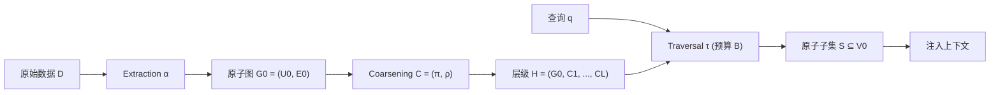

# 面向语言智能体的分层记忆理论探索

## 一、论文基础元数据
- **原文标题**：Toward a Theory of Hierarchical Memory for Language Agents
- **中文译版**：面向语言智能体的分层记忆理论探索
- **发表渠道**：arXiv 预印本（未经同行评审，理论/综述类）
- **发表时间**：2025 年（具体月份待补充）
- **链接**：arXiv:2603.21564
- **作者及核心机构**：Yashar Talebirad、Ali Parsaee、Csongor Y. Szepesvari、Amirhossein Nadiri、Osmar Zaiane（机构信息待补充；通讯作者可能与阿尔伯塔大学相关）
- **研究领域**：一级领域——人工智能 / 大语言模型；二级子领域——语言智能体记忆系统、检索增强生成（RAG）、信息检索理论
- **关联数据集**：本文为理论工作，未引入新数据集；系统实例化涉及 RAPTOR、GraphRAG、xMemory、H-MEM、SimpleMem、Mastra OM、PageIndex、MemoBrain、StackPlanner、AgeMem、InfiAgent 共 11 个系统的既有设定

## 二、论文综合评价

### 2.1 量化评分（1-5 分，5 分为最优）

| 评价维度 | 评分 | 备注 |
| -------- | ---- | ---- |
| 📚 理论基础 | ⭐⭐⭐⭐⭐ | 首次统一分层记忆的数学形式化，触及信息论根基 |
| 🎯 问题核心性 | ⭐⭐⭐⭐⭐ | 直击长上下文"上下文稀释"这一根本痛点 |
| 💡 方法创新性 | ⭐⭐⭐⭐⭐ | 三算子分解、自我充分性、C–T 耦合均为原创概念 |
| ⚙️ 技术壁垒 | ⭐⭐⭐⭐ | 理论推导有深度，但工程实现落地门槛中高 |
| 🧪 实验严谨性 | ⭐⭐ | 理论论文，缺乏大规模受控实证与消融数据 |
| 🔧 落地可行性 | ⭐⭐⭐ | 提供设计原则与形式化语言，但未开源可直接套用代码 |
| 🚀 应用前景 | ⭐⭐⭐⭐ | 对 RAG、智能体长时记忆架构具备强指导意义 |
| 📊 综合评分 | 3.9 | 理论框架贡献突出，实证支撑薄弱，属"路线图"型工作 |

### 2.2 定性综合评价（≤300 字）
> 本文为语言智能体的分层记忆研究提出首个统一理论框架。核心贡献是把 RAPTOR、GraphRAG、xMemory、H-MEM、SimpleMem 等孤立系统抽象为 \((\alpha, C, \tau)\) —— 提取、粗化、遍历三算子流水线，并引入"自我充分性 SS"刻画代表函数信息保留度，揭示粗化与遍历之间的 C–T 耦合约束。论文进一步给出信息单调性、亲和性一致性、Fano 界、最优分支因子 \(b=e\) 与深度下界等理论结果，并将框架扩展至执行轨迹记忆与任务层级。差异化优势在于"用同一把尺子量所有系统"，为设计空间提供可比较坐标；关键结论是：代表函数信息量决定可行检索策略，错配将浪费预算。局限性在于缺乏实证验证与时序动态层级的理论覆盖，整体更接近研究路线图而非完备理论。

## 三、领域本体论映射

| 核心维度 | 具体内容 |
| -------- | -------- |
| 核心研究对象 | 语言智能体的分层记忆系统（数据记忆 + 执行轨迹记忆 + 任务记忆） |
| 核心技术路径 | 将分层记忆统一抽象为"提取—粗化—遍历"三算子流水线 \((\alpha, C, \tau)\) |
| 数据/载体形态 | 原子信息单元图 \(G_0=(U_0,E_0)\)、多分辨率层级 \(\mathcal{H}=(G_0,C_1,\dots,C_L)\)、代表函数 \(\rho\) |
| 核心功能目标 | 在 token 预算 \(B\) 约束下最大化查询相关信息召回，缓解"上下文稀释" |
| 验证核心指标 | 自我充分性 \(SS\)、查询依赖 \(SS_Q\)、信息熵单调性、coherence gap \(\gamma_\ell\)、Fano 错误率上界、最优分支因子、层级深度下界 |

## 四、核心问题与解决方案

### 4.1 待解决的核心问题
1. **领域级根本问题**：长上下文模型存在"上下文稀释 / context rot"——窗口变大并不等于信息利用变好；如何让有限上下文预算高效触达海量记忆？
2. **现有方法痛点**：RAPTOR、GraphRAG、xMemory、H-MEM、SimpleMem 等分层记忆系统各自为政，设计点孤立，缺乏统一形式化，难以横向比较、复现与组合。
3. **工程落地卡点**：代表函数 \(\rho\) 与遍历策略 \(\tau\) 的选择依赖经验；SS 度量缺乏工作负载校准；动态层级（插入/重构/衰减）破坏静态假设。

### 4.2 核心解决方案
- **理论框架**：把任意分层记忆系统分解为三元组 \((\alpha, C, \tau)\)，其中 \(\alpha\) 负责原子化、\(C=(\pi,\rho)\) 负责分组与代表生成、\(\tau\) 负责预算约束下的检索。
- **核心架构**：迭代粗化形成层级 \(\mathcal{H}=(G_0,C_1,\dots,C_L)\)，遍历从层级中选出原子子集 \(S\subseteq V_0\) 注入上下文。
- **关键技术**：
  - 自我充分性度量 \(SS(\rho,G_j)=I(G_j;\rho(G_j))/H(G_j)\)
  - 可计算代理 \(SS_\theta\)（LLM 估计）与查询依赖度量 \(SS_Q\)
  - C–T 耦合：代表信息量约束可行遍历策略
  - 分组一致性 \(W\)-coherent partition 与 coherence gap \(\gamma_\ell\)
  - Fano 界约束每层组数 \(n_k\le 2^{(B+1)/(1-\varepsilon)}\)
- **创新机制**：以信息论视角统一"折叠搜索 vs 自顶向下细化"的取舍，并扩展到代理执行轨迹与任务 DAG 层级。

### 4.3 核心优势（量化 + 定性）
1. **性能优势**：定性揭示"高 SS → 折叠搜索、低 SS → 逐层细化"的匹配原则，为精度/召回权衡提供理论依据。
2. **效率优势**：给出最优分支因子 \(b=e\)（成本 \(\propto b/\ln b\)）与深度下界 \(L\ge\lceil\log_r(N/C)\rceil\)，直接指导层级参数选择。
3. **工程优势**：把 11 个异构系统映射到统一坐标系，便于系统比较、组件替换与设计复用。

## 五、方法与技术架构

### 5.1 核心架构设计

论文将分层记忆视为一个从原始数据到上下文注入的流水线，包含三个可组合算子：

- **Extraction \(\alpha\)**：原始数据 → 原子信息单元图。
- **Coarsening \(C=(\pi,\rho)\)**：分组映射 \(\pi:U\twoheadrightarrow[m]\) 与代表生成 \(\rho\)，迭代形成多层。
- **Traversal \(\tau\)**：在 token 预算 \(B\) 下从层级中检索原子单元。

### 5.2 关键技术实现细节

| 技术模块 | 实现路径 | 工程注意事项 |
| -------- | -------- | ------------ |
| Extraction \(\alpha\) | 将原始文档/轨迹切分为原子信息单元并构图 \(G_0\) | 原子粒度直接影响后续粗化质量 |
| Coarsening—分组 \(\pi\) | 基于嵌入余弦、图连通性、LLM 判断、时间邻近、结构路径等信号构建 affinity \(W\) | 单一分组必然有损，可考虑多视图/多层级 |
| Coarsening—代表 \(\rho\) | 为每组生成代表（摘要、标签、键等） | 需评估 \(SS_\theta\) 以匹配遍历策略 |
| Traversal—Top-down refinement | H-MEM / xMemory 采用逐层 `Top-k_ℓ` 细化 | 适合低 SS 代表，先广路由后细化 |
| Traversal—Collapsed search | RAPTOR 风格，池化所有层后全局 `Top-k` | 适合高 SS 代表，直接内容证据检索 |
| Traversal—Reasoning-based | PageIndex / MemWalker，LLM 从根导航 | 需较强 LLM 推理，token 消耗需控制 |
| Traversal—Multi-view parallel | SimpleMem，按语义/词汇/符号视图并行 `Top-n` | 查询分解 + 难度自适应候选数 |
| 依赖组件 | LLM（代表生成/导航/估计）、向量索引、图结构存储 | 需校准 \(SS_\theta\) 于目标工作负载 |

### 5.3 架构优缺点
- **优点**：抽象层次高，可容纳数 10 种现有系统；用同一坐标系揭示系统间差异；给出可计算的参数指导（如 \(b=e\)）。
- **缺点**：假设静态、无权、确定图，与真实加权/不确定/动态记忆存在差距；未提供端到端参考实现；理论结果与实证效果之间缺乏桥梁。

## 六、实验设计与结果分析

### 6.1 实验基础设置

| 维度 | 内容 |
| ---- | ---- |
| 数据集 | 待补充（本文为理论论文，无新数据集） |
| 基线方法 | 无实验基线；通过"系统实例化表 1"对比 11 个既有系统 |
| 实验环境 | 待补充 |
| 评价指标 | 理论指标：\(SS\)、\(SS_Q\)、coherence gap \(\gamma_\ell\)、Fano 界、最优分支因子、深度下界 |

### 6.2 核心实验结果

本文未开展受控对照实验，无标准结果表。以下为论文形式化映射结果：

| 方法 | 代表函数特性 | 适配遍历策略 | 工程指标（算力/耗时） |
| ---- | --------- | --------- | -------------------- |
| RAPTOR | 高 SS（摘要可独立回答） | Collapsed search | 待补充 |
| H-MEM / xMemory | 低 SS（代表为路由标签） | Top-down refinement | 待补充 |
| PageIndex / MemWalker | 推理导航 | Reasoning-based navigation | 依赖 LLM 调用 |
| SimpleMem | 多视图索引 | Multi-view parallel retrieval | 待补充 |
| 本文框架 | 抽象三元组 \((\alpha,C,\tau)\) | 覆盖上述四类 | 不适用 |

### 6.3 消融实验/鲁棒性分析

| 实验变体 | 指标变化 | 核心结论 |
| -------- | -------- | -------- |
| 静态层级 vs 动态层级 | 破坏 Markov-chain 论证 | query-conditioned \(\rho\) 使 \(V_\ell\) 依赖 \(Q\) |
| 单一视图 vs 多视图 | 多视图提升召回鲁棒性 | 单一分组必然有损；多层级可纠错 |
| SS 高低与遍历匹配 | 错配浪费预算 | C–T 耦合是核心设计约束 |

> 注：以上为论文的理论/形式化分析，非量化消融实验。

### 6.4 实验结论（工程视角）
本文属理论/路线图型工作，缺乏端到端实证测量。**工程视角的关键启示是**：在设计分层记忆时，应首先评估代表函数的自我充分性 \(SS\)，再据此选择遍历策略；多视图与多层级是提升检索鲁棒性的重要手段；但具体收益需在目标工作负载上实测验证。

## 七、领域贡献与创新点

| 贡献层级 | 具体内容 |
| -------- | -------- |
| 理论贡献 | 提出统一形式化 \((\alpha, C, \tau)\)；自我充分性 SS 与 C–T 耦合；信息单调性、Fano 界、最优分支因子 \(b=e\)、深度下界 |
| 方法/架构贡献 | 四类遍历算法（TDR、Collapsed、Reasoning-based、Multi-view）的统一分类；多层级/多视图扩展框架 |
| 数据/工具贡献 | 无开源代码与数据集（待补充） |
| 实验/验证贡献 | 系统实例化表映射 11 个系统；为后续受控实验给出设计建议 |
| 工程落地贡献 | 提供分层记忆系统设计的决策坐标系与参数指导 |

## 八、局限性与风险

| 维度 | 具体描述 | 应对思路 |
| ---- | -------- | -------- |
| 学术局限性 | 静态、无权、确定图假设；coherence gap \(\gamma_\ell\) 形式界限未解决；缺乏受控比较实验 | 引入 adaptive information theory / online learning；形式化动态层级 |
| 工程落地风险 | \(SS_\theta\) 需在工作负载上校准；无参考实现；多视图系统开销大 | 建立校准流程；提供小规模原型 |
| 伦理/合规风险 | 记忆系统涉及用户隐私与长期数据存储；检索溯源与删除机制不明确 | 设计记忆可删除、可审计机制；合规存储策略 |

## 九、未来研究/落地方向

| 方向类型 | 具体内容 | 优先级 |
| -------- | -------- | ------ |
| 科研拓展 | 形式化动态层级（插入/重构/衰减）；query-conditioned \(\rho\) 与 stateful coarsening 的反馈循环分析 | 高 |
| 工程优化 | 验证 \(SS_\theta\) 作为检索质量预测器；用匹配的 \(\rho/\tau\) 变体测试 C–T 耦合；计算 IB-optimal \(\rho\) | 高 |
| 跨领域适配 | 加权/不确定图上的分组函数（借鉴 SIWOw、USIWO）；多层级跨域迁移 | 中 |

## 十、关键词与术语表

| 语言 | 关键词 |
| ---- | ------ |
| 中文 | 分层记忆、语言智能体、自我充分性、粗化—遍历耦合、上下文稀释、信息瓶颈、多分辨率 |
| 英文 | Hierarchical Memory, Language Agents, Self-Sufficiency, Coarsening-Traversal Coupling, Context Rot, Information Bottleneck, Multi-resolution |
| 领域专属术语 | **Extraction α**：原始数据到原子信息单元图的算子；**Coarsening C=(π,ρ)**：分组+代表生成，迭代成层级；**Traversal τ**：预算 B 约束下检索原子子集；**SS**：代表函数信息保留比例；**C–T 耦合**：代表信息量对可行遍历策略的约束；**coherence gap γℓ**：组内亲和与组间亲和之差的层次控制量；**Collapsed search**：池化全层扁平检索（如 RAPTOR） |

## 十一、参考文献与关联资源
- **核心参考文献**：RAPTOR、GraphRAG、xMemory、H-MEM、SimpleMem、Mastra OM、PageIndex、MemoBrain、StackPlanner、AgeMem、InfiAgent（具体引用条目待补充）
- **补充阅读**：信息瓶颈理论、Fano 不等式、自适应信息论、online learning 相关文献
- **开源代码/工具**：本文未提供开源代码（待补充）

## 十二、阅读者批注
1. **科研启发**：以信息论视角统一分层记忆设计空间的思路很有张力；\(SS\) 与 C–T 耦合并可作为评估新记忆系统的新维度；后续可尝试将 SS 量化与具体 RAG 系统对照。
2. **工程落地思考**：在设计智能体长时记忆时，"先测 SS，再定 τ"可成为标准流程；多视图/多层级虽提升鲁棒性但引入存储与检索开销，需权衡；最优分支因子 \(b=e\) 可直接用于层级树参数初始化。
3. **待验证/存疑点**：\(SS_\theta\) 用 LLM 估计的可靠性与成本未量化；Fano 界中 \(B\) 的具体定义与实测映射需澄清；coherence gap \(\gamma_\ell\) 无闭式解，实际如何估计未明。
4. **个人/团队应用场景**：可应用于长文档 RAG、多智能体协作记忆、Agent 长期对话记忆；建议在现有 RAG 系统上以 SS 分层采样做小规模验证。

## 十三、阅读元信息

| 维度 | 内容 |
| ---- | ---- |
| 阅读日期 | 2026-09-30 21:10 |
| 阅读人 | xPaperReader AI |
| 文档编号 | arxiv-2603.21564 |
| 版本迭代 | v1.0 |