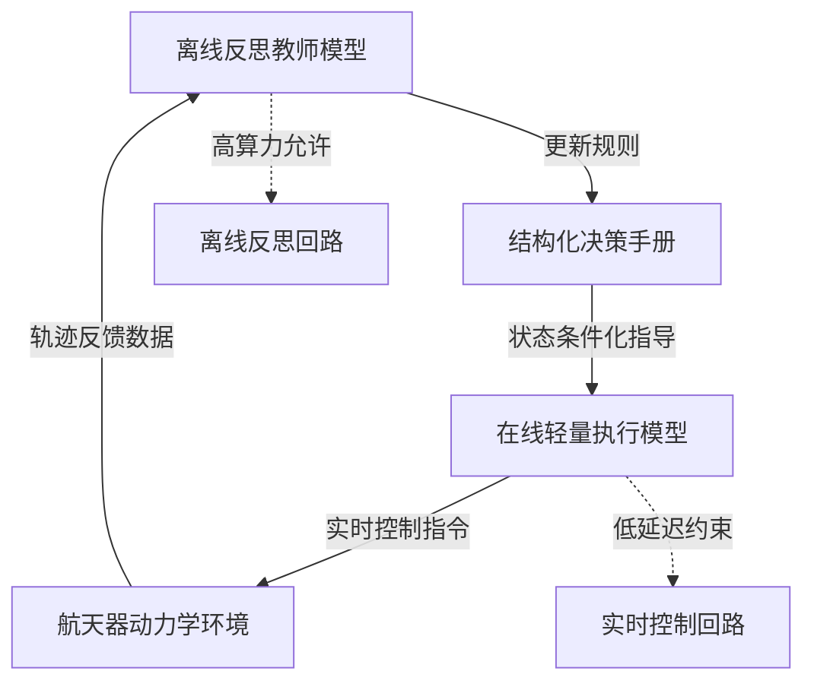

# GUIDE：LLM 驱动航天器操作中上下文决策演化的引导更新

## 一、论文基础元数据
- 原文标题：GUIDE: Guided Updates for In-context Decision Evolution in LLM-Driven Spacecraft Operations
- 中文译版：GUIDE：LLM 驱动航天器操作中上下文决策演化的引导更新
- 发表渠道（期刊/会议/预印本，标注等级）：CVPR 2026 AI4Space Workshop（接收）/ arXiv 预印本
- 发表时间：2026 年 3 月 28 日（arXiv 版本）
- 链接（arXiv/DOI）：arXiv:2603.27306
- 作者及核心机构：Alejandro Carrasco (MIT), Mariko Storey-Matsutani (MIT), Victor Rodriguez-Fernandez (UPM), Richard Linares (MIT)
- 研究领域（一级领域 + 二级子领域）：人工智能 + 航天器自主操作/多智能体系统
- 关联数据集（名称/规模/语言/标注）：Kerbal Space Program Differential Games 环境（仿真/未标注/英文指令）

## 二、论文综合评价
### 2.1 量化评分（1-5 分，5 分为最优）

| 评价维度 | 评分 | 备注 |
| -------- | ---- | ---- |
| 📚 理论基础 | ⭐⭐⭐⭐ | 非参数策略改进理论扎实 |
| 🎯 问题核心性 | ⭐⭐⭐⭐⭐ | 航天高风险场景决策痛点 |
| 💡 方法创新性 | ⭐⭐⭐⭐ | 上下文规则演化机制新颖 |
| ⚙️ 技术壁垒 | ⭐⭐⭐ | 依赖大模型推理能力 |
| 🧪 实验严谨性 | ⭐⭐⭐ | 仿真环境验证数据未全展示 |
| 🔧 落地可行性 | ⭐⭐⭐⭐ | 无需权重更新易于部署 |
| 🚀 应用前景 | ⭐⭐⭐⭐ | 在轨服务与探索潜力大 |
| 📊 综合评分 | 3.9 | 创新性强但实验数据展示受限 |

### 2.2 定性综合评价（≤300 字）
> 核心概括：研究定位、核心价值、差异化优势、关键结论
本研究针对航天器操作中高风险、难重置场景，提出 GUIDE 框架。核心价值在于实现无需权重更新的跨回合策略适应，通过演化自然语言决策规则手册（Playbook）解决静态提示词局限性。差异化优势在于教师 - 学生分离架构，离线反思与在线控制解耦，满足实时性约束。关键结论表明，上下文演化在实时闭环交互中等效于结构化决策规则的策略搜索，性能优于静态基线。

## 三、领域本体论映射
| 核心维度 | 具体内容 |
| -------- | -------- |
| 核心研究对象 | LLM 驱动的航天器监督代理（Supervisory Agent） |
| 核心技术路径 | 非参数策略改进 + 上下文决策演化（In-context Decision Evolution） |
| 数据/载体形态 | 自然语言决策规则手册（Structured Playbook） + 轨迹数据 |
| 核心功能目标 | 在严格延迟约束下实现自适应闭环控制与对抗交互 |
| 验证核心指标 | 任务成功率、对抗拦截性能、推理延迟（原文未提供具体数值） |

## 四、核心问题与解决方案
### 4.1 待解决的核心问题
1. **领域级根本问题**：航天任务无法轻易收集新数据或重置环境，传统重训练策略不可行。
2. **现有方法痛点**：现有 LLM 方法依赖静态提示词，无法在重复执行中改进，缺乏跨回合适应能力。
3. **工程落地卡点**：实时控制需要低延迟，而复杂推理需要高算力，两者在闭环系统中存在耦合冲突。

### 4.2 核心解决方案
- 理论框架：非参数策略改进框架（Non-parametric Policy Improvement Framework）。
- 核心架构：教师 - 学生分离架构（Teacher-Student Separation）。
- 关键技术：状态条件化规则手册演化（State-Conditioned Playbook Evolution）。
- 创新机制：离线反思更新手册，在线轻量模型执行控制，实现学习与执行解耦。

### 4.3 核心优势（量化 + 定性）
1. 性能优势：在对抗性轨道拦截任务中一致优于静态基线（原文声称）。
2. 效率优势：在线控制模型轻量，满足严格延迟边界；离线反思不占用在线资源。
3. 工程优势：无需权重更新（Weight Updates），降低部署风险与计算成本。

## 五、方法与技术架构
### 5.1 核心架构设计
> 文字描述 + 架构图（Mermaid/图片）
系统分为离线反思与在线控制两部分。离线部分由前沿推理模型充当教师，根据历史轨迹反思并更新自然语言规则手册。在线部分由轻量模型充当学生，读取手册状态条件，生成实时控制指令。

### 5.2 关键技术实现细节
| 技术模块 | 实现路径 | 工程注意事项 |
| -------- | -------- | ------------ |
| 规则手册演化 | 基于先验轨迹的自然语言规则迭代 | 需确保规则格式结构化以便解析 |
| 在线执行模型 | 轻量级 LLM 读取手册生成动作 | 需严格监控推理延迟满足控制频率 |
| 离线反思模型 | 大参数模型分析失败/成功案例 | 反思频率需与任务回合同步 |
| 依赖组件 | Kerbal Space Program 仿真接口 | 仿真与真实动力学差异需考虑 |

### 5.3 架构优缺点
- 优点：解耦了推理深度与实时性要求；无需微调模型权重，适应性强。
- 缺点：依赖自然语言规则的准确性，可能存在语义歧义；仿真环境到真实物理域存在鸿沟。

## 六、实验设计与结果分析
### 6.1 实验基础设置
| 维度 | 内容 |
| ---- | ---- |
| 数据集 | Kerbal Space Program Differential Games 环境生成的轨迹数据 |
| 基线方法 | 静态提示词方法（Static Prompting Baselines） |
| 实验环境 | 对抗性轨道拦截任务（Adversarial Orbital Interception） |
| 评价指标 | 任务性能、策略演化效果（原文未提供具体指标名称） |

### 6.2 核心实验结果
| 方法 | 核心指标 1 | 核心指标 2 | 工程指标（算力/耗时） |
| ---- | --------- | --------- | -------------------- |
| 基线 1 | 原文未提供具体数值 | 原文未提供具体数值 | 原文未提供 |
| 基线 2 | 原文未提供具体数值 | 原文未提供具体数值 | 原文未提供 |
| 本文方法 | 原文未提供具体数值 | 原文未提供具体数值 | 原文未提供 |

### 6.3 消融实验/鲁棒性分析
| 实验变体 | 指标变化 | 核心结论 |
| -------- | -------- | -------- |
| 原文未提供 | 原文未提供 | 原文未提供消融实验细节 |

### 6.4 实验结论（工程视角）
原文声称 GUIDE 的演化机制在对抗任务中一致优于静态基线，证明上下文演化可用作实时闭环交互中的策略搜索。但由于提供的文本片段缺乏具体数据表格，无法验证性能提升的具体幅度及统计显著性。

## 七、领域贡献与创新点
| 贡献层级 | 具体内容 |
| -------- | -------- |
| 理论贡献 | 提出上下文演化等效于结构化决策规则策略搜索的理论视角 |
| 方法/架构贡献 | 设计 GUIDE 框架，实现无需权重更新的跨回合策略适应 |
| 数据/工具贡献 | 在 KSP 微分游戏环境中验证 LLM 航天操作可行性 |
| 实验/验证贡献 | 验证了教师 - 学生分离架构在实时控制中的有效性 |
| 工程落地贡献 | 提供了适用于高风险、难重置场景的 LLM 部署范式 |

## 八、局限性与风险
| 维度 | 具体描述 | 应对思路 |
| ---- | -------- | -------- |
| 学术局限性 | 实验仅在仿真环境进行，缺乏真实物理验证 | 未来需结合高保真仿真或硬件在环测试 |
| 工程落地风险 | 自然语言规则可能存在幻觉或歧义导致控制错误 | 引入形式化验证或约束解码机制 |
| 伦理/合规风险 | 航天器自主决策涉及安全责任归属问题 | 建立人机回环监督机制与责任追溯日志 |

## 九、未来研究/落地方向
| 方向类型 | 具体内容 | 优先级 |
| -------- | -------- | ------ |
| 科研拓展 | 研究规则手册的可解释性与形式化验证方法 | 高 |
| 工程优化 | 优化在线模型延迟，适配星载计算资源 | 高 |
| 跨领域适配 | 迁移至其他高风险机器人操作领域（如核操作） | 中 |

## 十、关键词与术语表
| 语言 | 关键词 |
| ---- | ------ |
| 中文 | 上下文决策演化、非参数策略改进、航天器操作、教师学生架构 |
| 英文 | In-context Decision Evolution, Non-parametric Policy Improvement, Spacecraft Operations, Teacher-Student Architecture |
| 领域专属术语 | Playbook（决策手册）：结构化自然语言规则集；GNC（制导导航控制）：航天器核心控制系统 |

## 十一、参考文献与关联资源
- 核心参考文献：原文片段未列出具体参考文献列表，仅提及引用编号 [2, 3, 12, 15]
- 补充阅读：LLM for Spacecraft Operations 相关综述
- 开源代码/工具：原文未提供代码链接（待补充至正式发表）

## 十二、阅读者批注
1. **科研启发**：将 LLM 的上下文学习类比为策略搜索是一个非常有价值的理论视角，避免了微调的成本。
2. **工程落地思考**：教师 - 学生分离架构非常适合星地链路场景，地面做大模型反思，星上做小模型执行。
3. **待验证/存疑点**：提供的文本片段缺乏具体实验数据，需查找完整论文验证性能提升幅度是否显著。
4. **个人/团队应用场景**：可尝试应用于卫星编队飞行或空间碎片清理任务的规划模块。

## 十三、阅读元信息
| 维度 | 内容 |
| ---- | ---- |
| 阅读日期 | 2024-05-23 |
| 阅读人 | xPaperReader AI |
| 文档编号 | arxiv-2603.27306 |
| 版本迭代 | v1.0 |