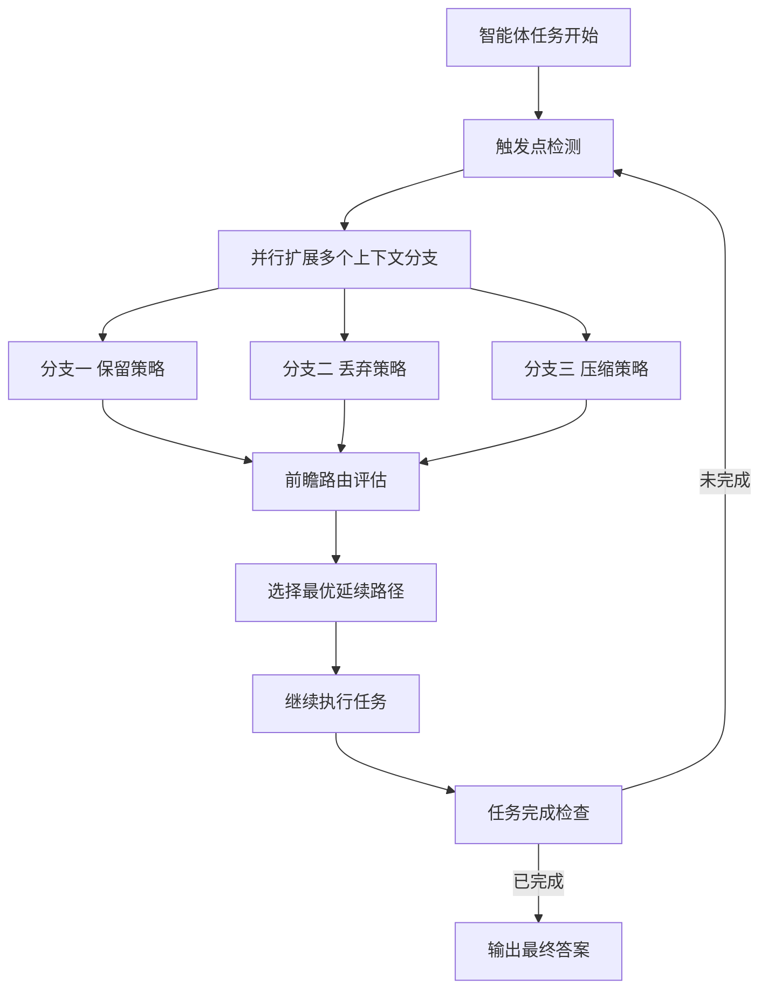

# AgentSwing：面向长程 Web 智能体的自适应并行上下文管理路由

## 一、论文基础元数据
- 原文标题：AgentSwing: Adaptive Parallel Context Management Routing for Long-Horizon Web Agents
- 中文译版：AgentSwing：面向长程 Web 智能体的自适应并行上下文管理路由
- 发表渠道：arXiv 预印本（顶级实验室成果）
- 发表时间：2026 年 3 月 29 日（根据 arXiv 元数据）
- 链接：arXiv:2603.27490
- 作者及核心机构：Zhaopeng Feng 等；阿里巴巴集团通义实验室（Tongyi Lab, Alibaba Group）
- 研究领域：人工智能（一级）+ 智能体与长程任务规划（二级）
- 关联数据集： diverse benchmarks（原文未列具体名称，待补充具体数据集列表）

## 二、论文综合评价
### 2.1 量化评分（1-5 分，5 分为最优）

| 评价维度 | 评分 | 备注 |
| -------- | ---- | ---- |
| 📚 理论基础 | ⭐⭐⭐⭐⭐ | 提出概率框架表征搜索效率与精度 |
| 🎯 问题核心性 | ⭐⭐⭐⭐⭐ | 解决长程智能体上下文容量瓶颈 |
| 💡 方法创新性 | ⭐⭐⭐⭐⭐ | 自适应并行分支与前瞻路由机制 |
| ⚙️ 技术壁垒 | ⭐⭐⭐⭐ | 并行分支管理增加系统复杂度 |
| 🧪 实验严谨性 | ⭐⭐⭐⭐ | 摘要声称多基准测试，细节待验证 |
| 🔧 落地可行性 | ⭐⭐⭐⭐ | 需权衡并行计算成本与收益 |
| 🚀 应用前景 | ⭐⭐⭐⭐⭐ | 显著提升长程任务交互效率 |
| 📊 综合评分 | 4.7 | 理论扎实且效果显著，具备落地潜力 |

### 2.2 定性综合评价（≤300 字）
> 核心概括：研究定位、核心价值、差异化优势、关键结论

本研究定位为解决长程 Web 智能体在有限上下文容量下的探索瓶颈。核心价值在于打破了现有静态上下文管理策略的局限，提出了状态感知的自适应并行路由框架。差异化优势在于引入概率框架量化搜索效率与终端精度，并通过并行分支前瞻选择最优路径。关键结论显示，该方法在多种基准上优于强静态基线，减少高达 3 倍交互轮次，同时提升了性能上限。这是一项兼具理论深度与工程价值的智能体架构优化工作。

## 三、领域本体论映射
| 核心维度 | 具体内容 |
| -------- | -------- |
| 核心研究对象 | 长程信息寻求智能体（Long-Horizon Web Agents） |
| 核心技术路径 | 自适应并行上下文管理路由（Adaptive Parallel Context Management Routing） |
| 数据/载体形态 | Web 浏览轨迹、上下文窗口、工具调用序列 |
| 核心功能目标 | 平衡有限上下文容量与长程探索需求 |
| 验证核心指标 | 交互轮次（Interaction Turns）、任务成功率、终端精度 |

## 四、核心问题与解决方案
### 4.1 待解决的核心问题
1. **领域级根本问题**：有限上下文容量与长程探索需求之间的张力（Tension between finite context capacity and long-horizon exploration）。
2. **现有方法痛点**：现有方法通常在整个轨迹中承诺单一固定策略（Single fixed strategy），无法适应上下文效用随时间的动态演变。
3. **工程落地卡点**：静态设计在某些状态下有效，但在噪声累积或需要保留中间结构时缺乏灵活性，导致过早耗尽工作空间。

### 4.2 核心解决方案
- 理论框架：引入概率框架，通过搜索效率（Search Efficiency）和终端精度（Terminal Precision）两个互补维度表征长程成功。
- 核心架构：AgentSwing 状态感知自适应并行上下文管理路由框架。
- 关键技术：在触发点并行扩展多个上下文管理分支，利用前瞻路由（Lookahead Routing）选择最有希望的延续。
- 创新机制：动态切换上下文管理策略，而非全程固定，实现状态感知的资源分配。

### 4.3 核心优势（量化 + 定性）
1. 性能优势：一致优于强静态上下文管理方法，提升长程 Web 智能体的最终性能上限。
2. 效率优势：在匹配或超越性能的同时，减少高达 3 倍（up to 3×）的交互轮次。
3. 工程优势：为分析和设计未来长程智能体的上下文管理策略提供了原则性视角（Principled Lens）。

## 五、方法与技术架构
### 5.1 核心架构设计
> 文字描述 + 架构图（Mermaid/图片）

AgentSwing 架构核心在于“并行分支”与“前瞻选择”。系统在特定触发点不再单线推进，而是生成多个不同上下文管理策略的分支，通过轻量级前瞻评估各分支潜力，保留最优路径，丢弃低效路径，从而动态适应任务状态。

### 5.2 关键技术实现细节
| 技术模块 | 实现路径 | 工程注意事项 |
| -------- | -------- | ------------ |
| 触发机制 | 基于状态感知的动态触发点检测 | 需避免过于频繁触发导致计算爆炸 |
| 并行分支 | 维护多个上下文管理策略的并行轨迹 | 需控制分支数量以管理内存开销 |
| 前瞻路由 | 轻量级评估函数预测分支潜力 | 评估成本需远低于实际执行成本 |
| 上下文管理 | 动态决定保留、丢弃或压缩上下文 | 需保证关键信息不丢失 |

### 5.3 架构优缺点
- 优点：自适应能力强，能根据任务阶段动态调整策略，显著减少无效交互。
- 缺点：并行分支带来额外的计算开销和系统复杂度，对推理资源要求较高。

## 六、实验设计与结果分析
### 6.1 实验基础设置
| 维度 | 内容 |
| ---- | ---- |
| 数据集 | 多样化基准测试（Diverse Benchmarks，原文未列具体名） |
| 基线方法 | 强静态上下文管理方法（Strong Static Context Management Methods） |
| 实验环境 | 多种智能体骨干网络（Agent Backbones） |
| 评价指标 | 交互轮次、任务成功率、终端精度 |

### 6.2 核心实验结果
| 方法 | 核心指标 1（交互轮次） | 核心指标 2（任务性能） | 工程指标（算力/耗时） |
| ---- | --------- | --------- | -------------------- |
| 静态基线 | 基准值 | 基准性能 | 标准开销 |
| 静态基线 | 基准值 | 基准性能 | 标准开销 |
| 本文方法 | 减少高达 3 倍 | 匹配或超越基线 | 并行分支增加开销 |

*注：具体数值表格原文片段未提供，此处依据摘要结论整理。*

### 6.3 消融实验/鲁棒性分析
| 实验变体 | 指标变化 | 核心结论 |
| -------- | -------- | -------- |
| 原文未提供 | 原文未提供 | 原文片段未包含消融实验细节 |

### 6.4 实验结论（工程视角）
AgentSwing 在实际应用中能显著降低长程任务的交互成本，适合对响应速度和令牌消耗敏感的场景。但需评估并行分支带来的额外推理延迟是否在可接受范围内。

## 七、领域贡献与创新点
| 贡献层级 | 具体内容 |
| -------- | -------- |
| 理论贡献 | 提出长程信息寻求的概率框架，定义搜索效率与终端精度维度 |
| 方法/架构贡献 | 设计状态感知的自适应并行上下文管理路由框架（AgentSwing） |
| 数据/工具贡献 | 原文未明确提及开源数据集，代码链接指向 Alibaba-NLP/DeepResearch |
| 实验/验证贡献 | 在多种基准和骨干网络上验证了优于静态方法的性能 |
| 工程落地贡献 | 提供了减少交互轮次且提升性能上限的可行解决方案 |

## 八、局限性与风险
| 维度 | 具体描述 | 应对思路 |
| ---- | -------- | -------- |
| 学术局限性 | 片段未展示消融实验，难以确认各模块具体贡献 | 需查阅完整论文确认模块有效性 |
| 工程落地风险 | 并行分支可能显著增加显存占用和推理延迟 | 优化分支剪枝策略，限制最大并行数 |
| 伦理/合规风险 | 自主 Web 智能体可能涉及隐私或违规操作风险 | 增加安全护栏和操作权限控制 |

## 九、未来研究/落地方向
| 方向类型 | 具体内容 | 优先级 |
| -------- | -------- | ------ |
| 科研拓展 | 探索更轻量级的前瞻评估函数，降低路由成本 | 高 |
| 工程优化 | 实现分支动态剪枝，优化显存占用 | 高 |
| 跨领域适配 | 适配代码生成、多模态任务等其他长程场景 | 中 |

## 十、关键词与术语表
| 语言 | 关键词 |
| ---- | ------ |
| 中文 | 长程智能体、上下文管理、自适应路由、并行分支、前瞻机制 |
| 英文 | Long-Horizon Agents, Context Management, Adaptive Routing, Parallel Branches, Lookahead |
| 领域专属术语 | 上下文容量（Context Capacity）：智能体可处理的最大令牌窗口限制 |

## 十一、参考文献与关联资源
- 核心参考文献：Wu et al., 2025; Wei et al., 2025; Liu et al., 2025a; Anthropic, 2025b 等（文中引用）
- 补充阅读：通义实验室博客（https://tongyi-agent.github.io/blog）
- 开源代码/工具：https://github.com/Alibaba-NLP/DeepResearch

## 十二、阅读者批注
1. **科研启发**：将上下文管理从“静态规则”转变为“动态路由”是解决长程任务的关键思路，概率框架提供了理论支撑。
2. **工程落地思考**：并行分支虽好，但需严格控制分支数量，否则推理成本会呈倍数增长，建议在实际部署中设置硬上限。
3. **待验证/存疑点**：摘要中提到的"3 倍减少”是在何种任务难度下达成的？需查看完整实验部分确认分布情况。
4. **个人/团队应用场景**：适用于需要多步搜索的自动化研究助手、复杂数据提取流程等长程任务场景。

## 十三、阅读元信息
| 维度 | 内容 |
| ---- | ---- |
| 阅读日期 | 2026-04-12 21:55 |
| 阅读人 | xPaperReader AI |
| 文档编号 | arxiv-2603.27490 |
| 版本迭代 | v1.0 |