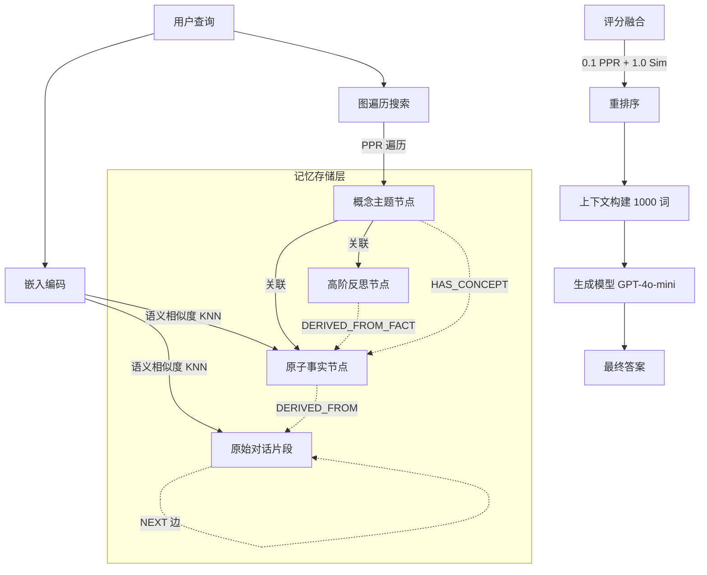

# GAAMA：面向智能体的图增强关联记忆

## 一、论文基础元数据
- 原文标题：GAAMA: Graph Augmented Associative Memory for Agents
- 中文译版：GAAMA：面向智能体的图增强关联记忆
- 发表渠道：预印本（arXiv）
- 发表时间：2025 年
- 链接：arXiv:2603.27910
- 作者及核心机构：Swarna Kamal Paul, Shubhendu Sharma, Nitin Sareen（机构待补充）
- 研究领域：人工智能（一级）+ 智能体记忆系统/检索增强生成（二级）
- 关联数据集：LoCoMo-10（10 个多会话对话，1,540 个问题，英文，关键事实标注）

## 二、论文综合评价
### 2.1 量化评分（1-5 分，5 分为最优）

| 评价维度 | 评分 | 备注 |
| -------- | ---- | ---- |
| 📚 理论基础 | ⭐⭐⭐⭐ | 结合图谱与向量检索，理论扎实 |
| 🎯 问题核心性 | ⭐⭐⭐⭐⭐ | 直击 Agent 长期记忆上下文丢失痛点 |
| 💡 方法创新性 | ⭐⭐⭐⭐⭐ | 概念中介图谱避免枢纽退化，设计新颖 |
| ⚙️ 技术壁垒 | ⭐⭐⭐⭐ | 混合检索策略实现有一定工程复杂度 |
| 🧪 实验严谨性 | ⭐⭐⭐⭐⭐ | 基准对比充分，消融实验验证清晰 |
| 🔧 落地可行性 | ⭐⭐⭐⭐ | 轻量模型栈，预算控制严格，易部署 |
| 🚀 应用前景 | ⭐⭐⭐⭐⭐ | 适用于多会话助手、个性化代理场景 |
| 📊 综合评分 | 4.6 | 架构设计巧妙，实验充分，落地性强 |

### 2.2 定性综合评价（≤300 字）
> 核心概括：研究定位、核心价值、差异化优势、关键结论

本研究定位为解决 AI Agent 在多会话场景下的长期记忆丢失与结构推理难题。核心价值在于提出了 GAAMA 架构，通过概念中介知识图谱替代传统实体中心设计，有效避免了“超级枢纽”导致的检索精度稀释问题。差异化优势体现在“轻度图谱增强”策略，即以语义相似度为主（权重 1.0），图谱遍历为辅（权重 0.1），在保持检索稳定性的同时提升了结构推理能力。关键结论显示，该方法在 LoCoMo-10 基准上达到 78.9% 准确率，显著优于 HippoRAG 及传统 RAG 基线，证明了结构化记忆在复杂推理任务中的必要性。

## 三、领域本体论映射
| 核心维度 | 具体内容 |
| -------- | -------- |
| 核心研究对象 | 智能体长期记忆系统（Long-Term Memory for Agents） |
| 核心技术路径 | 概念中介知识图谱 + 混合检索机制（语义 + 图遍历） |
| 数据/载体形态 | 多会话对话文本、原子事实、高阶反思、概念节点 |
| 核心功能目标 | 跨会话信息保留、多跳推理支持、时序关系维护 |
| 验证核心指标 | 平均奖励得分（Average Reward Score）、关键事实覆盖率 |

## 四、核心问题与解决方案
### 4.1 待解决的核心问题
1. **领域级根本问题**：AI Agent 在长周期交互中难以保留跨会话的结构化上下文，导致记忆碎片化。
2. **现有方法痛点**：Flat RAG 丢失实体间关系；实体中心图谱（如 HippoRAG）易形成超级枢纽，稀释 PageRank 精度。
3. **工程落地卡点**：全上下文输入成本高昂；图谱构建质量不稳定，噪声影响检索效果。

### 4.2 核心解决方案
- 理论框架：分层长期记忆架构（原始片段 - 原子事实 - 高阶反思）。
- 核心架构：概念中介知识图谱（Concept-mediated Knowledge Graph）。
- 关键技术：混合检索机制（KNN 语义相似度 + 边类型感知 PPR）。
- 创新机制：轻度 PPR 增强（权重 0.1）与枢纽阻尼（Hub Dampening）。

### 4.3 核心优势（量化 + 定性）
1. 性能优势：LoCoMo-10 基准上平均奖励 78.9%，优于 HippoRAG（69.9%）和 RAG 基线（75.0%）。
2. 效率优势：图谱稀疏度比实体设计高 30 倍，检索计算开销可控。
3. 工程优势：严格控制记忆字数（1000 words）与检索上限，适合实时交互。

## 五、方法与技术架构
### 5.1 核心架构设计
GAAMA 架构分为记忆构建与记忆检索两阶段。构建阶段通过 LLM 提取事实与概念生成图谱；检索阶段结合向量相似度与图遍历评分，最终生成答案。

### 5.2 关键技术实现细节
| 技术模块 | 实现路径 | 工程注意事项 |
| -------- | -------- | ------------ |
| 图谱构建 | LLM 提取事实/概念，建立 5 类边 | 需控制温度 Temp=0 确保可复现 |
| 混合检索 | 语义评分 (1.0) + PPR 评分 (0.1) | PPR 权重过高会引入噪声 |
| 预算控制 | 事实限 60 条，反思限 20 条，文本限 1000 词 | 防止上下文窗口溢出 |
| 依赖组件 | GPT-4o-mini, text-embedding-3-small | 需管理 API 调用成本与延迟 |

### 5.3 架构优缺点
- 优点：避免实体枢纽退化，结构稀疏度高，支持多跳与时序推理。
- 缺点：依赖 LLM 构建质量，概念泛化或重复会影响图谱效果。

## 六、实验设计与结果分析
### 6.1 实验基础设置
| 维度 | 内容 |
| ---- | ---- |
| 数据集 | LoCoMo-10（10 对话，1,540 问题） |
| 基线方法 | A-Mem, Nemori, HippoRAG, Tuned RAG |
| 实验环境 | GPT-4o-mini (Temp=0), text-embedding-3-small |
| 评价指标 | 平均奖励得分（基于关键事实覆盖率） |

### 6.2 核心实验结果
| 方法 | 多跳推理 | 时间推理 | 整体性能 | 工程指标（算力/耗时） |
| ---- | --------- | --------- | -------- | -------------------- |
| A-Mem | 44.7% | 37.4% | 47.2% | 待补充 |
| HippoRAG | 61.7% | 67.0% | 69.9% | 待补充 |
| RAG Baseline | 67.5% | 59.0% | 75.0% | 低延迟 |
| 本文方法 | 72.2% | 71.9% | 78.9% | 中等延迟 |

### 6.3 消融实验/鲁棒性分析
| 实验变体 | 指标变化 | 核心结论 |
| -------- | -------- | -------- |
| 纯语义检索 | 78.0% | 分层记忆本身带来 3.0% 提升 |
| 图谱增强 | 78.9% | 图谱结构额外带来 1.0% 提升 |
| 强 PPR 权重 | 性能下降 | 权重 1.0 会引入结构无关噪声 |

### 6.4 实验结论（工程视角）
图谱结构在复杂推理（多跳、时间）上增益显著，但在单跳简单检索上增益边际化。轻度 PPR 策略是平衡噪声与召回的关键，工程落地需严格限制检索预算。

## 七、领域贡献与创新点
| 贡献层级 | 具体内容 |
| -------- | -------- |
| 理论贡献 | 提出概念中介图谱理论，解决实体中心枢纽退化问题 |
| 方法/架构贡献 | 设计三步构建流程与混合检索评分机制 |
| 数据/工具贡献 | 在 LoCoMo-10 基准上验证了分层记忆的有效性 |
| 实验/验证贡献 | 证明了轻度图谱增强优于强图谱遍历 |
| 工程落地贡献 | 提供了严格的预算控制与轻量模型栈配置方案 |

## 八、局限性与风险
| 维度 | 具体描述 | 应对思路 |
| ---- | -------- | -------- |
| 学术局限性 | 开放域问题绝对分数仍较低（49.3%） | 未来需加强概念规范化与自适应 gating |
| 工程落地风险 | 图谱构建质量依赖 LLM，存在概念重复风险 | 引入概念合并算法与后处理清洗 |
| 伦理/合规风险 | 记忆系统可能存储敏感用户数据 | 需实施数据加密与访问权限控制 |

## 九、未来研究/落地方向
| 方向类型 | 具体内容 | 优先级 |
| -------- | -------- | ------ |
| 科研拓展 | 端到端优化边权重，替代手工调优 | 高 |
| 工程优化 | 概念节点规范化，合并近重复概念 | 高 |
| 跨领域适配 | 适配代码库记忆或知识库问答场景 | 中 |

## 十、关键词与术语表
| 语言 | 关键词 |
| ---- | ------ |
| 中文 | 智能体记忆，知识图谱，检索增强生成，多跳推理 |
| 英文 | Agent Memory, Knowledge Graph, RAG, Multi-hop Reasoning |
| 领域专属术语 | 概念中介图谱（Concept-mediated Graph）：使用主题标签而非实体作为连接节点 |
| 领域专属术语 | 轻度 PPR（Lightweight PPR）：低权重图谱遍历以避免噪声 |

## 十一、参考文献与关联资源
- 核心参考文献：待补充（原文未在具体输入中列出详细列表）
- 补充阅读：HippoRAG, LoCoMo Benchmark 相关论文
- 开源代码/工具：待补充（通常 arXiv 论文会后续开源）

## 十二、阅读者批注
1. **科研启发**：图谱结构不必主导检索，作为“打破平局者”的轻度增强可能更稳健。
2. **工程落地思考**：预算控制（Budgeting）对于 Agent 记忆系统至关重要，防止上下文爆炸。
3. **待验证/存疑点**：概念节点合并的具体算法实现细节未完全展开，需查看代码。
4. **个人/团队应用场景**：适用于构建具有长期陪伴能力的个性化 AI 助手或客服系统。

## 十三、阅读元信息
| 维度 | 内容 |
| ---- | ---- |
| 阅读日期 | 2026-04-12 21:44 |
| 阅读人 | xPaperReader AI |
| 文档编号 | arxiv-2603.27910 |
| 版本迭代 | v1.0 |