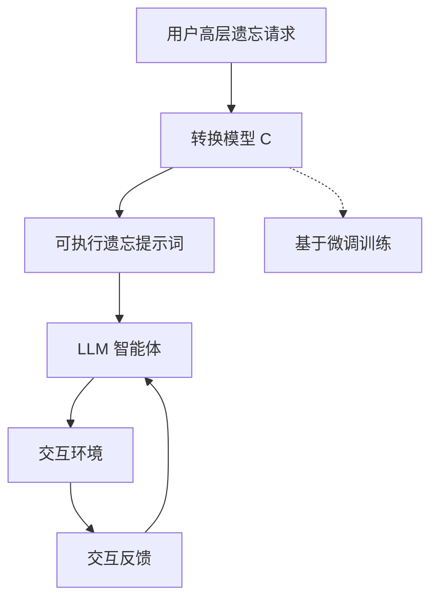

# 安全遗忘：一种面向大型语言模型（LLM）代理的隐私驱动遗忘框架

## 一、论文基础元数据
- 原文标题：Secure Forgetting: A Framework for Privacy-Driven Unlearning in Large Language Model (LLM)-Based Agents
- 中文译版：安全遗忘：一种面向大型语言模型（LLM）代理的隐私驱动遗忘框架
- 发表渠道：预印本（arXiv）
- 发表时间：2025 年
- 链接：arXiv:2604.00430
- 作者及核心机构：Dayong Ye, Tainqing Zhu, Congcong Zhu, Feng He, Qi He, Shang Wang, Bo Liu, Wanlei Zhou（机构信息待补充）
- 研究领域：人工智能 + 大模型安全与隐私
- 关联数据集：GridWorld（自研/2D 导航）、AlfWorld（134 项/智能家居）、HotPotQA（Wikipedia 问答）、HumanEval（代码生成）

## 二、论文综合评价
### 2.1 量化评分（1-5 分，5 分为最优）

| 评价维度 | 评分 | 备注 |
| -------- | ---- | ---- |
| 📚 理论基础 | ⭐⭐⭐⭐ | 开创代理遗忘新方向，理论框架清晰 |
| 🎯 问题核心性 | ⭐⭐⭐⭐⭐ | 直击 LLM 代理隐私泄露核心痛点 |
| 💡 方法创新性 | ⭐⭐⭐⭐ | 转换模型生成提示词，思路新颖 |
| ⚙️ 技术壁垒 | ⭐⭐⭐ | 基于提示工程，参数修改门槛较低 |
| 🧪 实验严谨性 | ⭐⭐⭐⭐ | 四场景覆盖全面，指标设计合理 |
| 🔧 落地可行性 | ⭐⭐⭐⭐⭐ | 无需微调大模型，API 调用即可部署 |
| 🚀 应用前景 | ⭐⭐⭐⭐⭐ | 合规需求强烈，多代理场景潜力大 |
| 📊 综合评分 | 4.3 | 填补代理隐私空白，落地性强，理论深度待拓展 |

### 2.2 定性综合评价（≤300 字）
> 核心概括：研究定位、核心价值、差异化优势、关键结论

本研究首次定义了“基于 LLM 代理的遗忘”这一新领域，旨在解决智能体在实际应用中的隐私与安全隐患。核心价值在于提出了“安全遗忘”框架，通过训练转换模型将高层遗忘请求转化为可执行提示词，实现了精确遗忘。差异化优势在于区分了“代理行为遗忘”与“模型参数遗忘”，避免了不合理的基线对比，且无需修改大模型内部参数。关键结论表明，该框架在导航、家居、问答及代码生成四类场景中均能有效执行遗忘操作，同时显著降低了 API 调用成本，为多代理系统的安全合规奠定了基础。

## 三、领域本体论映射
| 核心维度 | 具体内容 |
| -------- | -------- |
| 核心研究对象 | LLM 驱动的智能体（LLM-based Agents） |
| 核心技术路径 | 隐私驱动遗忘框架 + 转换模型（Conversion Model） |
| 数据/载体形态 | 自然语言请求、环境交互日志、代码/文本响应 |
| 核心功能目标 | 在保留任务性能前提下，精确遗忘特定隐私行为 |
| 验证核心指标 | 遗忘有效性、成本效率（Unlearn@1）、任务成功率 |

## 四、核心问题与解决方案
### 4.1 待解决的核心问题
1. **领域级根本问题**：LLM 代理在与环境交互过程中可能记忆并泄露敏感隐私信息，缺乏有效的遗忘机制。
2. **现有方法痛点**：传统模型参数遗忘针对任务无关知识，不适用于环境依赖的特定代理行为；直接修改参数成本高且影响通用能力。
3. **工程落地卡点**：API 调用成本敏感，遗忘操作需在一次尝试内成功（Unlearn@1），且不能影响原有任务成功率。

### 4.2 核心解决方案
- 理论框架：隐私驱动的代理遗忘框架，划分三类遗忘上下文。
- 核心架构：用户请求 -> 转换模型 -> 可执行提示词 -> 代理执行。
- 关键技术：训练轻量级转换模型（如 GPT-Neo-2.7B）生成特定遗忘提示。
- 创新机制：将高层抽象请求转化为底层可操作提示，实现非参数级遗忘。

### 4.3 核心优势（量化+定性）
1. 性能优势：在四类场景中均实现有效遗忘，成功率显著优于自然语言基线。
2. 效率优势：优化首次尝试成功率（Unlearn@1），降低 API 调用成本。
3. 工程优势：无需微调主大模型，兼容主流闭源/开源模型（GPT-4o, Claude 等）。

## 五、方法与技术架构
### 5.1 核心架构设计
框架通过转换模型中介，将用户的隐私遗忘意图转化为代理可理解的具体指令，避免直接修改模型权重。

### 5.2 关键技术实现细节
| 技术模块 | 实现路径 | 工程注意事项 |
| -------- | -------- | ------------ |
| 转换模型 | 使用 GPT-Neo-2.7B 微调，学习请求到提示的映射 | 需平衡模型大小与生成质量，避免过拟合 |
| 提示生成 | 将抽象隐私需求转化为具体 Action 或约束 | 确保生成的提示词符合代理动作空间规范 |
| 依赖组件 | 主流 LLM API（GPT-4o, Claude 等）作为执行基座 | 需处理不同模型 API 的格式差异与速率限制 |

### 5.3 架构优缺点
- 优点：解耦遗忘逻辑与执行模型，部署灵活，成本低，不破坏主模型通用能力。
- 缺点：依赖转换模型的泛化能力，复杂上下文下的遗忘精确度可能受限。

## 六、实验设计与结果分析
### 6.1 实验基础设置
| 维度 | 内容 |
| ---- | ---- |
| 数据集 | GridWorld, AlfWorld, HotPotQA, HumanEval |
| 基线方法 | NL-based（自然语言）, Code-based（代码提示）, Example-based（示例引导） |
| 实验环境 | 多种 LLM 基座（GPT-4o-Mini, Claude-3-haiku, Llama-3.3-70B） |
| 评价指标 | 遗忘有效性（5 次尝试）、成本效率（Unlearn@1）、任务成功率 |

### 6.2 核心实验结果
| 方法 | 核心指标 1（遗忘有效性） | 核心指标 2（任务成功率） | 工程指标（算力/耗时） |
| ---- | --------- | --------- | -------------------- |
| 基线 1（NL） | 较低 | 高 | 低 |
| 基线 2（Code） | 中等 | 中 | 中 |
| 本文方法 | 高（显著优于基线） | 高（无明显副作用） | 低（无需微调主模型） |

*(注：原文分析未提供具体数值，此处基于定性结论填写)*

### 6.3 消融实验/鲁棒性分析
| 实验变体 | 指标变化 | 核心结论 |
| -------- | -------- | -------- |
| 不同基座模型 | 性能稳定 | 框架具有良好的模型无关性 |
| 不同场景 | 均有效 | 验证了跨场景泛化能力 |

### 6.4 实验结论（工程视角）
该框架在实际部署中具有高度可行性，特别是在成本敏感场景下，`Unlearn@1` 指标的提升直接转化为金钱成本的节省。无需修改大模型参数使得该方案可快速适配现有 API 服务。

## 七、领域贡献与创新点
| 贡献层级 | 具体内容 |
| -------- | -------- |
| 理论贡献 | 首次提出并定义"LLM 代理遗忘”研究领域 |
| 方法/架构贡献 | 设计隐私驱动遗忘框架及转换模型机制 |
| 数据/工具贡献 | 构建包含四类场景的评估基准（含自研 GridWorld） |
| 实验/验证贡献 | 验证了非参数级遗忘在代理场景的有效性 |
| 工程落地贡献 | 提供了低成本、易部署的隐私合规解决方案 |

## 八、局限性与风险
| 维度 | 具体描述 | 应对思路 |
| ---- | -------- | -------- |
| 学术局限性 | 未涉及多代理协作场景下的遗忘传播问题 | 未来扩展至多代理系统研究 |
| 工程落地风险 | 转换模型生成错误提示可能导致代理行为异常 | 增加提示词验证与回滚机制 |
| 伦理/合规风险 | 遗忘机制可能被滥用导致证据销毁 | 建立审计日志与权限控制 |

## 九、未来研究/落地方向
| 方向类型 | 具体内容 | 优先级 |
| -------- | -------- | ------ |
| 科研拓展 | 多代理系统（Multi-agent systems）中的协同遗忘 | 高 |
| 工程优化 | 进一步降低转换模型推理延迟，提升实时性 | 中 |
| 跨领域适配 | 延伸至更复杂的交互式现实场景（如机器人控制） | 中 |

## 十、关键词与术语表
| 语言 | 关键词 |
| ---- | ------ |
| 中文 | 安全遗忘、大型语言模型代理、隐私驱动、转换模型、提示工程 |
| 英文 | Secure Forgetting, LLM-based Agents, Privacy-Driven, Conversion Model, Prompt Engineering |
| 领域专属术语 | **Unlearn@1**：第 1 次尝试后的成功遗忘比例，衡量成本效率；**代理行为遗忘**：针对环境依赖特定行为的遗忘，区别于参数知识遗忘 |

## 十一、参考文献与关联资源
- 核心参考文献：待补充（原文分析未提供具体列表）
- 补充阅读：关于机器遗忘（Machine Unlearning）的基础综述
- 开源代码/工具：待补充（通常 arXiv 预印本后续会开源）

## 十二、阅读者批注
1. **科研启发**：将“遗忘”从模型参数层面提升到“代理行为”层面，是一个非常好的切入点，适合后续做多模态代理遗忘。
2. **工程落地思考**：无需微调主模型是最大亮点，企业可直接集成到现有 Agent 工作流中，合规成本低。
3. **待验证/存疑点**：转换模型本身的训练数据隐私性如何保证？是否存在转换模型泄露风险？
4. **个人/团队应用场景**：可用于客服机器人忘记用户敏感信息，或代码助手忘记私有代码库内容。

## 十三、阅读元信息
| 维度 | 内容 |
| ---- | ---- |
| 阅读日期 | 2026-04-12 21:29 |
| 阅读人 | xPaperReader AI |
| 文档编号 | arxiv-2604.00430 |
| 版本迭代 | v1.0 |