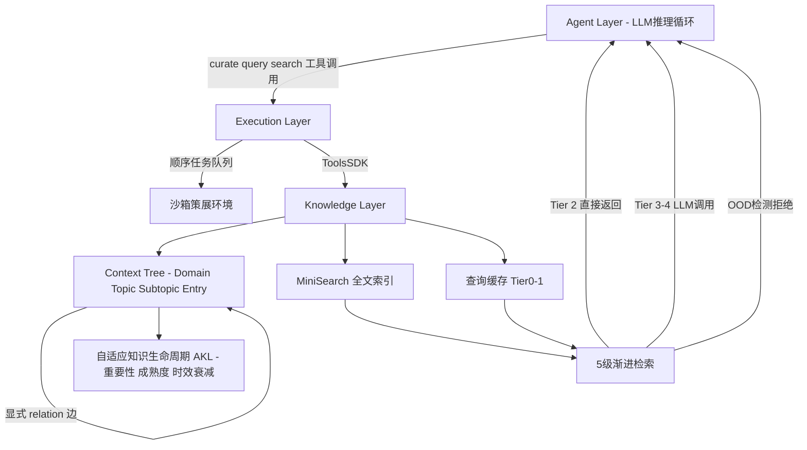

# ByteRover：通过LLM策展的分层上下文实现Agent原生记忆

## 一、论文基础元数据
- **原文标题**：ByteRover: Agent-Native Memory Through LLM-Curated Hierarchical Context
- **中文译版**：ByteRover：通过LLM策展的分层上下文实现Agent原生记忆
- **发表渠道**：arXiv 预印本（尚未标注会议/期刊等级，待补充）
- **发表时间**：2025年（具体日期待补充）
- **链接**：arXiv:2604.01599（https://arxiv.org/abs/2604.01599）
- **作者及核心机构**：Andy Nguyen, Danh Doan, Hoang Pham, Bao Ha, Dat Pham, Linh Nguyen, Hieu Nguyen, Thien Nguyen, Cuong Do, Phat Nguyen, Toan Nguyen（核心机构待补充）
- **研究领域**：人工智能 → 大语言模型 / Agent 记忆系统（Memory-Augmented Generation, MAG）
- **关联数据集**：
  - **LoCoMo**：平均约20K tokens，35 sessions，考察长程时序与因果检索
  - **LongMemEval-S**：500题，6类记忆能力，平均上下文>100K tokens，每题约48 sessions
  - 语言：英文（推测），标注：对话级时间戳 key facts

## 二、论文综合评价
### 2.1 量化评分（1-5分，5分为最优）

| 评价维度 | 评分 | 备注 |
| -------- | ---- | ---- |
| 📚 理论基础 | ⭐⭐⭐⭐ | 范式反转思路清晰，MAG taxonomy分类合理 |
| 🎯 问题核心性 | ⭐⭐⭐⭐⭐ | 直击外部记忆服务的语义漂移与恢复脆弱痛点 |
| 💡 方法创新性 | ⭐⭐⭐⭐⭐ | Agent原生记忆+LLM自策展+分层Context Tree原创性强 |
| ⚙️ 技术壁垒 | ⭐⭐⭐⭐ | AKL生命周期、5级渐进检索、策展原子操作壁垒较高 |
| 🧪 实验严谨性 | ⭐⭐⭐ | LongMemEval-S混合来源、配置不一致、写路径未消融 |
| 🔧 落地可行性 | ⭐⭐⭐⭐ | 零外部基础设施易部署，但写路径昂贵与文件扩展性受限 |
| 🚀 应用前景 | ⭐⭐⭐⭐⭐ | 契合Agent长期记忆刚需，本地可读存储利于隐私与审计 |
| 📊 综合评分 | 4.3 | 范式新颖、效果领先，但实验严谨性与写路径成本待补强 |

### 2.2 定性综合评价（≤300字）
> ByteRover 提出 **Agent-Native Memory** 范式，将记忆从"外部服务"反转为"Agent自身策展的本地文件式知识图谱"：同一LLM既推理任务，又负责写入、组织、检索知识。以 **Context Tree**（Domain>Topic>Subtopic>Entry）、**Adaptive Knowledge Lifecycle**（重要性评分/成熟度/时效衰减）、**5级渐进检索**（Tier 0-2无需LLM调用，亚100ms）为核心组件，实现零外部基础设施（无向量库/图库/embedding）的长程记忆。在LoCoMo上总体96.1%（超次优HonCho 6.2pp），LongMemEval-S上92.8%。差异化优势在于消除"理解Agent"与"存储pipeline"的分离，保留协调上下文与provenance，崩溃后可基于本地markdown优雅恢复。关键结论：低层级检索是精度核心而非单纯延迟优化（消融去Tiered Retrieval跌29.4pp）。

## 三、领域本体论映射
| 核心维度 | 具体内容 |
| -------- | -------- |
| 核心研究对象 | Agent 长期对话记忆的表示、策展与检索机制 |
| 核心技术路径 | LLM自策展 + 文件式层级知识图谱 + 多级渐进检索 + 自适应知识生命周期 |
| 数据/载体形态 | 本地人类可读 markdown 条目（含关系集、provenance、叙事、片段、生命周期元数据） |
| 核心功能目标 | 消除语义漂移、保留跨Agent协调上下文、支持崩溃后优雅恢复，实现零外部依赖的长程记忆 |
| 验证核心指标 | LLM-as-a-Judge 二值正确性（LoCoMo / LongMemEval-S），检索延迟 p50/p95/p99 |

## 四、核心问题与解决方案
### 4.1 待解决的核心问题
1. **领域级根本问题**：存储知识的系统并不理解知识——现有 MAG 将记忆委托给外部 pipeline（chunking/embedding/实体抽取/图构建），造成"理解Agent"与"存储系统"解耦。
2. **现有方法痛点**：
   - **语义漂移**：Agent 想存的与 pipeline 实际捕获的不一致；
   - **协调上下文丢失**：多Agent共享数据但不共享理解，丢失"为什么"；
   - **恢复脆弱**：崩溃后需查询外部服务并推断断点，状态不在文件里。
3. **工程落地卡点**：外部向量库/图库/embedding 服务带来部署复杂度、成本与隐私风险；向量检索在大语料下延迟不可控；传统记忆系统难以支持有状态反馈闭环。

### 4.2 核心解决方案
- **理论框架**：Agent-Native Memory —— 记忆操作是 Agent 工具箱中的一等工具（first-class tools），而非外部API调用。
- **核心架构**：三层架构（Agent Layer / Execution Layer / Knowledge Layer），核心数据结构为 Context Tree（文件式层级知识图谱）。
- **关键技术**：
  - LLM 策展五类原子操作：`ADD / UPDATE / UPSERT / MERGE / DELETE`（带 `reason` 审计轨迹、三级压缩、沙箱执行、原子写）；
  - Adaptive Knowledge Lifecycle（重要性0-100分、成熟度 draft→validated→core、时效衰减 exp(-Δt/30)）；
  - 5级渐进检索（Tier 0-4）+ OOD 检测。
- **创新机制**：关系由作者显式 `@relation` 声明（非隐式embedding相似），支持双向引用索引与前向链接+反链 O(1) 查找；状态反馈循环让Agent实时适应每次操作结果。

### 4.3 核心优势（量化+定性）
1. **性能优势**：LoCoMo 总体 96.1%（+6.2pp vs HonCho），Multi-hop 93.3%（+9.3pp），Temporal 97.8%；LongMemEval-S Knowledge Update 98.7%、Temporal 91.7%。
2. **效率优势**：Tier 0-2 完全无 LLM 调用，多数查询亚100ms解决；LoCoMo p50 1.2s / p99 1.7s；23,867文档下 p50 1.6s / p99 2.5s。
3. **工程优势**：零外部基础设施（无向量库/图库/embedding服务），全部知识本地人类可读 markdown，便于审计、迁移与崩溃恢复。

## 五、方法与技术架构
### 5.1 核心架构设计
> ByteRover 采用三层架构：Agent Layer 负责 LLM 推理循环，将 `curate`/`query`/`search` 作为一等工具；Execution Layer 提供顺序任务队列、沙箱策展环境与 ToolsSDK；Knowledge Layer 存储 Context Tree、MiniSearch 全文索引与查询缓存，全部落于本地文件系统。知识以 markdown 条目为节点，通过显式 `@relation` 注解构成边，形成 Domain > Topic > Subtopic > Entry 的层级知识图谱。

### 5.2 关键技术实现细节
| 技术模块 | 实现路径 | 工程注意事项 |
| -------- | -------- | ------------ |
| Context Tree | markdown条目为节点，`@relation`显式注解为边，支持前向链接+反链 | 双向引用索引 O(1)查找；设计规模约10K条目 |
| 策展操作 | ADD/UPDATE/UPSERT/MERGE/DELETE 五类原子操作，带reason审计轨迹 | 三级压缩保证策展终止；沙箱内执行；原子写防崩溃损坏 |
| AKL 生命周期 | 重要性分(access+3/update+5/日衰减0.995)、成熟度分层(滞后区间防震荡)、时效衰减exp(-Δt/30)约21天半衰期 | 检索分数=BM25+重要性+时效；需调参防振荡 |
| 5级渐进检索 | Tier0精确缓存(~0ms)→Tier1模糊缓存(~50ms, Jaccard阈值)→Tier2 MiniSearch(~100ms, BM25高分+gap)→Tier3单次LLM(<5s)→Tier4完整agentic loop(8-15s) | Tier0-2无LLM调用；OOD检测显式拒绝超域查询 |
| OOD 检测 | 查询超出已存知识时显式拒绝 | 减少幻觉；LongMemEval-S上Temporal -2.2pp |
| 依赖组件 | LLM backbone（推理+策展）、MiniSearch索引、文件系统、ToolsSDK | 策展质量受backbone格式遵循与推理能力影响 |

### 5.3 架构优缺点
- **优点**：
  - 消除语义漂移，Agent 意图与存储内容一致；
  - 零外部基础设施，部署轻、隐私友好、可审计；
  - 显式关系 + provenance 支持多Agent协调与多跳推理；
  - Tier 0-2 无LLM调用，大幅降低延迟与成本。
- **缺点**：
  - 写路径昂贵（LLM策展慢于机械chunking/embedding）；
  - 新查询 Tier 3-4 需LLM调用，慢于向量搜索；
  - 文件存储扩展性受限（设计约10K条目）；
  - 顺序队列限制并发写吞吐，多Agent写入存在瓶颈。

## 六、实验设计与结果分析
### 6.1 实验基础设置
| 维度 | 内容 |
| ---- | ---- |
| 数据集 | LoCoMo（均~20K tokens，35 sessions）；LongMemEval-S（500题，6类记忆能力，均>100K tokens，每题~48 sessions） |
| 基线方法 | LoCoMo：Mem0、Zep、Hindsight、HonCho、Memobase、OpenAI Memory；LongMemEval-S：Hindsight、HonCho、Chronos、SmartSearch、Memora、TiMem、Zep、full-context baseline |
| 实验环境 | Judge：Gemini 3 Flash（temp 0.0, budget 8,192, 禁thinking）；Justifier：Gemini 3.1 Pro（temp 0.0, budget 32,768, 低thinking budget） |
| 评价指标 | LLM-as-a-Judge 二值正确性标签；延迟 p50/p95/p99 |

### 6.2 核心实验结果
| 方法 | 核心指标1（LoCoMo总体） | 核心指标2（LongMemEval-S总体） | 工程指标（算力/耗时） |
| ---- | --------- | --------- | -------------------- |
| HonCho | 89.9% | 待补充 | 待补充 |
| Hindsight | 待补充（Open-domain 95.1%） | 待补充 | 待补充 |
| Chronos-Low | 待补充 | 92.6% | 待补充 |
| Chronos-High | 待补充 | 95.6% | 待补充 |
| **ByteRover（本文）** | **96.1%** | **92.8%** | LoCoMo p50 1.2s/p95 1.4s/p99 1.7s；LongMemEval-S 23,867文档下 p50 1.6s/p95 2.3s/p99 2.5s |

*细分：LoCoMo Multi-hop 93.3%（+9.3pp vs HonCho），Temporal 97.8%，Open-domain 85.9%（低于Hindsight 95.1%）；LongMemEval-S Knowledge Update 98.7%、Temporal 91.7%、Single-Session Preference 96.7%、Multi-Session 84.2%（Chronos 91.7%）。*

### 6.3 消融实验/鲁棒性分析
| 实验变体 | 指标变化 | 核心结论 |
| -------- | -------- | -------- |
| 去掉 Tiered Retrieval | 92.8% → 63.4%（**-29.4pp**） | 低层级检索不只是延迟优化，而是精度核心 |
| 去掉 OOD Detection | -0.4pp（Temporal -2.2pp） | 主要影响时序类问题 |
| 去掉 Relation Graph | -0.4pp（per-category与OOD消融完全一致） | 与OOD处理重叠失败模式；LoCoMo multi-hop效果未单独验证 |
| AKL/策展反馈/压缩（写路径） | 未消融 | 静态基准无法隔离写路径组件 |

### 6.4 实验结论（工程视角）
ByteRover 在 LoCoMo 上取得 SOTA（96.1%），在 LongMemEval-S 上具备竞争力（92.8%，略高于 Chronos-Low，低于 Chronos-High）。Tiered Retrieval 是精度与延迟的双重核心组件，移除即大幅下降29.4pp；OOD与Relation Graph在LongMemEval-S上冗余度高。整体延迟在亚秒到秒级，说明分层检索有效约束大语料搜索成本。但LongMemEval-S存在混合来源与†标记配置不一致问题，跨系统比较需谨慎；写路径（策展/AKL）缺乏消融验证，工程成本未被完整刻画。

## 七、领域贡献与创新点
| 贡献层级 | 具体内容 |
| -------- | -------- |
| 理论贡献 | 提出 Agent-Native Memory 范式，反转"记忆委托外部服务"的假设，论证"理解Agent"与"存储pipeline"应统一 |
| 方法/架构贡献 | Context Tree 文件式层级知识图谱；Adaptive Knowledge Lifecycle；5级渐进检索+OOD检测；五类策展原子操作 |
| 数据/工具贡献 | 零外部基础设施的本地markdown存储方案；ToolsSDK；MiniSearch索引集成（开源代码/工具待补充） |
| 实验/验证贡献 | 在LoCoMo达96.1%总体与93.3% multi-hop，LongMemEval-S达92.8%；系统性消融揭示Tiered Retrieval核心地位 |
| 工程落地贡献 | 证明无需向量库/图库/embedding服务即可实现高性能长程记忆，支持审计、可读、可迁移、崩溃友好恢复 |

## 八、局限性与风险
| 维度 | 具体描述 | 应对思路 |
| ---- | -------- | -------- |
| 学术局限性 | 写路径组件（AKL/策展反馈/压缩）未消融；LongMemEval-S混合来源与配置不一致；Open-domain弱于Hindsight | 设计可隔离写路径的动态基准；统一评测协议与backbone |
| 工程落地风险 | 写路径昂贵（LLM策展慢于chunking/embedding）；Tier3-4新查询需LLM调用；文件存储扩展性约10K条目；顺序队列限制并发写吞吐 | 分片存储/替代索引；异步批量策展；并发写队列改造 |
| 伦理/合规风险 | 本地文件存储可能涉及用户隐私数据持久化；LLM策展可能写入敏感或错误信息 | 引入脱敏/访问控制/审计日志；策展质量校验与回滚机制 |

## 九、未来研究/落地方向
| 方向类型 | 具体内容 | 优先级 |
| -------- | -------- | ------ |
| 科研拓展 | 隔离并验证写路径组件（AKL/策展反馈/压缩）；在LoCoMo multi-hop单独验证Relation Graph贡献；探索OOD与Relation Graph的冗余机制 | 高 |
| 工程优化 | 降低策展LLM成本（小模型策展/批量异步）；文件存储分片与索引替代方案；并发写队列优化；扩展至>10K条目 | 高 |
| 跨领域适配 | 多Agent协同场景的协调上下文共享；多用户/多租户隐私隔离；非对话类知识库（代码、文档、科研）适配 | 中 |

## 十、关键词与术语表
| 语言 | 关键词 |
| ---- | ------ |
| 中文 | Agent原生记忆、LLM策展、分层上下文、上下文树、自适应知识生命周期、渐进检索、记忆增强生成、语义漂移、OOD检测 |
| 英文 | Agent-Native Memory, LLM-Curated, Hierarchical Context, Context Tree, Adaptive Knowledge Lifecycle (AKL), Progressive Retrieval, MAG, Semantic Drift, OOD Detection |
| 领域专属术语 | **MAG (Memory-Augmented Generation)**：记忆增强生成，为LLM引入外部记忆的长程对话方案；**Context Tree**：文件式层级知识图谱，节点为markdown条目，边由`@relation`显式注解；**AKL**：自适应知识生命周期，通过重要性评分、成熟度分层、时效衰减管理知识演化；**Tiered Retrieval**：5级渐进检索策略，Tier0-2无LLM调用；**Agent-Native Memory**：同一LLM既推理又策展记忆的范式；**OOD Detection**：查询超出已存知识时显式拒绝，减少幻觉 |

## 十一、参考文献与关联资源
- **核心参考文献**：
  - Liu et al., 2026（轻量语义记忆）
  - Xu et al., 2025; Modarressi et al., 2023; Chhikara et al., 2025（实体中心与个性化记忆）
  - Nan et al., 2025（情景与反思记忆）
  - Jiang et al., 2026a; Rasmussen et al., 2025; Kang et al., 2025a; Packer et al., 2023（结构化与层次化记忆）
  - Hindsight（Judge/Justifier提示词来源）
- **补充阅读**：Chronos、SmartSearch、Memora、TiMem、Zep、Mem0、HonCho、Memobase、OpenAI Memory 等相关工作
- **开源代码/工具**：待补充（论文未提及代码仓库链接）

## 十二、阅读者批注
1. **科研启发**：ByteRover的"存储知识的系统必须理解知识"这一核心判断极具穿透力，提示未来记忆系统设计应从"检索管道"转向"认知一致性"，即将存储与推理的主体统一。显式关系 vs 隐式embedding 的对比也值得深入，尤其在multi-hop场景。
2. **工程落地思考**：零外部基础设施的方案对隐私敏感、边缘部署、离线Agent场景非常友好；但写路径LLM成本与文件扩展性是规模化关键瓶颈，建议评估"小模型策展 + 大模型推理"的分工模式，以及文件分片+索引混合