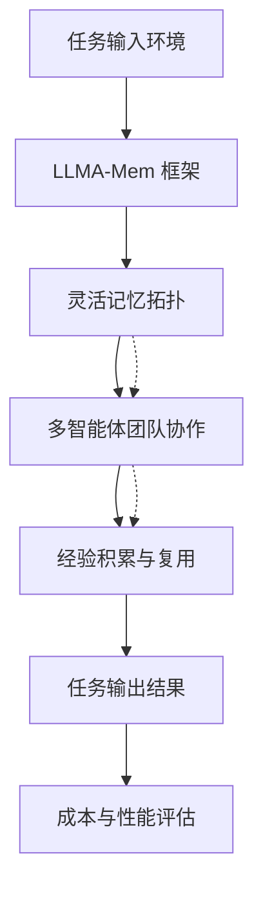

# 扩展团队还是扩展时间？大语言模型多智能体系统中支持记忆终身学习

## 一、论文基础元数据
- 原文标题：Scaling Teams or Scaling Time? Memory Enabled Lifelong Learning in LLM Multi-Agent Systems
- 中文译版：扩展团队还是扩展时间？大语言模型多智能体系统中支持记忆终身学习
- 发表渠道：arXiv 预印本（计算机科学 - 多智能体系统）
- 发表时间：2026 年 3 月 27 日（根据 arXiv  header 信息）
- 链接：arXiv:2604.03295
- 作者及核心机构：Shanglin Wu (Emory University), Yuyang Luo (Emory University), Yueqing Liang (Illinois Institute of Technology), Kaiwen Shi (University of Notre Dame), Yanfang Ye (University of Notre Dame), Ali Payani (Cisco Research), Kai Shu (Emory University)
- 研究领域：人工智能（一级）+ 多智能体系统/大语言模型/终身学习（二级）
- 关联数据集：MultiAgentBench（涵盖编码、研究、数据库环境）

## 二、论文综合评价
### 2.1 量化评分（1-5 分，5 分为最优）

| 评价维度 | 评分 | 备注 |
| -------- | ---- | ---- |
| 📚 理论基础 | ⭐⭐⭐⭐⭐ | 终身学习与多智能体缩放理论结合紧密 |
| 🎯 问题核心性 | ⭐⭐⭐⭐⭐ | 直击多智能体系统成本与性能平衡痛点 |
| 💡 方法创新性 | ⭐⭐⭐⭐⭐ | 提出记忆拓扑与团队规模联合缩放视角 |
| ⚙️ 技术壁垒 | ⭐⭐⭐⭐ | 记忆框架设计具有一定实现复杂度 |
| 🧪 实验严谨性 | ⭐⭐⭐⭐ | 覆盖多环境但片段未展示完整数据细节 |
| 🔧 落地可行性 | ⭐⭐⭐⭐⭐ | 明确降低 Token 成本，工程友好 |
| 🚀 应用前景 | ⭐⭐⭐⭐⭐ | 适用于长期任务自动化与成本控制场景 |
| 📊 综合评分 | 4.7 | 理论新颖且具实际成本优势，值得深入跟进 |

### 2.2 定性综合评价（≤300 字）
> 核心概括：研究定位、核心价值、差异化优势、关键结论

本研究定位为大语言模型多智能体系统（MAS）的缩放策略优化。核心价值在于打破了仅关注团队规模或仅关注个体学习的孤立视角，提出了联合考虑团队大小与终身学习能力的概念缩放视图。差异化优势在于提出了 LLMA-Mem 框架，通过灵活的记忆拓扑设计，揭示了非单调的缩放景观。关键结论表明，更大的团队并不总能带来更好的长期性能，当记忆能更好地支持经验复用时，小团队可超越大团队，且在降低 Token 成本方面表现显著。

## 三、领域本体论映射
| 核心维度 | 具体内容 |
| -------- | -------- |
| 核心研究对象 | 大语言模型多智能体系统（LLM MAS） |
| 核心技术路径 | 记忆增强终身学习框架（LLMA-Mem） |
| 数据/载体形态 | 任务交互日志、经验记忆库、多环境轨迹 |
| 核心功能目标 | 提升长视野任务性能，降低计算与 Token 成本 |
| 验证核心指标 | 长期任务成功率、平均 Token 消耗量 |

## 四、核心问题与解决方案
### 4.1 待解决的核心问题
1. **领域级根本问题**：多智能体系统在缩放过程中，团队规模增加与时间维度经验积累之间的相互作用机制尚不明确。
2. **现有方法痛点**：现有研究孤立看待团队缩放或个体终身学习，忽略了协调开销、通信成本及信息碎片化对终身学习的影响。
3. **工程落地卡点**：盲目增加代理数量导致成本激增，且长期运行中经验无法有效复用，性能提升遭遇瓶颈。

### 4.2 核心解决方案
- 理论框架：提出多智能体系统概念缩放视图，联合考虑团队规模与终身学习能力。
- 核心架构：LLMA-Mem 框架，支持灵活的记忆拓扑结构。
- 关键技术：记忆增强机制，支持经验在智能体间的有效复用与更新。
- 创新机制：揭示非单调缩放景观，证明记忆设计可替代单纯的团队规模扩张。

### 4.3 核心优势（量化 + 定性）
1. 性能优势：在长视野任务中一致优于基线方法，小团队配合优质记忆可超越大团队。
2. 效率优势：显著降低平均每个任务的 Token 使用量，减少计算成本。
3. 工程优势：提供了更具性价比的缩放路径，避免盲目堆砌代理数量。

## 五、方法与技术架构
### 5.1 核心架构设计
> 文字描述 + 架构图（Mermaid/图片）

LLMA-Mem 架构旨在通过记忆模块连接多智能体团队与任务环境。系统接收任务输入，通过记忆拓扑管理历史经验，协调多个 LLM 代理进行协作，最终输出结果并更新记忆。重点在于记忆模块如何支持经验的存储、检索与复用，以优化团队协作效率。

### 5.2 关键技术实现细节
| 技术模块 | 实现路径 | 工程注意事项 |
| -------- | -------- | ------------ |
| 记忆拓扑 | 支持灵活配置的记忆结构，适应不同团队规模 | 需平衡记忆检索延迟与信息完整性 |
| 多智能体协作 | 基于 LLM 的通信与任务分解机制 | 需控制通信开销以防成本失控 |
| 经验复用 | 从历史轨迹中提取可迁移经验 | 需防止负迁移或过时经验干扰 |
| 依赖组件 | 大语言模型接口、向量数据库（推测） | 确保接口稳定性与数据一致性 |

### 5.3 架构优缺点
- 优点：有效降低长期运行成本，提升小团队性能上限，架构灵活可扩展。
- 缺点：记忆管理引入额外复杂度，可能增加单次推理延迟，依赖高质量记忆检索。

## 六、实验设计与结果分析
### 6.1 实验基础设置
| 维度 | 内容 |
| ---- | ---- |
| 数据集 | MultiAgentBench（编码、研究、数据库环境） |
| 基线方法 | 传统多智能体协作方法（无终身记忆或固定记忆） |
| 实验环境 | 原文片段未提供具体硬件配置细节 |
| 评价指标 | 长视野任务性能、平均 Token 使用量（成本） |

### 6.2 核心实验结果
| 方法 | 核心指标 1 | 核心指标 2 | 工程指标（算力/耗时） |
| ---- | --------- | --------- | -------------------- |
| 基线 1 | 原文片段未提供具体数值 | 原文片段未提供具体数值 | 原文片段未提供具体数值 |
| 基线 2 | 原文片段未提供具体数值 | 原文片段未提供具体数值 | 原文片段未提供具体数值 |
| 本文方法 | 声称长视野性能一致优于基线 | 声称成本显著降低 | 平均 Token 用量大幅减少 |

*注：输入片段未包含完整实验表格，以上基于摘要结论描述。*

### 6.3 消融实验/鲁棒性分析
| 实验变体 | 指标变化 | 核心结论 |
| -------- | -------- | -------- |
| 不同团队规模 | 性能非单调变化 | 大团队不一定优于小团队 |
| 不同记忆设计 | 影响经验复用效率 | 记忆设计是关键缩放路径 |
| 原文未提供详细消融表 | 原文未提供详细数据 | 原文片段未包含完整消融实验数据 |

### 6.4 实验结论（工程视角）
在资源受限场景下，优化记忆设计比单纯增加代理数量更具性价比。工程落地应优先考虑记忆拓扑的优化，而非盲目扩展团队规模，以实现成本与性能的最佳平衡。

## 七、领域贡献与创新点
| 贡献层级 | 具体内容 |
| -------- | -------- |
| 理论贡献 | 提出多智能体系统联合缩放视图，揭示非单调缩放景观 |
| 方法/架构贡献 | 设计 LLMA-Mem 终身记忆框架，支持灵活记忆拓扑 |
| 数据/工具贡献 | 在 MultiAgentBench 多环境中验证，代码开源 |
| 实验/验证贡献 | 实证记忆设计可替代团队规模扩张以提升性能 |
| 工程落地贡献 | 提供降低 Token 成本的具体路径，优化长期运行效率 |

## 八、局限性与风险
| 维度 | 具体描述 | 应对思路 |
| ---- | -------- | -------- |
| 学术局限性 | 片段未展示完整理论证明，缩放规律普适性需更多验证 | 后续需在更多领域数据集验证非单调规律 |
| 工程落地风险 | 记忆检索延迟可能影响实时性，长周期记忆存储成本高 | 优化向量检索效率，实施记忆分层存储策略 |
| 伦理/合规风险 | 智能体长期学习可能积累偏见或敏感信息 | 引入记忆审查机制，定期清理敏感经验数据 |

## 九、未来研究/落地方向
| 方向类型 | 具体内容 | 优先级 |
| -------- | -------- | ------ |
| 科研拓展 | 探索记忆拓扑与模型参数缩放的交互关系 | 高 |
| 工程优化 | 开发高效记忆压缩与检索算法，降低延迟 | 高 |
| 跨领域适配 | 将框架迁移至机器人协作或科学发现领域 | 中 |

## 十、关键词与术语表
| 语言 | 关键词 |
| ---- | ------ |
| 中文 | 多智能体系统、终身学习、记忆框架、缩放规律、成本控制 |
| 英文 | Multi-Agent Systems, Lifelong Learning, Memory Framework, Scaling Laws, Cost Efficiency |
| 领域专属术语 | LLMA-Mem：本文提出的大语言模型多智能体终身记忆框架 |
| 领域专属术语 | 非单调缩放景观：团队规模增加不必然导致性能提升的现象 |

## 十一、参考文献与关联资源
- 核心参考文献：原文片段提及 Chen et al., 2024b; Wu et al., 2024; Zheng et al., 2025b 等（完整列表见原文）
- 补充阅读：关于多智能体缩放逻辑及终身学习的相关综述
- 开源代码/工具：https://github.com/ShanglinWu/MAS_lifelong_learning

## 十二、阅读者批注
1. **科研启发**：缩放定律在多智能体领域可能呈现非单调性，记忆机制是调节杠杆。
2. **工程落地思考**：在生产环境中，应优先评估记忆模块的 ROI，而非盲目增加 Agent 数量。
3. **待验证/存疑点**：具体性能提升百分比及不同规模下的拐点数据需查阅完整论文确认。
4. **个人/团队应用场景**：适用于需要长期运行且成本敏感的自动化任务流系统。

## 十三、阅读元信息
| 维度 | 内容 |
| ---- | ---- |
| 阅读日期 | 2026-04-12 22:18 |
| 阅读人 | xPaperReader AI |
| 文档编号 | arxiv-2604.03295 |
| 版本迭代 | v1.0 |