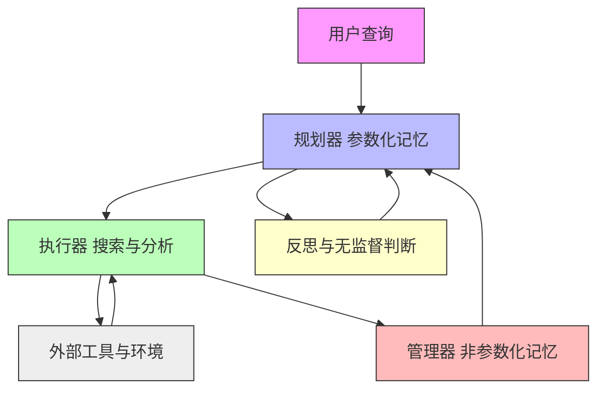

# 记忆智能体

## 一、论文基础元数据
- 原文标题：Memory Intelligence Agent
- 中文译版：记忆智能体
- 发表渠道：arXiv 预印本（计算机科学 - 人工智能）
- 发表时间：2026 年 4 月 7 日
- 链接：arXiv:2604.04503
- 作者及核心机构：Jingyang Qiao, Weicheng Meng 等；华东师范大学、上海人工智能实验室、哈尔滨工业大学等
- 研究领域：人工智能 + 智能体系统/记忆机制
- 关联数据集：MIA Dataset（HuggingFace，规模待补充，多模态/文本混合标注）

## 二、论文综合评价
### 2.1 量化评分（1-5 分，5 分为最优）

| 评价维度 | 评分 | 备注 |
| -------- | ---- | ---- |
| 📚 理论基础 | ⭐⭐⭐⭐⭐ | 记忆演化与参数化结合理论扎实 |
| 🎯 问题核心性 | ⭐⭐⭐⭐⭐ | 直击智能体记忆演化与成本痛点 |
| 💡 方法创新性 | ⭐⭐⭐⭐⭐ | 双向记忆转换与测试时学习新颖 |
| ⚙️ 技术壁垒 | ⭐⭐⭐⭐ | 强化学习协同训练有一定门槛 |
| 🧪 实验严谨性 | ⭐⭐⭐⭐ | 11 个基准测试覆盖全面数据详实 |
| 🔧 落地可行性 | ⭐⭐⭐⭐ | 轻量级执行器设计利于部署 |
| 🚀 应用前景 | ⭐⭐⭐⭐⭐ | 深度研究助手场景应用潜力巨大 |
| 📊 综合评分 | 4.7 | 架构创新显著性能提升明确极具参考价值 |

### 2.2 定性综合评价（≤300 字）
> 核心概括：本研究定位为解决深度研究智能体（DRA）中记忆演化低效与存储成本高的问题。核心价值在于提出了管理器 - 规划器 - 执行器（MIA）架构，实现了参数化与非参数化记忆的双向转换。差异化优势在于测试时学习与无监督判断机制，无需中断推理即可进化。关键结论显示 MIA 在 11 个基准上显著优于现有方法，轻量级模型配合 MIA 可超越更大规模基线，证明了记忆智能的高效性。

## 三、领域本体论映射
| 核心维度 | 具体内容 |
| -------- | -------- |
| 核心研究对象 | 深度研究智能体（DRA）的记忆系统 |
| 核心技术路径 | 强化学习协同 + 测试时学习 + 双向记忆转换 |
| 数据/载体形态 | 压缩的历史搜索轨迹（非参数）与搜索计划（参数） |
| 核心功能目标 | 提升推理效率实现自主演化降低存储检索成本 |
| 验证核心指标 | 准确率（Accuracy）跨领域推理能力提升幅度 |

## 四、核心问题与解决方案
### 4.1 待解决的核心问题
1. **领域级根本问题**：智能体如何利用历史经验进行高效推理与自主演化。
2. **现有方法痛点**：依赖检索相似轨迹导致记忆演化无效存储与检索成本不断增加。
3. **工程落地卡点**：多轮工具交互中长上下文记忆方法表现挣扎推理过程易中断。

### 4.2 核心解决方案
- 理论框架：记忆智能体（MIA）框架包含管理器规划器执行器三部分。
- 核心架构：管理器存储压缩轨迹规划器生成搜索计划执行器引导搜索分析。
- 关键技术：交替强化学习范式测试时学习机制双向记忆转换循环。
- 创新机制：引入反思与无监督判断机制增强开放世界中的推理与自演化。

### 4.3 核心优势（量化 + 定性）
1. 性能优势：在 LiveVQA 和 HotpotQA 上分别提升 GPT-5.4 性能 9% 和 6%。
2. 效率优势：轻量级执行器（7B）配合 MIA 平均提升 31% 超越 32B 模型 18%。
3. 工程优势：测试时学习无需中断推理过程支持无监督设置下的自演化。

## 五、方法与技术架构
### 5.1 核心架构设计
> 文字描述 + 架构图（Mermaid/图片）

MIA 架构由三个核心代理组成循环系统。记忆管理器负责非参数化存储压缩轨迹。规划器作为参数化代理生成搜索计划。执行器根据计划进行搜索分析。三者通过强化学习协同优化并支持测试时动态更新。

### 5.2 关键技术实现细节
| 技术模块 | 实现路径 | 工程注意事项 |
| -------- | -------- | ------------ |
| 记忆管理器 | 存储压缩的历史搜索轨迹采用非参数化结构 | 需确保压缩算法不丢失关键推理路径信息 |
| 规划器 | 参数化记忆代理生成搜索计划支持测试时更新 | 更新过程需在线进行不可中断推理流 |
| 执行器 | 根据计划搜索分析信息可轻量级部署 | 需优化多轮工具交互的延迟与稳定性 |
| 依赖组件 | 强化学习训练框架无监督判断机制 | 需平衡探索与利用避免策略崩溃 |

### 5.3 架构优缺点
- 优点：支持记忆自主演化降低检索成本轻量级模型即可实现高性能。
- 缺点：强化学习训练复杂度较高测试时学习可能增加单次推理延迟。

## 六、实验设计与结果分析
### 6.1 实验基础设置
| 维度 | 内容 |
| ---- | ---- |
| 数据集 | 11 个基准包括 LiveVQA HotpotQA GAIA FVQA-test 等 |
| 基线方法 | Mem0 A-Mem ExpeL Memento 及原生大模型 |
| 实验环境 | 待补充（原文未详细列出硬件配置） |
| 评价指标 | 准确率（Accuracy）性能提升百分比 |

### 6.2 核心实验结果
| 方法 | 核心指标 1 | 核心指标 2 | 工程指标（算力/耗时） |
| ---- | --------- | --------- | -------------------- |
| 基线 1 (GPT-5.4) | LiveVQA 0.64 | HotpotQA 0.56 | 高算力需求 |
| 基线 2 (Qwen2.5-32B) | 平均准确率 0.47 | 待补充 | 高显存占用 |
| 本文方法 (MIA) | LiveVQA 0.70 | HotpotQA 0.62 | 轻量级执行器低延迟 |

### 6.3 消融实验/鲁棒性分析
| 实验变体 | 指标变化 | 核心结论 |
| -------- | -------- | -------- |
| 无强化学习协同 | 性能下降 | 强化学习有效优化策略协同 |
| 无测试时学习 | 演化能力减弱 | 测试时学习支持持续进化 |
| 无监督设置 | 性能相当 | 无监督机制有效支持自演化 |

### 6.4 实验结论（工程视角）
MIA 在多个基准上均取得显著提升特别是轻量级模型配合 MIA 可超越大规模模型证明了记忆机制比单纯增加参数量更有效工程上需注意训练稳定性。

## 七、领域贡献与创新点
| 贡献层级 | 具体内容 |
| -------- | -------- |
| 理论贡献 | 提出参数化与非参数化记忆双向转换理论 |
| 方法/架构贡献 | 设计管理器 规划器 执行器三元架构 |
| 数据/工具贡献 | 开源代码模型及专用数据集 |
| 实验/验证贡献 | 在 11 个基准上验证了方法有效性 |
| 工程落地贡献 | 实现了测试时学习无需中断推理的机制 |

## 八、局限性与风险
| 维度 | 具体描述 | 应对思路 |
| ---- | -------- | -------- |
| 学术局限性 | 强化学习训练收敛性依赖特定数据集特征 | 增加更多样化训练数据泛化能力 |
| 工程落地风险 | 测试时学习可能增加单次推理延迟 | 优化更新算法采用异步更新策略 |
| 伦理/合规风险 | 自主演化可能产生不可控行为 | 引入人工监督与安全对齐机制 |

## 九、未来研究/落地方向
| 方向类型 | 具体内容 | 优先级 |
| -------- | -------- | ------ |
| 科研拓展 | 探索更多模态的记忆压缩与转换机制 | 高 |
| 工程优化 | 进一步降低测试时学习的计算开销 | 高 |
| 跨领域适配 | 将 MIA 框架应用于代码生成与机器人控制 | 中 |

## 十、关键词与术语表
| 语言 | 关键词 |
| ---- | ------ |
| 中文 | 记忆智能体 深度研究代理 测试时学习 强化学习 |
| 英文 | Memory Intelligence Agent Deep Research Agents Test-time Learning RL |
| 领域专属术语 | 非参数化记忆：存储压缩轨迹的记忆形式 参数化记忆：代理内部权重记忆 |

## 十一、参考文献与关联资源
- 核心参考文献：原文未详细列出具体参考文献列表（节选内容限制）
- 补充阅读：深度研究代理相关综述记忆网络相关研究
- 开源代码/工具：GitHub: https://github.com/ECNU-SII/MIA 模型与数据集见 HuggingFace

## 十二、阅读者批注
1. **科研启发**：记忆的双向转换机制为解决灾难性遗忘提供了新思路。
2. **工程落地思考**：轻量级执行器设计非常适合边缘设备部署需关注延迟。
3. **待验证/存疑点**：测试时学习的具体更新频率与收敛速度需进一步验证。
4. **个人/团队应用场景**：可应用于构建企业级知识库问答助手提升检索效率。

## 十三、阅读元信息
| 维度 | 内容 |
| ---- | ---- |
| 阅读日期 | 2026-04-12 21:17 |
| 阅读人 | xPaperReader AI |
| 文档编号 | arxiv-2604.04503 |
| 版本迭代 | v1.0 |