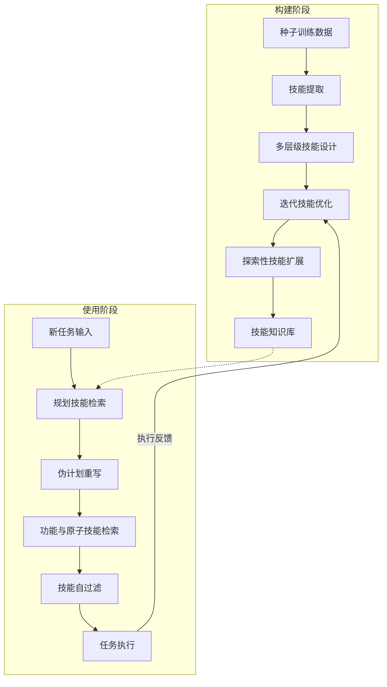

# SkillX：为智能体自动构建技能知识库

## 一、论文基础元数据
- 原文标题：SkillX: Automatically Constructing Skill Knowledge Bases for Agents
- 中文译版：SkillX：为智能体自动构建技能知识库
- 发表渠道：arXiv 预印本（未正式发表）
- 发表时间：2025 (arXiv ID 暗示 2026 年 4 月)
- 链接：arXiv:2604.04804
- 作者及核心机构：Chenxi Wang, Zhuoyun Yu, Xin Xie, Wuguannan Yao, Runnan Fang, Shuofei Qiao, Kexin Cao, Guozhou Zheng, Xiang Qi, Peng Zhang, Shumin Deng（机构信息文中未明确列出，待补充）
- 研究领域：人工智能（一级）+ 智能体系统/大语言模型应用（二级）
- 关联数据集：BFCL-v3, AppWorld, $\tau^2$-Bench（规模/语言/标注：文中未详细提及，主要为工具使用与交互基准）

## 二、论文综合评价
### 2.1 量化评分（1-5 分，5 分为最优）

| 评价维度 | 评分 | 备注 |
| -------- | ---- | ---- |
| 📚 理论基础 | ⭐⭐⭐⭐ | 基于经验学习与知识蒸馏理论，基础扎实 |
| 🎯 问题核心性 | ⭐⭐⭐⭐⭐ | 直击智能体孤立学习与经验泛化差的核心痛点 |
| 💡 方法创新性 | ⭐⭐⭐⭐⭐ | 提出多层级技能设计与自动化构建流水线，创新显著 |
| ⚙️ 技术壁垒 | ⭐⭐⭐⭐ | 涉及复杂技能提取、优化与扩展机制，实现难度中等偏高 |
| 🧪 实验严谨性 | ⭐⭐⭐⭐⭐ | 多基准、多模型对比，包含消融与跨模型迁移验证 |
| 🔧 落地可行性 | ⭐⭐⭐⭐ | 自动化流程清晰，但依赖强模型提取技能，成本需考量 |
| 🚀 应用前景 | ⭐⭐⭐⭐⭐ | 适用于复杂任务智能体，强弱模型协同场景价值巨大 |
| 📊 综合评分 | 4.6 | 方法创新且实验充分，显著提升弱模型能力，极具应用价值 |

### 2.2 定性综合评价（≤300 字）
> 核心概括：研究定位、核心价值、差异化优势、关键结论

本研究定位为 LLM 智能体经验学习框架，核心价值在于将孤立试错转化为结构化、可复用的技能知识库。差异化优势在于提出了规划、功能、原子三层技能设计，以及自动化迭代优化与扩展机制。关键结论表明，SkillX 在所有测试基准上均优于现有记忆方法，且能实现强模型向弱模型的有效经验迁移，显著降低执行步骤并提升成功率，解决了智能体进化效率低下与泛化能力差的根本问题。

## 三、领域本体论映射
| 核心维度 | 具体内容 |
| -------- | -------- |
| 核心研究对象 | LLM 智能体（Agent）及其经验记忆系统 |
| 核心技术路径 | 基于经验的结构化技能提取、优化与检索增强 |
| 数据/载体形态 | 多层级技能知识库（文本/结构化描述） |
| 核心功能目标 | 提升任务成功率、减少执行步骤、实现跨模型经验迁移 |
| 验证核心指标 | Pass@4, Avg@4, 执行步骤数，跨模型性能增益 |

## 四、核心问题与解决方案
### 4.1 待解决的核心问题
1. **领域级根本问题**：智能体自我进化效率低下，孤立学习导致重复探索，经验难以泛化。
2. **现有方法痛点**：传统记忆方法（如轨迹检索）冗余度高，缺乏结构化抽象，难以跨任务复用。
3. **工程落地卡点**：弱模型能力边界受限，强模型经验难以低成本迁移至弱模型。

### 4.2 核心解决方案
- 理论框架：基于经验的学习（Experience-based Learning）与结构化知识表示。
- 核心架构：SkillX 自动化流水线（提取、优化、扩展）。
- 关键技术：多层级技能设计（规划/功能/原子）、迭代技能优化、经验引导探索。
- 创新机制：两阶段检索机制（规划检索 + 伪计划重写 -> 功能/原子技能检索）。

### 4.3 核心优势（量化 + 定性）
1. 性能优势：在多个基准上持续提升，弱模型（如 Qwen3-32B）提升约 10 分。
2. 效率优势：减少执行步骤，降低试错成本，提升首次执行成功率。
3. 工程优势：支持即插即用，实现强模型向弱模型的结构化经验迁移。

## 五、方法与技术架构
### 5.1 核心架构设计
SkillX 通过自动化流水线构建技能库，包含技能提取、迭代优化与探索扩展三个核心阶段，并在推理时采用两阶段检索机制。

### 5.2 关键技术实现细节
| 技术模块 | 实现路径 | 工程注意事项 |
| -------- | -------- | ------------ |
| 多层技能设计 | 划分为规划、功能、原子三层，适配不同粒度需求 | 需定义清晰的层级边界，避免语义重叠 |
| 迭代技能优化 | 基于执行反馈自动修订，包含合并与过滤机制 | 需设置最大迭代轮数，防止过拟合或无限循环 |
| 探索性扩展 | 经验引导探索，优先探索未充分使用或高失败率工具 | 需平衡探索成本与新技能收益，避免无效探索 |
| 两阶段检索 | 先检索规划技能生成伪计划，再检索具体技能 | 伪计划仅作为中间查询，不注入最终 Prompt 以防幻觉 |

### 5.3 架构优缺点
- 优点：结构化表示泛化性强，支持跨模型迁移，自动化程度高，显著提升弱模型性能。
- 缺点：技能与特定工具 schema 绑定，跨差异较大领域复用难；依赖强模型提取技能，初期成本较高。

## 六、实验设计与结果分析
### 6.1 实验基础设置
| 维度 | 内容 |
| ---- | ---- |
| 数据集 | BFCL-v3, AppWorld, $\tau^2$-Bench |
| 基线方法 | No Memory, A-Mem, AWM, ExpeL |
| 实验环境 | 多模型评估（Qwen3-32B, Kimi-K2, GLM-4.6, DeepSeek-V3.2, GPT-4.1） |
| 评价指标 | Avg@4, Pass@4, 执行步骤数 |

### 6.2 核心实验结果
| 方法 | 核心指标 1 (AppWorld Pass@4) | 核心指标 2 (多基准平均提升) | 工程指标（算力/耗时） |
| ---- | --------- | --------- | -------------------- |
| 基线 (No Memory) | 84.08 (DeepSeek-V3.2) | 基准 | 低 |
| 基线 (ExpeL) | 待补充 | 低于 SkillX | 中 |
| 本文方法 (SkillX) | 88.39 (DeepSeek-V3.2) | 约 10 分 (Qwen3-32B) | 中偏高 (构建阶段) |

### 6.3 消融实验/鲁棒性分析
| 实验变体 | 指标变化 | 核心结论 |
| -------- | -------- | -------- |
| 仅规划技能 | 弱模型提升显著 | 规划技能对弱模型效果最佳，避免过度模仿 |
| 仅功能技能 | 整体贡献最大 | 功能技能对整体性能提升贡献最大 |
| 移除原子技能 | 性能大幅下降 | 原子技能补充 API 细节，缺失导致执行失败 |
| 无迭代优化 | 性能下降 | 迭代优化能有效提升技能文档与内容质量 |

### 6.4 实验结论（工程视角）
SkillX 证明了结构化多层级技能表示优于原始轨迹记忆。弱模型通过蒸馏强模型技能库可显著扩展能力边界，强模型虽增益空间有限但仍有效。执行步骤减少意味着推理成本降低，具备实际部署价值。

## 七、领域贡献与创新点
| 贡献层级 | 具体内容 |
| -------- | -------- |
| 理论贡献 | 确立了结构化技能表示在经验迁移中的优越性 |
| 方法/架构贡献 | 提出 SkillX 框架，包含三层技能设计与自动化构建流水线 |
| 数据/工具贡献 | 将释放优化版技能库，促进社区探索（计划中） |
| 实验/验证贡献 | 在多模型、多基准上验证了跨模型迁移的有效性与鲁棒性 |
| 工程落地贡献 | 提供了强弱模型协同的具体实现路径，降低弱模型使用门槛 |

## 八、局限性与风险
| 维度 | 具体描述 | 应对思路 |
| ---- | -------- | -------- |
| 学术局限性 | 技能与特定工具 schema 绑定，跨领域复用较难 | 研究更抽象的技能表示，解耦工具依赖 |
| 工程落地风险 | 构建阶段依赖强模型，初期计算成本较高 | 优化提取流程，复用已有技能库减少重复构建 |
| 伦理/合规风险 | 纯文本优化可能导致过拟合，技能库可能包含偏见 | 平衡更新轮数，引入人工审核或多样性约束 |

## 九、未来研究/落地方向
| 方向类型 | 具体内容 | 优先级 |
| -------- | -------- | ------ |
| 科研拓展 | 研究跨环境、跨工具生态的技能迁移机制 | 高 |
| 工程优化 | 降低技能库构建成本，优化检索效率 | 高 |
| 跨领域适配 | 扩展至纯对话类用户交互场景，覆盖更多任务类型 | 中 |

## 十、关键词与术语表
| 语言 | 关键词 |
| ---- | ------ |
| 中文 | 技能知识库，智能体，经验学习，多层级技能，跨模型迁移 |
| 英文 | Skill Knowledge Base, Agent, Experience-based Learning, Multi-Level Skills, Cross-Model Transfer |
| 领域专属术语 | 伪计划 (Pseudo-Plan)：仅作为中间检索查询的重写计划，不注入最终 Prompt |
| 领域专属术语 | 经验引导探索 (Experience Guiding Exploration)：优先探索未充分使用或高失败率工具的策略 |

## 十一、参考文献与关联资源
- 核心参考文献：待补充（文中提及基线方法 A-Mem, AWM, ExpeL 等对应论文）
- 补充阅读：关于 LLM Agent 记忆机制、工具学习的相关综述
- 开源代码/工具：待补充（作者计划释放技能库，代码未明确提及）

## 十二、阅读者批注
1. **科研启发**：结构化经验表示优于原始轨迹，这为记忆压缩提供了新方向；强弱模型协同是提升系统性价比的有效路径。
2. **工程落地思考**：构建技能库的初期成本需评估，但对于长期运行的 Agent 系统，复用技能库可大幅降低推理试错成本。
3. **待验证/存疑点**：跨差异较大领域（如从 API 调用到物理机器人控制）的技能迁移效果尚未验证；过拟合风险的具体阈值需进一步测试。
4. **个人/团队应用场景**：适用于构建企业级自动化助手，将专家操作转化为技能库赋能普通模型；适用于长程任务规划场景。

## 十三、阅读元信息
| 维度 | 内容 |
| ---- | ---- |
| 阅读日期 | 2026-04-12 21:06 |
| 阅读人 | xPaperReader AI |
| 文档编号 | arxiv-2604.04804 |
| 版本迭代 | v1.0 |