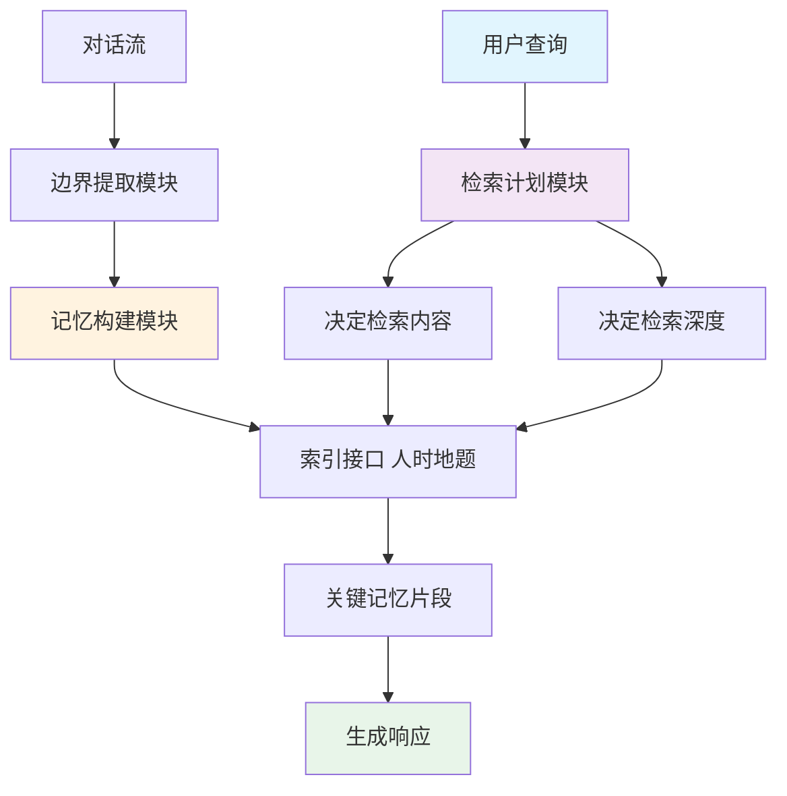

# HingeMem：面向可扩展对话的边界引导长期记忆与查询自适应检索

## 一、论文基础元数据
- 原文标题：HingeMem: Boundary Guided Long-Term Memory with Query Adaptive Retrieval for Scalable Dialogues
- 中文译版：HingeMem：面向可扩展对话的边界引导长期记忆与查询自适应检索
- 发表渠道：ACM Web Conference 2026 (WWW '26)，CCF-A 类会议
- 发表时间：2026 年 4 月（会议日期 4 月 13-17 日）
- 链接：https://doi.org/10.1145/3774904.3792089 (arXiv: 2604.06845)
- 作者及核心机构：Yijie Zhong, Yunfan Gao, Haofen Wang（同济大学 设计创意学院/上海自主智能无人系统科学中心）
- 研究领域：人工智能 + 自然语言处理（对话系统/长期记忆）
- 关联数据集：LOCOMO（规模/语言/标注：原文未详述，通常为长对话记忆基准）

## 二、论文综合评价
### 2.1 量化评分（1-5 分，5 分为最优）

| 评价维度 | 评分 | 备注 |
| -------- | ---- | ---- |
| 📚 理论基础 | ⭐⭐⭐⭐ | 引入事件分割理论，理论依据扎实 |
| 🎯 问题核心性 | ⭐⭐⭐⭐⭐ | 解决长对话记忆冗余与检索不准痛点 |
| 💡 方法创新性 | ⭐⭐⭐⭐ | 边界引导索引与查询自适应检索结合 |
| ⚙️ 技术壁垒 | ⭐⭐⭐ | 依赖边界检测精度，实现难度中等 |
| 🧪 实验严谨性 | ⭐⭐⭐⭐ | 多模型规模验证，对比基线较强 |
| 🔧 落地可行性 | ⭐⭐⭐⭐ | 显著降低 Token 成本，利于工程部署 |
| 🚀 应用前景 | ⭐⭐⭐⭐⭐ | 适用于个性化助手及 Web 应用场景 |
| 📊 综合评分 | 4.2 | 方法新颖且成本优势显著，具落地潜力 |

### 2.2 定性综合评价（≤300 字）
> 核心概括：研究定位、核心价值、差异化优势、关键结论

本研究定位於解决长对话系统中长期记忆管理的效率与准确性问题。核心价值在于提出 HingeMem 框架，通过边界引导的记忆构建和查询自适应检索机制，突破了传统固定 Top-k 检索的局限。差异化优势体现在利用人物、时间、地点、话题四要素触发记忆边界，实现可解释的索引接口，并根据查询类型动态决定检索内容与深度。关键结论显示，该方法在 LOCOMO 数据集上相比强基线实现约 20% 的相对性能提升，同时将问答 Token 成本降低 68%，兼具性能与效率优势。

## 三、领域本体论映射
| 核心维度 | 具体内容 |
| -------- | -------- |
| 核心研究对象 | 长对话系统中的长期记忆管理机制 |
| 核心技术路径 | 边界引导记忆构建 + 查询自适应检索 |
| 数据/载体形态 | 对话文本、超边索引结构（人/时/地/题） |
| 核心功能目标 | 提高记忆检索准确性，降低计算开销 |
| 验证核心指标 | 相对性能提升率、问答 Token 成本 |

## 四、核心问题与解决方案
### 4.1 待解决的核心问题
1. **领域级根本问题**：长对话系统中记忆冗余、检索不相关或信息不足，导致上下文理解偏差。
2. **现有方法痛点**：依赖连续总结或固定 Top-k 检索，缺乏对查询类别的适应性，计算开销大。
3. **工程落地卡点**：高 Token 消耗导致成本高昂，难以在大规模 Web 应用中可持续部署。

### 4.2 核心解决方案
- 理论框架：基于事件分割理论（Event Segmentation Theory）构建记忆边界。
- 核心架构：边界引导长期记忆模块 + 查询自适应检索模块。
- 关键技术：边界触发超边索引（人/时/地/题）、查询条件路由、检索深度控制。
- 创新机制：当四要素任一变化时绘制边界并写入片段，动态决定检索内容与数量。

### 4.3 核心优势（量化 + 定性）
1. 性能优势：相比强基线实现约 20% 的相对性能提升。
2. 效率优势：问答 Token 成本相比 HippoRAG2 降低 68%。
3. 工程优势：无需指定查询类别即可适应多样信息需求，适合生产环境。

## 五、方法与技术架构
### 5.1 核心架构设计
> 文字描述 + 架构图（Mermaid/图片）

HingeMem 架构分为记忆构建与检索两阶段。记忆构建阶段通过边界提取模块监测对话中人物、时间、地点、话题的变化，触发超边索引写入记忆。检索阶段接收用户查询，通过自适应检索机制决定检索路径（什么内容）和深度（多少内容），最终生成响应。

### 5.2 关键技术实现细节
| 技术模块 | 实现路径 | 工程注意事项 |
| -------- | -------- | ------------ |
| 边界提取 | 监测四要素变化触发写入 | 需平衡边界敏感度与片段粒度 |
| 索引接口 | 基于超边连接人时地题 | 确保索引结构可解释且易查询 |
| 自适应检索 | 联合决策路由与深度 | 避免过度检索导致上下文溢出 |
| 依赖组件 | 大语言模型（Qwen 系列） | 需适配不同参数量模型的表现 |

### 5.3 架构优缺点
- 优点：显著降低 Token 消耗，检索策略灵活，记忆结构可解释。
- 缺点：边界检测依赖模型能力，复杂对话场景下边界判定可能出错。

## 六、实验设计与结果分析
### 6.1 实验基础设置
| 维度 | 内容 |
| ---- | ---- |
| 数据集 | LOCOMO |
| 基线方法 | HippoRAG2 等强基线 |
| 实验环境 | 多模型规模（0.6B 至生产级模型） |
| 评价指标 | 相对性能提升率、Token 成本 |

### 6.2 核心实验结果
| 方法 | 核心指标 1(性能提升) | 核心指标 2(成本降低) | 工程指标（算力/耗时） |
| ---- | --------- | --------- | -------------------- |
| 基线 (HippoRAG2) | 基准 | 基准 | 高 Token 消耗 |
| 本文方法 | 约 20% 相对提升 | 68% 下降 | 显著降低 QA Token 成本 |
| 适用模型 | Qwen3-0.6B 至 Qwen-Flash | 跨规模有效 | 适配生产级模型 |

### 6.3 消融实验/鲁棒性分析
| 实验变体 | 指标变化 | 核心结论 |
| -------- | -------- | -------- |
| 原文片段未提供详细消融表 | 待补充具体数据 | 推测边界引导与自适应检索均关键 |

### 6.4 实验结论（工程视角）
该方法在不同规模模型上均表现出一致的性能增益，特别是在成本控制方面优势巨大，适合对推理成本敏感的生产环境。无需查询类别指定即可生效，降低了前置处理复杂度。

## 七、领域贡献与创新点
| 贡献层级 | 具体内容 |
| -------- | -------- |
| 理论贡献 | 将事件分割理论操作化为记忆边界构建机制 |
| 方法/架构贡献 | 提出边界引导记忆与查询自适应检索联合框架 |
| 数据/工具贡献 | 在 LOCOMO 基准上验证了多模型规模有效性 |
| 实验/验证贡献 | 证明了无需查询类别指定即可实现性能提升 |
| 工程落地贡献 | 大幅降低 Token 成本，提升 Web 应用可行性 |

## 八、局限性与风险
| 维度 | 具体描述 | 应对思路 |
| ---- | -------- | -------- |
| 学术局限性 | 边界检测依赖模型语义理解能力 | 引入更轻量级的边界检测器 |
| 工程落地风险 | 超边索引维护可能增加存储复杂度 | 优化索引存储结构，采用向量压缩 |
| 伦理/合规风险 | 长期记忆涉及用户隐私数据 | 实施数据加密与访问权限控制 |

## 九、未来研究/落地方向
| 方向类型 | 具体内容 | 优先级 |
| -------- | -------- | ------ |
| 科研拓展 | 探索更多记忆边界触发要素（如情感） | 中 |
| 工程优化 | 进一步压缩索引存储与检索延迟 | 高 |
| 跨领域适配 | 迁移至角色扮演或心理咨询场景 | 高 |

## 十、关键词与术语表
| 语言 | 关键词 |
| ---- | ------ |
| 中文 | 对话系统、个性化记忆、海马体 - 皮层交互、查询自适应检索 |
| 英文 | Dialogue System, Personalized Memory, Hippocampal-Cortical Interaction, Query Adaptive Retrieval |
| 领域专属术语 | 边界引导记忆：基于事件变化触发记忆写入的机制 |
| 领域专属术语 | 查询自适应检索：根据查询类型动态决定检索内容与深度的策略 |

## 十一、参考文献与关联资源
- 核心参考文献：原文片段未列出具体参考文献列表（通常包含 HippoRAG 等相关工作）
- 补充阅读：事件分割理论（Event Segmentation Theory）、LOCOMO 数据集论文
- 开源代码/工具：待补充（通常随论文发布在 GitHub 或项目主页）

## 十二、阅读者批注
1. **科研启发**：将认知科学理论（事件分割）引入记忆管理是一个很好的跨学科切入点。
2. **工程落地思考**：68% 的 Token 成本降低极具吸引力，可直接应用于降低 API 调用成本。
3. **待验证/存疑点**：边界检测在噪声对话中的鲁棒性需要进一步验证，原文片段未提供详细消融数据。
4. **个人/团队应用场景**：适用于构建长期陪伴型 AI 助手或客服系统，需关注隐私合规。

## 十三、阅读元信息
| 维度 | 内容 |
| ---- | ---- |
| 阅读日期 | 2026-04-12 22:41 |
| 阅读人 | xPaperReader AI |
| 文档编号 | arxiv-2604.06845 |
| 版本迭代 | v1.0 |