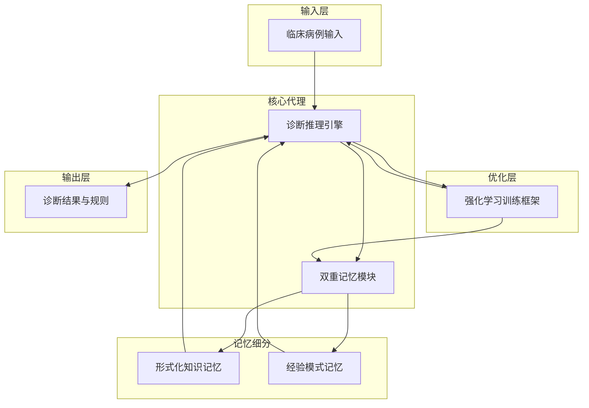

# 推理与双重记忆联合优化的自学习诊断智能体

## 一、论文基础元数据
- 原文标题：Joint Optimization of Reasoning and Dual-Memory for Self-Learning Diagnostic Agent
- 中文译版：推理与双重记忆联合优化的自学习诊断智能体
- 发表渠道：arXiv 预印本（审稿中）
- 发表时间：2026 年 4 月 8 日（预印本日期）
- 链接：arXiv:2604.07269
- 作者及核心机构：Bingxuan Li (UIUC), Simo Du (Jacobi Medical Center), Yue Guo (UIUC)
- 研究领域：人工智能 + 医疗诊断代理
- 关联数据集：MedCaseReasoning（标准评估）、ER-Reason（长程评估）

## 二、论文综合评价
### 2.1 量化评分（1-5 分，5 分为最优）

| 评价维度 | 评分 | 备注 |
| -------- | ---- | ---- |
| 📚 理论基础 | ⭐⭐⭐⭐⭐ | 认知科学双重记忆理论结合强化学习 |
| 🎯 问题核心性 | ⭐⭐⭐⭐⭐ | 解决医疗代理经验复用与持续学习痛点 |
| 💡 方法创新性 | ⭐⭐⭐⭐⭐ | 提出推理与记忆联合优化框架 |
| ⚙️ 技术壁垒 | ⭐⭐⭐⭐ | 双重记忆模块设计与强化训练框架 |
| 🧪 实验严谨性 | ⭐⭐⭐⭐ | 双数据集验证及专家评估，基线对比强 |
| 🔧 落地可行性 | ⭐⭐⭐ | 医疗合规性与数据隐私需进一步验证 |
| 🚀 应用前景 | ⭐⭐⭐⭐⭐ | 临床决策支持系统具有极高应用价值 |
| 📊 综合评分 | 4.6 | 理论创新与实验效果显著，落地需谨慎 |

### 2.2 定性综合评价（≤300 字）
> 核心概括：本研究针对现有医疗诊断代理缺乏经验复用能力的痛点，提出 SEA 自学习诊断代理。核心价值在于引入认知启发的双重记忆模块，并通过强化学习框架联合优化推理与记忆管理。差异化优势在于不仅关注知识获取，更强调经验驱动的长期学习。关键结论显示，该方法在标准数据集上准确率提升 19.6%，长程任务中表现稳定，且生成规则具备临床可信度，为医疗 AI 持续进化提供了新范式。

## 三、领域本体论映射
| 核心维度 | 具体内容 |
| -------- | -------- |
| 核心研究对象 | 自学习医疗诊断智能体（SEA） |
| 核心技术路径 | 双重记忆模块 + 强化学习联合优化 |
| 数据/载体形态 | 临床病例文本、诊断规则、经验记忆 |
| 核心功能目标 | 提升诊断准确率、实现经验持续复用 |
| 验证核心指标 | 准确率（Accuracy）、长程增益（∆Acc） |

## 四、核心问题与解决方案
### 4.1 待解决的核心问题
1. **领域级根本问题**：临床专家成长依赖经验积累，而现有 AI 代理仅获取静态知识，缺乏经验复用机制。
2. **现有方法痛点**：大多数方法独立处理病例，限制经验复用与持续适应能力，长程任务表现不稳定。
3. **工程落地卡点**：医疗领域信息密集、证据噪声大，通用记忆机制难以直接适配临床场景。

### 4.2 核心解决方案
- 理论框架：认知启发的双重记忆理论（形式化知识 + 经验推理）。
- 核心架构：SEA 代理包含双重记忆模块与推理引擎。
- 关键技术：针对代理设计的强化训练框架，联合优化推理与记忆管理。
- 创新机制：将经验转化为可复用知识的自学习机制。

### 4.3 核心优势（量化 + 定性）
1. 性能优势：标准评估准确率 92.46%，超越最强基线 19.6%。
2. 效率优势：长程任务最终准确率 0.7214，改进幅度最大（+0.35）。
3. 工程优势：生成规则经专家评估具备临床正确性、有用性与信任度。

## 五、方法与技术架构
### 5.1 核心架构设计
> 文字描述：SEA 架构由诊断代理核心、双重记忆模块（形式化知识记忆与经验记忆）及强化学习优化器组成。代理通过交互收集经验，记忆模块存储并检索模式，优化器联合更新推理策略与记忆权重。

### 5.2 关键技术实现细节
| 技术模块 | 实现路径 | 工程注意事项 |
| -------- | -------- | ------------ |
| 双重记忆模块 | 分离存储指南知识与病例经验模式 | 需确保经验检索的相关性与去噪 |
| 推理引擎 | 基于 LLM 的代理工作流，含中间步骤 | 需保证推理过程可审计与可解释 |
| 强化训练框架 | 联合优化推理策略与记忆管理策略 | 奖励函数需平衡准确率与记忆效率 |
| 依赖组件 | 大语言模型底座、向量数据库 | 需考虑医疗数据隐私与合规存储 |

### 5.3 架构优缺点
- 优点：模拟人类专家学习路径，支持持续进化，长程任务稳定性高。
- 缺点：强化训练成本较高，记忆模块可能随时间膨胀影响检索效率。

## 六、实验设计与结果分析
### 6.1 实验基础设置
| 维度 | 内容 |
| ---- | ---- |
| 数据集 | MedCaseReasoning（标准）、ER-Reason（长程） |
| 基线方法 | 现有最强诊断代理方法（原文未列具体名） |
| 实验环境 | 原文未提及具体硬件配置 |
| 评价指标 | 准确率（Accuracy）、长程增益（∆Acc@100） |

### 6.2 核心实验结果
| 方法 | 核心指标 1 | 核心指标 2 | 工程指标（算力/耗时） |
| ---- | --------- | --------- | -------------------- |
| 最强基线 | 72.86% (推算) | 原文未提及 | 原文未提及 |
| 现有方法平均 | 原文未提及 | 增益有限或不稳定 | 原文未提及 |
| 本文方法 | 92.46% | 0.7214 (最终准确率) | 原文未提及 |

*注：基线数据根据本文超越 19.6% 推算，原文表格未提供具体基线数值。*

### 6.3 消融实验/鲁棒性分析
| 实验变体 | 指标变化 | 核心结论 |
| -------- | -------- | -------- |
| 原文未提供详细消融表 | 原文未提及 | 原文声称联合优化有益，但无具体消融数据 |

### 6.4 实验结论（工程视角）
SEA 在标准与长程任务均显著优于基线，证明联合优化策略有效。专家评估确认生成规则具备临床实用性，但缺乏具体耗时与算力数据，工程部署成本待评估。

## 七、领域贡献与创新点
| 贡献层级 | 具体内容 |
| -------- | -------- |
| 理论贡献 | 将认知科学双重记忆理论引入医疗代理学习 |
| 方法/架构贡献 | 提出 SEA 架构及推理记忆联合优化强化框架 |
| 数据/工具贡献 | 在 MedCaseReasoning 与 ER-Reason 上验证 |
| 实验/验证贡献 | 提供专家评估验证生成规则的临床可信度 |
| 工程落地贡献 | 为临床决策支持系统提供持续学习解决方案 |

## 八、局限性与风险
| 维度 | 具体描述 | 应对思路 |
| ---- | -------- | -------- |
| 学术局限性 | 预印本状态，同行评审未完成，消融实验细节缺失 | 等待正式发表，补充详细消融数据 |
| 工程落地风险 | 医疗数据隐私、记忆模块膨胀、推理延迟 | 采用联邦学习、记忆压缩、边缘部署优化 |
| 伦理/合规风险 | 诊断责任归属、生成规则的可解释性 | 建立人机协同机制，保留医生最终决策权 |

## 九、未来研究/落地方向
| 方向类型 | 具体内容 | 优先级 |
| -------- | -------- | ------ |
| 科研拓展 | 探索多模态记忆（影像 + 文本），优化记忆检索算法 | 高 |
| 工程优化 | 降低强化训练成本，实现实时记忆更新 | 中 |
| 跨领域适配 | 迁移至法律、金融等其他高专业度诊断领域 | 低 |

## 十、关键词与术语表
| 语言 | 关键词 |
| ---- | ------ |
| 中文 | 自学习诊断代理、双重记忆、联合优化、强化学习、临床推理 |
| 英文 | Self-Learning Diagnostic Agent, Dual-Memory, Joint Optimization, Reinforcement Learning, Clinical Reasoning |
| 领域专属术语 | 经验驱动长期学习：指代理通过积累病例经验而非仅靠静态知识进行持续进化的能力 |

## 十一、参考文献与关联资源
- 核心参考文献：原文提及 Schmidt et al., 1990; Dornan et al., 2019 等认知科学文献，及多个 2025-2026 年 AI 代理文献。
- 补充阅读：关于 LLM 医疗代理工作流、多代理协调机制的相关研究。
- 开源代码/工具：原文未提及代码开源地址（预印本阶段常见）。

## 十二、阅读者批注
1. **科研启发**：将人类认知结构（双重记忆）映射到 AI 架构是提升专业领域代理能力的有效路径，值得在其他垂直领域复用。
2. **工程落地思考**：记忆模块的检索效率与准确性是落地关键，需防止错误经验污染记忆库，建议引入人工审核回路。
3. **待验证/存疑点**：基线方法的具体名称未列出，19.6% 的提升幅度较大，需确认基线选择是否合理；缺乏算力消耗数据。
4. **个人/团队应用场景**：适用于构建医院内部辅助诊断系统，尤其是罕见病与复杂病例的积累与复用场景。

## 十三、阅读元信息
| 维度 | 内容 |
| ---- | ---- |
| 阅读日期 | 2026-04-12 22:29 |
| 阅读人 | xPaperReader AI |
| 文档编号 | arxiv-2604.07269 |
| 版本迭代 | v1.0 |