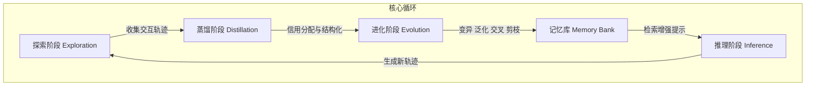

# PRIME：基于迭代记忆进化的无训练用户中心代理主动推理

## 一、论文基础元数据
- 原文标题：PRIME: Training Free Proactive Reasoning via Iterative Memory Evolution for User-Centric Agent
- 中文译版：PRIME：基于迭代记忆进化的无训练用户中心代理主动推理
- 发表渠道：预印本（arXiv）
- 发表时间：2026（根据 arXiv ID 2604 推断）
- 链接：arXiv:2604.07645
- 作者及核心机构：Prince Zizhuang Wang, Shuli Jiang（机构待补充）
- 研究领域：人工智能（一级）+ 大语言模型代理/强化学习（二级）
- 关联数据集：UserRL Benchmark（8 个环境/多语言/自动标注）

## 二、论文综合评价
### 2.1 量化评分（1-5 分，5 分为最优）

| 评价维度 | 评分 | 备注 |
| -------- | ---- | ---- |
| 📚 理论基础 | ⭐⭐⭐⭐ | 记忆进化理论扎实，结合信用分配机制 |
| 🎯 问题核心性 | ⭐⭐⭐⭐⭐ | 直击 RL 训练成本高与策略僵化痛点 |
| 💡 方法创新性 | ⭐⭐⭐⭐⭐ | 无梯度学习框架，解耦知识与参数 |
| ⚙️ 技术壁垒 | ⭐⭐⭐ | 依赖基座模型能力，算法复杂度适中 |
| 🧪 实验严谨性 | ⭐⭐⭐⭐ | 8 个基准测试，对比充分，数据诚实 |
| 🔧 落地可行性 | ⭐⭐⭐⭐⭐ | 无需训练，跨模型迁移，部署成本低 |
| 🚀 应用前景 | ⭐⭐⭐⭐ | 适合资源受限及模型权重冻结场景 |
| 📊 综合评分 | 4.3 | 高效实用的代理增强范式，性价比极高 |

### 2.2 定性综合评价（≤300 字）
> 核心概括：研究定位、核心价值、差异化优势、关键结论

本研究定位为解决用户中心型 Agent 在多轮对话中训练成本高且策略不透明的问题。核心价值在于提出了一种无需梯度更新（Training-Free）的代理优化框架 PRIME，将能力改进转化为记忆库的知识积累。差异化优势在于实现了策略的可解释性、跨模型架构的可迁移性以及显著降低的计算成本（相比 RL 减少 5-6 倍 GPU 小时）。关键结论表明，虽然绝对性能略低于全量 RL 微调，但在资源受限场景下具有极高性价比，且记忆库可作为独立资产复用。

## 三、领域本体论映射
| 核心维度 | 具体内容 |
| -------- | -------- |
| 核心研究对象 | 用户中心型大语言模型代理（User-Centric LLM Agent） |
| 核心技术路径 | 迭代记忆进化（Iterative Memory Evolution） |
| 数据/载体形态 | 结构化经验记忆库（情境 - 动作 - 结果 - 教训） |
| 核心功能目标 | 无需训练即可实现代理策略的持续主动推理与优化 |
| 验证核心指标 | 任务成功率、GPU 小时消耗、跨模型迁移性能提升 |

## 四、核心问题与解决方案
### 4.1 待解决的核心问题
1. **领域级根本问题**：动态多轮对话中，代理如何持续适应个性化用户意图而不遗忘。
2. **现有方法痛点**：基于监督微调（SFT）策略僵化；基于强化学习（RL）训练成本高、不透明、难审计。
3. **工程落地卡点**：模型权重不可修改场景下的优化难题；高算力消耗限制部署。

### 4.2 核心解决方案
- 理论框架：无梯度学习框架，将代理改进视为知识积累而非参数优化。
- 核心架构：探索 - 蒸馏 - 进化 - 推理的闭环循环。
- 关键技术：结构化记忆表示、多轮信用分配、记忆进化算子（变异/泛化/交叉/剪枝）。
- 创新机制：经验库与模型参数解耦，支持跨架构迁移。

### 4.3 核心优势（量化 + 定性）
1. 性能优势：在 8 个基准测试上均优于原始开源模型，部分任务接近闭源模型。
2. 效率优势：相比 GRPO，每个环境减少 5-6 倍 GPU 小时，无需反向传播。
3. 工程优势：记忆库可跨模型迁移（如 8B 库用于 4B 模型），支持“大建小用”。

## 五、方法与技术架构
### 5.1 核心架构设计
PRIME 框架通过四个互联阶段形成持续学习循环。首先收集交互轨迹，随后蒸馏关键决策步，接着通过元级别操作优化记忆库，最后在推理时检索记忆增强提示词。

### 5.2 关键技术实现细节
| 技术模块 | 实现路径 | 工程注意事项 |
| -------- | -------- | ------------ |
| 信用分配 | 序列依赖用 R2G，并行信息用 Equalized | 需根据环境特性动态选择策略 |
| 记忆表示 | 情境 - 动作 - 结果 - 教训，分三区管理 | 确保语义分区清晰，便于检索 |
| 记忆进化 | 变异优化清晰度，泛化实现迁移 | 防止记忆库膨胀，定期剪枝 |
| 依赖组件 | 基座 LLM（Qwen3 系列），优化器 LLM（GPT-4o） | 注意不同模型间的指令遵循差异 |

### 5.3 架构优缺点
- 优点：无需梯度更新，可解释性强，支持跨模型迁移，计算成本低。
- 缺点：绝对性能上限略低于全量参数优化的 RL 方法；依赖外部 LLM 进行记忆操作。

## 六、实验设计与结果分析
### 6.1 实验基础设置
| 维度 | 内容 |
| ---- | ---- |
| 数据集 | UserRL Benchmark（8 个环境，含 TurtleGym, FunctionGym 等） |
| 基线方法 | GPT-4o Zero-shot, ReAct, Reflexion, GRPO (RL-trained) |
| 实验环境 | 8×A100 GPU（GRPO 训练），推理仅需前向传播 |
| 评价指标 | 任务成功率、GPU 小时消耗、跨模型迁移增益 |

### 6.2 核心实验结果
| 方法 | 核心指标 1 (FunctionGym) | 核心指标 2 (TauGym) | 工程指标（算力/耗时） |
| ---- | --------- | --------- | -------------------- |
| 基线 1 (Qwen3-4B) | 基准值 | 基准值 | 低 |
| 基线 2 (GRPO Qwen3-8B) | 0.423 | 待补充 | 高 (100+ 小时) |
| 本文方法 (PRIME 4B) | 提升 218% | 提升 61% | 低 (无需训练) |

### 6.3 消融实验/鲁棒性分析
| 实验变体 | 指标变化 | 核心结论 |
| -------- | -------- | -------- |
| 跨架构迁移 (8B 库->4B 模) | 性能一致提升 | 经验库与参数解耦，具备迁移性 |
| 不同信用分配策略 | 环境适配性差异 | 序列依赖环境 R2G 更优，并行环境 Equalized 更优 |

### 6.4 实验结论（工程视角）
PRIME 在计算资源受限或模型权重冻结场景下具有显著优势。虽然绝对得分略低于 GRPO（如 FunctionGym 0.278 vs 0.423），但考虑到其无需训练且支持跨模型复用，整体性价比极高。

## 七、领域贡献与创新点
| 贡献层级 | 具体内容 |
| -------- | -------- |
| 理论贡献 | 提出无梯度学习框架，重新定义代理优化为知识积累问题 |
| 方法/架构贡献 | 设计迭代记忆进化管道，实现探索 - 蒸馏 - 进化 - 推理闭环 |
| 数据/工具贡献 | 构建结构化经验记忆库，支持语义分区与阶段标记 |
| 实验/验证贡献 | 在 8 个用户中心环境验证，证明跨模型迁移可行性 |
| 工程落地贡献 | 提供低成本、可解释、可审计的代理增强方案 |

## 八、局限性与风险
| 维度 | 具体描述 | 应对思路 |
| ---- | -------- | -------- |
| 学术局限性 | 绝对性能上限略低于全量 RL 微调方法 | 结合轻量级微调混合使用 |
| 工程落地风险 | 记忆库膨胀可能导致检索效率下降 | 实施严格的剪枝策略与索引优化 |
| 伦理/合规风险 | 记忆库可能存储敏感用户交互数据 | 增加数据脱敏与访问控制机制 |

## 九、未来研究/落地方向
| 方向类型 | 具体内容 | 优先级 |
| -------- | -------- | ------ |
| 科研拓展 | 研究记忆库与参数微调的混合优化机制 | 高 |
| 工程优化 | 优化记忆检索算法，降低推理延迟 | 高 |
| 跨领域适配 | 将框架适配至代码生成、多模态交互领域 | 中 |

## 十、关键词与术语表
| 语言 | 关键词 |
| ---- | ------ |
| 中文 | 无训练代理，记忆进化，信用分配，用户中心型代理 |
| 英文 | Training-Free Agent, Memory Evolution, Credit Assignment, User-Centric Agent |
| 领域专属术语 | Golden Zone（成功策略区）, Warning Zone（失败模式区）, Reward-to-Go（剩余累积奖励） |

## 十一、参考文献与关联资源
- 核心参考文献：待补充（原文未提供详细列表）
- 补充阅读：UserRL Benchmark 相关论文，GRPO 技术报告
- 开源代码/工具：待补充（暂未公开）

## 十二、阅读者批注
1. **科研启发**：将“参数优化”转化为“知识积累”的思路非常巧妙，避开了梯度计算的瓶颈。
2. **工程落地思考**：适合用于私有化部署场景，其中模型权重不可改，但需要持续适应特定用户习惯。
3. **待验证/存疑点**：记忆库规模增大后的检索延迟具体数据未详细披露，需进一步验证。
4. **个人/团队应用场景**：可尝试应用于客服对话系统，利用历史成功对话构建记忆库，提升新员工（小模型）表现。

## 十三、阅读元信息
| 维度 | 内容 |
| ---- | ---- |
| 阅读日期 | 2026-04-12 20:50 |
| 阅读人 | xPaperReader AI |
| 文档编号 | arxiv-2604.07645 |
| 版本迭代 | v1.0 |