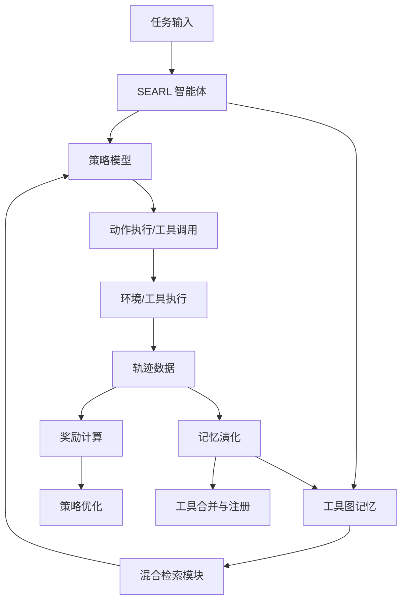

# SEARL: 面向自进化智能体的策略与工具图记忆联合优化

## 一、论文基础元数据
- 原文标题：SEARL: Joint Optimization of Policy and Tool Graph Memory for Self-Evolving Agents
- 中文译版：SEARL: 面向自进化智能体的策略与工具图记忆联合优化
- 发表渠道：预印本（arXiv）
- 发表时间：2026 年 4 月
- 链接：arXiv:2604.07791
- 作者及核心机构：Xinshun Feng, Xinhao Song, Lijun Li, Gongshen Liu, Jing Shao（机构待补充）
- 研究领域：人工智能 + 强化学习与智能体
- 关联数据集：AIME24, GSM8K, MATH500, HotpotQA, 2wiki, Bamboogle（多领域/多语言/标准标注）

## 二、论文综合评价
### 2.1 量化评分（1-5 分，5 分为最优）

| 评价维度 | 评分 | 备注 |
| -------- | ---- | ---- |
| 📚 理论基础 | ⭐⭐⭐⭐ | 结合 RL 与外部记忆，理论扎实 |
| 🎯 问题核心性 | ⭐⭐⭐⭐⭐ | 直击智能体工具复用与泛化痛点 |
| 💡 方法创新性 | ⭐⭐⭐⭐⭐ | 工具图记忆与联合优化机制新颖 |
| ⚙️ 技术壁垒 | ⭐⭐⭐⭐ | 涉及复杂奖励塑造与优势估计 |
| 🧪 实验严谨性 | ⭐⭐⭐⭐ | 多基准测试，但简单任务有开销 |
| 🔧 落地可行性 | ⭐⭐⭐ | 小模型友好，但工具管理有成本 |
| 🚀 应用前景 | ⭐⭐⭐⭐⭐ | 为通用自主智能体提供新路径 |
| 📊 综合评分 | 4.3 | 创新显著，小模型进化范式潜力大 |

### 2.2 定性综合评价（≤300 字）
> 核心概括：研究定位、核心价值、差异化优势、关键结论

本研究定位为资源受限环境下的小参数模型自我进化框架。核心价值在于打破了策略优化与外部记忆增长的隔离，提出工具图记忆结构解决工具复用难题。差异化优势在于通过工具锚点优势估计实现长程信用分配，并利用结构化记忆过滤噪声。关键结论表明，该框架在复杂数学推理和多跳问答任务上达到 SOTA 水平，证明联合优化范式能显著提升智能体的泛化能力与持续学习潜力，尽管在简单任务上存在一定开销。

## 三、领域本体论映射
| 核心维度 | 具体内容 |
| -------- | -------- |
| 核心研究对象 | 自进化智能体（Self-Evolving Agents） |
| 核心技术路径 | 强化学习联合优化工具图记忆与策略模型 |
| 数据/载体形态 | 结构化有向图（工具节点与依赖边） |
| 核心功能目标 | 自主创建工具、积累可复用技能、解决长程任务 |
| 验证核心指标 | Pass@1 准确率、平均排名、训练奖励与熵值 |

## 四、核心问题与解决方案
### 4.1 待解决的核心问题
1. **领域级根本问题**：智能体缺乏持续学习与技能积累机制，难以适应开放域复杂任务。
2. **现有方法痛点**：工具集静态化缺乏适应性，记忆非结构化导致难以复用，奖励稀疏导致信用分配困难。
3. **工程落地卡点**：小参数模型难以生成单体复杂工具，自主工具生成引入程序性噪声。

### 4.2 核心解决方案
- 理论框架：策略与记忆联合优化框架（Joint Optimization Framework）。
- 核心架构：包含工具图记忆模块与工具感知策略优化模块的双系统。
- 关键技术：混合检索（稀疏 + 稠密）、工具锚点优势估计、过程奖励塑造。
- 创新机制：动态工具注册与合并机制，基于子任务依赖的图结构演化。

### 4.3 核心优势（量化 + 定性）
1. 性能优势：多跳问答与高难数学推理平均排名最优（1.43），AIME24 达 0.3333。
2. 效率优势：结构化记忆有效过滤噪声，减少无效上下文加载与幻觉。
3. 工程优势：赋能小参数模型（如 4B）具备解决复杂长程任务的能力。

## 五、方法与技术架构
### 5.1 核心架构设计
> 文字描述 + 架构图（Mermaid/图片）

SEARL 架构由交互环境与智能体核心组成。智能体内部包含策略模型与工具图记忆。交互过程中，智能体检索工具、执行动作、收集轨迹。记忆模块根据轨迹奖励筛选并合并工具，更新图结构。策略模型利用图记忆与混合优势函数进行更新。

### 5.2 关键技术实现细节
| 技术模块 | 实现路径 | 工程注意事项 |
| -------- | -------- | ------------ |
| 工具图记忆 | 有向图存储工具节点与依赖边，基于嵌入合并相似工具 | 需维护图一致性，避免循环依赖 |
| 混合检索 | TF-IDF 稀疏检索与 Sentence-BERT 稠密检索线性加权融合 | 权重参数需调优，平衡精度与泛化 |
| 优势估计 | 步级相对优势基于工具锚点聚类，计算同工具不同轨迹效用 | 需确保锚点定义清晰，避免信用分配偏差 |
| 依赖组件 | Qwen3-4B 基座模型，all-MiniLM-L6-v2 嵌入模型 | 小模型生成工具质量需监控 |

### 5.3 架构优缺点
- 优点：结构化记忆支持技能积累，细粒度奖励提升训练稳定性，小模型友好。
- 缺点：简单任务存在工具生成开销，工具泛化性受训练上下文限制，奖励函数设计复杂。

## 六、实验设计与结果分析
### 6.1 实验基础设置
| 维度 | 内容 |
| ---- | ---- |
| 数据集 | AIME24, GSM8K, MATH500, HotpotQA, 2wiki, Bamboogle |
| 基线方法 | GRPO, DAPO, ARPO 等强化学习基线 |
| 实验环境 | 基于 Qwen3-4B 模型，LLM-as-Judge 评估 |
| 评价指标 | Pass@1 准确率，平均排名，训练奖励，熵值 |

### 6.2 核心实验结果
| 方法 | 核心指标 1 (AIME24) | 核心指标 2 (HotpotQA) | 工程指标（算力/耗时） |
| ---- | --------- | --------- | -------------------- |
| GRPO | 低于 SEARL | 低于 SEARL | 标准 RL 开销 |
| ARPO | 0.3333 (持平) | 低于 SEARL | 标准 RL 开销 |
| 本文方法 | 0.3333 (最佳) | 优于基线 | 工具管理额外开销 |

### 6.3 消融实验/鲁棒性分析
| 实验变体 | 指标变化 | 核心结论 |
| -------- | -------- | -------- |
| 移除步级分组 | 性能显著下降 | 步级分组对准确优势估计至关重要 |
| 移除步级奖励 | 性能明显下降 | 细粒度过程监督信号必不可少 |
| 移除 Single Vanishing | 影响相对较小 | 对维持整体稳定性必要但非核心 |

### 6.4 实验结论（工程视角）
SEARL 在复杂任务上表现优异，证明工具图记忆能有效隔离噪声。但在简单任务（如 GSM8K）上因工具生成引入噪声导致性能略低。工程落地需权衡任务复杂度与工具管理成本，适合高价值复杂推理场景。

## 七、领域贡献与创新点
| 贡献层级 | 具体内容 |
| -------- | -------- |
| 理论贡献 | 提出策略与外部记忆联合优化的理论框架 |
| 方法/架构贡献 | 设计工具图记忆结构与工具锚点优势估计方法 |
| 数据/工具贡献 | 构建自进化智能体训练流程与工具注册机制 |
| 实验/验证贡献 | 在多领域基准上验证了小模型自我进化的可行性 |
| 工程落地贡献 | 提供了资源受限环境下构建持续学习智能体的路径 |

## 八、局限性与风险
| 维度 | 具体描述 | 应对思路 |
| ---- | -------- | -------- |
| 学术局限性 | 简单任务上存在性能开销，工具泛化性有限 | 引入任务复杂度判断机制，动态开关工具生成 |
| 工程落地风险 | 工具质量受模型规模限制，可能难以复用 | 增加工具质量评估过滤器，人工审核关键工具 |
| 伦理/合规风险 | 奖励函数可能激励表面奖励黑客行为 | 进一步优化奖励对齐，引入人类反馈机制 |

## 九、未来研究/落地方向
| 方向类型 | 具体内容 | 优先级 |
| -------- | -------- | ------ |
| 科研拓展 | 探索更大规模模型上的工具图演化规律 | 高 |
| 工程优化 | 优化工具检索速度与图存储效率 | 高 |
| 跨领域适配 | 适配代码生成、多模态任务等其他领域 | 中 |

## 十、关键词与术语表
| 语言 | 关键词 |
| ---- | ------ |
| 中文 | 自进化智能体，工具图记忆，联合优化，强化学习，信用分配 |
| 英文 | Self-Evolving Agents, Tool Graph Memory, Joint Optimization, RL, Credit Assignment |
| 领域专属术语 | 工具锚点：用于聚类动作计算相对效用的参考点；混合检索：结合稀疏与稠密向量检索 |

## 十一、参考文献与关联资源
- 核心参考文献：待补充（原文未提供具体列表）
- 补充阅读：强化学习基础，智能体记忆机制相关综述
- 开源代码/工具：待补充（暂无公开链接）

## 十二、阅读者批注
1. **科研启发**：结构化记忆是解决长程依赖与技能复用的关键，值得在其他序列任务中推广。
2. **工程落地思考**：小模型 + 外部工具库是性价比极高的路线，但需严格控制工具生成质量。
3. **待验证/存疑点**：工具图在长期演化后是否会出现冗余或冲突，需验证清理机制。
4. **个人/团队应用场景**：适用于构建企业内部自动化运维或复杂数据分析助手。

## 十三、阅读元信息
| 维度 | 内容 |
| ---- | ---- |
| 阅读日期 | 2026-04-12 20:35 |
| 阅读人 | xPaperReader AI |
| 文档编号 | arxiv-2604.07791 |
| 版本迭代 | v1.0 |