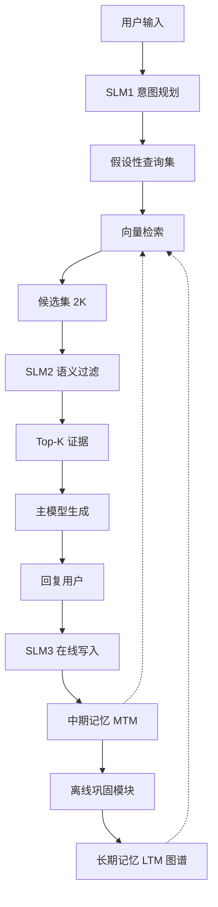

# 基于小语言模型的轻量级 LLM 代理记忆

## 一、论文基础元数据
- 原文标题：Lightweight LLM Agent Memory with Small Language Models
- 中文译版：基于小语言模型的轻量级 LLM 代理记忆
- 发表渠道：预印本（arXiv）
- 发表时间：2025
- 链接：arXiv:2604.07798
- 作者及核心机构：Jiaquan Zhang 等；机构待补充
- 研究领域：人工智能 + 大模型代理/记忆系统
- 关联数据集：LoCoMo（逻辑推理）、DialSim（长程对话）；规模待补充；语言：英文；标注：人工/自动混合

## 二、论文综合评价
### 2.1 量化评分（1-5 分，5 分为最优）

**评分格式要求**：
- 前 7 个维度：评分列使用星星形式（⭐⭐⭐⭐⭐），备注列填写该维度的简短评价依据（10-20 字）
- 综合评分：评分列使用具体数字（如 4.3、4.7），备注列填写总体评价（10-30 字）

| 评价维度 | 评分 | 备注 |
| -------- | ---- | ---- |
| 📚 理论基础 | ⭐⭐⭐⭐ | 记忆分层理论扎实，认知科学映射清晰 |
| 🎯 问题核心性 | ⭐⭐⭐⭐⭐ | 直击代理长程交互效率与准确性痛点 |
| 💡 方法创新性 | ⭐⭐⭐⭐⭐ | 在线离线解耦与 SLM 控制机制新颖 |
| ⚙️ 技术壁垒 | ⭐⭐⭐⭐ | 系统工程复杂，但模块复用性较高 |
| 🧪 实验严谨性 | ⭐⭐⭐⭐⭐ | 包含显著性检验、消融及多模型泛化 |
| 🔧 落地可行性 | ⭐⭐⭐⭐⭐ | 低延迟设计，小模型驱动，成本可控 |
| 🚀 应用前景 | ⭐⭐⭐⭐⭐ | 代理记忆是刚需，架构通用性强 |
| 📊 综合评分 | 4.7 | 架构设计优雅，实验充分，极具落地价值 |

### 2.2 定性综合评价（≤300 字）
> 核心概括：研究定位、核心价值、差异化优势、关键结论

本研究定位为解决 LLM 代理长程交互中记忆系统的效率与准确性权衡问题。核心价值在于提出 LightMem 系统，利用小语言模型（SLM）驱动轻量级记忆管理，而非依赖大模型。差异化优势采用在线 - 离线解耦架构，在线保证低延迟（83ms），离线保证知识质量。关键结论表明，该方法在多跳推理和对话一致性上显著优于 A-MEM 等基线，且上下文效率提升显著（1K vs 16K tokens），证明了小模型在代理控制层面的高效性与可行性。

## 三、领域本体论映射
| 核心维度 | 具体内容 |
| -------- | -------- |
| 核心研究对象 | LLM 代理的外部记忆系统（Memory System） |
| 核心技术路径 | 分层记忆存储 + SLM 意图控制 + 在线离线解耦 |
| 数据/载体形态 | 文本交互日志、向量嵌入、知识图谱三元组 |
| 核心功能目标 | 降低检索延迟、提高长程推理准确性、减少上下文开销 |
| 验证核心指标 | F1 分数（推理/对话）、检索延迟（ms）、上下文长度（tokens） |

## 四、核心问题与解决方案
### 4.1 待解决的核心问题
1. **领域级根本问题**：长程交互中记忆检索的噪声与延迟矛盾，大模型直接管理记忆成本过高。
2. **现有方法痛点**：检索式记忆噪声大，大模型驱动的记忆系统延迟高，上下文窗口浪费严重。
3. **工程落地卡点**：实时交互要求毫秒级响应，而高质量记忆巩固需要耗时计算，难以兼顾。

### 4.2 核心解决方案
- 理论框架：认知科学启发的三层记忆模型（STM/MTM/LTM）。
- 核心架构：在线 - 离线解耦架构，在线由 SLM 控制，离线由大模型巩固。
- 关键技术：SLM 意图分解、两阶段检索（粗检索 + 语义过滤）、图谱化长期记忆。
- 创新机制：固定预算检索控制、用户级数据隔离、异步知识巩固。

### 4.3 核心优势（量化 + 定性）
1. 性能优势：DialSim F1 达 4.12（优于 A-MEM 的 3.45），多跳推理 F1 显著提升。
2. 效率优势：检索延迟 P50 仅 83ms，有效上下文压缩至 1K tokens。
3. 工程优势：端到端延迟 581ms，支持多模型骨干泛化，系统稳定性高。

## 五、方法与技术架构
### 5.1 核心架构设计
> 文字描述 + 架构图（Mermaid/图片）

系统分为在线交互与离线巩固两条链路。在线链路包含短期记忆（STM）、中期记忆（MTM）和长期记忆（LTM），由三个 SLM 模块（意图规划、语义过滤、在线写入）控制。离线链路定期将 MTM 高价值条目抽象为 LTM 图谱知识。

### 5.2 关键技术实现细节
| 技术模块 | 实现路径 | 工程注意事项 |
| -------- | -------- | ------------ |
| SLM 意图控制 | 输入转化为结构化检索计划，含查询重写与元数据约束 | 需防止意图分解歧义导致焦点稀释 |
| 两阶段检索 | 先元数据过滤向量检索，后 SLM 语义一致性重排序 | 平衡召回率与计算开销，固定 Top-K 预算 |
| 离线巩固 | 定期批量处理 MTM 条目，抽象为去身份化图谱节点 | 异步执行，避免阻塞在线交互链路 |
| 依赖组件 | 向量数据库、知识图谱存储、SLM 推理引擎 | 需确保用户数据隔离与隐私合规 |

### 5.3 架构优缺点
- 优点：延迟极低，上下文成本低，记忆质量随时间进化，支持多跳推理。
- 缺点：小模型意图理解存在上限，模糊查询可能导致检索配额浪费，系统链路较长。

## 六、实验设计与结果分析
### 6.1 实验基础设置
| 维度 | 内容 |
| ---- | ---- |
| 数据集 | LoCoMo（逻辑推理）、DialSim（长程对话） |
| 基线方法 | A-MEM、MemGPT、MemoryBank、LoCoMo 原生 |
| 实验环境 | 多骨干模型（GPT-4o, Qwen2.5, Llama-3.2 等） |
| 评价指标 | F1 分数、语义相似度、检索延迟、上下文长度 |

### 6.2 核心实验结果
| 方法 | 核心指标 1 (DialSim F1) | 核心指标 2 (多跳 F1) | 工程指标（算力/耗时） |
| ---- | --------- | --------- | -------------------- |
| A-MEM | 3.45 | 27.02 | 检索 P95 高达 1583ms |
| MemGPT | 待补充 | 待补充 | 上下文约 16K tokens |
| 本文方法 | 4.12 | 28.85 | 检索 P50 83ms, 上下文 1K |

### 6.3 消融实验/鲁棒性分析
| 实验变体 | 指标变化 | 核心结论 |
| -------- | -------- | -------- |
| 移除 MTM 层 | F1 降至 3.75 | 中期记忆是性能核心，保留情景细节关键 |
| 移除语义重排序 | F1 降至 3.83 | 语义过滤对抑制噪声至关重要 |
| 移除图谱结构 | 相似度下降 | 图谱结构支持更好的语义关联与推理 |
| 移除离线更新 | 性能下降 | 长期知识巩固对稳定性有贡献 |

### 6.4 实验结论（工程视角）
LightMem 在显著降低计算开销（短上下文、低延迟）的前提下，实现了优于传统记忆方法的检索精度。统计显著性检验（p<0.01）证实了提升的可靠性。主要挑战在于小模型对模糊意图的分解精度，但已通过后续过滤机制缓解，适合实际部署。

## 七、领域贡献与创新点
| 贡献层级 | 具体内容 |
| -------- | -------- |
| 理论贡献 | 验证了小语言模型在代理记忆控制层面的有效性 |
| 方法/架构贡献 | 提出在线 - 离线解耦的三层记忆架构（STM/MTM/LTM） |
| 数据/工具贡献 | 提供了轻量级记忆系统实现方案与评估基准 |
| 实验/验证贡献 | 在多个骨干模型上验证了泛化性，包含显著性检验 |
| 工程落地贡献 | 实现了毫秒级检索延迟与极低上下文开销的平衡 |

## 八、局限性与风险
| 维度 | 具体描述 | 应对思路 |
| ---- | -------- | -------- |
| 学术局限性 | 专注于特定记忆管道，未充分探索替代巩固策略 | 未来可研究不同的控制政策与巩固算法 |
| 工程落地风险 | 模糊查询导致焦点稀释，影响固定预算下的检索质量 | 优化 SLM 意图分解，动态调整检索预算 |
| 伦理/合规风险 | 记忆系统涉及用户隐私数据存储与隔离 | 强化元数据约束，确保用户级数据物理隔离 |

## 九、未来研究/落地方向
| 方向类型 | 具体内容 | 优先级 |
| -------- | -------- | ------ |
| 科研拓展 | 探索更高效的 Consolidation 策略与控制政策 | 高 |
| 工程优化 | 进一步压缩 SLM 推理延迟，优化向量检索索引 | 中 |
| 跨领域适配 | 适配多模态代理记忆，支持图像/音频记忆存储 | 中 |

## 十、关键词与术语表
| 语言 | 关键词 |
| ---- | ------ |
| 中文 | 小语言模型、代理记忆、在线离线解耦、知识图谱、检索增强 |
| 英文 | Small Language Models, Agent Memory, Online-Offline Decoupling, Knowledge Graph, RAG |
| 领域专属术语 | LightMem：本文提出的轻量级记忆系统名称；MTM：中期记忆，存储个性化交互摘要；Consolidation：离线记忆巩固过程 |

## 十一、参考文献与关联资源
- 核心参考文献：待补充（原文未提供具体列表）
- 补充阅读：MemoryBank, MemGPT, A-MEM 相关论文
- 开源代码/工具：待补充（若公开）

## 十二、阅读者批注
1. **科研启发**：小模型做大模型的“控制器”而非“生成器”是降低成本的有效路径，记忆分层符合认知规律。
2. **工程落地思考**：83ms 的检索延迟极具竞争力，但需关注 SLM 意图识别错误带来的级联影响，需增加纠错机制。
3. **待验证/存疑点**：模糊查询下的焦点稀释问题在极端场景下的表现，以及离线巩固的具体触发策略。
4. **个人/团队应用场景**：适用于构建长程对话助手、个性化推荐代理、企业知识库问答系统。

## 十三、阅读元信息
| 维度 | 内容 |
| ---- | ---- |
| 阅读日期 | 2026-04-12 20:19 |
| 阅读人 | xPaperReader AI |
| 文档编号 | arxiv-2604.07798 |
| 版本迭代 | v1.0 |