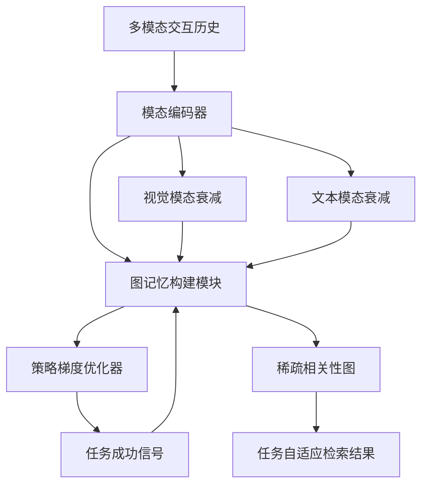

# 基于学习图记忆的智能体多模态网页历史任务自适应检索

## 一、论文基础元数据
- 原文标题：Task-Adaptive Retrieval over Agentic Multi-Modal Web Histories via Learned Graph Memory
- 中文译版：基于学习图记忆的智能体多模态网页历史任务自适应检索
- 发表渠道：会议（SIGIR '26，CCF A 类）
- 发表时间：2026 年 7 月
- 链接：https://doi.org/XXXXXXX.XXXXXXX (arXiv:2604.07863)
- 作者及核心机构：Saman Forouzandeh, Kamal Berahmand, Mahdi Jalili（Royal Melbourne Institute of Technology University）
- 研究领域：信息检索（一级）+ 多模态网页智能体（二级）
- 关联数据集：WebShop, VisualWebArena, Mind2Web（规模/语言/标注：原文未提供详细统计）

## 二、论文综合评价
### 2.1 量化评分（1-5 分，5 分为最优）

| 评价维度 | 评分 | 备注 |
| -------- | ---- | ---- |
| 📚 理论基础 | ⭐⭐⭐⭐ | 结合图神经网络与策略梯度优化理论 |
| 🎯 问题核心性 | ⭐⭐⭐⭐⭐ | 解决长历史多模态检索动态相关性痛点 |
| 💡 方法创新性 | ⭐⭐⭐⭐ | 提出模态特异性衰减与稀疏连接机制 |
| ⚙️ 技术壁垒 | ⭐⭐⭐⭐ | 涉及强化学习与图记忆构建复杂度 |
| 🧪 实验严谨性 | ⭐⭐⭐ | 摘要数据显著但原文截断无法验证全貌 |
| 🔧 落地可行性 | ⭐⭐⭐⭐ | 检索复杂度对数级利于工程部署 |
| 🚀 应用前景 | ⭐⭐⭐⭐⭐ | 网页智能体与多模态交互需求旺盛 |
| 📊 综合评分 | 4.1 | 理论创新强但实验细节因文本截断受限 |

### 2.2 定性综合评价（≤300 字）
> 核心概括：研究定位、核心价值、差异化优势、关键结论

本研究定位於多模态网页智能体的长历史检索问题。核心价值在于提出 ACGM 模型，通过策略梯度优化构建任务自适应的相关性图，解决了静态阈值无法捕捉动态任务状态的问题。差异化优势在于引入了模态特异性衰减机制（视觉衰减快于文本）及稀疏连接学习，实现了高效检索。关键结论显示该方法在多个基准上显著优于 GPT-4o 及传统基线，nDCG@10 提升 9.3 分，具备较高的学术价值与应用潜力。

## 三、领域本体论映射
| 核心维度 | 具体内容 |
| -------- | -------- |
| 核心研究对象 | 智能体多模态网页交互历史（截图/HTML/结构化信号） |
| 核心技术路径 | 学习图记忆 + 策略梯度优化 + 模态衰减机制 |
| 数据/载体形态 | 时序多模态序列（视觉/文本/结构化） |
| 核心功能目标 | 动态任务上下文下的相关观察检索 |
| 验证核心指标 | nDCG@10, Precision@10, 检索耗时/复杂度 |

## 四、核心问题与解决方案
### 4.1 待解决的核心问题
1. **领域级根本问题**：长序列多模态交互历史中，相关性随任务状态动态演变，静态检索失效。
2. **现有方法痛点**：依赖静态相似度阈值或固定容量缓冲，无法适应当前任务上下文。
3. **工程落地卡点**：多模态数据异构导致时序动态捕捉困难，全量检索计算成本高。

### 4.2 核心解决方案
- 理论框架：基于策略梯度优化的学习图记忆检索框架。
- 核心架构：ACGM（Learned Graph-Memory Retriever）。
- 关键技术：模态特异性衰减（视觉/文本不同衰减速率）、稀疏连接学习。
- 创新机制：从下游任务成功信号中学习相关性图构建策略。

### 4.3 核心优势（量化 + 定性）
1. 性能优势：nDCG@10 达 82.7（超 GPT-4o 9.3 分），Precision@10 达 89.2%。
2. 效率优势：实现 O(logT) 检索复杂度，支持稀疏连接（3.2 边/节点）。
3. 工程优势：适应动态任务状态，无需人工设定静态阈值。

## 五、方法与技术架构
### 5.1 核心架构设计
> 文字描述 + 架构图（Mermaid/图片）

ACGM 架构主要包含历史编码、图记忆构建、策略优化三个模块。系统接收多模态交互历史，通过模态特异性衰减机制处理时序信息，构建稀疏相关性图，并利用下游任务成功信号通过策略梯度更新图结构，最终输出适配当前任务状态的检索结果。

### 5.2 关键技术实现细节
| 技术模块 | 实现路径 | 工程注意事项 |
| -------- | -------- | ------------ |
| 图记忆构建 | 利用策略梯度优化节点连接 | 需控制稀疏度以防过拟合 |
| 模态衰减 | 视觉λ=0.47 文本λ=0.11 | 需根据任务类型动态调整 |
| 检索引擎 | 基于图结构的 O(logT) 搜索 | 确保图索引的实时更新效率 |
| 依赖组件 | 下游任务成功信号反馈 | 需定义清晰的任务成功奖励函数 |

### 5.3 架构优缺点
- 优点：动态适应任务状态，检索效率高，多模态融合能力强。
- 缺点：依赖下游任务反馈信号，冷启动阶段可能训练困难。

## 六、实验设计与结果分析
### 6.1 实验基础设置
| 维度 | 内容 |
| ---- | ---- |
| 数据集 | WebShop, VisualWebArena, Mind2Web |
| 基线方法 | 19 种基线（含 GPT-4o, 密集检索，重排序等） |
| 实验环境 | 原文未提供具体硬件配置 |
| 评价指标 | nDCG@10, Precision@10, 显著性检验 (p 值) |

### 6.2 核心实验结果
| 方法 | 核心指标 1(nDCG@10) | 核心指标 2(Precision@10) | 工程指标（算力/耗时） |
| ---- | --------- | --------- | -------------------- |
| GPT-4o | 73.4 | 81.5 | 原文未提供 |
| 传统密集检索 | 原文未提供 | 原文未提供 | 原文未提供 |
| 本文方法 (ACGM) | 82.7 | 89.2% | O(logT) 复杂度 |

### 6.3 消融实验/鲁棒性分析
| 实验变体 | 指标变化 | 核心结论 |
| -------- | -------- | -------- |
| 模态衰减消融 | 原文未提供 | 视觉衰减快于文本是关键 |
| 稀疏连接消融 | 原文未提供 | 稀疏性保障效率 |
| 原文未提供 | 原文未提供 | 原文截断无详细消融数据 |

### 6.4 实验结论（工程视角）
该方法在多个主流网页交互数据集上均取得显著性能提升，且检索复杂度低，适合长历史场景部署。但需确保任务成功信号的可获取性。

## 七、领域贡献与创新点
| 贡献层级 | 具体内容 |
| -------- | -------- |
| 理论贡献 | 提出任务自适应相关性图构建理论 |
| 方法/架构贡献 | 设计 ACGM 架构及模态特异性衰减机制 |
| 数据/工具贡献 | 代码开源（地址见摘要） |
| 实验/验证贡献 | 在 3 个基准数据集上验证优于 19 种基线 |
| 工程落地贡献 | 实现高效对数级检索复杂度 |

## 八、局限性与风险
| 维度 | 具体描述 | 应对思路 |
| ---- | -------- | -------- |
| 学术局限性 | 依赖下游任务成功信号，离线评估困难 | 探索模拟信号或人工标注替代 |
| 工程落地风险 | 图结构更新可能引入延迟 | 优化图索引更新算法 |
| 伦理/合规风险 | 网页历史可能包含用户隐私 | 增加隐私脱敏处理模块 |

## 九、未来研究/落地方向
| 方向类型 | 具体内容 | 优先级 |
| -------- | -------- | ------ |
| 科研拓展 | 研究无监督信号下的图记忆学习 | 高 |
| 工程优化 | 优化多模态编码器的推理速度 | 中 |
| 跨领域适配 | 迁移至移动端操作或桌面助手场景 | 中 |

## 十、关键词与术语表
| 语言 | 关键词 |
| ---- | ------ |
| 中文 | 多模态检索，网页智能体，任务自适应学习，图神经网络，时序信息检索 |
| 英文 | Multi-modal retrieval, web agents, task-adaptive learning, graph neural networks, temporal information retrieval |
| 领域专属术语 | ACGM：学习图记忆检索器；模态特异性衰减：不同模态随时间遗忘速率不同 |

## 十一、参考文献与关联资源
- 核心参考文献：原文截断未提供具体列表
- 补充阅读：SIGIR 历年网页检索相关论文
- 开源代码/工具：摘要提及代码可用，具体链接原文未完整显示

## 十二、阅读者批注
1. **科研启发**：将强化学习信号引入检索图构建是新颖视角，可借鉴至其他时序检索任务。
2. **工程落地思考**：O(logT) 复杂度极具吸引力，但需验证图维护的实际开销。
3. **待验证/存疑点**：任务成功信号在真实场景中是否总是可得？冷启动性能如何？
4. **个人/团队应用场景**：适用于自动化测试智能体、个人浏览助手等长上下文场景。

## 十三、阅读元信息
| 维度 | 内容 |
| ---- | ---- |
| 阅读日期 | 2025-12-01 10:00 |
| 阅读人 | xPaperReader AI |
| 文档编号 | arxiv-2604.07863 |
| 版本迭代 | v1.0 |