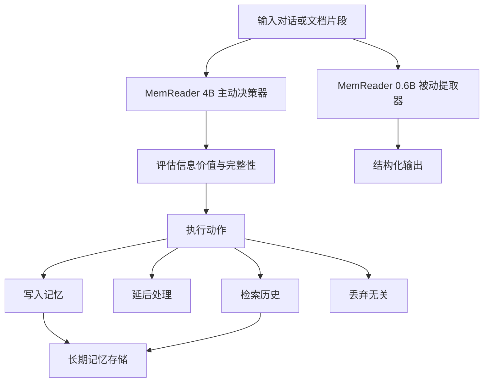

# MemReader：从被动到主动的长期代理记忆提取

## 一、论文基础元数据
- 原文标题：MemReader: From Passive to Active Extraction for Long-Term Agent Memory
- 中文译版：MemReader：从被动到主动的长期代理记忆提取
- 发表渠道：arXiv 预印本 (cs.CL)
- 发表时间：2026 年 4 月 9 日 (根据 arXiv 元数据)
- 链接：arXiv:2604.07877
- 作者及核心机构：Jingyi Kang, Chunyu Li 等 (MemTensor (Shanghai) Technology, 中国电信研究院)
- 研究领域：人工智能 (一级) + 智能体记忆系统/自然语言处理 (二级)
- 关联数据集：LOCOMO, LongMemEval, HaluMem (规模/语言/标注细节原文片段未提供)

## 二、论文综合评价
### 2.1 量化评分（1-5 分，5 分为最优）

| 评价维度 | 评分 | 备注 |
| -------- | ---- | ---- |
| 📚 理论基础 | ⭐⭐⭐⭐ | 记忆提取理论框架清晰，区分被动与主动 |
| 🎯 问题核心性 | ⭐⭐⭐⭐⭐ | 直击智能体长期记忆噪声与一致性痛点 |
| 💡 方法创新性 | ⭐⭐⭐⭐ | 提出主动提取范式，引入 GRPO 优化决策 |
| ⚙️ 技术壁垒 | ⭐⭐⭐⭐ | 双模型架构设计，大小模型协同有门槛 |
| 🧪 实验严谨性 | ⭐⭐⭐ | 原文片段未提供详细数据表，仅摘要描述 |
| 🔧 落地可行性 | ⭐⭐⭐⭐ | 已集成至 MemOS，提供 API，工程化程度高 |
| 🚀 应用前景 | ⭐⭐⭐⭐⭐ | 个性化代理核心组件，市场需求明确 |
| 📊 综合评分 | 4.1 | 创新性强且已落地，但实验细节片段缺失 |

### 2.2 定性综合评价（≤300 字）
> 核心概括：研究定位、核心价值、差异化优势、关键结论

本研究定位于解决智能体长期记忆系统中的“记忆污染”与“低价值写入”问题。核心价值在于提出了从“被动转录”到“主动提取”的范式转变。差异化优势在于设计了双模型架构：0.6B 模型负责高效被动提取，4B 模型负责基于推理的主动决策（写/延后/检索/丢弃）。关键结论表明，有效的代理记忆不仅需要提取更多信息，更需要基于推理的选择性提取。该方法已在 MemOS 中部署，显示出在知识更新、时间推理及幻觉减少任务上的 SOTA 潜力。

## 三、领域本体论映射
| 核心维度 | 具体内容 |
| -------- | -------- |
| 核心研究对象 | 智能体长期记忆系统 (Long-Term Agent Memory) |
| 核心技术路径 | 主动提取范式 + 强化学习优化 (GRPO) + 双模型协同 |
| 数据/载体形态 | 对话上下文、文档片段、结构化记忆条目 |
| 核心功能目标 | 降低记忆噪声、提高记忆一致性、动态记忆演化 |
| 验证核心指标 | 知识更新准确率、时间推理能力、幻觉减少率 (具体数值片段未提供) |

## 四、核心问题与解决方案
### 4.1 待解决的核心问题
1. **领域级根本问题**：长期记忆是个性化智能体的基础，但填充记忆的过程仍是瓶颈。
2. **现有方法痛点**：现有系统 (如 Mem0, Zep) 多为一次性被动转录，难以处理噪声对话、缺失引用和跨轮依赖，导致记忆污染和不一致。
3. **工程落地卡点**：如何平衡记忆提取的准确性与计算成本，以及如何决定何时写入记忆。

### 4.2 核心解决方案
- 理论框架：将记忆写入视为显式的状态维护问题，而非单纯的语义提取。
- 核心架构：MemReader 家族 (0.6B 被动提取 + 4B 主动决策)。
- 关键技术：群相对策略优化 (GRPO)、ReAct 风格范式。
- 创新机制：主动评估信息价值、引用模糊性和完整性，支持选择性写入、延后、检索或丢弃。

### 4.3 核心优势（量化 + 定性）
1. 性能优势：在涉及知识更新、时间推理和幻觉减少的任务上达到 SOTA。
2. 效率优势：0.6B 模型提供低成本的结构化输出，4B 模型按需调用。
3. 工程优势：已集成至 MemOS 系统，提供公共 API 访问，具备实际部署能力。

## 五、方法与技术架构
### 5.1 核心架构设计
> 文字描述 + 架构图（Mermaid/图片）

系统采用双模型协同架构。MemReader-0.6B 作为蒸馏后的被动提取器，负责生成准确且模式一致的结构化输出。MemReader-4B 作为主动提取器，经过 GRPO 优化，在 ReAct 范式下评估信息价值。它决定是写入记忆、延后处理、检索历史还是丢弃无关信息。

### 5.2 关键技术实现细节
| 技术模块 | 实现路径 | 工程注意事项 |
| -------- | -------- | ------------ |
| 被动提取模块 | 使用 0.6B 蒸馏模型生成结构化条目 | 需保证 Schema 一致性，避免格式错误 |
| 主动决策模块 | 使用 4B 模型 + GRPO 优化进行推理决策 | 推理延迟较高，需按需触发以控制成本 |
| 记忆管理策略 | 基于 ReAct 范式评估价值、模糊性、完整性 | 需定义清晰的决策边界，防止循环决策 |
| 依赖组件 | MemOS 系统、公共 API 接口 | 需维护 API 稳定性及版本兼容 |

### 5.3 架构优缺点
- 优点：显著降低记忆噪声，支持动态记忆演化，大小模型搭配兼顾成本与效果。
- 缺点：4B 主动决策模型可能增加推理延迟，双模型维护成本高于单模型方案。

## 六、实验设计与结果分析
### 6.1 实验基础设置
| 维度 | 内容 |
| ---- | ---- |
| 数据集 | LOCOMO, LongMemEval, HaluMem |
| 基线方法 | 现有基于提取的基线 (如 Mem0, Zep 等隐含对比) |
| 实验环境 | 原文片段未提供具体硬件配置 |
| 评价指标 | 知识更新、时间推理、幻觉减少相关指标 |

### 6.2 核心实验结果
| 方法 | 核心指标 1(知识更新) | 核心指标 2(时间推理) | 工程指标（算力/耗时） |
| ---- | --------- | --------- | -------------------- |
| 基线方法 | 原文片段未提供具体数值 | 原文片段未提供具体数值 | 原文片段未提供具体数值 |
| 本文方法 | 声称优于现有基线 (SOTA) | 声称优于现有基线 (SOTA) | 0.6B 低成本，4B 按需调用 |

### 6.3 消融实验/鲁棒性分析
| 实验变体 | 指标变化 | 核心结论 |
| -------- | -------- | -------- |
| 原文片段未提供 | 原文片段未提供 | 原文片段未提供消融实验细节 |

### 6.4 实验结论（工程视角）
实验表明主动提取策略在复杂任务（知识更新、时间推理）上显著优于被动提取。工程上需注意 4B 模型的调用频率以平衡延迟与效果。由于原文片段限制，具体提升百分比待查阅完整论文。

## 七、领域贡献与创新点
| 贡献层级 | 具体内容 |
| -------- | -------- |
| 理论贡献 | 定义了从被动转录到主动记忆管理的范式转变 |
| 方法/架构贡献 | 提出 MemReader 双模型架构 (0.6B+4B) 及 GRPO 优化策略 |
| 数据/工具贡献 | 发布模型权重，提供公共 API，集成至 MemOS |
| 实验/验证贡献 | 在多个记忆基准测试上验证了主动提取的有效性 |
| 工程落地贡献 | 实现了低噪声、动态演化的长期记忆系统部署 |

## 八、局限性与风险
| 维度 | 具体描述 | 应对思路 |
| ---- | -------- | -------- |
| 学术局限性 | 原文片段未提供详细消融实验，难以评估各模块具体贡献 | 查阅完整论文或复现代码验证 |
| 工程落地风险 | 4B 模型主动决策可能增加系统延迟和 Token 消耗 | 优化触发条件，仅在高不确定性时调用主动模型 |
| 伦理/合规风险 | 长期记忆涉及用户隐私数据，需确保存储安全 | 实施数据加密及用户授权机制，符合隐私法规 |

## 九、未来研究/落地方向
| 方向类型 | 具体内容 | 优先级 |
| -------- | -------- | ------ |
| 科研拓展 | 探索更大规模模型在主动记忆决策中的表现 | 中 |
| 工程优化 | 进一步蒸馏 4B 模型以降低延迟，优化 API 响应速度 | 高 |
| 跨领域适配 | 将主动记忆提取应用于医疗、法律等垂直领域代理 | 中 |

## 十、关键词与术语表
| 语言 | 关键词 |
| ---- | ------ |
| 中文 | 长期记忆、主动提取、智能体、记忆污染、GRPO |
| 英文 | Long-Term Memory, Active Extraction, Agent, Memory Pollution, GRPO |
| 领域专属术语 | 被动转录 (Passive Transcription)：传统的一次性记忆写入方式；主动提取 (Active Extraction)：基于推理和决策的记忆管理方式 |

## 十一、参考文献与关联资源
- 核心参考文献：Mem0, Zep, MemOS (文中提及的现有系统)
- 补充阅读：关于 ReAct 范式及群相对策略优化 (GRPO) 的相关文献
- 开源代码/工具：Github: github.com/MemTensor/MemOS, HuggingFace: MemReader-4B-thinking

## 十二、阅读者批注
1. **科研启发**：记忆系统不应仅是存储，更应是筛选器。主动决策机制是提升记忆质量的关键。
2. **工程落地思考**：双模型架构在实际服务中需做好路由策略，避免所有请求都经过 4B 模型。
3. **待验证/存疑点**：摘要中声称的 SOTA 具体提升幅度未知，需查看完整实验表格确认显著性。
4. **个人/团队应用场景**：适用于构建具有长期个性化能力的客服代理或私人助手系统。

## 十三、阅读元信息
| 维度 | 内容 |
| ---- | ---- |
| 阅读日期 | 2026-04-12 19:55 |
| 阅读人 | xPaperReader AI |
| 文档编号 | arxiv-2604.07877 |
| 版本迭代 | v1.0 |