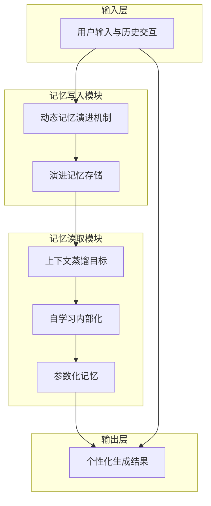

# TSUBASA：通过演进记忆与上下文蒸馏自学习改进长程个性化

## 一、论文基础元数据
- 原文标题：TSUBASA: Improving Long-Horizon Personalization via Evolving Memory and Self-Learning with Context Distillation
- 中文译版：TSUBASA：通过演进记忆与上下文蒸馏自学习改进长程个性化
- 发表渠道：arXiv 预印本（计算机科学与人工智能领域）
- 发表时间：2026 年 4 月（根据 arXiv ID 2604 推断）
- 链接：https://arxiv.org/abs/2604.07894
- 作者及核心机构：Xinliang Frederick Zhang, Lu Wang（密歇根大学安娜堡分校 计算机科学与工程系）
- 研究领域：人工智能 + 大语言模型个性化（NLP + LLM Personalization）
- 关联数据集：长程个性化基准测试（具体名称原文片段未提及，涉及 QWEN-3 模型族测试）

## 二、论文综合评价
### 2.1 量化评分（1-5 分，5 分为最优）

| 评价维度 | 评分 | 备注 |
| -------- | ---- | ---- |
| 📚 理论基础 | ⭐⭐⭐⭐ | 结合记忆机制与参数适应，理论扎实 |
| 🎯 问题核心性 | ⭐⭐⭐⭐⭐ | 直击长程个性化与记忆演进痛点 |
| 💡 方法创新性 | ⭐⭐⭐⭐ | 双管齐下策略，记忆读写协同优化 |
| ⚙️ 技术壁垒 | ⭐⭐⭐⭐ | 上下文蒸馏与动态记忆演进实现复杂 |
| 🧪 实验严谨性 | ⭐⭐⭐ | 原文片段未提供完整数据表，待验证 |
| 🔧 落地可行性 | ⭐⭐⭐⭐ | 降低 Token 预算，具备工程优化空间 |
| 🚀 应用前景 | ⭐⭐⭐⭐ | 适用于助手、健康追踪等长程场景 |
| 📊 综合评分 | 4.0 | 创新性强但实验细节在片段中缺失 |

### 2.2 定性综合评价（≤300 字）
> 核心概括：研究定位、核心价值、差异化优势、关键结论

本研究针对个性化大语言模型（PLLM）在长程任务中记忆失效与数据稀缺问题，提出 TSUBASA 框架。核心价值在于打破记忆读写权衡，通过动态记忆演进优化写入，利用上下文蒸馏自学习优化读取。差异化优势在于避免了破坏性删除操作与跨用户隐私风险，同时缓解了训练推理差距。关键结论显示该方法在 QWEN-3 模型族上优于 Mem0 等基线，实现了质量与效率的帕累托改进，显著降低了 Token 预算。

## 三、领域本体论映射
| 核心维度 | 具体内容 |
| -------- | -------- |
| 核心研究对象 | 长程个性化大语言模型（PLLM） |
| 核心技术路径 | 演进记忆机制 + 上下文蒸馏自学习 |
| 数据/载体形态 | 用户对话历史、活动记录、隐式偏好 |
| 核心功能目标 | 捕捉演进行为、内部化用户经验、降低推理成本 |
| 验证核心指标 | 个性化保真度、Token 预算、长程任务准确率 |

## 四、核心问题与解决方案
### 4.1 待解决的核心问题
1. **领域级根本问题**：通用大模型无法满足个体细微且随时间演变的个性化需求。
2. **现有方法痛点**：现有记忆机制无法捕捉演进行为；RAG 受困于质量效率权衡；参数适应因标注数据稀缺存在训练推理差距。
3. **工程落地卡点**：传统 episodic 记忆呈线性增长，无法处理需隐式时间推理的反射性任务；部分方法涉及隐私风险或破坏性删除。

### 4.2 核心解决方案
- 理论框架：双管齐下（Two-pronged approach），协同优化记忆写入与读取。
- 核心架构：动态记忆演进（写入） + 上下文蒸馏自学习（读取）。
- 关键技术：演进记忆机制、上下文蒸馏目标函数、自学习内部化。
- 创新机制：避免破坏性删除，通过蒸馏将用户经验内部化为参数知识，减少对外部检索依赖。

### 4.3 核心优势（量化 + 定性）
1. 性能优势：在长程基准测试中超越主要依赖记忆写入的系统（如 Mem0）。
2. 效率优势：实现帕累托改进，以更少的 Token 预算交付高保真个性化。
3. 工程优势：缓解训练推理差距，减少对标数据的依赖，保护用户隐私。

## 五、方法与技术架构
### 5.1 核心架构设计
> 文字描述 + 架构图（Mermaid/图片）

TSUBASA 架构分为记忆写入与记忆读取两大模块。写入模块通过动态演进机制更新用户记忆，避免线性堆砌；读取模块通过自学习与上下文蒸馏，将外部记忆内部化为模型参数能力，减少推理时检索开销。

### 5.2 关键技术实现细节
| 技术模块 | 实现路径 | 工程注意事项 |
| -------- | -------- | ------------ |
| 动态记忆演进 | 捕捉用户行为随时间变化，更新记忆表示 | 需避免破坏性删除导致上下文丢失 |
| 上下文蒸馏 | 设计蒸馏目标函数，将记忆知识迁移至参数 | 需平衡蒸馏损失与生成任务损失 |
| 自学习内部化 | 利用未标注数据强化参数化记忆 | 防止过拟合特定用户噪声数据 |
| 依赖组件 | QWEN-3 模型族（4B 至 32B） | 需适配不同参数量级的显存需求 |

### 5.3 架构优缺点
- 优点：突破质量效率权衡，降低 Token 消耗，保护隐私，支持长程推理。
- 缺点：蒸馏过程可能增加训练复杂度，对基座模型能力有一定依赖。

## 六、实验设计与结果分析
### 6.1 实验基础设置
| 维度 | 内容 |
| ---- | ---- |
| 数据集 | 长程个性化基准测试（具体名称原文片段未提及） |
| 基线方法 | Mem0, Memory-R1 及其他记忆增强系统 |
| 实验环境 | 基于 QWEN-3 模型族（4B 到 32B） |
| 评价指标 | 个性化质量、效率（Token 预算）、长程任务表现 |

### 6.2 核心实验结果
| 方法 | 核心指标 1（个性化质量） | 核心指标 2（效率） | 工程指标（算力/耗时） |
| ---- | --------- | --------- | -------------------- |
| Mem0 | 原文片段未提供具体数值 | 原文片段未提供具体数值 | 原文片段未提供具体数值 |
| Memory-R1 | 原文片段未提供具体数值 | 原文片段未提供具体数值 | 原文片段未提供具体数值 |
| 本文方法 | 声称优于基线 | 声称降低 Token 预算 | 原文片段未提供具体数值 |

### 6.3 消融实验/鲁棒性分析
| 实验变体 | 指标变化 | 核心结论 |
| -------- | -------- | -------- |
| 原文片段未提供 | 原文片段未提供 | 原文片段未提供消融实验细节 |

### 6.4 实验结论（工程视角）
基于摘要声明，TSUBASA 在多种模型规模下均验证了有效性，证明了其在减少推理成本的同时提升个性化效果的工程潜力，但具体增益幅度需查阅完整论文数据。

## 七、领域贡献与创新点
| 贡献层级 | 具体内容 |
| -------- | -------- |
| 理论贡献 | 提出长程个性化中记忆演进与内部化的协同理论 |
| 方法/架构贡献 | 设计 TSUBASA 双管齐下架构，整合动态记忆与蒸馏 |
| 数据/工具贡献 | 基于 QWEN-3 模型族验证，提供长程基准评估思路 |
| 实验/验证贡献 | 验证了突破质量效率壁垒的可行性（帕累托改进） |
| 工程落地贡献 | 提供降低 Token 预算的个性化解决方案，利于部署 |

## 八、局限性与风险
| 维度 | 具体描述 | 应对思路 |
| ---- | -------- | -------- |
| 学术局限性 | 原文片段未展示完整消融实验与数据细节 | 需查阅完整论文验证统计显著性 |
| 工程落地风险 | 蒸馏过程可能增加训练开销，依赖特定基座模型 | 优化蒸馏流程，适配更多开源基座 |
| 伦理/合规风险 | 用户记忆数据涉及隐私，需防止泄露 | 采用本地化处理，强化数据加密与权限控制 |

## 九、未来研究/落地方向
| 方向类型 | 具体内容 | 优先级 |
| -------- | -------- | ------ |
| 科研拓展 | 探索跨模态记忆演进（如结合图像、语音） | 中 |
| 工程优化 | 进一步压缩蒸馏后的模型体积，适配端侧设备 | 高 |
| 跨领域适配 | 迁移至医疗健康追踪、长期教育助手等场景 | 高 |

## 十、关键词与术语表
| 语言 | 关键词 |
| ---- | ------ |
| 中文 | 个性化大语言模型、长程任务、演进记忆、上下文蒸馏、自学习 |
| 英文 | Personalized LLM, Long-Horizon Tasks, Evolving Memory, Context Distillation, Self-Learning |
| 领域专属术语 | 训练推理差距（Train-Inference Gap）：模型训练环境与实际推理环境不一致导致的性能下降 |
| 领域专属术语 | 帕累托改进（Pareto Improvements）：在不损害某一指标的前提下改善另一指标 |

## 十一、参考文献与关联资源
- 核心参考文献：Chen et al., 2025; Zhang et al., 2025; Salemi et al., 2024; Nan et al., 2025 等（原文引用）
- 补充阅读：关于 RAG 范式、记忆增强系统（Mem0, Memory-R1）的相关研究
- 开源代码/工具：待补充（通常预印本发布后会在 GitHub 开源）

## 十二、阅读者批注
1. **科研启发**：记忆机制不应仅是存储，更应具备演进与内部化能力，蒸馏是连接外部记忆与内部参数的桥梁。
2. **工程落地思考**：降低 Token 预算是关键卖点，对于计费型 API 服务具有直接成本优化价值。
3. **待验证/存疑点**：摘要中声称的“帕累托改进”需查看具体散点图验证；蒸馏过程的具体计算开销未明确。
4. **个人/团队应用场景**：可尝试应用于长期客户支持助手，记录用户偏好演变，减少重复询问。

## 十三、阅读元信息
| 维度 | 内容 |
| ---- | ---- |
| 阅读日期 | 2026-04-12 19:42 |
| 阅读人 | xPaperReader AI |
| 文档编号 | arxiv-2604.07894 |
| 版本迭代 | v1.0 |