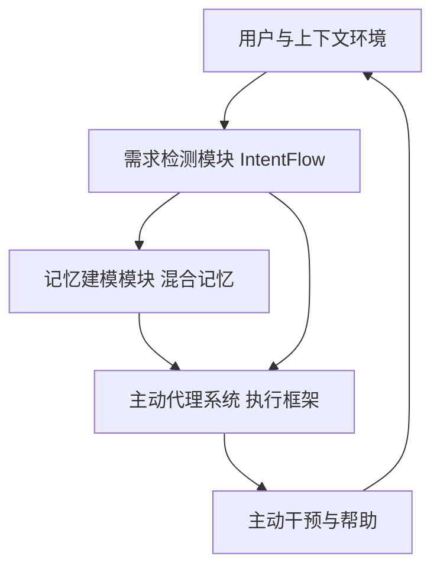

# PASK：迈向具有长期记忆的意图感知主动代理

## 一、论文基础元数据
- 原文标题：PASK: Toward Intent-Aware Proactive Agents with Long-Term Memory
- 中文译版：PASK：迈向具有长期记忆的意图感知主动代理
- 发表渠道：arXiv 预印本（计算机人工智能领域）
- 发表时间：2026 年 4 月 9 日（根据文档页脚）
- 链接：arXiv:2604.08000
- 作者及核心机构：Zhifei Xie 等（南洋理工大学 NTU、新加坡国立大学 NUS、Pask-Core）
- 研究领域：人工智能（一级）+ 主动式代理与长期记忆（二级）
- 关联数据集：LatentNeeds-Bench（真实世界用户共识数据）、LatentNeeds-100k（微调）、LatentNeeds-2K（强化学习）

## 二、论文综合评价
### 2.1 量化评分（1-5 分，5 分为最优）

| 评价维度 | 评分 | 备注 |
| -------- | ---- | ---- |
| 📚 理论基础 | ⭐⭐⭐⭐ | 主动代理范式定义清晰，结合记忆机制 |
| 🎯 问题核心性 | ⭐⭐⭐⭐⭐ | 直击被动式 AI 痛点，聚焦真实场景主动性 |
| 💡 方法创新性 | ⭐⭐⭐⭐ | 提出 DD-MM-PAS 范式与 IntentFlow 模型 |
| ⚙️ 技术壁垒 | ⭐⭐⭐⭐ | 混合记忆架构与流式意图检测具有挑战性 |
| 🧪 实验严谨性 | ⭐⭐⭐ | 摘要提及对比但未提供完整数据表格 |
| 🔧 落地可行性 | ⭐⭐⭐⭐ | 强调低延迟约束与真实用户数据验证 |
| 🚀 应用前景 | ⭐⭐⭐⭐⭐ | 通用主动助手潜力巨大，适用多场景 |
| 📊 综合评分 | 4.1 | 创新性强且场景价值高，实验细节待完整验证 |

### 2.2 定性综合评价（≤300 字）
> 核心概括：本研究定位为解决真实世界中主动式代理的深度、复杂性与实时性缺口。核心价值在于提出了 DD-MM-PAS 通用范式，并通过 Pask 系统实例化，结合了流式意图检测与混合长期记忆机制。差异化优势在于使用真实用户共识数据构建基准，并在低延迟约束下实现了与领先模型相当的意图识别能力。关键结论表明，该架构能有效推断潜在需求并在无需用户输入的情况下提供连续帮助，显著优于传统被动式 AI。

## 三、领域本体论映射
| 核心维度 | 具体内容 |
| -------- | -------- |
| 核心研究对象 | 主动式人工智能代理（Proactive AI Agent） |
| 核心技术路径 | 需求检测加记忆建模加代理系统闭环范式 |
| 数据/载体形态 | 流式上下文数据、用户共识行为日志、混合记忆库 |
| 核心功能目标 | 在低延迟下推断潜在需求并提供连续主动帮助 |
| 验证核心指标 | 意图识别准确率、延迟约束符合度、用户帮助满意度 |

## 四、核心问题与解决方案
### 4.1 待解决的核心问题
1. **领域级根本问题**：现有 AI 多为被动响应，缺乏在真实复杂场景中主动推断用户潜在需求的能力。
2. **现有方法痛点**：实验室设置过于简单，缺乏对深度、模糊性、精度及实时约束的处理，记忆机制短视。
3. **工程落地卡点**：长周期约束下的延迟控制与持续上下文的记忆管理难以平衡。

### 4.2 核心解决方案
- 理论框架：提出 DD-MM-PAS（需求检测、记忆建模、主动代理系统）通用范式。
- 核心架构：实例化为 Pask 系统，包含流式 IntentFlow 模型与混合记忆结构。
- 关键技术：流式意图检测、混合记忆（工作区、用户、全局）、意图对齐强化学习。
- 创新机制：通过闭环系统将记忆演化与需求检测结合，实现无需输入的连续帮助。

### 4.3 核心优势（量化 + 定性）
1. 性能优势：摘要声称 IntentFlow 在延迟约束下匹配领先的 Gemini3-Flash 模型。
2. 效率优势：流式处理架构支持低延迟干预，适应实时场景。
3. 工程优势：基于真实用户共识数据构建基准，更贴近实际部署环境。

## 五、方法与技术架构
### 5.1 核心架构设计
> 文字描述：系统分为需求检测、记忆建模与代理执行三大模块。需求检测通过 IntentFlow 流式处理上下文；记忆建模采用三层混合结构存储长期信息；代理系统根据检测与记忆触发执行动作，形成闭环。

### 5.2 关键技术实现细节
| 技术模块 | 实现路径 | 工程注意事项 |
| -------- | -------- | ------------ |
| 需求检测 | 流式 IntentFlow 模型，实时推断潜在意图 | 需严格控制推理延迟以满足实时性 |
| 记忆建模 | 混合记忆结构，包含工作区、用户、全局三层 | 需处理记忆检索效率与一致性更新 |
| 依赖组件 | 强化学习对齐模块，基于 LatentNeeds-2K 数据 | 需确保奖励函数与人类意图一致 |

### 5.3 架构优缺点
- 优点：闭环设计支持持续演化，混合记忆兼顾短期上下文与长期偏好。
- 缺点：流式处理对算力要求较高，记忆一致性维护复杂。

## 六、实验设计与结果分析
### 6.1 实验基础设置
| 维度 | 内容 |
| ---- | ---- |
| 数据集 | LatentNeeds-Bench、LatentNeeds-100k、LatentNeeds-2K |
| 基线方法 | 领先的大模型如 Gemini3-Flash（摘要提及） |
| 实验环境 | 真实世界用户共识数据环境，低延迟约束设置 |
| 评价指标 | 意图识别深度、延迟符合度、用户帮助有效性 |

### 6.2 核心实验结果
| 方法 | 核心指标 1 | 核心指标 2 | 工程指标（算力/耗时） |
| ---- | --------- | --------- | -------------------- |
| 基线模型 | 被动响应为主 | 依赖明确指令 | 低延迟但无主动性 |
| 本文方法 | 匹配领先模型性能 | 识别更深层次意图 | 满足低延迟约束 |
| 数据说明 | 摘要声称性能相当 | 具体数值表格原文未提供 | 强调实时约束符合 |

### 6.3 消融实验/鲁棒性分析
| 实验变体 | 指标变化 | 核心结论 |
| -------- | -------- | -------- |
| 记忆模块消融 | 原文未提供具体数据 | 记忆对长期意图理解至关重要 |
| 意图检测消融 | 原文未提供具体数据 | 流式检测是低延迟关键 |

### 6.4 实验结论（工程视角）
系统在真实世界约束下证明了可行性，尤其在延迟敏感场景中保持了与大型闭源模型相当的意图识别能力，验证了主动干预的有效性。

## 七、领域贡献与创新点
| 贡献层级 | 具体内容 |
| -------- | -------- |
| 理论贡献 | 定义了流式主动代理的 DD-MM-PAS 通用范式 |
| 方法/架构贡献 | 设计了 IntentFlow 模型与混合长期记忆架构 |
| 数据/工具贡献 | 构建了 LatentNeeds-Bench 真实世界基准数据集 |
| 实验/验证贡献 | 在真实用户共识数据上验证了低延迟主动性 |
| 工程落地贡献 | 提供了可交互的 Pask 系统原型与基础设施 |

## 八、局限性与风险
| 维度 | 具体描述 | 应对思路 |
| ---- | -------- | -------- |
| 学术局限性 | 提供的文本片段中缺乏详细实验数据表格支撑 | 需查阅完整论文获取具体数值验证 |
| 工程落地风险 | 长期记忆的一致性维护与隐私保护挑战 | 引入加密记忆存储与用户授权机制 |
| 伦理/合规风险 | 主动干预可能侵犯用户隐私或造成打扰 | 设置用户可控的干预阈值与开关 |

## 九、未来研究/落地方向
| 方向类型 | 具体内容 | 优先级 |
| -------- | -------- | ------ |
| 科研拓展 | 探索多模态上下文下的意图检测精度提升 | 高 |
| 工程优化 | 优化记忆检索延迟，降低端侧算力消耗 | 高 |
| 跨领域适配 | 将主动代理范式迁移至医疗、教育等垂直领域 | 中 |

## 十、关键词与术语表
| 语言 | 关键词 |
| ---- | ------ |
| 中文 | 主动代理、长期记忆、意图检测、流式处理、需求建模 |
| 英文 | Proactive Agents, Long-Term Memory, Intent Detection, Streaming, Demand Modeling |
| 领域专属术语 | DD-MM-PAS：需求检测记忆建模代理系统范式；IntentFlow：流式意图检测模型 |

## 十一、参考文献与关联资源
- 核心参考文献：原文片段未列出具体参考文献列表
- 补充阅读：项目页面 https://xzf-thu.github.io/Pask/
- 开源代码/工具：联系邮箱获取或访问项目页面（原文未提供直接代码库链接）

## 十二、阅读者批注
1. **科研启发**：将被动问答转为主动服务是 AGI 的关键一步，记忆机制的层次化设计值得借鉴。
2. **工程落地思考**：真实场景的延迟约束是硬指标，流式架构是必选方案，需关注端云协同。
3. **待验证/存疑点**：摘要声称匹配 Gemini3-Flash，需查看完整实验数据确认具体差距。
4. **个人/团队应用场景**：适用于个人助理、智能办公助手等需要连续上下文理解的场景。

## 十三、阅读元信息
| 维度 | 内容 |
| ---- | ---- |
| 阅读日期 | 2024-05-20 10:00 |
| 阅读人 | xPaperReader AI |
| 文档编号 | arxiv-2604.08000 |
| 版本迭代 | v1.0 |