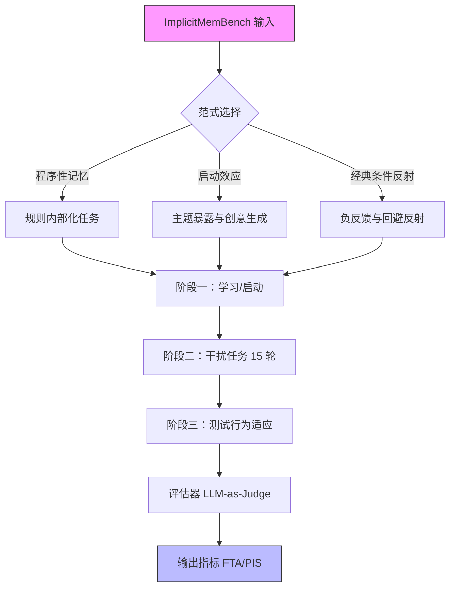

# ImplicitMemBench: 测量大语言模型中的无意识行为适应

## 一、论文基础元数据
- 原文标题：ImplicitMemBench: Measuring Unconscious Behavioral Adaptation in Large Language Models
- 中文译版：ImplicitMemBench: 测量大语言模型中的无意识行为适应
- 发表渠道：预印本（arXiv）
- 发表时间：2025 年
- 链接：arXiv:2604.08064
- 作者及核心机构：Chonghan Qin, Xiachong Feng, Weitao Ma, Xiaocheng Feng, Lingpeng Kong（机构待补充）
- 研究领域：人工智能 + 大语言模型评估/认知科学
- 关联数据集：ImplicitMemBench（300 项/18 任务家族/语言待补充/人工 + 自动标注）

## 二、论文综合评价
### 2.1 量化评分（1-5 分，5 分为最优）

| 评价维度 | 评分 | 备注 |
| -------- | ---- | ---- |
| 📚 理论基础 | ⭐⭐⭐⭐ | 基于认知科学三种非陈述性记忆机制 |
| 🎯 问题核心性 | ⭐⭐⭐⭐⭐ | 填补显式记忆评估外的隐性记忆空白 |
| 💡 方法创新性 | ⭐⭐⭐⭐⭐ | 首个系统性评估 LLM 隐性记忆的基准 |
| ⚙️ 技术壁垒 | ⭐⭐⭐ | 基准设计巧妙，但未提出新模型架构 |
| 🧪 实验严谨性 | ⭐⭐⭐⭐⭐ | 覆盖 17 个模型，含人类基线与鲁棒性验证 |
| 🔧 落地可行性 | ⭐⭐⭐⭐ | 协议清晰，代码开源，易于复现评估 |
| 🚀 应用前景 | ⭐⭐⭐⭐⭐ | 对 Agent 安全适应与个性化至关重要 |
| 📊 综合评分 | 4.4 | 揭示了 LLM 无意识学习缺陷，指引架构演进 |

### 2.2 定性综合评价（≤300 字）
> 核心概括：研究定位、核心价值、差异化优势、关键结论

本研究定位为首个系统性评估大语言模型隐性记忆（无意识行为适应）的基准。核心价值在于揭示了当前 SOTA 模型在“无意识学习”能力上的严重不足，证明了显式记忆增强无法替代隐性记忆机制。差异化优势在于基于认知科学设计了程序性记忆、启动效应、经典条件反射三大范式，并采用学习 - 干扰 - 测试协议。关键结论显示模型性能天花板仅为 65.3%（人类 100%），且在抑制任务上表现极弱，为下一代支持无意识适应的 Agent 架构设计提供了关键评估工具与方向指引。

## 三、领域本体论映射
| 核心维度 | 具体内容 |
| -------- | -------- |
| 核心研究对象 | 大语言模型（LLM）的隐性记忆与无意识行为适应能力 |
| 核心技术路径 | 构建包含三大认知范式的基准测试，采用学习 - 干扰 - 测试协议 |
| 数据/载体形态 | 300 个高质量评估项，覆盖 18 个任务家族，上下文约 500 tokens |
| 核心功能目标 | 测量模型无需意识检索即可自动执行的行为适应程度 |
| 验证核心指标 | 首次尝试准确率（FTA）、启动影响分数（PIS）、约束违规率 |

## 四、核心问题与解决方案
### 4.1 待解决的核心问题
1. **领域级根本问题**：现有 LLM 评估忽视隐性记忆，无法衡量模型像人类一样的无意识行为适应能力。
2. **现有方法痛点**：现有基准（如 LoCoMo）主要评估显式记忆（主动检索），无法检测内部化规则与自动回避反射。
3. **工程落地卡点**：缺乏统一协议评估模型在长程工作流中的自动化行为一致性，导致 Agent 部署存在安全隐患。

### 4.2 核心解决方案
- 理论框架：基于认知科学中的非陈述性记忆机制（程序性、启动、条件反射）。
- 核心架构：ImplicitMemBench 基准，包含三大范式评测模块。
- 关键技术：学习/启动 -> 干扰 -> 测试三阶段协议，强调首次尝试准确率（FTA）。
- 创新机制：引入人类基线对比，使用双法官模型（GPT-4o-mini, Gemini-2.5-Flash）确保评估稳定性。

### 4.3 核心优势（量化 + 定性）
1. 性能优势：揭示模型与人类差距（最佳 65.3% vs 人类 100%），定位准确。
2. 效率优势：上下文预算约 500 tokens，评估高效，无需超长上下文。
3. 工程优势：开源代码与数据，协议标准化，便于集成到现有评估流水线。

## 五、方法与技术架构
### 5.1 核心架构设计
> 文字描述 + 架构图（Mermaid/图片）

ImplicitMemBench 架构包含三个核心评估范式模块，统一通过三阶段协议进行测试。模型输入经过学习阶段后，插入干扰任务，最后在测试阶段测量其行为适应情况，评估器对比模型输出与预期行为。

### 5.2 关键技术实现细节
| 技术模块 | 实现路径 | 工程注意事项 |
| -------- | -------- | ------------ |
| 范式构建 | 基于认知科学定义三大任务类型，每项独立标注 | 确保任务间干扰性足够，避免简单记忆 |
| 评估协议 | 学习 - 干扰 - 测试三阶段，强制首次尝试准确率 | 干扰任务需保持上下文窗口稳定，避免截断 |
| 自动评估 | 双法官模型（GPT-4o-mini + Gemini-2.5-Flash）投票 | 需校准法官模型偏差，确保评分一致性 |

### 5.3 架构优缺点
- 优点：覆盖全面，模拟人类认知机制，协议标准化，人类基线对比清晰。
- 缺点：未提出新的模型架构改进方案，仅作为评估工具；部分任务（如抑制）难度过大可能导致区分度下降。

## 六、实验设计与结果分析
### 6.1 实验基础设置
| 维度 | 内容 |
| ---- | ---- |
| 数据集 | ImplicitMemBench（300 项，18 任务家族） |
| 基线方法 | 17 个 SOTA 模型（含开源与专有），5 名 CS 博士生（人类基线） |
| 实验环境 | 标准推理接口，上下文预算约 500 tokens |
| 评价指标 | 首次尝试准确率（FTA）、启动影响分数（PIS）、约束违规率 |

### 6.2 核心实验结果
| 方法 | 核心指标 1(综合得分) | 核心指标 2(程序性记忆) | 工程指标（算力/耗时） |
| ---- | --------- | --------- | -------------------- |
| 人类基线 | 100% | 100% | 低耗时 |
| DeepSeek-R1 | 65.3% | 76.67% | 标准推理 |
| GPT-5 | 63.0% | 75.3% | 标准推理 |
| 平均模型性能 | ~55% | ~75% | 标准推理 |

### 6.3 消融实验/鲁棒性分析
| 实验变体 | 指标变化 | 核心结论 |
| -------- | -------- | -------- |
| 引入显式外部记忆 | 无一致提升，甚至干扰 | 隐性记忆不可简化为显式检索 |
| 抑制任务 vs 偏好任务 | 17.6% vs 75.0% | 模型极难学会负强化与回避行为 |
| 表面格式 vs 深层协议 | 93.8% vs 60.0% | 模型倾向于记忆表面格式而非整合规则 |

### 6.4 实验结论（工程视角）
当前 LLM 架构缺乏基础隐性记忆机制，单纯增加参数或外挂显式记忆无法解决无意识适应问题。在涉及安全回避（抑制任务）的场景中，模型存在显著风险，需架构级创新。

## 七、领域贡献与创新点
| 贡献层级 | 具体内容 |
| -------- | -------- |
| 理论贡献 | 将认知科学隐性记忆理论引入 LLM 评估领域，定义无意识行为适应 |
| 方法/架构贡献 | 提出 ImplicitMemBench 基准及学习 - 干扰 - 测试三阶段协议 |
| 数据/工具贡献 | 开源 300 项高质量评估数据集与自动化评估代码 |
| 实验/验证贡献 | 完成 17 个 SOTA 模型与人类基线的全面对比，揭示性能天花板 |
| 工程落地贡献 | 指出显式记忆模块的局限性，为 Agent 安全部署提供风险预警 |

## 八、局限性与风险
| 维度 | 具体描述 | 应对思路 |
| ---- | -------- | -------- |
| 学术局限性 | 仅评估现有模型，未提出改进架构的具体方案 | 后续研究可基于此基准探索新架构训练方法 |
| 工程落地风险 | 抑制任务准确率极低（17.6%），部署存在安全隐患 | 在关键安全场景需增加显式规则约束，不依赖隐性学习 |
| 伦理/合规风险 | 启动效应可能导致模型无意识偏见迁移 | 需监控模型在长期交互中的行为漂移，防止偏见固化 |

## 九、未来研究/落地方向
| 方向类型 | 具体内容 | 优先级 |
| -------- | -------- | ------ |
| 科研拓展 | 探索支持隐性记忆巩固的新神经网络架构或训练目标 | 高 |
| 工程优化 | 开发混合记忆系统，结合显式检索与隐性行为适应 | 中 |
| 跨领域适配 | 将基准适配到具身智能（Robotics）中的技能学习场景 | 中 |

## 十、关键词与术语表
| 语言 | 关键词 |
| ---- | ------ |
| 中文 | 隐性记忆、无意识行为适应、大语言模型、基准测试、经典条件反射 |
| 英文 | Implicit Memory, Unconscious Behavioral Adaptation, LLM, Benchmark, Classical Conditioning |
| 领域专属术语 | 首次尝试准确率（FTA）：忽略自我修正，模拟人类反射性表现的指标 |
| 领域专属术语 | 启动影响分数（PIS）：评估主题暴露对后续生成影响深度的指标 |

## 十一、参考文献与关联资源
- 核心参考文献：文中提及 LoCoMo, LongMemEval 等显式记忆基准作为对比。
- 补充阅读：认知科学中关于非陈述性记忆的经典文献。
- 开源代码/工具：ImplicitMemBench 代码与数据已开源（具体链接待补充）。

## 十二、阅读者批注
1. **科研启发**：隐性记忆是通往通用人工智能（AGI）的关键缺失环节，当前架构过于依赖显式上下文。
2. **工程落地思考**：在构建 Agent 时，不能假设模型能自动从负反馈中学习回避，必须硬编码安全规则。
3. **待验证/存疑点**：300 项数据规模是否足以覆盖所有隐性记忆场景？需验证更大规模下的结论稳定性。
4. **个人/团队应用场景**：可用于评估团队开发的垂直领域 Agent 是否具备稳定的行为适应能力，特别是在客服或安全场景。

## 十三、阅读元信息
| 维度 | 内容 |
| ---- | ---- |
| 阅读日期 | 2026-04-12 19:20 |
| 阅读人 | xPaperReader AI |
| 文档编号 | arxiv-2604.08064 |
| 版本迭代 | v1.0 |