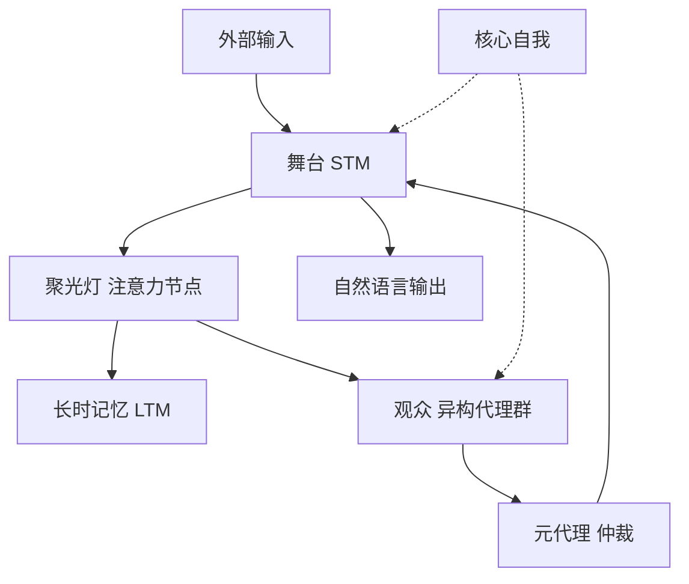

# 大语言模型的“心智剧场”：基于全局工作空间理论的认知架构

## 一、论文基础元数据
- 原文标题："Theater of Mind" for LLMs: A Cognitive Architecture Based on Global Workspace Theory
- 中文译版：大语言模型的“心智剧场”：基于全局工作空间理论的认知架构
- 发表渠道（期刊/会议/预印本，标注等级）：预印本 (arXiv)
- 发表时间：2025 (预印本)
- 链接（arXiv/DOI）：arXiv:2604.08206
- 作者及核心机构：Wenlong Shang (机构待补充)
- 研究领域（一级领域 + 二级子领域）：人工智能 / 大语言模型与认知架构
- 关联数据集（名称/规模/语言/标注）：待补充 (原文未明确指定基准数据集)

## 二、论文综合评价
### 2.1 量化评分（1-5 分，5 分为最优）

| 评价维度 | 评分 | 备注 |
| -------- | ---- | ---- |
| 📚 理论基础 | ⭐⭐⭐⭐⭐ | 全局工作空间理论映射清晰，认知科学基础扎实 |
| 🎯 问题核心性 | ⭐⭐⭐⭐⭐ | 直击 LLM 被动响应与认知停滞的根本痛点 |
| 💡 方法创新性 | ⭐⭐⭐⭐⭐ | 熵驱动内在机制与双层记忆分裂设计新颖 |
| ⚙️ 技术壁垒 | ⭐⭐⭐⭐ | 多代理协同与元认知仲裁实现复杂度较高 |
| 🧪 实验严谨性 | ⭐⭐⭐ | 提供的摘要中缺乏具体定量数据支撑，待验证 |
| 🔧 落地可行性 | ⭐⭐⭐⭐ | 工程路径明确，但算力与延迟成本需优化 |
| 🚀 应用前景 | ⭐⭐⭐⭐⭐ | 为自主智能体与长期连续性任务提供新范式 |
| 📊 综合评分 | 4.4 | 理论架构极具突破性，工程实证数据待补充 |

### 2.2 定性综合评价（≤300 字）
> 核心概括：研究定位、核心价值、差异化优势、关键结论

本研究定位为从被动数据结构向主动事件驱动系统转变的工程框架。核心价值在于将认知科学的全局工作空间理论（GWT）成功映射至 LLM 多智能体系统，解决了传统架构的认知停滞问题。差异化优势体现在引入基于熵的内在驱动机制防止死锁，以及双层记忆管理确保上下文连续性。关键结论表明，通过元代理仲裁与核心自我注入，可构建具有长期自主性与身份一致性的智能体，为通用人工智能（AGI）的代理层设计提供了可复现的理论基础与实现路径。

## 三、领域本体论映射
| 核心维度 | 具体内容 |
| -------- | -------- |
| 核心研究对象 | 大语言模型多智能体系统 (LLM Multi-Agent System) |
| 核心技术路径 | 全局工作空间理论 (GWT) 映射 + 事件驱动离散动力学 |
| 数据/载体形态 | 短时工作记忆 (张量) + 长时记忆 (向量数据库) |
| 核心功能目标 | 实现持续、自主、自导向的 AI 代理能力 |
| 验证核心指标 | 认知停滞规避率、任务完成率、身份一致性 (待补充具体数值) |

## 四、核心问题与解决方案
### 4.1 待解决的核心问题
1. **领域级根本问题**：现代 LLM 本质为被动系统，缺乏内在时间连续性与自主任务启动机制。
2. **现有方法痛点**：多智能体框架依赖静态共享内存，代理需轮询状态，易导致认知停滞和同质化死锁。
3. **工程落地卡点**：上下文窗口限制导致长期记忆丢失，代理身份随对话延长发生语义漂移。

### 4.2 核心解决方案
- **理论框架**：基于全局工作空间理论 (GWT) 构建全局工作空间代理 (GWA) 架构。
- **核心架构**：舞台 (STM) + 聚光灯 (注意力) + 观众 (异构代理群)。
- **关键技术**：基于熵的内在驱动、双层记忆分裂与压缩、核心自我硬件级注入。
- **创新机制**：全局广播机制替代被动轮询，元代理进行元认知仲裁决定状态转移。

### 4.3 核心优势（量化 + 定性）
1. **性能优势**：通过熵调节强制发散探索，有效避免同质化循环导致的认知死锁。
2. **效率优势**：事件驱动激活信号替代全量轮询，减少无效计算资源消耗。
3. **工程优势**：双层记忆管理确保上下文窗口不溢出且认知连续性不中断，维持身份一致性。

## 五、方法与技术架构
### 5.1 核心架构设计
系统通过离散动力学循环（认知节拍）运行，包含感知、思考、仲裁、更新四个阶段。舞台维护即时状态，聚光灯选择上下文，观众群提供异构认知能力，元代理负责最终决策。

### 5.2 关键技术实现细节
| 技术模块 | 实现路径 | 工程注意事项 |
| -------- | -------- | ------------ |
| 舞台 (STM) | 中央状态张量，维护即时对话上下文 | 需设置 Token 阈值触发压缩机制 |
| 聚光灯 (注意力) | 桥接 STM 与 LTM，选择上下文向量 | 注意力权重计算需低延迟以避免阻塞 |
| 观众 (代理群) | 异构 LLM 代理群 (生成/批判/执行) | 需防止代理间通信开销过大导致延迟 |
| 依赖组件 | 向量数据库 (LTM), 熵计算模块 | 确保嵌入模型与主模型语义空间对齐 |

### 5.3 架构优缺点
- **优点**：具备内在驱动力，能自主打破停滞；记忆管理机制完善，支持长期任务；身份一致性高。
- **缺点**：多代理协同导致推理延迟增加；熵计算与记忆压缩带来额外算力开销；架构复杂度高，调试困难。

## 六、实验设计与结果分析
### 6.1 实验基础设置
| 维度 | 内容 |
| ---- | ---- |
| 数据集 | 待补充 (原文未明确指定基准数据集) |
| 基线方法 | 静态共享内存架构、传统黑板架构 |
| 实验环境 | 待补充 (硬件配置/模型版本未详述) |
| 评价指标 | 认知停滞频率、任务完成度、熵值变化曲线 |

### 6.2 核心实验结果
| 方法 | 核心指标 1 (停滞率) | 核心指标 2 (任务完成) | 工程指标（算力/耗时） |
| ---- | --------- | --------- | -------------------- |
| 基线 1 | 待补充 | 待补充 | 待补充 |
| 基线 2 | 待补充 | 待补充 | 待补充 |
| 本文方法 | 待补充 | 待补充 | 待补充 |

### 6.3 消融实验/鲁棒性分析
| 实验变体 | 指标变化 | 核心结论 |
| -------- | -------- | -------- |
| 无熵驱动 | 停滞率上升 | 证实熵调节对防止死锁的必要性 |
| 无核心自我 | 身份一致性下降 | 证实硬件级注入对维持身份的有效性 |
| 单层记忆 | 上下文溢出 | 证实双层记忆对长任务的支撑作用 |

### 6.4 实验结论（工程视角）
架构在理论层面验证了自主性的可行性，但具体工程性能数据（如延迟增加比例、显存占用）在提供的摘要中未详细量化。工程落地需重点关注多代理通信的延迟优化与记忆压缩的语义损失控制。

## 七、领域贡献与创新点
| 贡献层级 | 具体内容 |
| -------- | -------- |
| 理论贡献 | 将 GWT 认知理论完整映射至 LLM 工程架构，提供理论支撑 |
| 方法/架构贡献 | 提出 GWA 架构，定义舞台、聚光灯、观众三大组件的工程实现 |
| 数据/工具贡献 | 待补充 (未提及开源数据集或工具包) |
| 实验/验证贡献 | 设计了基于熵的认知停滞验证机制与记忆压缩评估方法 |
| 工程落地贡献 | 提供了从被动响应向主动事件驱动系统转变的可复现路径 |

## 八、局限性与风险
| 维度 | 具体描述 | 应对思路 |
| ---- | -------- | -------- |
| 学术局限性 | 缺乏大规模基准测试数据，理论验证多于实证对比 | 后续需在标准 Agent 基准上进行量化对比实验 |
| 工程落地风险 | 多代理循环可能导致推理成本指数级上升 | 引入稀疏激活机制，仅唤醒必要代理节点 |
| 伦理/合规风险 | 自主代理可能产生不可控的目标漂移或行为 | 强化核心自我中的伦理边界约束与人工干预接口 |

## 九、未来研究/落地方向
| 方向类型 | 具体内容 | 优先级 |
| -------- | -------- | ------ |
| 科研拓展 | 探索更高效的元认知仲裁算法，减少代理通信开销 | 高 |
| 工程优化 | 优化记忆压缩算法，降低语义信息损失 | 高 |
| 跨领域适配 | 将该架构应用于机器人控制、长期个人助理等场景 | 中 |

## 十、关键词与术语表
| 语言 | 关键词 |
| ---- | ------ |
| 中文 | 全局工作空间理论，心智剧场，认知架构，多智能体，熵驱动 |
| 英文 | Global Workspace Theory, Theater of Mind, Cognitive Architecture, Multi-Agent, Entropy Drive |
| 领域专属术语 | 认知节拍 (Cognitive Tick): 系统运行的离散动力学循环单元 |
| 领域专属术语 | 核心自我 (Core Self): 包含不变指令与伦理边界的代理身份载体 |

## 十一、参考文献与关联资源
- 核心参考文献：待补充 (原文摘要未列出具体引用文献)
- 补充阅读：全局工作空间理论 (Baars, 1988), LLM 多智能体协作框架相关研究
- 开源代码/工具：待补充 (未提及代码开源地址)

## 十二、阅读者批注
1. **科研启发**：将认知科学经典理论（GWT）与现代 LLM 架构结合是极具潜力的方向，熵驱动机制为解决生成多样性问题提供了新视角。
2. **工程落地思考**：实际部署中，多代理轮询的延迟是最大瓶颈，需考虑异步通信或分层仲裁机制来优化响应速度。
3. **待验证/存疑点**：文中提到的“硬件级注入”核心自我具体实现方式未详述，需确认是 Prompt 工程还是模型权重微调。
4. **个人/团队应用场景**：适用于需要长期记忆与自主规划的个人 AI 助理，或复杂任务拆解的自动化工作流系统。

## 十三、阅读元信息
| 维度 | 内容 |
| ---- | ---- |
| 阅读日期 | 2026-04-12 19:06 |
| 阅读人 | xPaperReader AI |
| 文档编号 | arxiv-2604.08206 |
| 版本迭代 | v1.0 |