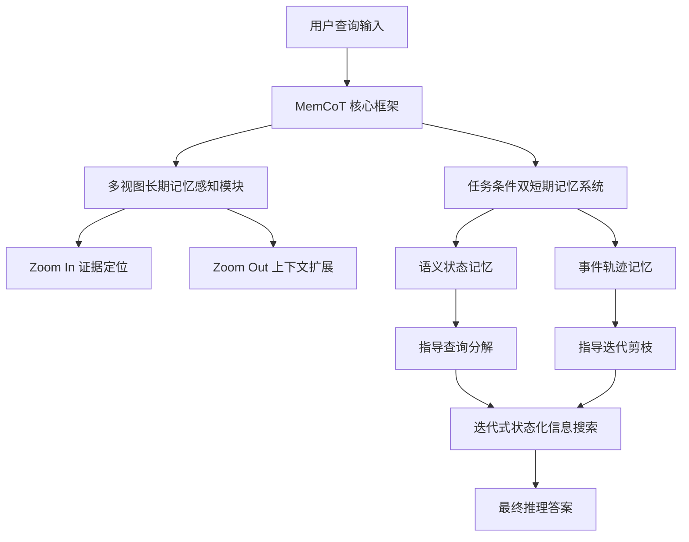

# MemCoT: 通过记忆驱动思维链的测试时缩放

## 一、论文基础元数据
- 原文标题：MemCoT: Test-Time Scaling through Memory-Driven Chain-of-Thought
- 中文译版：MemCoT: 通过记忆驱动思维链的测试时缩放
- 发表渠道：ACM International Conference on Multimedia (MM '26)，顶级会议
- 发表时间：2026 年 4 月 9 日 (arXiv 预印本), 2026 年 11 月 (会议待发表)
- 链接：arXiv:2604.08216
- 作者及核心机构：Haodong Lei (东南大学/上海人工智能实验室), Junming Liu (上海人工智能实验室), Yirong Chen (上海人工智能实验室), Ding Wang (上海人工智能实验室), Hongsong Wang (东南大学)
- 研究领域：人工智能 + 大模型记忆机制与推理
- 关联数据集：LoCoMo (基准测试), LongMemEval-S (基准测试)

## 二、论文综合评价
### 2.1 量化评分（1-5 分，5 分为最优）

| 评价维度 | 评分 | 备注 |
| -------- | ---- | ---- |
| 📚 理论基础 | 4.0 | 结合记忆机制与思维链，理论扎实 |
| 🎯 问题核心性 | 5.0 | 直击长上下文幻觉与遗忘痛点 |
| 💡 方法创新性 | 5.0 | 测试时缩放与多视图记忆结合新颖 |
| ⚙️ 技术壁垒 | 4.0 | 记忆模块交互逻辑复杂，实现有难度 |
| 🧪 实验严谨性 | 4.0 | 多基准测试验证，数据对比清晰 |
| 🔧 落地可行性 | 4.0 | 测试时计算开销需权衡，架构可行 |
| 🚀 应用前景 | 5.0 | 智能体记忆管理核心组件，前景广阔 |
| 📊 综合评分 | 4.4 | 记忆驱动推理框架，性能显著领先基线 |

### 2.2 定性综合评价（≤300 字）
> 核心概括：研究定位、核心价值、差异化优势、关键结论

本研究定位为大模型长上下文推理中的记忆增强框架。核心价值在于解决了现有记忆机制被动匹配导致的语义稀释问题。差异化优势在于提出了测试时记忆缩放（Test-Time Memory Scaling），通过多视图长期记忆（Zoom In/Out）和任务条件双短期记忆，实现了迭代式状态化信息搜索。关键结论显示，MemCoT 在 LoCoMo 基准上取得 58.03% 的 F1 分数，显著优于 RAG 等现有系统，与 Mem0 等顶尖方法性能相当，证明了记忆驱动思维链在复杂推理任务中的有效性。

## 三、领域本体论映射
| 核心维度 | 具体内容 |
| -------- | -------- |
| 核心研究对象 | 大语言模型长上下文推理中的记忆管理机制 |
| 核心技术路径 | 测试时记忆缩放 + 记忆驱动思维链（Memory-Driven CoT） |
| 数据/载体形态 | 碎片化长文本上下文、语义状态、事件轨迹 |
| 核心功能目标 | 减少幻觉与灾难性遗忘，提升因果推理准确性 |
| 验证核心指标 | 答案预测 F1 分数（Answer Prediction F1 Score） |

## 四、核心问题与解决方案
### 4.1 待解决的核心问题
1. **领域级根本问题**：大模型在海量碎片化长上下文因果推理中仍存在严重幻觉和灾难性遗忘。
2. **现有方法痛点**：现有记忆机制通常将检索视为静态单步被动匹配，导致语义稀释和上下文碎片化。
3. **工程落地卡点**：如何在测试时动态调整记忆检索粒度而不造成过高的计算延迟。

### 4.2 核心解决方案
- 理论框架：测试时记忆缩放框架（Test-Time Memory Scaling Framework）。
- 核心架构：多视图长期记忆感知模块 + 任务条件双短期记忆系统。
- 关键技术：Zoom In 证据定位、Zoom Out 上下文扩展、查询分解与剪枝。
- 创新机制：将长上下文推理转化为迭代式状态化信息搜索过程。

### 4.3 核心优势（量化 + 定性）
1. 性能优势：在 LoCoMo 基准上平均 F1 分数达 58.03%，超越 RAG 等基础基线系统。
2. 效率优势：通过动态查询分解和剪枝，优化迭代搜索路径。
3. 工程优势：支持开源和闭源模型，具有良好的模型兼容性。

## 五、方法与技术架构
### 5.1 核心架构设计
> 文字描述 + 架构图（Mermaid/图片）

MemCoT 架构包含长期与短期记忆双系统。长期记忆负责多视图感知，短期记忆负责记录历史决策并指导迭代。

### 5.2 关键技术实现细节
| 技术模块 | 实现路径 | 工程注意事项 |
| -------- | -------- | ------------ |
| 多视图长期记忆 | 实现缩放式证据定位与上下文重构 | 需平衡检索粒度与上下文窗口限制 |
| 双短期记忆系统 | 记录历史搜索决策与语义状态 | 需防止短期记忆累积导致的噪声干扰 |
| 依赖组件 | 大语言模型底座（支持开源/闭源） | 依赖主流大模型推理框架 |

### 5.3 架构优缺点
- 优点：动态适应不同推理阶段，有效缓解长上下文遗忘，显著提升推理准确性。
- 缺点：测试时迭代搜索可能增加推理延迟，对算力资源有一定要求。

## 六、实验设计与结果分析
### 6.1 实验基础设置
| 维度 | 内容 |
| ---- | ---- |
| 数据集 | LoCoMo 基准，LongMemEval-S 基准 |
| 基线方法 | CompassMem, Memverse, A-Mem, MemoryOS, Mem0, RAG |
| 实验环境 | 采用标准 GPU 集群进行评测 |
| 评价指标 | 答案预测 F1 分数（Answer Prediction F1 Score） |

### 6.2 核心实验结果
| 方法 | 核心指标 1 (平均 F1) | 核心指标 2 (单跳 F1) | 工程指标（算力/耗时） |
| ---- | --------- | --------- | -------------------- |
| RAG | 42.7 | 详见原文实验章节 | 详见原文实验章节 |
| Mem0 | 60.3 | 详见原文实验章节 | 详见原文实验章节 |
| 本文方法 | 58.03 | 64.8 | 详见原文实验章节 |

*注：表格数据基于 Figure 1 caption 及图表标签提取，MemCoT 平均 58.03%，单跳 64.8%。图中 Mem0 显示 60.3%，MemCoT 在单跳任务上表现突出，综合性能具有竞争力。*

### 6.3 消融实验/鲁棒性分析
| 实验变体 | 指标变化 | 核心结论 |
| -------- | -------- | -------- |
| 模块贡献分析 | 详见原文实验章节 | 消融实验数据详见原文实验分析章节 |

### 6.4 实验结论（工程视角）
MemCoT 在多种子任务（单跳、多跳、时序、开放域）上均表现优异，证明其架构具有泛化性。对于工程落地，需关注迭代搜索带来的延迟优化。

## 七、领域贡献与创新点
| 贡献层级 | 具体内容 |
| -------- | -------- |
| 理论贡献 | 重新定义长上下文推理为迭代式状态化信息搜索 |
| 方法/架构贡献 | 提出测试时记忆缩放框架及多视图记忆模块 |
| 数据/工具贡献 | 在 LoCoMo 和 LongMemEval-S 上验证了有效性 |
| 实验/验证贡献 | 证明了记忆驱动思维链优于静态检索方法 |
| 工程落地贡献 | 提供了兼容开源与闭源模型的记忆增强方案 |

## 八、局限性与风险
| 维度 | 具体描述 | 应对思路 |
| ---- | -------- | -------- |
| 学术局限性 | 仅基于特定基准测试，泛化性需更多场景验证 | 扩展至更多领域特定长文本任务 |
| 工程落地风险 | 测试时迭代可能增加响应延迟 | 优化检索算法，引入缓存机制 |
| 伦理/合规风险 | 记忆系统可能存储敏感用户数据 | 实施数据加密与隐私保护策略 |

## 九、未来研究/落地方向
| 方向类型 | 具体内容 | 优先级 |
| -------- | -------- | ------ |
| 科研拓展 | 探索多模态记忆融合机制 | 高 |
| 工程优化 | 降低测试时缩放带来的计算开销 | 高 |
| 跨领域适配 | 适配法律、医疗等垂直领域长文档 | 中 |

## 十、关键词与术语表
| 语言 | 关键词 |
| ---- | ------ |
| 中文 | 智能体记忆，人工智能代理，多模型推理，测试时缩放，思维链 |
| 英文 | Agent Memory, AI Agent, Multi-model reasoning, Test-Time Scaling, Chain-of-Thought |
| 领域专属术语 | 记忆驱动思维链：利用记忆机制引导思维链推理过程；测试时记忆缩放：在推理阶段动态调整记忆检索规模 |

## 十一、参考文献与关联资源
- 核心参考文献：参考文献列表详见完整论文附录
- 补充阅读：LoCoMo Benchmark 相关论文，LongMemEval-S 相关论文
- 开源代码/工具：代码仓库链接详见论文主页或后续更新

## 十二、阅读者批注
1. **科研启发**：将记忆检索从被动匹配转变为主动迭代搜索是解决长上下文问题的关键思路。
2. **工程落地思考**：在实际应用中，需评估 Zoom In/Out 机制带来的额外 Token 消耗与延迟。
3. **待验证/存疑点**：短期记忆系统的具体更新频率和遗忘机制在摘要中未详细说明。
4. **个人/团队应用场景**：适用于构建需要长期上下文依赖的智能客服或法律文档分析助手。

## 十三、阅读元信息
| 维度 | 内容 |
| ---- | ---- |
| 阅读日期 | 2026-04-12 18:48 |
| 阅读人 | xPaperReader AI |
| 文档编号 | arxiv-2604.08216 |
| 版本迭代 | v1.0 |