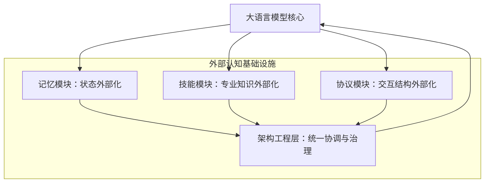

# LLM 智能体中的外部化：记忆、技能、协议与架构工程的统一综述

## 一、论文基础元数据
- 原文标题：Externalization in LLM Agents: A Unified Review of Memory, Skills, Protocols and Harness Engineering
- 中文译版：LLM 智能体中的外部化：记忆、技能、协议与架构工程的统一综述
- 发表渠道：arXiv 预印本（顶级会议投稿前版本）
- 发表时间：2026 年 4 月
- 链接：arXiv:2604.08224
- 作者及核心机构：Chenyu Zhou 等（上海交通大学、中山大学、卡内基梅隆大学、OPPO 等）
- 研究领域（一级领域 + 二级子领域）：人工智能 / 大语言模型智能体
- 关联数据集（名称/规模/语言/标注）：综述论文，未提出新数据集

## 二、论文综合评价
### 2.1 量化评分（1-5 分，5 分为最优）

| 评价维度 | 评分 | 备注 |
| -------- | ---- | ---- |
| 📚 理论基础 | ⭐⭐⭐⭐⭐ | 认知人工制品理论支撑扎实 |
| 🎯 问题核心性 | ⭐⭐⭐⭐⭐ | 直击智能体架构演进核心 |
| 💡 方法创新性 | ⭐⭐⭐⭐ | 提出外部化统一视角框架 |
| ⚙️ 技术壁垒 | ⭐⭐⭐⭐ | 系统工程整合难度较高 |
| 🧪 实验严谨性 | ⭐⭐⭐ | 综述性质，缺乏新实证数据 |
| 🔧 落地可行性 | ⭐⭐⭐⭐ | 架构工程指导意义明确 |
| 🚀 应用前景 | ⭐⭐⭐⭐⭐ | 指引智能体基础设施方向 |
| 📊 综合评分 | 4.3 | 理论框架清晰，实证需后续验证 |

### 2.2 定性综合评价（≤300 字）
> 核心概括：研究定位、核心价值、差异化优势、关键结论
本文是一篇系统性综述，定位为大语言模型智能体架构的理论框架梳理。核心价值在于提出“外部化”视角，将智能体能力从模型权重转移到运行时基础设施。差异化优势在于统一了记忆、技能、协议与架构工程四个维度，解释了为何实际进展依赖外部认知基础设施。关键结论表明，未来的智能体进化将是模型与外部架构的协同演进，而非单纯的参数规模扩张。

## 三、领域本体论映射
| 核心维度 | 具体内容 |
| -------- | -------- |
| 核心研究对象 | LLM 智能体运行时架构与外部基础设施 |
| 核心技术路径 | 能力外部化（记忆、技能、协议）与架构工程协调 |
| 数据/载体形态 | 上下文状态、存储库、交互协议、工程化封装 |
| 核心功能目标 | 将认知负担转化为模型可可靠解决的形式 |
| 验证核心指标 | 架构可靠性、执行协调性、系统演进能力 |

## 四、核心问题与解决方案
### 4.1 待解决的核心问题
1. **领域级根本问题**：智能体能力过度依赖模型内部权重，导致可靠性与扩展性受限。
2. **现有方法痛点**：缺乏统一框架理解记忆、技能与协议之间的耦合关系。
3. **工程落地卡点**：外部模块与模型之间的协调执行缺乏标准化架构工程支持。

### 4.2 核心解决方案
- 理论框架：基于认知人工制品理论的外部化视角。
- 核心架构：记忆（状态外部化）、技能（程序专业知识外部化）、协议（交互结构外部化）。
- 关键技术：架构工程作为统一协调层，管理上述模块的执行。
- 创新机制：从权重到上下文再到架构工程的历史演进逻辑分析。

### 4.3 核心优势（量化 + 定性）
1. 性能优势：通过外部化降低模型认知负担，提升任务可靠性。
2. 效率优势：复用外部技能与记忆，减少重复计算与推理开销。
3. 工程优势：提供统一的架构工程视角，便于系统治理与长期演进。

## 五、方法与技术架构
### 5.1 核心架构设计
> 文字描述 + 架构图（Mermaid/图片）
本文提出智能体外部化架构，核心在于将原本内化于模型的能力剥离至外部模块。记忆模块负责跨时间状态存储，技能模块负责程序性知识复用，协议模块规范交互结构，而架构工程层负责统一协调与治理。

### 5.2 关键技术实现细节
| 技术模块 | 实现路径 | 工程注意事项 |
| -------- | -------- | ------------ |
| 记忆模块 | 单体上下文至分层记忆编排 | 需平衡检索精度与上下文窗口限制 |
| 技能模块 | 可复用工具与程序化接口 | 需确保技能调用的安全性与兼容性 |
| 协议模块 | 标准化交互结构与通信格式 | 需定义清晰的输入输出规范 |
| 依赖组件 | 向量数据库、工具注册表、调度器 | 需保证低延迟与高可用性 |

### 5.3 架构优缺点
- 优点：解耦模型与功能，提升系统可维护性与可靠性，支持长期演进。
- 缺点：增加了系统复杂度，对外部组件的依赖可能引入新的故障点。

## 六、实验设计与结果分析
### 6.1 实验基础设置
| 维度 | 内容 |
| ---- | ---- |
| 数据集 | 综述论文，主要引用现有文献数据 |
| 基线方法 | 传统权重依赖型智能体架构 |
| 实验环境 | 原文未提供具体实验环境配置 |
| 评价指标 | 架构治理性、可靠性、演进潜力 |

### 6.2 核心实验结果
| 方法 | 核心指标 1 | 核心指标 2 | 工程指标（算力/耗时） |
| ---- | --------- | --------- | -------------------- |
| 基线 1 | 原文未提供 | 原文未提供 | 原文未提供 |
| 基线 2 | 原文未提供 | 原文未提供 | 原文未提供 |
| 本文方法 | 理论框架提出 | 无具体数值 | 依赖外部设施开销 |

### 6.3 消融实验/鲁棒性分析
| 实验变体 | 指标变化 | 核心结论 |
| -------- | -------- | -------- |
| 无消融实验 | 不适用 | 本文为理论综述，无消融设计 |

### 6.4 实验结论（工程视角）
本文主要通过理论分析与历史演进梳理得出结论，未提供具体定量实验数据。工程视角表明，外部化架构是提升智能体可靠性的必然趋势，但需权衡外部调用开销。

## 七、领域贡献与创新点
| 贡献层级 | 具体内容 |
| -------- | -------- |
| 理论贡献 | 确立外部化作为智能体演进的核心逻辑 |
| 方法/架构贡献 | 提出记忆、技能、协议与架构工程的四维框架 |
| 数据/工具贡献 | 无新数据集，提供分类学参考 |
| 实验/验证贡献 | 梳理现有文献证据，验证外部化趋势 |
| 工程落地贡献 | 指导实际智能体系统的基础设施构建 |

## 八、局限性与风险
| 维度 | 具体描述 | 应对思路 |
| ---- | -------- | -------- |
| 学术局限性 | 缺乏统一的定量评估标准验证框架有效性 | 后续需建立基准测试集 |
| 工程落地风险 | 外部组件增多导致系统延迟与故障率上升 | 优化检索与调度算法 |
| 伦理/合规风险 | 外部记忆可能存储敏感信息，存在隐私泄露风险 | 加强数据治理与访问控制 |

## 九、未来研究/落地方向
| 方向类型 | 具体内容 | 优先级 |
| -------- | -------- | ------ |
| 科研拓展 | 自我演进的架构工程与共享智能体基础设施 | 高 |
| 工程优化 | 评估标准、治理机制与模型外部设施协同进化 | 高 |
| 跨领域适配 | 将外部化框架应用于多模态与机器人领域 | 中 |

## 十、关键词与术语表
| 语言 | 关键词 |
| ---- | ------ |
| 中文 | 外部化、智能体架构、记忆工程、技能复用、协议设计 |
| 英文 | Externalization, LLM Agents, Memory Engineering, Skills, Protocols, Harness Engineering |
| 领域专属术语 | 认知人工制品：辅助人类或模型认知的外部工具或结构；架构工程：协调外部模块执行的统一层 |

## 十一、参考文献与关联资源
- 核心参考文献：原文引用了大量关于 Memory、Skills、Protocols 的现有文献（具体列表未在片段中展示）。
- 补充阅读：认知科学中关于外部认知的经典理论。
- 开源代码/工具：原文未提及具体开源代码库。

## 十二、阅读者批注
1. **科研启发**：将智能体研究重心从模型微调转向架构设计，是一个重要的范式转移信号。
2. **工程落地思考**：在实际开发中，应优先构建稳定的记忆检索与技能调用层，而非盲目追求模型参数。
3. **待验证/存疑点**：外部化带来的延迟开销在具体实时场景中的容忍度需进一步量化。
4. **个人/团队应用场景**：适用于构建企业级知识库助手及复杂任务自动化流程系统。

## 十三、阅读元信息
| 维度 | 内容 |
| ---- | ---- |
| 阅读日期 | 2026-04-12 18:38 |
| 阅读人 | xPaperReader AI |
| 文档编号 | arxiv-2604.08224 |
| 版本迭代 | v1.0 |