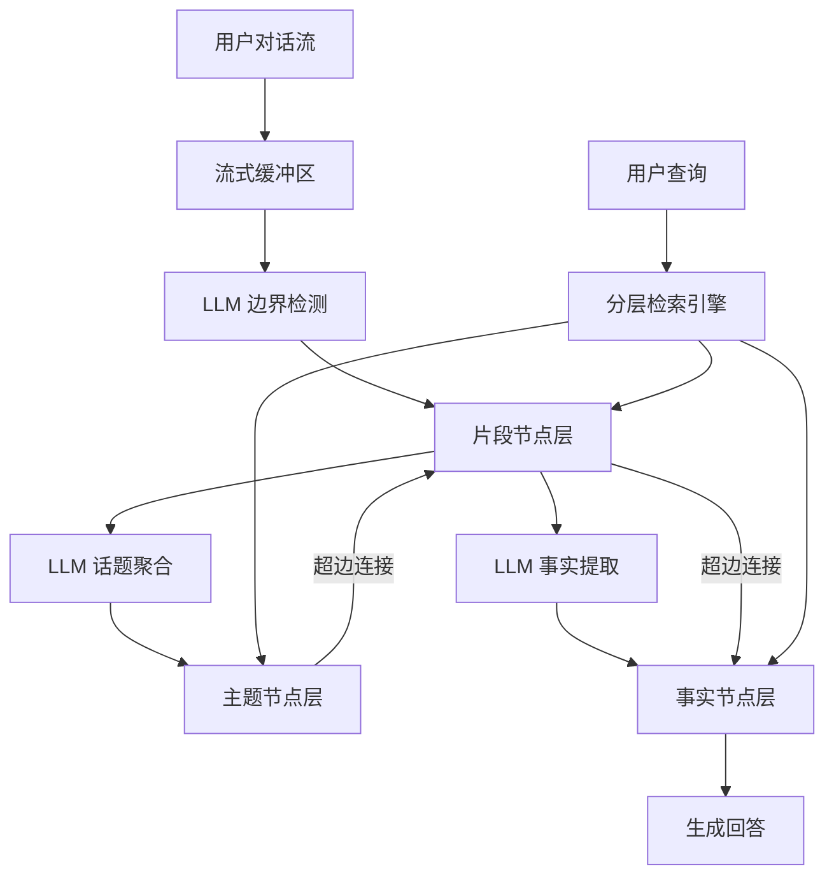

# HyperMem：用于长对话的超图记忆

## 一、论文基础元数据
- 原文标题：HyperMem: Hypergraph Memory for Long-Term Conversations
- 中文译版：HyperMem：用于长对话的超图记忆
- 发表渠道：预印本（arXiv）
- 发表时间：2025 年
- 链接：arXiv:2604.08256
- 作者及核心机构：Juwei Yue 等（原文未提供具体机构）
- 研究领域：人工智能 + 自然语言处理（长文本记忆/检索增强生成）
- 关联数据集：LoCoMo（长对话记忆基准/多语言/人工标注）

## 二、论文综合评价
### 2.1 量化评分（1-5 分，5 分为最优）

| 评价维度 | 评分 | 备注 |
| -------- | ---- | ---- |
| 📚 理论基础 | ⭐⭐⭐⭐ | 超图理论应用于记忆架构，基础扎实 |
| 🎯 问题核心性 | ⭐⭐⭐⭐⭐ | 直击长对话记忆碎片化与关联缺失痛点 |
| 💡 方法创新性 | ⭐⭐⭐⭐⭐ | 引入超边建模高阶关联，架构设计新颖 |
| ⚙️ 技术壁垒 | ⭐⭐⭐⭐ | 依赖 LLM 流式处理，工程实现复杂度较高 |
| 🧪 实验严谨性 | ⭐⭐⭐⭐⭐ | 基准测试全面，消融实验与效率分析充分 |
| 🔧 落地可行性 | ⭐⭐⭐⭐ | 支持流式处理，但 LLM 调用成本需优化 |
| 🚀 应用前景 | ⭐⭐⭐⭐⭐ | 智能体长期记忆核心组件，应用场景广阔 |
| 📊 综合评分 | 4.6 | 长对话记忆领域突破性工作，性能与效率平衡佳 |

### 2.2 定性综合评价（≤300 字）
> 核心概括：研究定位、核心价值、差异化优势、关键结论

本研究定位为解决长程对话中的记忆碎片化与高阶关联缺失问题。核心价值在于提出 HyperMem 超图记忆架构，通过主题、片段、事实三层分层结构，利用超边显式连接分散语义。差异化优势在于突破了传统 RAG 仅能处理成对关系的局限，支持跨时间证据聚合。关键结论显示，该方法在 LoCoMo 基准上准确率达 92.73%，显著优于现有 GraphRAG 及记忆系统，同时实现了更低的 Token 消耗，证明了超图结构在长上下文管理中的有效性与高效性。

## 三、领域本体论映射
| 核心维度 | 具体内容 |
| -------- | -------- |
| 核心研究对象 | 长程对话历史中的语义记忆单元 |
| 核心技术路径 | 超图结构建模 + LLM 流式处理 + 分层检索 |
| 数据/载体形态 | 结构化超图节点（主题/片段/事实）与超边 |
| 核心功能目标 | 实现高准确率、低消耗的长期记忆检索 |
| 验证核心指标 | 准确率（Accuracy）、Token 消耗量、多跳推理能力 |

## 四、核心问题与解决方案
### 4.1 待解决的核心问题
1. **领域级根本问题**：长对话中分散在不同时间的语义片段难以形成连贯的整体记忆。
2. **现有方法痛点**：传统 RAG 及图方法依赖成对关系，无法捕捉三个或更多元素间的高阶关联，导致检索碎片化。
3. **工程落地卡点**：长上下文导致 Token 消耗巨大，且离线批处理无法适应实时对话场景。

### 4.2 核心解决方案
- 理论框架：基于超图理论的分层记忆模型，显式建模高阶关联。
- 核心架构：主题（Topic）、片段（Episode）、事实（Fact）三层_hierarchy_。
- 关键技术：LLM 驱动的流式边界检测、超边聚合、双重索引（BM25+Dense）。
- 创新机制：由粗到细（Coarse-to-fine）检索策略与超图嵌入传播机制。

### 4.3 核心优势（量化 + 定性）
1. 性能优势：LoCoMo 基准准确率 92.73%，超越最强基线 6.24%。
2. 效率优势：相比基线 RAG 减少 25-35 倍 Token 消耗，性价比显著。
3. 工程优势：支持流式实时处理，具备时间锚点保留能力，适合在线代理。

## 五、方法与技术架构
### 5.1 核心架构设计
系统采用三层分层超图结构。用户对话流首先进入片段层，经检测生成 Episode 节点；随后聚合至主题层形成 Topic 节点；最后提取细粒度事实生成 Fact 节点。超边连接同一主题下的片段及同一片段下的事实。检索时从主题层开始，逐层下钻至事实层。

### 5.2 关键技术实现细节
| 技术模块 | 实现路径 | 工程注意事项 |
| -------- | -------- | ------------ |
| 片段检测 | 基于缓冲区的 LLM 语义完整性判断 | 需平衡检测延迟与语义连贯性 |
| 话题聚合 | 语义相似度检索与 LLM 分类决策 | 避免主题爆炸，需设置合并阈值 |
| 事实提取 | LLM 识别原子断言与潜在查询模式 | 确保事实独立性，减少冗余存储 |
| 依赖组件 | Qwen3-Embedding, Qwen3-Reranker, GPT-4.1-mini | 模型版本需固定以保证复现性 |

### 5.3 架构优缺点
- 优点：显式建模高阶关联，支持跨时间推理；分层检索大幅降低上下文窗口压力；流式架构适应实时交互。
- 缺点：依赖多次 LLM 调用，构建延迟较高；当前仅支持单用户场景，缺乏多代理隔离机制。

## 六、实验设计与结果分析
### 6.1 实验基础设置
| 维度 | 内容 |
| ---- | ---- |
| 数据集 | LoCoMo Benchmark（单跳/多跳/时间推理/开放域） |
| 基线方法 | GraphRAG, LightRAG, Mem0, MIRIX, OpenAI Memory |
| 实验环境 | GPT-4.1-mini 生成，GPT-4o-mini 评估 |
| 评价指标 | 准确率（Accuracy）、Token 消耗量、检索召回率 |

### 6.2 核心实验结果
| 方法 | 核心指标 1 | 核心指标 2 | 工程指标（算力/耗时） |
| ---- | --------- | --------- | -------------------- |
| GraphRAG | 67.60% | 多跳较弱 | 25-35 倍 Token 消耗 |
| MIRIX | 85.38% | 记忆系统最强 | 中等消耗 |
| 本文方法 | 92.73% | 多跳 93.62% | 7.5 倍 Token 消耗 |

### 6.3 消融实验/鲁棒性分析
| 实验变体 | 指标变化 | 核心结论 |
| -------- | -------- | -------- |
| 移除片段上下文 | 下降 3.76% | 片段层对时间推理最关键 |
| 移除主题检索 | 下降 0.72% | 主题层主要起索引引导作用 |
| 仅用事实检索 | 下降 3.25% | 证明层级协同优于单层检索 |

### 6.4 实验结论（工程视角）
片段摘要提供了关键语义指导，无法仅通过增加事实检索量来补偿。分层检索在保持高准确率的同时，显著优于传统 RAG 的性价比，适合资源受限的长对话场景。

## 七、领域贡献与创新点
| 贡献层级 | 具体内容 |
| -------- | -------- |
| 理论贡献 | 将超图理论引入对话记忆，定义高阶关联建模方法 |
| 方法/架构贡献 | 提出 Topic-Episode-Fact 三层分层记忆架构 |
| 数据/工具贡献 | 在 LoCoMo 基准上建立了新的性能标杆 |
| 实验/验证贡献 | 验证了超边结构在多跳推理与时间推理上的有效性 |
| 工程落地贡献 | 实现了流式处理与低 Token 消耗的平衡方案 |

## 八、局限性与风险
| 维度 | 具体描述 | 应对思路 |
| ---- | -------- | -------- |
| 学术局限性 | 缺乏外部知识库集成，开放域推理仍受限 | 未来可融合外部知识图谱增强常识 |
| 工程落地风险 | 依赖 LLM 进行流式构建，延迟与成本较高 | 优化小模型蒸馏，减少 LLM 调用频次 |
| 伦理/合规风险 | 单用户假设，未考虑多用户隐私隔离 | 增加访问控制模块与记忆隔离机制 |

## 九、未来研究/落地方向
| 方向类型 | 具体内容 | 优先级 |
| -------- | -------- | ------ |
| 科研拓展 | 探索多模态对话记忆的超图建模方法 | 中 |
| 工程优化 | 降低构建阶段的 LLM 调用成本与延迟 | 高 |
| 跨领域适配 | 适配多用户协作场景与复杂代理系统 | 高 |

## 十、关键词与术语表
| 语言 | 关键词 |
| ---- | ------ |
| 中文 | 超图记忆、长对话、分层检索、流式处理、高阶关联 |
| 英文 | Hypergraph Memory, Long-Term Conversations, Hierarchical Retrieval, Streaming, High-Order Associations |
| 领域专属术语 | 超边：连接任意数量节点的边；片段：时间连续的对话单元；事实：原子语义断言 |

## 十一、参考文献与关联资源
- 核心参考文献：原文未提供具体引用列表
- 补充阅读：GraphRAG, LightRAG 相关论文
- 开源代码/工具：原文未提供（待补充）

## 十二、阅读者批注
1. **科研启发**：超图结构在处理非成对依赖关系上具有天然优势，可迁移至其他长文本任务。
2. **工程落地思考**：流式构建的延迟是最大瓶颈，需考虑异步处理或边缘计算部署。
3. **待验证/存疑点**：超图嵌入传播的具体算法细节原文未完全展开，需进一步验证。
4. **个人/团队应用场景**：适用于个人助理、客服机器人等需要长期记忆用户偏好的场景。

## 十三、阅读元信息
| 维度 | 内容 |
| ---- | ---- |
| 阅读日期 | 2026-04-12 18:26 |
| 阅读人 | xPaperReader AI |
| 文档编号 | arxiv-2604.08256 |
| 版本迭代 | v1.0 |