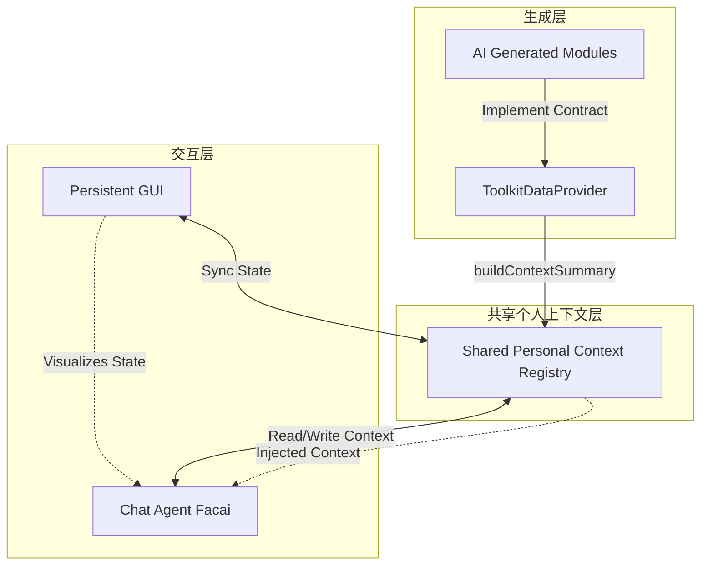

# PSI：共享状态作为个人 AI 代理中连贯 AI 生成仪器的缺失层

## 一、论文基础元数据
- 原文标题：PSI: Shared State as the Missing Layer for Coherent AI-Generated Instruments in Personal AI Agents
- 中文译版：PSI：共享状态作为个人 AI 代理中连贯 AI 生成仪器的缺失层
- 发表渠道：预印本（arXiv）
- 发表时间：2026 年
- 链接（arXiv/DOI）：arXiv:2604.08529
- 作者及核心机构：Zhiyuan Wang, Erzhen Hu, Mark Rucker, Laura E. Barnes（未知）
- 研究领域（一级领域 + 二级子领域）：计算机科学 - 人机交互/人工智能代理
- 关联数据集（名称/规模/语言/标注）：RyanHub 部署数据 / 3 周单用户日志 / 英文 / 人工评估

## 二、论文综合评价
### 2.1 量化评分（1-5 分，5 分为最优）

| 评价维度 | 评分 | 备注 |
| -------- | ---- | ---- |
| 理论基础 | 4.0 | 共享状态理论清晰，架构定义明确 |
| 问题核心性 | 5.0 | 直击个人 AI 碎片化与孤岛痛点 |
| 方法创新性 | 5.0 | 提出共享状态层作为运行时契约 |
| 技术壁垒 | 3.0 | 基于协议集成，技术实现难度中等 |
| 实验严谨性 | 4.0 | 三周单用户部署，任务设计覆盖全面 |
| 落地可行性 | 4.0 | 已有原型应用，模块扩展机制清晰 |
| 应用前景 | 5.0 | 个人代理架构演进的关键方向 |
| 综合评分 | 4.3 | 架构创新显著，实证有效，但需扩展多用户验证 |

### 2.2 定性综合评价（≤300 字）
> 核心概括：研究定位、核心价值、差异化优势、关键结论
本研究定位个人 AI 代理架构层，旨在解决 AI 生成工具碎片化与缺乏连贯性的根本问题。核心价值在于提出“共享状态层”作为缺失的运行时契约，通过标准化接口实现模块解耦集成。差异化优势在于双模态交互（GUI+Chat）同步操作同一状态，避免了传统搜索或单模块的局限。关键结论表明，共享上下文显著提升了跨模块推理能力（满足度 0.88）与状态写回可靠性（95%），证明了其作为连贯计算环境基础设施的必要性。

## 三、领域本体论映射
| 核心维度 | 具体内容 |
| -------- | -------- |
| 核心研究对象 | 个人 AI 代理中的生成式仪器（Instruments）及其互联关系 |
| 核心技术路径 | 共享状态层（Shared State Layer）+ 提供者契约（Provider Contract） |
| 数据/载体形态 | 个人上下文快照（状态摘要）、持久化 GUI 状态、聊天指令 |
| 核心功能目标 | 实现跨模块连贯推理、状态同步监控、可靠的状态写回操作 |
| 验证核心指标 | 推理满足度、任务成功率、状态修改成功率、延迟 |

## 四、核心问题与解决方案
### 4.1 待解决的核心问题
1. **领域级根本问题**：个人数字工具数据孤立，缺乏整合，导致个人 AI 无法形成连贯认知。
2. **现有方法痛点**：AI 生成的应用成为新的“孤岛”，缺乏运行时契约，模块间无法相互理解。
3. **工程落地卡点**：模块增多导致集成复杂度指数级上升，缺乏统一的上下文总线。

### 4.2 核心解决方案
- 理论框架：共享状态作为连接 AI 生成仪器的缺失层（Missing Layer）。
- 核心架构：PSI 架构（生成层、共享个人上下文层、交互层）。
- 关键技术：ToolkitDataProvider 协议、buildContextSummary 方法、双模态同步交互。
- 创新机制：模块间不直接通信，均通过 LLM 中介的共享上下文交互，实现解耦集成。

### 4.3 核心优势（量化 + 定性）
1. 性能优势：跨模块推理满足度 0.88，远超仅搜索 (0.63) 和单模块 (0.27)。
2. 效率优势：状态同步可靠，写回成功率 95%，且未带来显著延迟惩罚 (23s-29s)。
3. 工程优势：新模块只需实现协议并注册，无需与现有模块硬连线，支持优雅降级。

## 五、方法与技术架构
### 5.1 核心架构设计
PSI 架构分为三层：生成层负责创建遵循契约的模块；共享个人上下文层作为中央注册表收集状态快照；交互层提供持久化 GUI 与聊天代理的双模态入口。所有模块状态通过 LLM 中介在共享层汇聚，实现读写同步。

### 5.2 关键技术实现细节
| 技术模块 | 实现路径 | 工程注意事项 |
| -------- | -------- | ------------ |
| 提供者契约 | 定义 Swift 协议 ToolkitDataProvider，强制模块实现状态摘要方法 | 需确保摘要格式标准化，便于 LLM 解析 |
| 上下文注入 | 将状态快照作为标记块预置于每条聊天消息前 | 需控制上下文长度，避免污染或溢出 |
| 双模态同步 | GUI 与 Chat 操作同一可变状态，支持写回即时反映 | 需处理并发修改冲突，确保状态一致性 |
| 依赖组件 | RyanHub 环境、Claude Opus 4.6 (评估)、iOS 应用 | 依赖特定运行环境，跨平台适配需额外工作 |

### 5.3 架构优缺点
- 优点：集成解耦，新模块无需硬连线；状态一致性高，消除 GUI 与 Chat 孤岛；支持优雅降级。
- 缺点：上下文污染风险，过时摘要可能导致系统退化；模块增多可能引发冗余和歧义。

## 六、实验设计与结果分析
### 6.1 实验基础设置
| 维度 | 内容 |
| ---- | ---- |
| 数据集 | 单用户 3 周自传式部署数据（主动日志 + 被动传感） |
| 基线方法 | Search-Only（仅搜索）、Single-Module（单模块） |
| 实验环境 | RyanHub iOS 应用，14 个模块（6 试点 +8 生成） |
| 评价指标 | 满足度 (0-1)、任务成功率 (0/1)、延迟 (秒) |

### 6.2 核心实验结果
| 方法 | 核心指标 1(推理满足度) | 核心指标 2(任务成功率) | 工程指标（算力/耗时） |
| ---- | --------- | --------- | -------------------- |
| 基线 1(仅搜索) | 0.63 | 0.32 | 延迟相近 (23s-29s) |
| 基线 2(单模块) | 0.27 | 0.08 | 延迟相近 (23s-29s) |
| 本文方法 (共享上下文) | 0.88 | 0.68 | 延迟相近 (23s-29s) |

### 6.3 消融实验/鲁棒性分析
| 实验变体 | 指标变化 | 核心结论 |
| -------- | -------- | -------- |
| 写回动作任务 | 共享上下文 95% vs 仅搜索 40% | 共享上下文提供了临机搜索无法实现的写回路径发现能力 |
| 跨模块合成任务 | 共享上下文 1.00 vs 单模块 0 | 单模块无法完成跨域推理，共享层是必要条件 |

### 6.4 实验结论（工程视角）
共享状态层在保持低延迟的同时，显著提升了推理与动作执行的可靠性。证明了双向信息访问（读取 + 写入）是个人 AI 代理连贯性的关键，优于纯搜索方案。

## 七、领域贡献与创新点
| 贡献层级 | 具体内容 |
| -------- | -------- |
| 理论贡献 | 定义“共享状态”为个人 AI 代理中缺失的关键架构层 |
| 方法/架构贡献 | 提出 PSI 架构及 ToolkitDataProvider 集成契约 |
| 数据/工具贡献 | 开源 PSI 架构、RyanHub iOS 应用及代表模块代码 |
| 实验/验证贡献 | 提供 3 周单用户部署实证，验证跨模块推理与写回能力 |
| 工程落地贡献 | 实现了模块持久化、互联化与聊天代理的互补协作机制 |

## 八、局限性与风险
| 维度 | 具体描述 | 应对思路 |
| ---- | -------- | -------- |
| 学术局限性 | 仅为单用户、三周的概念验证，缺乏多用户泛化性 | 扩展至多用户场景，进行长期纵向研究 |
| 工程落地风险 | 模块增多导致上下文冗余，引发代理错误归因 | 优化路由选择，实施条件注入而非无条件注入 |
| 伦理/合规风险 | 个人范围操作的隐私与授权，非程序员合规模块生成 | 建立隐私授权机制，提供低代码生成工具 |

## 九、未来研究/落地方向
| 方向类型 | 具体内容 | 优先级 |
| -------- | -------- | ------ |
| 科研拓展 | 大规模模块路由机制、个人范围操作隐私研究 | 高 |
| 工程优化 | 上下文注入优化（减少冗余）、跨平台适配 | 中 |
| 跨领域适配 | 适配企业级代理、多用户协作场景 | 低 |

## 十、关键词与术语表
| 语言 | 关键词 |
| ---- | ------ |
| 中文 | 共享状态、个人 AI 代理、仪器连贯性、运行时契约、双模态交互 |
| 英文 | Shared State, Personal AI Agents, Instrument Coherence, Runtime Contract, Dual-Modality |
| 领域专属术语 | 仪器 (Instrument)：持久、连接、聊天互补的个人工具模块；提供者契约 (Provider Contract)：模块集成的标准协议 |

## 十一、参考文献与关联资源
- 核心参考文献：未知（文中未列出具体引用文献列表）
- 补充阅读：关于 Personal AI Agents 架构的相关研究
- 开源代码/工具：PSI 架构、RyanHub iOS 应用（计划发布）

## 十二、阅读者批注
1. **科研启发**：共享状态层的提出为解决 Agent 碎片化提供了新范式，类似操作系统的进程间通信。
2. **工程落地思考**：协议标准化是关键，需平衡上下文长度与信息完整性，避免 LLM 注意力分散。
3. **待验证/存疑点**：多用户场景下状态冲突如何解决？上下文污染的具体阈值是多少？
4. **个人/团队应用场景**：可用于构建个人健康管理助手，整合运动、饮食、日历数据，实现自动化建议。

## 十三、阅读元信息
| 维度 | 内容 |
| ---- | ---- |
| 阅读日期 | 2026-04-12 17:55 |
| 阅读人 | xPaperReader AI |
| 文档编号 | arxiv-2604.08529 |
| 版本迭代 | v1.0 |