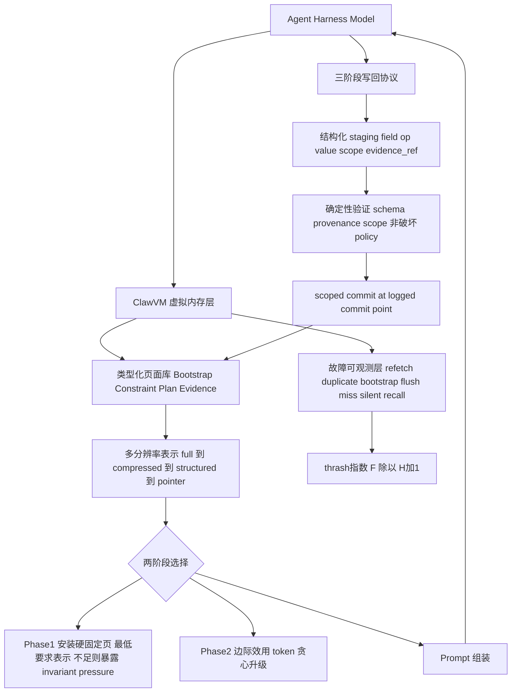

# ClawVM：面向有状态工具调用式LLM智能体的Harness托管虚拟内存

## 一、论文基础元数据
- **原文标题**：ClawVM: Harness-Managed Virtual Memory for Stateful Tool-Using LLM Agents
- **中文译版**：ClawVM：面向有状态工具调用式LLM智能体的Harness托管虚拟内存
- **发表渠道**：预印本（arXiv，推测为系统/体系结构方向会议投稿，如OSDI/EuroSys/SOSP档位，等级待补充）
- **发表时间**：2025（arXiv ID 2604.10352，具体日期待补充）
- **链接**：arXiv:2604.10352；开源代码 https://github.com/mpi-dsg/clawvm
- **作者及核心机构**：Mofasshara Rafique、Laurent Bindschaedler（据代码仓库归属推断为马克斯·普朗克软件系统研究所 MPI-SWS 数据系统组，具体待补充）
- **研究领域**：一级领域——计算机系统（Computer Systems）；二级子领域——LLM智能体运行时/上下文与记忆管理系统、虚拟内存与持久化机制
- **关联数据集**：
  - 12条真实 Claude Code 会话轨迹（转为replay workload，覆盖 coding、research、DevOps、trading、ML ops、web scraping、写作、邮件、产品设计等；100轮/200轮，预算300）
  - 30个合成任务（含 debugging 类）
  - 20个实时单会话生产级Agent任务
  - 对抗场景工作负载（churn、cascade reset、starvation）
  - 语言：英文；标注：策略可控故障标签、显式故障计数、thrash指数（标注体系为论文自定义）

## 二、论文综合评价

### 2.1 量化评分

| 评价维度 | 评分 | 备注 |
| -------- | ---- | ---- |
| 📚 理论基础 | ⭐⭐⭐⭐⭐ | OS缺页异常类比扎实，fault model形式化清晰 |
| 🎯 问题核心性 | ⭐⭐⭐⭐⭐ | 直击有状态Agent上下文生命周期丢失痛点 |
| 💡 方法创新性 | ⭐⭐⭐⭐⭐ | 用运行时契约替代启发式调参，范式转变 |
| ⚙️ 技术壁垒 | ⭐⭐⭐⭐ | 系统级机制完整，但概念可复现、门槛中等 |
| 🧪 实验严谨性 | ⭐⭐⭐⭐ | 多负载多预算+oracle对照，但live样本偏小 |
| 🔧 落地可行性 | ⭐⭐⭐⭐ | 开销μs级、内存<83KB，可包装现有框架 |
| 🚀 应用前景 | ⭐⭐⭐⭐ | 面向Agent基础设施，普适性高 |
| 📊 综合评分 | 4.4 | 从启发式到契约式，系统级消除Agent可控记忆故障 |

### 2.2 定性综合评价（≤300字）
> 本文定位为 **harness级 enforcement layer**，而非新型记忆框架。核心价值在于把有状态工具型Agent的上下文驻留与写回从"模型/提示工程尽力而为"升级为确定性、可审计、可回放的运行时契约，从而结构性消除策略可控故障（refetch、duplicate-tool、bootstrap、flush-miss、silent-recall）。差异化优势：通过类型化页面、最低保真不变量、多分辨率表示与三阶段验证写回，在生命周期边界强制正确性，而非依赖更聪明的升级启发式。关键结论：在4 workload×6预算、12条真实轨迹、30合成任务及对抗场景下ClawVM实现零策略可控故障，匹配离线oracle；开销仅18–44 μs/turn、峰值内存<83 KB；LRU替换utility scoring与权重扫描仍零故障，证明鲁棒性来自结构约束而非调参。

## 三、领域本体论映射

| 核心维度 | 具体内容 |
| -------- | -------- |
| 核心研究对象 | 有状态工具调用式LLM Agent的上下文驻留与持久化生命周期 |
| 核心技术路径 | 借鉴OS虚拟内存：类型化页面、最低保真不变量、多分辨率驻留、两阶段选择、三阶段验证写回 |
| 数据/载体形态 | 类型化页面（Bootstrap/Policy、Constraint、Plan、Preference、Evidence、Conversation Segment）；四级表示 full→compressed→structured→pointer |
| 核心功能目标 | 在compaction/reset等生命周期边界保证状态不丢失、不被破坏、可审计、可回放 |
| 验证核心指标 | 显式故障计数（policy-controllable faults）、thrash指数 F/(H+1)、成功率、μs级开销、峰值内存 |

## 四、核心问题与解决方案

### 4.1 待解决的核心问题
1. **领域级根本问题**：现有Agent harness将上下文窗口当工作内存，但驻留与写回是best-effort，harness与其所管理状态之间缺少明确契约，导致记忆故障反复出现。
2. **现有方法痛点**：
   - compaction后状态丢失、reset时未flush导致脏状态静默消失
   - 破坏性写回、重复工具调用与refetch
   - bootstrap/policy页面被驱逐后Agent"忘记协议"
   - 故障是"静默的"，无插桩时harness无法检测，只能靠regeneration恢复
3. **工程落地卡点**：检索式（Retrieval）故障随会话长度近似线性增长；压缩混合式（Comp-Hybrid）在短会话仍有flush-miss、长会话结构缺陷未消除；缺乏可观测的故障分类与量化指标。

### 4.2 核心解决方案
- **理论框架**：Agent故障模型（类比OS缺页异常），划分为working-set faults（refetch、duplicate-tool、pinned-invariant-miss、post-compaction bootstrap）与durability faults（silent-recall、flush-miss），均为策略可控故障。
- **核心架构**：harness托管的虚拟内存层，将所有token置于类型化页面，页面有最低表示级别（如Constraint硬固定为structured，Evidence pointer须可确定性解析）。
- **关键技术**：四级多分辨率驻留、两阶段选择策略、三阶段写回协议、故障可观测与thrash指数。
- **创新机制**：表示在页面创建时预先构建，预算压力下仅做查表与token算术，不触发运行时LLM压缩；写回全程验证（schema/provenance/scope/非破坏性/policy-safety）并在显式logged commit point确定性合并。

### 4.3 核心优势（量化+定性）
1. **性能优势**：全部预算（120–500）下零策略可控故障，匹配离线oracle（h=3）；对比Retrieval显式故障67.8→0、thrash降77.4%；对比Comp-Hybrid故障1.5→0、thrash降11.4%；最紧预算120时Comp-Hybrid有26个故障而ClawVM为0。
2. **效率优势**：中位18–44 μs/turn，p95<60 μs，峰值内存<83 KB；live场景耗时16.6s vs Comp-Hybrid 16.9s，开销可忽略。
3. **工程优势**：可包装MemGPT/AIOS/MemOS等系统，与LLMLingua-2、RAGCache、Mem0、Cognee等正交；fault model与replay oracle可独立用于评估替代策略；代码数据已开源。

## 五、方法与技术架构

### 5.1 核心架构设计
> ClawVM 位于应用层 Agent harness 与底层记忆/工具之间，充当"虚拟内存管理层"。页面创建时即生成多分辨率表示；每轮Prompt组装时由两阶段选择器决定驻留级别；每轮结束/生命周期边界经三阶段写回协议验证并提交；全过程记录paging events与hits以计算thrash。

### 5.2 关键技术实现细节

| 技术模块 | 实现路径 | 工程注意事项 |
| -------- | -------- | ------------ |
| 类型化页面与最低保真不变量 | 六类页面，每类定义最低表示级别；Constraint硬固定structured，Evidence pointer须确定性可解析 | 类型/级别定义须完备，遗漏将导致不变量失效 |
| 多分辨率驻留 | 页面创建时预生成full→compressed→structured→pointer四级，压力下仅查表与token算术 | 创建期成本前置，避免运行时触发LLM压缩 |
| 两阶段选择策略 | Phase1安装硬固定页与最低表示并暴露invariant pressure；Phase2按边际效用/token贪心升级（效用含pin、bootstrap、plan、recency、scope、recompute cost） | 最小集放不下须显式告警而非静默降级 |
| 三阶段写回协议 | 结构化staging→确定性验证（schema/provenance/scope/非破坏/policy）→scoped commit，拒绝码如SCOPE_DENIED、DESTRUCTIVE_OP | commit点须显式logged，保证可回放 |
| 故障可观测与thrash指数 | 插桩记录显式故障与paging events，thrash=F/(H+1)，改编自Denning(1968) | 无插桩则故障静默，须全程埋点 |
| 依赖组件 | 底层Agent harness、工具运行时、记忆/检索后端（Mem0、Cognee、RAGCache等正交组件） | 非确定性工具需记录并回放真实输出 |

### 5.3 架构优缺点
- **优点**：结构约束保证安全，故障消除不依赖启发式调参；开销极低、可包装现有系统、故障可观测可回放、可扩展至multi-agent。
- **缺点**：不验证语义正确性（模型生成更新的事实正确性）；replay假设工具可模拟，非确定性服务需额外记录；live与多会话部署验证不足。

## 六、实验设计与结果分析

### 6.1 实验基础设置

| 维度 | 内容 |
| ---- | ---- |
| 数据集 | 12条真实Claude Code会话轨迹（100/200轮，预算300）、30个合成任务、20个实时单会话任务、对抗工作负载（churn/cascade reset/starvation）、4 workload×6 token预算（120–500） |
| 基线方法 | Retrieval-only、Comp-Hybrid、离线oracle（h=3）、LRU替换baseline |
| 实验环境 | 生产级Agent harness；replay评测框架；具体硬件配置待补充 |
| 评价指标 | 显式故障计数、thrash指数F/(H+1)、成功率、μs/turn开销、峰值内存、p95延迟 |

### 6.2 核心实验结果

| 方法 | 核心指标1（显式故障） | 核心指标2（thrash） | 工程指标（算力/耗时） |
| ---- | --------- | --------- | -------------------- |
| Retrieval-only（100轮） | 51 (49–77) | 0.677 | 待补充 |
| Retrieval-only（200轮） | 83 (71–109) | 0.527 | 待补充 |
| Comp-Hybrid（100轮） | 1 (1–1) | 0.047 | live平均16.9s，20/20成功 |
| Comp-Hybrid（200轮） | 0 (0–0) | 0.029 | 结构缺陷仍存 |
| 本文方法 ClawVM（100/200轮） | 0 (0–0) | 0.032 | 中位18–44 μs/turn，p95<60 μs，峰值<83 KB；live 16.6s，20/20成功 |

### 6.3 消融实验/鲁棒性分析

| 实验变体 | 指标变化 | 核心结论 |
| -------- | -------- | -------- |
| 移除upgrade scoring / prefetch | 无故障 | 结构约束已保证安全，评分仅优化质量 |
| LRU替换utility scoring | 零故障，thrash相同 | 故障消除与替换策略无关 |
| utility权重扫描（84 runs） | 全部零故障且thrash相同 | 对权重不敏感，鲁棒性来自结构 |
| 对抗：churn / cascade reset | ClawVM零故障 | 生命周期边界结构保证有效 |
| 对抗：starvation | 所有策略10个pinned-invariant-miss | 物理预算不足不在策略可控范围 |
| 合成任务（30个，预算180） | ClawVM 100%，Comp-Hybrid 76.7% | 7个失败均因compaction驱逐未保护bootstrap页 |

### 6.4 实验结论（工程视角）
ClawVM 在真实长会话、合成任务与对抗场景中稳定消除显式故障，并匹配离线oracle，说明故障计数已无剩余改进空间。其安全性与鲁棒性归因于enforcement layer的结构约束，而非启发式调参——LRU替换与权重扫描仍零故障即为佐证。开销为μs级、内存<83 KB，与Comp-Hybrid相当，工程上可直接包装现有Agent框架；物理预算不足（starvation）与语义错误超出其可控制边界，需单独处理。

## 七、领域贡献与创新点

| 贡献层级 | 具体内容 |
| -------- | -------- |
| 理论贡献 | 提出Agent故障模型（working-set faults / durability faults），形式化为可观测、策略可控的类型；将Agent记忆问题从"换缓存策略"提升为"建立harness-state契约" |
| 方法/架构贡献 | harness托管虚拟内存层：类型化页面、最低保真不变量、多分辨率驻留、两阶段选择、三阶段验证写回 |
| 数据/工具贡献 | 开源代码/数据/脚本（github.com/mpi-dsg/clawvm）；fault model与replay oracle可作为通用评测工具 |
| 实验/验证贡献 | 4 workload×6预算+12真实轨迹+30合成+对抗+live的全面评测；oracle对照证明故障计数无剩余改进空间 |
| 工程落地贡献 | μs级低开销、<83KB内存；可包装MemGPT/AIOS/MemOS等，与LLMLingua-2/RAGCache/Mem0/Cognee正交 |

## 八、局限性与风险

| 维度 | 具体描述 | 应对思路 |
| ---- | -------- | -------- |
| 学术局限性 | 语义正确性不在范围，仅验证schema/provenance/scope/非破坏性；replay假设工具可模拟；外部有效性有限（live仅单会话，跨会话生命周期仅replay验证） | 引入语义校验层；记录并回放非确定性工具输出；扩展多会话在线部署与用户可见指标 |
| 工程落地风险 | 类型与最低保真不变量定义不完备可能引入新故障；无插桩则故障静默；非确定性服务回放困难 | 完善页面类型体系；全链路埋点；对非确定性接口做确定性封装 |
| 伦理/合规风险 | 写回验证不校验事实正确性，可能提交错误但格式合法的状态；持久化敏感数据涉及隐私与审计要求 | 增加事实性校验与人工审计点；对敏感字段做访问控制与合规日志（论文未专门讨论，属推断） |

## 九、未来研究/落地方向

| 方向类型 | 具体内容 | 优先级 |
| -------- | -------- | ------ |
| 科研拓展 | 与live models的端到端评估；多会话部署；扩展至multi-agent orchestrators | 高 |
| 工程优化 | 引入语义正确性验证；完善非确定性工具的回放机制；扩大多会话在线验证规模 | 高 |
| 跨领域适配 | 与MemGPT/AIOS/MemOS/Text2Mem/Memory OS等系统集成；与LLMLingua-2、RAGCache、Mem0、Cognee、QMD等正交组件协同 | 中 |

## 十、关键词与术语表

| 语言 | 关键词 |
| ---- | ------ |
| 中文 | 有状态工具调用LLM智能体、Harness托管虚拟内存、类型化页面、最低保真不变量、多分辨率驻留、两阶段选择、三阶段写回、Agent故障模型、thrash指数、策略可控故障 |
| 英文 | Stateful Tool-Using LLM Agent, Harness-Managed Virtual Memory, Typed Pages, Minimum-Fidelity Invariants, Multi-Resolution Residency, Two-Phase Selection, Three-Phase Writeback, Agent Fault Model, Thrash Index, Policy-Controllable Faults |
| 领域专属术语 | **harness**：包裹LLM的运行框架，管理上下文与工具调用；**typed page**：带类型与最低表示级别的状态页；**minimum-fidelity invariant**：每类页面必须满足的最低表示保真要求；**working-set fault**：驻留失败导致的状态缺失；**durability fault**：生命周期边界处的状态丢失；**silent-recall fault**：lookup返回空但后端实际拒绝访问/报错；**flush-miss**：脏页在提交前因上下文销毁而丢失；**thrash index**：F/(H+1)，paging event与hits之比，衡量工作集/预算不匹配；**invariant pressure**：最小页集放不下时的显式告警 |

## 十一、参考文献与关联资源
- **核心参考文献**：Denning (1968) 经典thrashing ratio（thrash指数改编来源）；MemGPT、AIOS、MemOS、Memory OS、Text2Mem（可被ClawVM包装的记忆系统）
- **补充阅读**：LLMLingua-2、RAGCache、Mem0、Cognee、QMD（正交组件）
- **开源代码/工具**：https://github.com/mpi-dsg/clawvm（源码、数据、脚本）

## 十二、阅读者批注
1. **科研启发**：将OS经典机制（虚拟内存/缺页/工作集）迁移到Agent上下文管理，以"契约"而非"启发式"保证正确性，这一视角转换值得复用到其他Agent可靠性问题（如工具调用一致性、并发状态管理）。fault model与replay oracle可独立作为评测基准。
2. **工程落地思考**：μs级开销与<83KB内存使其几乎无侵入，可优先在长会话、多工具、需审计的Agent产品中试点；关键是先把页面类型体系与最低保真不变量落地到位，并做全链路埋点。
3. **待验证/存疑点**：语义正确性完全不在范围，是否会在真实部署中造成"格式合法但事实错误"的隐性风险？Replay对非确定性工具（如真实网络/支付/交易）的假设在工程上是否可靠？live仅单会话、缺延迟分布与统计显著性。
4. **个人/团队应用场景**：长时程编码/DevOps Agent的状态持久化；需审计与回放的合规型Agent；多Agent编排中的共享状态一致性管理。

## 十三、阅读元信息

| 维度 | 内容 |
| ---- | ---- |
| 阅读日期 | 2026-09-30 21:18 |
| 阅读人 | xPaperReader AI |
| 文档编号 | arxiv-2604.10352 |
| 版本迭代 | v1.0 |