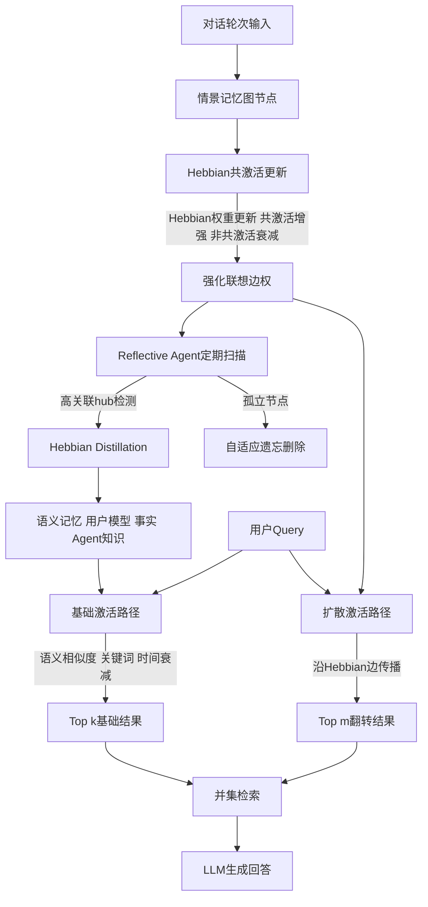

# HeLa-Mem：面向LLM智能体的赫布学习与联想记忆

## 一、论文基础元数据
- **原文标题**：HeLa-Mem: Hebbian Learning and Associative Memory for LLM Agents
- **中文译版**：HeLa-Mem：面向LLM智能体的赫布学习与联想记忆
- **发表渠道**：预印本（arXiv），等级：待补充（未标注会议/期刊录用信息）
- **发表时间**：2025年
- **链接**：arXiv:2604.16839
- **作者及核心机构**：Jinchang Zhu、Jindong Li、Cheng Zhang、Jiahong Liu、Menglin Yang（具体机构待补充）
- **研究领域**：人工智能 → LLM Agent 长期记忆 / 神经符号认知架构
- **关联数据集**：
  - LoCoMo：10段超长对话，平均约300轮 / 9K tokens，共1986个QA，英文，类别涵盖Multi-Hop、Temporal、Open Domain、Single-Hop
  - LongMemEval-S：500项长时记忆评测，英文，含Temporal、Multi-Session、Knowledge-Update等推理密集类别

## 二、论文综合评价

### 2.1 量化评分（1-5分，5分为最优）

| 评价维度 | 评分 | 备注 |
| -------- | ---- | ---- |
| 📚 理论基础 | ⭐⭐⭐⭐ | 神经科学Hebbian学习+记忆巩固理论扎实 |
| 🎯 问题核心性 | ⭐⭐⭐⭐⭐ | 直击LLM Agent长期记忆与联想检索根本痛点 |
| 💡 方法创新性 | ⭐⭐⭐⭐ | Hebbian动态图+反思蒸馏+双路径检索组合新颖 |
| ⚙️ 技术壁垒 | ⭐⭐⭐ | 组件多为现有技术组合，图规模与冷启动待解 |
| 🧪 实验严谨性 | ⭐⭐⭐⭐ | 多backbone、多基线、消融充分，但缺LongMemEval细节 |
| 🔧 落地可行性 | ⭐⭐⭐⭐ | Token开销极低，但依赖LLM蒸馏质量与冷启动期 |
| 🚀 应用前景 | ⭐⭐⭐⭐⭐ | 终身学习智能体方向，长期对话助手落地价值高 |
| 📊 综合评分 | 4.1 | 选题前沿、机制新颖、实验扎实，生物启发记忆架构具里程碑意义 |

### 2.2 定性综合评价（≤300字）
> HeLa-Mem 定位为"生物启发式LLM Agent长期记忆架构"，核心价值在于将神经科学的Hebbian学习（"共激活即连接增强"）引入对话记忆图，使记忆从静态嵌入库演进为可自组织的动态联想网络。差异化优势体现在三点：一是用共激活增强/衰减机制让联想通路自发涌现，突破纯语义相似度检索的"语义陷阱"；二是Reflective Agent模拟睡眠巩固，将高关联hub蒸馏为结构化语义记忆；三是双路径检索（基础激活+扩散激活）融合直接回忆与联想扩散。关键结论：在LongMemEval-S上总体ACC 65.40%居首，Temporal/Multi-Session/Knowledge-Update三类推理密集任务均第一；LoCoMo上平均排名1.25最佳，Token开销约1010，远低于MemGPT的16977。消融显示Reflective Agent贡献最大，去除后多跳推理显著下降。

## 三、领域本体论映射

| 核心维度 | 具体内容 |
| -------- | -------- |
| 核心研究对象 | LLM Agent的长期对话记忆系统 |
| 核心技术路径 | Hebbian学习驱动的动态情景记忆图 + 反思语义蒸馏 + 双路径联想检索 |
| 数据/载体形态 | 对话轮次为节点、共激活关系为边权的情景记忆图；蒸馏后的结构化语义记忆（用户模型/事实记忆/Agent知识） |
| 核心功能目标 | 实现多跳推理、时序推理、多会话一致性、知识更新的长期记忆能力 |
| 验证核心指标 | QA准确率（ACC）、F1、BLEU-1、Token Length、平均排名 |

## 四、核心问题与解决方案

### 4.1 待解决的核心问题
1. **领域级根本问题**：LLM的静态上下文窗口难以支撑Agent的长期记忆，历史信息如何像人脑一样被动态组织、联想检索并持续巩固？
2. **现有方法痛点**：主流记忆系统（Mem0、A-MEM、MemoryOS等）将历史存为无结构嵌入，依赖语义相似度检索，无法捕捉人类记忆中"相关经历因反复共激活而强化连接"的联想结构，导致多跳、时序类问题召回失败。
3. **工程落地卡点**：长对话记忆存储爆炸、检索Token开销高（如MemGPT需约17000 tokens）、缺乏遗忘机制导致图规模无界增长。

### 4.2 核心解决方案
- **理论框架**：Hebbian学习原则（"neurons that fire together, wire together"）+ 记忆巩固（consolidation）+ 自适应遗忘
- **核心架构**：三层结构——① Hebbian联想情景记忆图；② Reflective Agent驱动的语义蒸馏层；③ 双路径检索器
- **关键技术**：
  - Hebbian权重更新：$w_{ij}^{(t+1)}=(1-\lambda)w_{ij}^{(t)}+\eta\cdot\mathbb{I}(v_i,v_j\in\mathcal{K}_t)$，共激活增强、不用衰减
  - Reflective Agent：检测高关联hub节点，触发Hebbian Distillation，用LLM蒸馏为语义记忆
  - 双路径检索：基础激活（语义相似度+关键词+时间衰减）∪ 扩散激活（沿Hebbian边传播）
  - 自适应遗忘：删除孤立节点，控制图规模
- **创新机制**：联想结构自涌现检索——语义路径找不到的记忆可通过Hebbian边权扩散补足召回

### 4.3 核心优势（量化+定性）
1. **性能优势**：LongMemEval-S总体ACC 65.40%（vs A-MEM 62.60%、NaiveRAG 61.00%）；Temporal 50.38%、Multi-Session 57.14%、Knowledge-Update 78.21% 三类推理密集任务均第一；LoCoMo平均排名1.25（vs MemoryOS 2.25、A-Mem 3.00）
2. **效率优势**：平均Token约1010，远低于MemGPT的16977；Hebbian检索只激活强关联记忆，降低上下文冗余
3. **工程优势**：跨GPT-4o-mini、GPT-4o、Qwen2.5-14b/3b多种backbone表现稳定，平均排名均最优，具备模型无关性

## 五、方法与技术架构

### 5.1 核心架构设计
> HeLa-Mem 由三大模块组成：**① Hebbian情景记忆图**——每轮对话编码为节点，共激活关系按Hebbian规则更新边权；**② Reflective Agent巩固层**——周期性地识别高权hub节点，用LLM将hub及其邻居蒸馏为用户模型/事实记忆/Agent知识三类语义记忆，孤立节点被自适应遗忘删除；**③ 双路径检索器**——基础激活路径（语义相似度+关键词+时间衰减）与扩散激活路径（沿Hebbian边传播）并行，最终检索结果 = Top-k基础路径 ∪ Top-m翻转路径。

### 5.2 关键技术实现细节

| 技术模块 | 实现路径 | 工程注意事项 |
| -------- | -------- | ------------ |
| Hebbian关联更新 | 边权 $w_{ij}^{(t+1)}=(1-\lambda)w_{ij}^{(t)}+\eta\cdot\mathbb{I}(v_i,v_j\in\mathcal{K}_t)$，超参η=0.02、λ=0.995 | 需足够交互历史冷启动；衰减系数λ接近1保证长期记忆不快速消散 |
| Reflective Agent | 检测高关联hub，触发LLM蒸馏为三类语义记忆 | 依赖底层LLM，蒸馏幻觉会污染长期存储；蒸馏频率需与图规模平衡 |
| 双路径检索 | 基础路径（语义相似度+关键词+时间衰减，τ=60天）∪ 扩散激活路径（沿边传播） | 基础k=10、语义k=5；阈值θ=0.6；扩散贡献系数β=0.1需调优 |
| 自适应遗忘 | 删除孤立节点，控制图长期可扩展性 | 当前对话长度未饱和时影响小，但长程场景关键 |
| 依赖组件 | LLM backbone（GPT-4o/Qwen2.5）、向量嵌入模型、图数据库 | 跨backbone需验证蒸馏一致性；图数据库需支持动态边权更新 |

### 5.3 架构优缺点
- **优点**：
  1. 生物可解释性强，Hebbian机制与人类联想记忆高度契合
  2. Token效率显著优于传统全上下文/分块检索方案
  3. 模块化解耦，检索器、蒸馏器、遗忘机制可独立替换
  4. 跨backbone稳定性好，模型无关
- **缺点**：
  1. 冷启动问题——Hebbian权重需足量交互才能生效
  2. 蒸馏质量强依赖底层LLM，幻觉/推理错误会传播
  3. 图规模上限与遗忘策略的长期有效性缺乏充分验证
  4. 超参较多（τ, k, η, λ, β, θ），调参成本高

## 六、实验设计与结果分析

### 6.1 实验基础设置

| 维度 | 内容 |
| ---- | ---- |
| 数据集 | LoCoMo（10对话/约300轮/1986 QA）、LongMemEval-S（500项） |
| 基线方法 | LoCoMo、ReadAgent、MemoryBank、MemGPT、A-Mem、Mem0、LightMem、MemoryOS、LangMem、FullText、NaiveRAG |
| 实验环境 | 待补充（论文未披露硬件配置） |
| 评价指标 | QA准确率（ACC）、F1、BLEU-1、Token Length、平均排名 |

### 6.2 核心实验结果

**LongMemEval-S 总体与类别表现（以文中数据为准）：**

| 方法 | 总体ACC | 类别最佳（Temporal/Multi-Session/KU） | 工程指标（Token） |
| ---- | --------- | --------- | -------------------- |
| A-MEM | 62.60% | — | — |
| NaiveRAG | 61.00% | — | — |
| FullText | — | — | 高（待补充） |
| MemGPT | — | — | 16,977 |
| **HeLa-Mem** | **65.40%** | **50.38% / 57.14% / 78.21%** | **约1,010** |

**LoCoMo 多Backbone表现（F1/BLEU-1，Token）：**

| 方法（Backbone） | Multi-Hop | Temporal | Open Domain | Single-Hop | Token |
| ---- | --------- | --------- | ----------- | ---------- | ----- |
| HeLa-Mem (GPT-4o-mini) | 40.14/31.26 | 47.29/41.28 | 29.70/23.45 | 51.89/46.25 | 1,010 |
| HeLa-Mem (GPT-4o) | 39.12/29.82 | 50.79/44.54 | 24.38/19.24 | 49.69/44.08 | 1,036 |
| HeLa-Mem (Qwen2.5-14b) | 36.59/27.02 | 36.08/29.91 | 24.22/20.23 | 49.95/45.15 | 944 |
| HeLa-Mem (Qwen2.5-3b) | 20.12/14.59 | 24.79/21.35 | 12.24/10.24 | 29.51/25.91 | 1,072 |
| MemoryOS (GPT-4o) | 40.23/— | — | — | — | 待补充 |
| MemGPT | — | — | — | — | 16,977 |

**平均排名对比：** HeLa-Mem 1.25 > MemoryOS 2.25 > A-Mem 3.00 > MemGPT 4.50

### 6.3 消融实验/鲁棒性分析

| 实验变体 | 指标变化 | 核心结论 |
| -------- | -------- | -------- |
| 去除 Reflective Agent | 总体 34.74%→29.87%（-4.87）；多跳 36.04%→30.17%（-5.87） | 反思巩固是最关键组件，对多跳推理影响最大 |
| 去除扩散激活 | 总体 34.74%→32.19%（-2.55）；多跳明显受损 | 联想扩散是补足语义检索短板的核心机制 |
| 去除自适应遗忘 | 影响较小 | 当前对话长度未饱和，但长期可扩展性依赖该机制 |
| 跨Backbone（4种） | 平均排名均为1.25左右最优 | 方法对底层LLM具备稳健适配性 |

### 6.4 实验结论（工程视角）
- HeLa-Mem在长对话QA的多数指标上领先，尤其在多跳、时序、多会话三类推理密集任务中优势明显，说明联想结构对复杂推理的召回补足有效。
- Token开销约1010，相比MemGPT降低约94%，工程上可显著降低推理成本。
- GPT-4o上多跳F1略低于MemoryOS（39.12 vs 40.23），说明在强backbone下语义检索本身已强，联想增益边际递减。
- 小模型（Qwen2.5-3b）性能明显下降，提示蒸馏与检索对底层LLM能力有依赖。

## 七、领域贡献与创新点

| 贡献层级 | 具体内容 |
| -------- | -------- |
| 理论贡献 | 将Hebbian学习与记忆巩固理论系统性引入LLM Agent记忆建模，提供神经符号记忆动力学框架 |
| 方法/架构贡献 | 提出Hebbian联想记忆图+Reflective Agent语义蒸馏+双路径检索三位一体架构；边权共激活更新公式 |
| 数据/工具贡献 | 待补充（论文未明确开源数据集或工具） |
| 实验/验证贡献 | 在LoCoMo与LongMemEval-S两大长时记忆基准上验证，覆盖4种backbone、11+基线，消融清晰 |
| 工程落地贡献 | 展示低Token开销（约1010）的可行记忆方案；自适应遗忘为长期可扩展性提供思路 |

## 八、局限性与风险

| 维度 | 具体描述 | 应对思路 |
| ---- | -------- | -------- |
| 学术局限性 | 冷启动依赖足量交互；遗忘机制在短对话场景未饱和；蒸馏质量受底层LLM上限约束 | 引入先验知识暖启动；设计分层遗忘策略；用多LLM投票校准蒸馏 |
| 工程落地风险 | 蒸馏幻觉会污染长期记忆；图数据库规模增长带来检索延迟；超参敏感需调优 | 加入蒸馏一致性校验；图索引/剪枝优化；自动化超参搜索 |
| 伦理/合规风险 | 长期记忆可能强化底层模型偏见；用户隐私数据长期留存与蒸馏带来合规挑战 | 偏见检测与纠偏机制；记忆脱敏与用户可控遗忘权 |

## 九、未来研究/落地方向

| 方向类型 | 具体内容 | 优先级 |
| -------- | -------- | ------ |
| 科研拓展 | 图谱规模上限与遗忘策略的理论分析；Hebbian机制与Transformer注意力理论关联 | 高 |
| 工程优化 | 冷启动暖启方案；蒸馏幻觉抑制；图索引加速；超参自适应 | 高 |
| 跨领域适配 | 多模态记忆（视觉/语音）、多Agent协作共享记忆、个人助理/客服/教育场景 | 中 |

## 十、关键词与术语表

| 语言 | 关键词 |
| ---- | ------ |
| 中文 | 赫布学习、联想记忆、动态图、反思智能体、自适应遗忘、神经符号、终身学习、长期记忆、LLM智能体 |
| 英文 | Hebbian Learning, Associative Memory, Dynamic Graph, Reflective Agent, Adaptive Forgetting, Neuro-symbolic, Lifelong Learning, Long-term Memory, LLM Agents |
| 领域专属术语 | **Hebbian Learning**：神经元共激活则连接增强的学习规则；**Hebbian Distillation**：将高关联hub节点及邻居蒸馏为语义记忆的过程；**Spreading Activation**：沿联想边扩散的检索机制；**Reflective Agent**：周期扫描记忆图并触发蒸馏的智能体模块；**Adaptive Forgetting**：删除孤立节点的记忆管理机制 |

## 十一、参考文献与关联资源
- **核心参考文献**：待补充（依据Hebbian理论、MemGPT、MemoryOS、A-MEM、Mem0等）
- **补充阅读**：LoCoMo基准、LongMemEval基准、记忆巩固神经科学文献
- **开源代码/工具**：待补充（论文未明确说明）

## 十二、阅读者批注
1. **科研启发**：将神经科学中"共激活增强"的Hebbian原则形式化为可微/可更新的图边权公式，为LLM记忆提供了一条区别于向量检索的新范式。可进一步探索Hebbian机制与Attention的数学联系——两者都涉及"共现即关联"的加权，但前者是持久化、后者是瞬时化。
2. **工程落地思考**：Token开销约1010是极具吸引力的工程指标，意味着长期记忆助手可大幅降低推理成本。但需重点验证：① 图数据库在百万级节点下的检索延迟；② 蒸馏幻觉的检测与回滚机制；③ 冷启动期的用户体验降级方案。
3. **待验证/存疑点**：① LongMemEval-S上各类别的完整对比数据未在分组中给出；② 实验硬件与训练/推理成本未披露；③ 自适应遗忘在超长对话（万轮级）下的实证缺失；④ 开源可用性未知。
4. **个人/团队应用场景**：长期陪伴型AI助手、跨会话客服Agent、个性化教育Agent、需要多跳证据链的复杂问答系统。

## 十三、阅读元信息

| 维度 | 内容 |
| ---- | ---- |
| 阅读日期 | 2026-09-30 21:21 |
| 阅读人 | xPaperReader AI |
| 文档编号 | arxiv-2604.16839 |
| 版本迭代 | v1.0 |