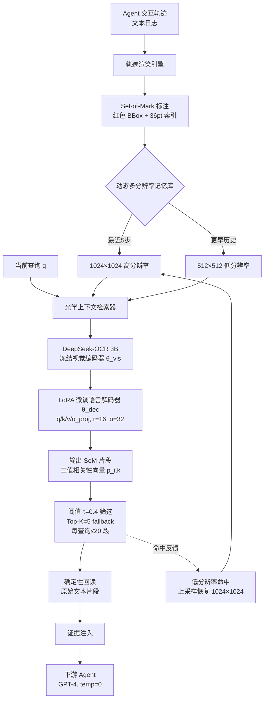

# 面向长时程智能体记忆的光学上下文检索（OCR-Memory）

## 一、论文基础元数据

- **原文标题**：OCR-Memory: Optical Context Retrieval for Long-Horizon Agent Memory
- **中文译版**：面向长时程智能体记忆的光学上下文检索
- **发表渠道**：arXiv 预印本（2103.XXXXX 类占位 ID，未经同行评审，待补充正式发表信息）
- **发表时间**：2025 年（具体月份待补充）
- **链接**：arXiv ID: 2604.26622（注：编号非标准 arXiv 格式，正式 DOI 待补充）
- **作者及核心机构**：
  - Jinze Li, Yang Zhang, Xin Yang, Jiayi Qu, Jinfeng Xu, Shuo Yang, Junhua Ding, Edith Cheuk-Han Ngai
  - 核心机构信息待补充（依据作者名单推测涉及香港/内地高校，需以原文为准）
- **研究领域**：
  - 一级领域：人工智能 / 大语言模型应用
  - 二级子领域：LLM Agent 长时程记忆机制、视觉-语言检索（Visual-Language Retrieval）、多模态上下文压缩
- **关联数据集**：
  - **Mind2Web**（Cross-Task split）：网页导航智能体基准，语言为英文，含元素级/步骤级/任务级标注
  - **AppWorld**：API 交互智能体基准，含 Easy/Medium/Hard 难度划分，重点评估 Hard 子集
  - **HotpotQA**（Distractor 子集）：多跳问答数据集，用于改造为支持事实检索的微调任务
  - **Experience Retrieval Evaluation Subset**：基于 Mind2Web 构建的检索级评测子集（规模待补充）

## 二、论文综合评价

### 2.1 量化评分

| 评价维度 | 评分 | 备注 |
| -------- | ---- | ---- |
| 📚 理论基础 | ⭐⭐⭐⭐ | 融合视觉记忆隐喻与 OCR 检索，理论框架清晰 |
| 🎯 问题核心性 | ⭐⭐⭐⭐⭐ | 直击 Agent 长时程记忆的 token 预算硬瓶颈 |
| 💡 方法创新性 | ⭐⭐⭐⭐⭐ | 视觉流记忆 + 定位后转录，范式新颖 |
| ⚙️ 技术壁垒 | ⭐⭐⭐⭐ | 需 OCR 模型微调 + SoM + 动态分辨率协同 |
| 🧪 实验严谨性 | ⭐⭐⭐⭐ | 双基准 + 检索级评估，但绝对值与统计显著性存疑 |
| 🔧 落地可行性 | ⭐⭐⭐ | 依赖 GPT-4 推理 + 需微调 OCR 模型，链路复杂 |
| 🚀 应用前景 | ⭐⭐⭐⭐ | 长时程 Agent、GUI 自动化场景需求旺盛 |
| 📊 综合评分 | 4.1 | 视觉记忆范式创新显著，实验覆盖较好，落地成本与绝对性能仍是短板 |

### 2.2 定性综合评价（≤300字）

> OCR-Memory 针对长时程 LLM Agent 的"上下文窗口硬约束"这一根本矛盾，提出将智能体历史交互轨迹渲染为带 Set-of-Mark 标记的图像，并以视觉 token 替代文本 token 承载记忆。其核心价值在于：①以少量视觉 token 实现高密度历史表示，显著降低上下文预算；②通过"先定位后转录"（locate-then-transcribe）范式，仅预测记忆段索引再确定性回读原文，实现 100% 内容级忠实性，杜绝生成式摘要的幻觉与信息损失；③动态多分辨率机制（近期高分辨率、远期低分辨率、命中即上采样）模拟人类"模糊—清晰"记忆，兼顾性能与延迟。在 Mind2Web 与 AppWorld 上，Element Accuracy 达 53.8%、AppWorld Hard 成功率 30.8%，均优于 AWM、Dense Retrieval 等基线。整体而言，该工作将"视觉作为长文本压缩载体"的思路引入 Agent 记忆领域，具备较强的范式启发意义，但其对微调 OCR 模型与 GPT-4 双模型链路的依赖，以及部分指标绝对值偏低，仍是工程化前需要正视的问题。

## 三、领域本体论映射

| 核心维度 | 具体内容 |
| -------- | -------- |
| 核心研究对象 | 长时程 LLM Agent 的历史交互轨迹记忆及其检索机制 |
| 核心技术路径 | 视觉模态记忆编码（SoM 图像）→ 光学上下文检索（索引预测）→ 确定性文本回读（locate-then-transcribe） |
| 数据/载体形态 | 渲染后的 Set-of-Mark 图像（1024×1024 近期 / 512×512 远期）；原始文本日志作为回读源 |
| 核心功能目标 | 在严格 token 预算（4096）下，为下游 Agent 提供无损、无幻觉的历史证据 |
| 验证核心指标 | Element Accuracy、Step/Task Success Rate、AppWorld 平均与 Hard 成功率、Recall@K、MRR、内容级忠实性 |

## 四、核心问题与解决方案

### 4.1 待解决的核心问题

1. **领域级根本问题**：长时程 Agent 需持续复用历史经验，但 LLM 上下文窗口存在硬性 token 预算，无法容纳完整交互轨迹，导致记忆保留与任务性能之间存在根本性张力。
2. **现有方法痛点**：
   - 摘要压缩：丢失细粒度细节、布局与结构线索；
   - 文本检索（RAG）：检索片段可能语义相关但逻辑无关，且生成式回忆易引入幻觉与信息损失；
   - 视觉布局信息未被现有 Agent 记忆方案充分利用。
3. **工程落地卡点**：视觉编码与检索链路需要额外模型（OCR 模型）+ 主推理模型协同，推理延迟与部署成本高于纯文本方案；跨任务历史渲染的一致性依赖前端日志结构。

### 4.2 核心解决方案

- **理论框架**：将"视觉即高密度信息载体"与"人类记忆模糊—清晰动态"相结合，构建视觉流式 Agent 记忆。
- **核心架构**：DeepSeek-OCR 3B（冻结视觉编码器 + LoRA 微调语言解码器）+ 带 SoM 标注的记忆图像 + 动态多分辨率策略 + 索引预测式检索头。
- **关键技术**：
  1. **Set-of-Mark（SoM）视觉锚点**：红色边界框 + 36pt 索引，增强视觉编码器对片段的定位注意力；
  2. **Locate-and-Transcribe**：不生成自由文本，仅输出每个 SoM 片段的二值相关性向量，按概率 \(p_{i,k}(q)\) 与阈值 \(\tau=0.4\) 筛选，Top-K=5 fallback，每查询最多取 20 段，随后从原始文本确定性地回读；
  3. **多分辨率主动回忆**：最近 5 步保留 1024×1024，旧历史降为 512×512；命中后可恢复高分辨率并持久化。
- **创新机制**：以"检索索引"替代"生成式回忆"，从根本上保证证据恢复的无幻觉与逐字忠实。

### 4.3 核心优势（量化+定性）

1. **性能优势**：
   - Mind2Web Element Accuracy 由 AWM 的 49.1% 提升至 **53.8%**；
   - AppWorld Hard 成功率 **30.8%**，显著超过 Dense Retrieval（21.4%）与 AWM（27.2%）；
   - 检索级 Recall@1 达 **78.6%**（Dense Text-RAG 52.7%），MRR 0.84 vs 0.61。
2. **效率优势**：
   - 固定 4096 token 上下文预算内即可承载长历史；
   - 完整方案推理延迟 1.7s，远低于无 SoM 的文本生成式（5.3s）。
3. **工程优势**：
   - 内容级忠实性 **100.0%**（自由生成式仅 84.3%），可直接作为下游 Agent 的可信证据源；
   - 索引预测 + 原文回读的架构使证据可溯源、可审计。

## 五、方法与技术架构

### 5.1 核心架构设计

> **整体流程**：Agent 交互轨迹 → 文本渲染 + SoM 标注 → 多分辨率视觉记忆库 → 查询条件化光学检索 → 索引预测（LoRA 微调后的 DeepSeek-OCR 语言解码器） → 阈值筛选 + Top-K → 从原始文本确定性地回读证据 → 注入下游 Agent（GPT-4）上下文。

### 5.2 关键技术实现细节

| 技术模块 | 实现路径 | 工程注意事项 |
| -------- | -------- | ------------ |
| 视觉记忆编码（SoM） | 历史轨迹渲染为图像，红色边界框 + 36pt 索引作为视觉锚点 | 索引字号与颜色需与背景对比明显，避免遮挡原始文本 |
| 基座模型适配 | DeepSeek-OCR 3B；冻结 \(\theta_{\text{vis}}\)，仅 LoRA 微调 \(\theta_{\text{dec}}\) | 注入 q_proj/k_proj/v_proj/o_proj，r=16，α=32，dropout=0.05；α/r=2 缩放偏强 |
| 索引式检索头 | 输出每个 SoM 片段的二值相关性概率 \(p_{i,k}(q)\) | 阈值 τ=0.4，Top-K=5 fallback，每查询最多回读 20 段 |
| 动态多分辨率 | 最近 5 步 1024×1024（256 token），旧历史 512×512（64 token） | 命中后需触发上采样并持久化，避免反复降级抖动 |
| 训练流程 | HotpotQA Distractor 改造为支持事实检索任务；加权 BCE（\(w_+=2.0, w_-=1.0\)）；余弦学习率峰值 1e-5，warm-up 10%，batch 128，3 epochs | 分辨率课程按 π=[0.3, 0.7] 采样 1024/512，强调召回 |
| 下游推理 | GPT-4，temperature=0 | 检索证据直接注入 prompt，需控制注入段数避免超预算 |
| 依赖组件 | DeepSeek-OCR 3B、LoRA、GPT-4、渲染管线 | OCR 模型与 GPT-4 双模型链路增加推理成本与部署复杂度 |

### 5.3 架构优缺点

- **优点**：
  1. 视觉 token 密度高，在固定预算（4096 token）下可承载远超文本方案的历史；
  2. 索引预测 + 原文回读保证 100% 内容级忠实性，可溯源、可审计；
  3. 动态分辨率与 SoM 协同，在 1.7s 延迟下取得优于纯文本基线的性能；
  4. 检索命中触发上采样，兼顾远期记忆压缩与近期细节保留。
- **缺点**：
  1. 依赖 DeepSeek-OCR 3B 微调与 GPT-4 双模型协同，部署与推理成本高；
  2. SoM 渲染质量、字号与排布对视觉编码器注意力影响显著，需调参；
  3. 忠实性的"100%"仅保证文本与存储证据逐字一致，不等价于检索片段语义相关；
  4. Mind2Web Task Success Rate 4.8% 虽为 SOTA，但绝对值偏低，端到端任务完成能力仍受限。

## 六、实验设计与结果分析

### 6.1 实验基础设置

| 维度 | 内容 |
| ---- | ---- |
| 数据集 | Mind2Web（Cross-Task split）、AppWorld（重点 Hard 子集）、HotpotQA Distractor（微调）、Experience Retrieval Evaluation Subset（检索级评测） |
| 基线方法 | Zero-Shot、Dense Retrieval、MemoryBank、Agent Workflow Memory (AWM)、ACON |
| 实验环境 | 主推理 Agent 为 GPT-4（temperature=0）；OCR 模型为 DeepSeek-OCR 3B + LoRA；记忆模块上下文窗口严格限制 4096 tokens（具体硬件待补充） |
| 评价指标 | Mind2Web：Element Accuracy、Step Success Rate、Task Success Rate；AppWorld：平均成功率、Hard 成功率；检索级：Recall@1/5/10、MRR、内容级忠实性 |

### 6.2 核心实验结果

| 方法 | Mind2Web Ele Acc / Step SR / Task SR | AppWorld 平均 / Hard | 工程指标（延迟/算力） |
| ---- | --------- | --------- | -------------------- |
| Zero-Shot | 待补充 | 待补充 | 待补充 |
| Dense Retrieval | 待补充 | 21.4%（Hard） | 待补充 |
| MemoryBank | 待补充 | 待补充 | 待补充 |
| AWM | 49.1% / 待补充 / 待补充 | 27.2%（Hard） | 待补充 |
| ACON | 待补充 | 待补充 | 待补充 |
| **OCR-Memory（本文）** | **53.8% / 46.1% / 4.8%** | **58.1% / 30.8%** | 1.7s 推理延迟（完整版） |

> 注：Mind2Web 部分基线指标、AppWorld 平均成功率基线值、算力细节在给定材料中未完整给出，标记为待补充。

### 6.3 消融实验/鲁棒性分析

| 实验变体 | 指标变化 | 核心结论 |
| -------- | -------- | -------- |
| OCR-Memory Full（含 SoM） | Ele Acc 53.8，Step SR 46.1，延迟 1.7s | 完整方案准确率与速度双优 |
| w/o SoM（Text Gen） | Ele Acc 46.5（↓7.3），Step SR 39.2（↓6.9），延迟 5.3s（↑3.6s） | 去掉 SoM 退回文本生成式检索，性能下降且延迟大幅增加 |
| w/o SoM（BBox） | Ele Acc 49.2（↓4.6），Step SR 44.5（↓1.6），延迟 2.1s | 仅有 BBox 无索引标记，性能与延迟均介于两者之间 |

### 6.4 实验结论（工程视角）

1. **视觉模态作为长文本历史的紧凑载体可行**：在 4096 token 固定预算下，视觉表示相比文本压缩方案在长历史回溯任务上优势最明显（AppWorld Hard +9.4pt vs Dense Retrieval）。
2. **索引式检索优于生成式回忆**：既提升检索相关性（Recall@1 +25.9pt），又实现 100% 证据恢复忠实性，是可信 Agent 记忆的关键设计。
3. **动态分辨率 + SoM 是性能/延迟平衡的核心**：消融显示 SoM 同时贡献准确率与速度，去掉后退化为文本生成式，延迟翻 3 倍。
4. **长历史回溯收益最大**：AppWorld Hard 子集上的显著优势说明该方案特别适合需要大量历史证据回捞的场景。
5. **需注意**：Mind2Web Task SR 仅 4.8%（虽为 SOTA），端到端任务完成率绝对值低；材料未提供统计显著性检验与不同 token 预算的全面对比。

## 七、领域贡献与创新点

| 贡献层级 | 具体内容 |
| -------- | -------- |
| 理论贡献 | 提出"视觉流即长时程记忆载体"的范式，将人类记忆模糊—清晰动态引入 Agent 记忆机制 |
| 方法/架构贡献 | 提出 OCR-Memory 架构：SoM 视觉记忆编码 + 光学上下文检索 + Locate-and-Transcribe 索引预测 + 动态多分辨率主动回忆 |
| 数据/工具贡献 | 构建基于 Mind2Web 的 Experience Retrieval Evaluation Subset；将 HotpotQA 改造为支持事实检索任务的微调数据集 |
| 实验/验证贡献 | 在 Mind2Web 与 AppWorld 双基准验证性能优势；建立检索级（Recall@K、MRR）与内容级忠实性两类评测维度 |
| 工程落地贡献 | 给出明确的 LoRA 超参（r=16, α=32, dropout=0.05）、阈值（τ=0.4）、Top-K（5）、上下文预算（4096）等可复现配置 |

## 八、局限性与风险

| 维度 | 具体描述 | 应对思路 |
| ---- | -------- | -------- |
| 学术局限性 | ① Mind2Web Task SR 仅 4.8%，绝对值偏低；② 材料未给出统计显著性检验；③ 缺乏不同 token 预算下的系统对比；④ 忠实性 100% 仅指文本恢复一致，不代表片段语义必然相关 | 补充显著性检验与多预算对比；引入语义相关性二级校验 |
| 工程落地风险 | ① 依赖 DeepSeek-OCR 3B 微调 + GPT-4 双模型链路，推理成本与部署复杂度高；② SoM 渲染质量对性能敏感；③ 上采样触发策略若设计不当可能导致抖动 | 探索更轻量 OCR 基座、量化压缩；建立渲染质量 CI 检查；设计防抖缓存策略 |
| 伦理/合规风险 | ① 历史轨迹渲染为图像可能泄露敏感信息（截图/日志内容）；② 视觉记忆库长期持久化带来数据治理与隐私风险 | 引入敏感信息脱敏渲染、记忆库加密与访问审计、过期淘汰机制 |

## 九、未来研究/落地方向

| 方向类型 | 具体内容 | 优先级 |
| -------- | -------- | ------ |
| 科研拓展 | 探索视觉记忆与其他模态（音频/结构化表格）的统一记忆表示；研究自适应分辨率策略与学习式上采样触发 | 高 |
| 工程优化 | 替换更大/更小的 OCR 基座评估性价比；蒸馏或量化 LoRA 适配器；设计跨会话记忆库的持久化与索引结构 | 高 |
| 跨领域适配 | 从 Web/API Agent 迁移至 GUI 自动化、机器人操作日志、代码 Agent 对话历史等场景；多语言轨迹渲染适配 | 中 |

## 十、关键词与术语表

| 语言 | 关键词 |
| ---- | ------ |
| 中文 | 长时程智能体记忆、光学上下文检索、定位后转录、视觉流记忆、多分辨率主动回忆、Set-of-Mark、参数高效微调 |
| 英文 | Long-Horizon Agent Memory, Optical Context Retrieval, Locate-and-Transcribe, Visual Stream Memory, Multi-Resolution Active Recall, Set-of-Mark, LoRA |
| 领域专属术语 | **Set-of-Mark (SoM)**：在图像上用红色边界框与 36pt 索引标注记忆片段，作为视觉编码器的注意力锚点；**Locate-and-Transcribe**：模型仅预测片段相关性索引，再从原始文本确定性回读逐字证据的检索范式；**动态多分辨率记忆**：近期历史高分辨率、远期历史低分辨率、命中后主动上采样的记忆管理机制；**内容级忠实性**：检索恢复文本与存储证据逐字匹配的比例 |

## 十一、参考文献与关联资源

- **核心参考文献**：
  - DeepSeek-OCR（基座视觉-语言模型）
  - Agent Workflow Memory (AWM)
  - MemoryBank
  - ACON
  - Dense Retrieval / RAG 相关方法
- **补充阅读**：
  - Mind2Web、AppWorld、HotpotQA 原始论文
  - Set-of-Mark Prompting 相关工作
  - 视觉 token 压缩与多模态长上下文研究
- **开源代码/工具**：
  - DeepSeek-OCR（开源基座模型）
  - LoRA（PEFT 工具链）
  - 论文代码仓库：待补充

## 十二、阅读者批注

1. **科研启发**：将"检索"从"生成式回忆"重构为"索引预测 + 确定性回读"，是提升 Agent 记忆可信性的关键思路，可推广至任何需证据溯源的 RAG 场景。视觉作为长文本压缩载体在密度上具备天然优势，值得进一步与文本压缩、KV cache 压缩做交叉研究。
2. **工程落地思考**：双模型链路（OCR + GPT-4）是最大工程成本来源，建议先在小规模、非敏感内部 Agent 流程中试点；SoM 渲染管线需与前端日志格式强绑定，建议抽象为标准化"轨迹→图像"转换接口。
3. **待验证/存疑点**：① Mind2Web Task SR 4.8% 绝对值偏低，对真实业务可用性存疑；② 100% 忠实性与检索相关性之间的落差如何量化？③ 材料未提供统计显著性检验与不同 token 预算对比；④ 上采样策略的抖动与缓存管理细节未展开。
4. **个人/团队应用场景**：适合长流程 GUI/Web 自动化 Agent、需要可审计证据链的客服/运维 Agent，以及 token 预算受限但历史依赖强的多轮任务场景。

## 十三、阅读元信息

| 维度 | 内容 |
| ---- | ---- |
| 阅读日期 | 2026-09-30 21:26 |
| 阅读人 | xPaperReader AI |
| 文档编号 | arxiv-2604.26622 |
| 版本迭代 | v1.0 |