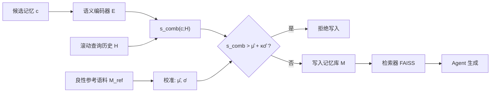

# MEMSAD：面向检索增强智能体记忆投毒的梯度耦合异常检测

## 一、论文基础元数据
- **原文标题**：MEMSAD: Gradient-Coupled Anomaly Detection for Memory Poisoning in Retrieval-Augmented Agents
- **中文译版**：MEMSAD：面向检索增强智能体记忆投毒的梯度耦合异常检测
- **发表渠道**：预印本（arXiv，未经同行评审）
- **发表时间**：2025 年
- **链接**：arXiv:2605.03482（DOI 待补充）
- **作者及核心机构**：Ishrith Gowda（核心机构待补充；独立作者署名）
- **研究领域**：
  - 一级领域：人工智能安全 / AI Security
  - 二级子领域：LLM 智能体安全、检索增强生成（RAG）防御、异常检测
- **关联数据集**：
  - 合成语料：|M| = 1,000 条条目（含良性参考语料 $\mathcal{M}_{\text{ref}}$）
  - Natural Questions（NQ）：跨语料泛化验证（附录 Q）
  - 多智能体 SIR 模拟环境：用于传播阻断验证
  - Mem0 生产系统：用于真实部署验证
  - 语言：英文（主要）；标注方式：由攻击模型与检索模型自动生成标签，无人工标注

## 二、论文综合评价

### 2.1 量化评分（1-5 分，5 分为最优）

| 评价维度 | 评分 | 备注 |
| -------- | ---- | ---- |
| 📚 理论基础 | ⭐⭐⭐⭐⭐ | 梯度耦合、认证半径、Le Cam下界、在线regret完整 |
| 🎯 问题核心性 | ⭐⭐⭐⭐⭐ | 直击RAG Agent持久记忆投毒这一新兴核心威胁 |
| 💡 方法创新性 | ⭐⭐⭐⭐ | 写前过滤+梯度耦合视角较新，但算法本身朴素 |
| ⚙️ 技术壁垒 | ⭐⭐⭐ | 算法简单，依赖良好校准，壁垒偏理论侧 |
| 🧪 实验严谨性 | ⭐⭐⭐⭐ | 3×5攻击-防御矩阵扎实，但仅1k合成条目 |
| 🔧 落地可行性 | ⭐⭐⭐⭐ | 2 ms/entry，与生产系统兼容，依赖组合防御 |
| 🚀 应用前景 | ⭐⭐⭐⭐⭐ | RAG Agent爆发期，记忆安全防御需求刚性 |
| 📊 综合评分 | 4.3 | 理论强、评估广，但评估规模与同义词漏洞削弱落地信心 |

### 2.2 定性综合评价（≤300字）

> 本文定位为 RAG 智能体持久记忆投毒的首批形式化防御工作，核心价值在于将“恶意记忆必与受害者查询语义接近”这一攻击刚性需求反转为检测信号，用校准后的查询-记忆余弦异常分数在写入前实施拦截。差异化优势体现在三点：一是提出梯度耦合定理，证明单调检索分数检测器对连续规避的必要充分性，并给出认证检测半径与 Le Cam 下界，理论完备度在同类工作中少见；二是通过 3×5 攻击-防御矩阵覆盖 AgentPoison、MINJA、InjecMEM 三类访问权限递进攻击，并跨语料、多智能体及 Mem0 生产系统验证；三是给出“水印 + 滚动 MemSAD + 主动防御”组合方案，可达成 TPR=1.00、FPR=0.00 与 ASR-R*=0。关键结论是：无单一最优防御，组合防御与良好校准是前提；离散同义词替换与域漂移是主要残余风险。

## 三、领域本体论映射

| 核心维度 | 具体内容 |
| -------- | -------- |
| 核心研究对象 | 检索增强 LLM Agent 的持久记忆库（$\mathcal{M}$）中恶意条目的预写入检测 |
| 核心技术路径 | 编码器语义空间中的查询-记忆余弦相似度统计异常检测 + 校准阈值决策 |
| 数据/载体形态 | 文本记忆条目 → 稠密向量（all-MiniLM-L6-v2，$d$ 维）→ FAISS 向量索引 |
| 核心功能目标 | 在毒化条目写入记忆前拒绝之，同时保持对良性记忆的低误拒率 |
| 验证核心指标 | TPR、FPR、AUROC、ASR-R、ASR-A、ASR-T、检测延迟（ms/entry） |

## 四、核心问题与解决方案

### 4.1 待解决的核心问题

1. **领域级根本问题**：持久记忆使投毒具有“一次注入、长期复用、跨会话触发”的时间放大效应；攻击面随查询历史累积而指数级扩张，传统一次性输入过滤无法应对。
2. **现有方法痛点**：
   - 水印机制在自动存储场景（MINJA 类攻击）失效；
   - 通用 OOD 检测器（Energy Score、KNN）对语义相近的毒化条目判别力不足；
   - Mahalanobis 虽 TPR 高，但 FPR≈0.964，实际不可用；
   - LLM 文本 sanitization 精度虽高，但约 1.2 s/条，比 MemSAD 慢约 1000 倍，难以规模化。
3. **工程落地卡点**：
   - 阈值校准强依赖域匹配的受害者查询，随机/域外校准会使 FPR 飙升至 >0.95；
   - 冷启动、查询分布漂移下校准失效；
   - 仅能拦截新写入，无法清除已污染条目；
   - 对抗者可优化嵌入规避相似度阈值。

### 4.2 核心解决方案

- **理论框架**：Stackelberg 博弈（防御者先设阈值策略，攻击者最优响应）+ 梯度耦合定理（max-cosine 异常分数与检索目标梯度同向）+ 认证检测半径 + Le Cam 样本复杂度下界。
- **核心架构**：写前预摄入过滤器（Algorithm 1），维护滚动受害者查询历史 $\mathcal{H}$，对候选记忆 $c$ 编码后计算 $s_{\text{comb}}(c;\mathcal{H})$，与良性校准统计 $\hat\mu,\hat\sigma$ 比较，超出 $\hat\mu+\kappa\hat\sigma$ 即拒绝。
- **关键技术**：
  - **combined max-mean 分数**：$s_{\text{comb}}=\frac12\max_{q}\cos(E(c),E(q)) + \frac12\cdot\text{mean}_q\cos(E(c),E(q))$，兼顾定向与分布式攻击；
  - **查询历史校准**：用良性参考条目在同一 $\mathcal{H}$ 上的分布估计 $\hat\mu,\hat\sigma$；
  - **触发查询校准**：针对 AgentPoison，需以触发查询作校准集，否则 TPR 极低；
  - **MemSAD+ 扩展**：加入字符 n-gram JSD，部分封堵同义词替换漏洞。
- **创新机制**：把“攻击者必须与受害者查询语义接近才能被检索”的刚性约束反转为检测信号；在线校准窗口最优长度 $\Theta((\sigma/\Delta)^{2/3})$，每步 regret $O(\sigma^{2/3}\Delta^{1/3})$。

### 4.3 核心优势（量化 + 定性）

1. **性能优势**：AgentPoison 触发校准后 TPR=1.00 / AUROC=1.000；MINJA AUROC≈0.914；InjecMEM AUROC≈0.816；组合防御在所有攻击上 TPR=1.00、FPR=0.00。
2. **效率优势**：约 2 ms/entry，比 LLM sanitization（~1.2 s/条）快约 1000 倍；$O(md)$ 复杂度，无额外模型调用。
3. **工程优势**：预摄入过滤，无需修改检索器或生成器；与 FAISS 向量库、Mem0 生产系统等主流组件兼容；可与水印、主动防御、A-MemGuard 组合互补。

## 五、方法与技术架构

### 5.1 核心架构设计

> **流程描述**：候选记忆 $c$ 经语义编码器 $E(\cdot)$ 得到稠密向量；防御者维护滚动查询历史 $\mathcal{H}=\{q_1,\dots,q_m\}$（FIFO，容量 $m_{\max}$），并预先在良性参考语料 $\mathcal{M}_{\text{ref}}$ 上校准得到 $\hat\mu,\hat\sigma$。对 $c$ 计算 combined max-mean 余弦异常分数 $s_{\text{comb}}$，若超过阈值 $\hat\mu+\kappa\hat\sigma$，则在写入记忆库 $\mathcal{M}$ 前拒绝，否则接受。

### 5.2 关键技术实现细节

| 技术模块 | 实现路径 | 工程注意事项 |
| -------- | -------- | ------------ |
| 语义编码 | all-MiniLM-L6-v2 编码候选与查询 | 需与检索器共用编码器，避免空间不一致 |
| 异常评分 | max-cosine 或 combined max-mean 余弦 | combined 更抗分布式攻击；单点 max 易被稀释 |
| 阈值校准 | 良性参考条目在 $\mathcal{H}$ 上估计 $\hat\mu,\hat\sigma$ | 校准集必须域匹配，否则 FPR 可 >0.95 |
| 触发查询校准 | 针对 AgentPoison 使用触发查询作校准 | 校准集缺失会导致 TPR 崩塌，是 AgentPoison 场景关键 |
| MemSAD+ 扩展 | 字符 n-gram JSD 辅助检测 | 只能部分缓解同义词替换；连续-离散失效是结构性漏洞 |
| 在线校准 | 滑动窗口长度 $\Theta((\sigma/\Delta)^{2/3})$ | 慢漂移假设下成立；突变漂移需重新校准 |
| 依赖组件 | FAISS 向量索引、all-MiniLM-L6-v2、Mem0（部署） | 编码器升级需重做校准；ANN 化会影响精确度上限 |

### 5.3 架构优缺点

- **优点**：
  - 轻量预过滤，2 ms/entry，无需动检索器/生成器；
  - 自适应当前查询分布，可同时覆盖定向与分布式攻击；
  - 理论保证完备（梯度耦合、认证半径、Le Cam 下界）；
  - 与多种防御机制正交，可组合。
- **缺点**：
  - 依赖查询历史，冷启动与域漂移下校准失效；
  - 只能拦截新写入，无法清除已存在污染；
  - 离散同义词替换是结构性漏洞，MemSAD+ 仅部分缓解；
  - 完美防御效果来自组合而非单点，单用时 MINJA/InjecMEM TPR 偏低。

## 六、实验设计与结果分析

### 6.1 实验基础设置

| 维度 | 内容 |
| ---- | ---- |
| 数据集 | 合成语料 \|M\|=1,000；Natural Questions（跨语料，附录 Q）；多智能体 SIR 模拟；Mem0 生产系统 |
| 基线方法 | 水印、主动防御（proactive）、A-MemGuard（附录 N 讨论）、OOD 基线（Energy Score、Mahalanobis、KNN）、GPT-4o-mini 文本 sanitization |
| 实验环境 | all-MiniLM-L6-v2 编码器 + FAISS 检索；校准样本量 N=50 |
| 评价指标 | TPR、FPR、AUROC、ASR-R、ASR-A、ASR-T、延迟（ms/entry）、传播阻断率 |

### 6.2 核心实验结果

| 方法 | 核心指标1（TPR / ASR-R） | 核心指标2（AUROC / ASR-T） | 工程指标（算力/耗时） |
| ---- | --------- | --------- | -------------------- |
| Energy Score | 待补充 | 待补充（低于 MemSAD） | 待补充 |
| Mahalanobis | 高 TPR | FPR≈0.964，不可用 | 待补充 |
| KNN | 待补充 | 待补充（低于 MemSAD） | 待补充 |
| MemSAD（AgentPoison，触发校准） | TPR=1.00 | AUROC=1.000 | ~2 ms/entry |
| MemSAD（MINJA） | TPR≈0.40 | AUROC≈0.914 | ~2 ms/entry |
| MemSAD（InjecMEM） | TPR≈0.20 | AUROC≈0.816 | ~2 ms/entry |
| 组合防御（watermark ∨ MemSAD ∨ proactive） | TPR=1.00 | FPR=0.00，ASR-R*=0 | 叠加开销，仍 <10 ms/entry 量级 |
| GPT-4o-mini sanitization | 完美（1.00） | 完美 | ~1.2 s/条（慢约 1000 倍） |

### 6.3 消融实验/鲁棒性分析

| 实验变体 | 指标变化 | 核心结论 |
| -------- | -------- | -------- |
| 无触发校准（AgentPoison） | TPR 极低 | 触发查询校准是 AgentPoison 防御的前提 |
| max-cosine → combined max-mean | 分布式攻击检测能力提升 | 组合分数对两类攻击兼顾 |
| MemSAD → MemSAD+（+n-gram JSD） | 同义词替换漏洞部分缓解 | 连续-离散差距仅部分弥合 |
| 域外/随机校准 vs 域匹配校准 | FPR 从 0.00 飙升至 >0.95 | 校准集质量是落地关键 |
| 单点防御 → 组合防御 | ASR-R* 可达 0 | 无单一最优，组合是推荐方案 |
| 多智能体 SIR（MemSAD κ=2.0 单用） | secondary entries 仅减 22% | 单点防御无法阻断传播 |
| 多智能体 SIR（组合防御 κ=1.0） | 传播被阻断 | 组合防御才能阻断传播 |
| 跨语料 NQ | AgentPoison 强转移；MINJA ASR-R 升至 0.58；InjecMEM 降至 0 | 攻击转移性差异显著 |
| Mem0 生产验证 | LLM 中介重写可隐式防御 AgentPoison；原始向量库完全暴露 | 生产部署需绕过 LLM 重写直接保护向量库 |

### 6.4 实验结论（工程视角）

1. **MemSAD 单点不足以覆盖所有攻击**：AgentPoison 场景表现完美（需触发校准），但 MINJA/InjecMEM 单用 TPR 仅 0.20~0.40，必须组合防御才能达到 TPR=1.00、FPR=0.00。
2. **校准质量是落地第一风险**：域外校准导致 FPR>0.95，是工程部署中最易踩的坑；需构建域匹配的良性参考集。
3. **效率不是瓶颈**：2 ms/entry 的预算在 RAG Agent 写入路径上可接受，远优于 LLM sanitization 的 1.2 s/条。
4. **多智能体场景需组合防御**：单点 MemSAD κ=2.0 仅减少 22% 次级条目，组合防御 κ=1.0 才能阻断传播。
5. **评估规模有限**：1,000 条合成条目与 NQ 跨语料验证只能部分缓解泛化担忧，真实规模（百万级）下的表现仍未验证。

## 七、领域贡献与创新点

| 贡献层级 | 具体内容 |
| -------- | -------- |
| 理论贡献 | ①梯度耦合定理：max-cosine 异常分数与检索目标梯度同向；②单调检索分数检测器对连续规避的必要充分性；③认证检测半径；④Le Cam 下界 $\Omega(1/\rho^2)$ 与 MemSAD 的 $O(\log(1/\delta)/\rho^2)$ 近 minimax 最优性；⑤在线校准最优窗口 $\Theta((\sigma/\Delta)^{2/3})$ 与每步 regret $O(\sigma^{2/3}\Delta^{1/3})$ |
| 方法/架构贡献 | 提出首个具有形式化保证的 RAG 记忆投毒写前预过滤防御；combined max-mean 评分兼顾定向与分布式攻击；MemSAD+ 的 n-gram JSD 扩展 |
| 数据/工具贡献 | 构建 3×5 攻击-防御评估矩阵；覆盖 AgentPoison/MINJA/InjecMEM 三类攻击的系统性基准 |
| 实验/验证贡献 | 跨语料（NQ）、多智能体 SIR 传播、Mem0 生产系统三类真实场景验证；与 OOD 基线、LLM sanitization 对比 |
| 工程落地贡献 | 给出“摄入水印 + 写入滚动 MemSAD + 主动防御”的推荐部署方案（~2 ms/entry）；与 FAISS/Mem0 等主流组件兼容 |

## 八、局限性与风险

| 维度 | 具体描述 | 应对思路 |
| ---- | -------- | -------- |
| 学术局限性 | 离散同义词替换是结构性漏洞（命题 13 标出的结构前沿）；复述训练编码器使同义词近乎等距，MemSAD+ 仅部分弥合；评估规模仅 1,000 条合成条目 | 探索 token 级离散空间检测；构建同义词感知的嵌入校准；在更大规模语料上复现 |
| 工程落地风险 | 阈值校准需域匹配的受害者查询，域外/随机校准 FPR>0.95；冷启动与域漂移下失效；仅能拦截新写入，不能清除已污染条目；与 A-MemGuard 等并发防御无直接基准（无公开实现） | 建立域匹配校准集生产线；设计在线漂移检测与重校准触发；配合全量记忆审计与清洗流程；等待并发防御开源后做统一基准 |
| 伦理/合规风险 | 防御机制可能误拒与查询语义相关的良性记忆，影响 Agent 正常功能；若在用户不可见情况下拦截写入，可能引发透明性与知情权问题；记忆投毒攻击本身可用于信息操纵，防御技术亦需防止被滥用为内容审查工具 | 记录拦截日志并提供可解释拒绝理由；为良性误拒提供人工申诉通道；明示部署场景与合规边界 |

> **重要提示**：论文含多处 erratum/修正（SIR 公式、Energy Score 极性、组合防御定义、假设检验零假设等），说明材料经历修订，读者应核对最新版本。

## 九、未来研究/落地方向

| 方向类型 | 具体内容 | 优先级 |
| -------- | -------- | ------ |
| 科研拓展 | 缩小同义词语义差距（离散-连续耦合）；多模态记忆投毒防御扩展；组合防御的最优策略理论刻画 | 高 |
| 工程优化 | ANN 近似最近邻扩展以支撑百万级记忆；在线漂移检测与自适应重校准；与 A-MemGuard 等并发防御的统一基准 | 高 |
| 跨领域适配 | 迁移至多智能体协作系统的传播阻断；适配不同编码器（如更大规模 embedding）与不同向量库（Milvus、Pinecone） | 中 |

## 十、关键词与术语表

| 语言 | 关键词 |
| ---- | ------ |
| 中文 | 记忆投毒、检索增强智能体、异常检测、梯度耦合、写前过滤、认证检测半径、在线校准 |
| 英文 | Memory Poisoning, Retrieval-Augmented Agents, Anomaly Detection, Gradient-Coupled, Pre-ingestion Filtering, Certified Detection Radius, Online Calibration |
| 领域专属术语 | **AgentPoison**：具备写权限、优化触发词的记忆投毒攻击；**MINJA**：仅具备查询权限、利用自动存储机制的攻击；**InjecMEM**：单次交互注入、检索器无关锚点的攻击；**ASR-R**：恶意条目被检索到的比例；**ASR-A**：恶意条目被检索后 Agent 执行对抗动作的条件概率；**ASR-T**：总体攻击成功率 = ASR-R × ASR-A；**梯度耦合定理**：max-cosine 异常分数与检索目标梯度同向；**MemSAD+**：加入字符 n-gram JSD 的扩展版本；**SIR**：多智能体传播模拟模型；**Le Cam 下界**：校准样本复杂度理论下界 |

## 十一、参考文献与关联资源

- **核心参考文献**：
  - AgentPoison（记忆投毒攻击，写权限）
  - MINJA（查询权限注入攻击）
  - InjecMEM（单次交互注入攻击）
  - A-MemGuard（并发记忆防御，附录 N 讨论）
- **补充阅读**：
  - Le Cam 下界与 minimax 估计理论
  - 认证鲁棒性（certified robustness）相关工作
  - 在线学习 regret 分析（慢漂移假设）
- **开源代码/工具**：
  - all-MiniLM-L6-v2（Sentence-Transformers）
  - FAISS 向量检索库
  - Mem0 记忆系统
  - 开源代码：待补充（论文未明确提供）

## 十二、阅读者批注

1. **科研启发**：把“攻击成功的刚性语义约束”反转为“检测信号”是通用范式，可迁移到其他投毒/后门场景；梯度耦合定理将检测器与检索目标绑定，为“可认证防御”提供新思路；离散-连续耦合失效是 LLM 安全中普遍的结构性问题，值得深挖。
2. **工程落地思考**：2 ms/entry 的效率让写前过滤成为可选项；但真正的工程难点是校准集的持续维护与漂移检测，这应作为部署的第一优先级；组合防御（水印 + MemSAD + 主动防御）才是生产可用的方案，单点 MemSAD 不足以覆盖全部攻击面；记忆库全量审计与清洗能力需配套建设。
3. **待验证/存疑点**：
   - 1,000 条合成条目下的表现能否外推到百万级真实记忆库？
   - 域外校准 FPR>0.95 的具体场景边界在哪里？域匹配的判定标准是什么？
   - 同义词替换漏洞在 MemSAD+ 下的实际 ASR 是多少？论文未给出明确量化。
   - 与 A-MemGuard 的对比因无公开实现而未做，架构互补性的实证强度有限。
   - 论文含多处 erratum，需核对最终版本以确认关键公式与结论。
4. **个人/团队应用场景**：若团队正在构建 RAG Agent（含长期记忆），可优先在写入路径上接入 MemSAD 作为一层防御，并配套域匹配校准集；对多智能体协作系统，需评估组合防御 κ=1.0 下的传播阻断效果；对合规敏感场景，需增加拦截日志与可解释性机制。

## 十三、阅读元信息

| 维度 | 内容 |
| ---- | ---- |
| 阅读日期 | 2026-09-30 21:28 |
| 阅读人 | xPaperReader AI |
| 文档编号 | arxiv-2605.03482 |
| 版本迭代 | v1.0 |