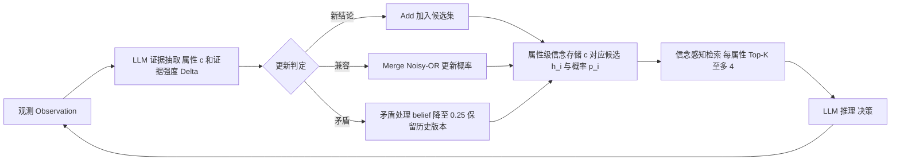

# 信念记忆：部分可观测条件下的智能体记忆

## 一、论文基础元数据
- **原文标题**：Belief Memory: Agent Memory Under Partial Observability
- **中文译版**：信念记忆：部分可观测条件下的智能体记忆
- **发表渠道**：arXiv 预印本（未标注会议/期刊等级）
- **发表时间**：2025 年
- **链接**：arXiv:2605.05583（https://arxiv.org/abs/2605.05583）
- **作者及核心机构**：Junfeng Liao, Qizhou Wang, Jianing Zhu, Bo Du, Rui Yan, Xiuying Chen（机构信息待补充）
- **研究领域**：人工智能 → LLM Agent / 智能体记忆与推理；交叉方向为 POMDP 决策与不确定性建模
- **关联数据集**：
  - **LoCoMo**：长期对话基准，评估长期记忆召回与生成质量（语言：英文；指标：F1/BLEU）
  - **ALFWorld**：具身交互任务基准（语言：英文指令/环境文本；指标：成功率 SR、平均步数）
  - 对抗实验子集：从 ALFWorld 记忆库筛选的 102 个强错误样本（本文自建评测集）

## 二、论文综合评价
### 2.1 量化评分（1-5分，5分为最优）

| 评价维度 | 评分 | 备注 |
| -------- | ---- | ---- |
| 📚 理论基础 | ⭐⭐⭐⭐ | 将记忆视作 POMDP 信念近似，视角新颖但缺形式化保证 |
| 🎯 问题核心性 | ⭐⭐⭐⭐⭐ | 直击部分可观测下记忆自增强错误这一根本瓶颈 |
| 💡 方法创新性 | ⭐⭐⭐⭐ | 属性级概率信念 + Noisy-OR 证据合并，范式转移明显 |
| ⚙️ 技术壁垒 | ⭐⭐⭐⭐ | 概率更新、兼容/矛盾判定、版本保留等工程细节较多 |
| 🧪 实验严谨性 | ⭐⭐⭐⭐ | 双基准 + 消融 + 对抗实验较完整，但场景面偏窄 |
| 🔧 落地可行性 | ⭐⭐⭐ | Token 更省，但记忆写入/合并开销仍较高 |
| 🚀 应用前景 | ⭐⭐⭐⭐ | 长期记忆型 Agent、具身智能、对话助手均可受益 |
| 📊 综合评分 | 4.1 | 范式创新突出，经验效果扎实，理论与效率仍有提升空间 |

### 2.2 定性综合评价（≤300字）
> 本文定位为 LLM Agent 记忆机制的方向性重构工作，核心价值在于把外部记忆从"确定性结论数据库"改造为"对环境信念状态的近似"。针对部分可观测环境中"一次错误结论被反复强化"的 Self-reinforcing Error 痛点，BeliefMem 通过属性级候选结论 + 概率 + Noisy-OR 证据合并，在检索时保留不确定性，并支持 Add/Merge/矛盾修正与历史版本保留。差异化优势在于不追求完整后验归一化，而是以低成本维护局部后验，兼顾抗噪与可执行性。在 LoCoMo 与 ALFWorld 上取得最优平均性能（LoCoMo F1/BLEU 42.38/36.30，ALFWorld SR 59.88%、步数 29.56），对抗纠错率接近确定性基线 2 倍，且 Token 消耗更低。关键结论：概率化记忆是缓解记忆自增强错误的有效路径，但理论保证与证据校准仍待补强。

## 三、领域本体论映射
| 核心维度 | 具体内容 |
| -------- | -------- |
| 核心研究对象 | 部分可观测环境下 LLM Agent 的外部长期记忆表示与更新机制 |
| 核心技术路径 | 属性级概率信念表示 → Noisy-OR 证据合并 → 信念感知检索 → 概率化推理与决策 |
| 数据/载体形态 | 多属性候选结论集（属性 c，候选 h，概率 p ∈ [0,1]）+ 历史版本记录；文本形式存储 |
| 核心功能目标 | 抑制错误记忆自增强、支持矛盾纠正、保留不确定性以支撑下游决策 |
| 验证核心指标 | LoCoMo 的 F1/BLEU；ALFWorld 的成功率 SR、平均步数；Token 消耗；纠错率/纠错步数 |

## 四、核心问题与解决方案
### 4.1 待解决的核心问题
1. **领域级根本问题**：LLM Agent 在部分可观测环境（POMDP）中，观测仅为隐藏状态的噪声证据，如何在记忆层面正确近似信念状态 \(b_t(s)\)，避免将单一观测固化为"事实"。
2. **现有方法痛点**：Generative Agents、MemGPT、Mem0、A-MEM、MemoryBank、Zep、MemOS、Memory-R1 等主流记忆框架普遍将每次观察压缩为一个确定性结论（如"API X 失败"），丢弃剩余后验概率；一旦写入错误结论，Agent 会据此决策、不再测试替代假设，并持续收集支持该错误结论的证据，形成 **Self-reinforcing Error**。
3. **工程落地卡点**：概率维护引入额外写入/合并开销；LLM 提取的置信度并非校准后验，便于实现但带噪；兼容/矛盾判定依赖关键词匹配与规则，泛化性受限；属性级候选数量上限（4）限制表达能力。

### 4.2 核心解决方案
- **理论框架**：将外部记忆视为对 POMDP 信念状态 \(b_t(s)\) 的近似。确定性记忆只保留每个属性的 \(\arg\max\) 结论，BeliefMem 则保留局部后验 \(b_t^{(c)}(h)\)，即在属性 c 上的候选结论分布。
- **核心架构**：属性级概率信念记忆 —— 对每个任务相关属性 \(c\)，维护多个互斥候选结论 \(h\)，每个候选带概率；新观测到来时更新概率；检索时返回全部候选及其概率。
- **关键技术**：
  1. **Noisy-OR 证据合并**：多源观测以概率方式累加证据强度。
  2. **概率感知检索**：返回带概率的候选集，让 Agent 在不确定下推理。
  3. **更新三操作**：Add（新结论入存）、Merge（兼容证据合并更新概率）、矛盾处理（矛盾结论使当前 belief 降至 0.25，并保留历史版本）。
- **创新机制**：保留历史版本以支持时间查询与矛盾后修复；候选数上限 4 以控制检索成本；初始概率区间 \([0.7, 0.9]\) 由 LLM 置信分数给出。

### 4.3 核心优势（量化+定性）
1. **性能优势**：LoCoMo 平均 F1/BLEU 达 42.38/36.30，ALFWorld 平均 SR 59.88%、步数 29.56，在两个基准上取得最佳平均性能；对抗纠错实验中校正率接近确定性基线 **2 倍**。
2. **效率优势**：在更低 Token 消耗下优于知名的记忆类竞争基线；候选上限（每属性 ≤4）使检索成本可控。
3. **工程优势**：不改动 LLM 本身，可作为外部记忆模块即插即用；保留历史版本天然支持时间查询、审计与回滚；对错误记忆条目具备渐进式自修复能力。

## 五、方法与技术架构
### 5.1 核心架构设计
> BeliefMem 的核心流程：感知观测 → LLM 提取属性与证据强度 Δ → 与现有属性级候选集做 Add/Merge/矛盾处理 → Noisy-OR 更新概率 → 信念感知检索返回带概率候选 → 支撑 LLM 推理与动作选择。全流程处于"证据累积—信念刷新"闭环中。

### 5.2 关键技术实现细节
| 技术模块 | 实现路径 | 工程注意事项 |
| -------- | -------- | ------------ |
| 证据抽取 | LLM 从观测中抽取属性 c、候选结论 h 及置信分数 Δ | LLM 置信非校准后验，需关注 Δ 的噪声与偏置 |
| Noisy-OR 概率更新 | 以 noisy-OR 方式合并来自多源观测的证据，更新候选概率 | 需处理概率抑制与饱和；冲突证据的传播策略需谨慎 |
| 兼容/矛盾判定 | 依据关键词匹配与规则判定"兼容/矛盾" | 规则泛化性有限，跨域需扩充判定器（如嵌入或 LLM 裁判） |
| 概率化存储 | 每属性维护多个候选 (h_i, p_i)，初始区间 [0.7,0.9] | 候选上限 4，注意超出时的裁剪与合并策略 |
| 信念感知检索 | 检索时返回全候选与概率，保留不确定性 | 检索上下文长度与 Token 成本需权衡候选数量 |
| 历史版本管理 | 保存旧结论支持时间查询与矛盾后修复 | 存储膨胀风险，需设计过期与压缩策略 |

### 5.3 架构优缺点
- **优点**：
  - 从根本上缓解确定性记忆的自增强错误；
  - 检索保留不确定性，使下游决策更具鲁棒性；
  - 保留历史版本，天然支持时间查询、审计与回滚；
  - 模块化，易与现有 Agent 记忆框架（MemGPT/Mem0 等）集成；
  - 在更低 Token 预算下取得更优性能。
- **缺点**：
  - 概率近似缺乏形式化收敛保证；
  - 证据强度 Δ 由 LLM 提取，存在噪声，非校准后验；
  - 兼容/矛盾判定依赖规则，跨域泛化性存疑；
  - 候选上限 4 可能限制复杂属性的表达；
  - 记忆写入与合并的计算/存储开销仍不低。

## 六、实验设计与结果分析
### 6.1 实验基础设置
| 维度 | 内容 |
| ---- | ---- |
| 数据集 | LoCoMo（长期对话）、ALFWorld（具身交互）；对抗实验：ALFWorld 记忆中筛选的 102 个强错误样本 |
| 基线方法 | Generative Agents、MemGPT、Mem0、A-MEM、MemoryBank、Zep、MemOS、Memory-R1 等 |
| 实验环境 | 待补充（论文原始信息未在汇总中给出具体硬件/模型版本） |
| 评价指标 | LoCoMo：F1、BLEU；ALFWorld：成功率 SR、平均步数；附加：Token 消耗、Correction Rate、Correction Steps |

### 6.2 核心实验结果
| 方法 | 核心指标1（LoCoMo 平均 F1 / BLEU） | 核心指标2（ALFWorld 平均 SR / 步数） | 工程指标（算力/耗时） |
| ---- | --------- | --------- | -------------------- |
| Generative Agents | 待补充 | 待补充 | 待补充 |
| MemGPT | 待补充 | 待补充 | 待补充 |
| Mem0 | 待补充 | 待补充 | 待补充 |
| A-MEM / MemoryBank / Zep / MemOS / Memory-R1 | 待补充 | 待补充 | 待补充 |
| **BeliefMem（本文方法）** | **42.38 / 36.30** | **59.88% / 29.56** | Token 消耗低于竞争基线 |

> 说明：汇总材料仅给出本文方法的具体数值与定性描述（"在两个基准上取得最佳平均性能"），各基线的精确数值论文原文中应有报告，此处以"待补充"标记以避免臆测。

### 6.3 消融实验/鲁棒性分析
| 实验变体 | 指标变化 | 核心结论 |
| -------- | -------- | -------- |
| 去掉概率记忆 | ALFWorld SR 降至 28.71；LoCoMo F1 降至 22.58 | 概率化记忆是性能的主要来源，贡献最显著 |
| 去掉信念感知检索 | ALFWorld SR 51.77；LoCoMo F1 28.50 | 检索阶段保留不确定性对决策至关重要 |
| 去掉 Add | ALFWorld SR 22.58；LoCoMo F1 14.48 | 缺少新结论入存会导致记忆僵化，性能急剧下降 |
| 去掉 Merge | ALFWorld SR 40.81；LoCoMo F1 20.38 | 证据合并是概率精化的关键，缺失会显著下降 |
| 对抗纠错实验（102 错样本） | Correction Rate 约为确定性基线的 2 倍 | 概率机制支撑渐进式纠错与错误遗忘 |

### 6.4 实验结论（工程视角）
- **概率记忆是收益主引擎**：去掉概率化即出现断崖式下降（ALFWorld SR 59.88→28.71），说明核心增益来自"保留不确定性"而非外围工程技巧。
- **检索环节同样关键**：即便存储概率，若检索时只返回 argmax 结论，性能也会显著回落（SR 51.77），因此"存储—检索"必须端到端概率一致。
- **Add/Merge 不可缺**：两者分别对应"记忆增长"与"概率精化"，任一缺失均造成大幅性能损失。
- **抗噪鲁棒性经验证**：在注入错误记忆并混入有效/噪声观察的对抗场景下，BeliefMem 能逐步纠正，验证机制有效性。
- **成本可控**：Token 消耗低于竞争基线，说明该方法不只是"更准"，也是"更省"，对产品化有正面意义。

## 七、领域贡献与创新点
| 贡献层级 | 具体内容 |
| -------- | -------- |
| 理论贡献 | 提出以 POMDP 信念状态近似重构 Agent 外部记忆的视角，明确确定性记忆丢弃剩余后验概率的问题机理 |
| 方法/架构贡献 | 提出 BeliefMem：属性级概率信念表示 + Noisy-OR 证据合并 + 信念感知检索 + 历史版本保留 |
| 数据/工具贡献 | 构建对抗评测子集（102 个强错误样本）用于记忆纠错评估（是否开源待补充） |
| 实验/验证贡献 | 在 LoCoMo 与 ALFWorld 上的主实验、消融与对抗实验，系统验证各组件与机制 |
| 工程落地贡献 | 以更低 Token 消耗取得更优性能，模块化设计便于在现有记忆框架中替换/叠加 |

## 八、局限性与风险
| 维度 | 具体描述 | 应对思路 |
| ---- | -------- | -------- |
| 学术局限性 | 信念近似缺乏形式化收敛保证；证据强度 Δ 由 LLM 提取，非校准后验 | 引入校准观测似然模型；探索带收敛界的近似推断 |
| 工程落地风险 | 记忆写入/合并计算开销仍不小；兼容/矛盾判定依赖关键词与规则，跨域泛化不足；候选上限 4 限制表达 | 引入轻量判定器（嵌入/小模型）；动态候选上限与分层压缩；异步/批量合并 |
| 伦理/合规风险 | 保留概率性错误信念可能被下游误用；历史版本中可能长期保存敏感或错误信息 | 加入审计与人工覆盖接口；敏感信息过滤与过期策略；置信度可视化提示 |

## 九、未来研究/落地方向
| 方向类型 | 具体内容 | 优先级 |
| -------- | -------- | ------ |
| 科研拓展 | 补足理论保证：信念近似的误差界与收敛性分析；校准的观测似然模型 | 高 |
| 工程优化 | 更成本有效的信念记忆维护/合并架构（批处理、增量、异步） | 高 |
| 跨领域适配 | 在更多 POMDP 场景（多 Agent、工具使用、网页导航）验证泛化性 | 中 |

## 十、关键词与术语表
| 语言 | 关键词 |
| ---- | ------ |
| 中文 | 智能体记忆、信念记忆、部分可观测、概率信念、证据合并、自我强化错误、Noisy-OR、长期对话、具身交互 |
| 英文 | Agent Memory, Belief Memory, Partial Observability, Probabilistic Belief, Evidence Aggregation, Self-reinforcing Error, Noisy-OR, Long-term Dialogue, Embodied Interaction |
| 领域专属术语 | **POMDP（Partially Observable Markov Decision Process）**：部分可观测马尔可夫决策过程，Agent 只能获得隐藏状态的噪声观测；**Belief State \(b_t(s)\)**：对隐藏状态的后验分布；**Noisy-OR**：一种概率证据合并算子，用于多源证据对候选结论的累加支持；**Self-reinforcing Error**：记忆中的错误结论被下游行为不断强化、难以纠正的现象；**Correction Rate / Correction Steps**：对抗实验中错误记忆被纠正的比例与所需的纠正步数 |

## 十一、参考文献与关联资源
- **核心参考文献**：待补充（汇总材料未列出具体引用列表；基线含 MemGPT、Mem0、A-MEM、MemoryBank、Zep、MemOS、Memory-R1、Generative Agents 等）
- **补充阅读**：POMDP 信念状态近似推断相关文献；LLM Agent 长期记忆综述
- **开源代码/工具**：待补充（论文是否开源未在汇总材料中提及）

## 十二、阅读者批注
1. **科研启发**：把"记忆"看作"信念"是很有穿透力的重构——它把记忆更新问题从"信息抽取 + 存储"转化为"近似推断 + 证据融合"，可以直接迁移到工具使用 Agent、代码 Agent、RAG 系统等所有存在观测噪声的场景。
2. **工程落地思考**：Noisy-OR 与候选上限 4 是明显的"性价比折中"；在生产系统里更应关注的是**写入侧成本**（LLM 抽取 Δ 的频率）与**判定器泛化性**，而不是存储与检索侧。可考虑把 Δ 的估计缓存或蒸馏为小模型以压成本。
3. **待验证/存疑点**：(1) 概率在长时间跨域场景下是否会漂移到错误极值？(2) 兼容/矛盾判定规则在跨域时的失败模式；(3) 候选上限 4 对复杂多值属性（如时间、位置、人物关系）的表达能力；(4) 对抗实验的 102 样本是否足以代表长尾错误分布；(5) 与 LLM 版本的耦合程度。
4. **个人/团队应用场景**：长期陪伴型对话 Agent 的用户画像维护；工具使用 Agent 对 API/服务可用性的持续记忆；游戏/具身 Agent 对场景对象属性的概率化建模；企业知识助手中对冲突信息源的信念融合。

## 十三、阅读元信息
| 维度 | 内容 |
| ---- | ---- |
| 阅读日期 | 2026-09-30 21:30 |
| 阅读人 | xPaperReader AI |
| 文档编号 | arxiv-2605.05583 |
| 版本迭代 | v1.0 |