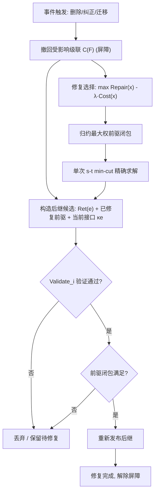

# MemoRepair：智能体记忆中的屏障优先级联修复

## 一、论文基础元数据
- **原文标题**：MemoRepair: Barrier-First Cascade Repair in Agentic Memory
- **中文译版**：MemoRepair：智能体记忆中的屏障优先级联修复
- **发表渠道**：预印本（arXiv），等级待补充（未见同行评审标注）
- **发表时间**：2025 年（具体月份待补充）
- **链接**：arXiv:2605.07242
- **作者及核心机构**：Yang Zhao、Chengxiao Dai、Mengying Kou、Yue Xiu（具体所属机构待补充）
- **研究领域**：人工智能 → 智能体系统 / 智能体记忆管理（Agentic Memory）
- **关联数据集**：
  - **ToolBench**：面向工具调用智能体的基准（规模/语言/标注待补充）
  - **MemoryArena**：面向智能体记忆场景的评测环境（规模/语言/标注待补充）

## 二、论文综合评价
### 2.1 量化评分（1-5分，5分为最优）

| 评价维度 | 评分 | 备注 |
| -------- | ---- | ---- |
| 📚 理论基础 | ⭐⭐⭐⭐ | 级联更新形式化清晰，最小割归约严谨 |
| 🎯 问题核心性 | ⭐⭐⭐⭐⭐ | 直击智能体记忆级联陈旧暴露痛点 |
| 💡 方法创新性 | ⭐⭐⭐⭐ | 首将后继发布转为前驱闭包修复选择 |
| ⚙️ 技术壁垒 | ⭐⭐⭐ | 依赖完整溯源，工程实现门槛较高 |
| 🧪 实验严谨性 | ⭐⭐⭐⭐ | 多基线多事件场景，含消融与鲁棒性 |
| 🔧 落地可行性 | ⭐⭐⭐ | 需改造现有记忆系统，集成成本较高 |
| 🚀 应用前景 | ⭐⭐⭐⭐ | 长期记忆安全与合规的刚需方向 |
| 📊 综合评分 | 4.0 | 问题新颖、理论扎实，但强依赖溯源完整与验证覆盖 |

### 2.2 定性综合评价（≤300字）
> 本文聚焦智能体持久记忆的**级联更新问题**：源工件被删除、纠正或迁移后，其派生的摘要、缓存、嵌入、技能与工具流程仍可能可见，并持续以陈旧依据引导行为。MemoRepair 提出“屏障优先”修复契约——先撤回受影响级联，再基于保留支持、已修复前驱与当前接口构造后继，仅当验证通过且满足前驱闭包时才重新发布。理论上将修复选择标量化为“修复收益−λ成本”，并证明可归约为最大权前驱闭包、由单次 s-t 最小割精确求解。实验显示，级联无感知基线普遍存在严重 Leak 与 Stale-use，而 MemoRepair 在完整溯源下实现 Leak=Stale=0，并以 0.57–0.66 的相对成本恢复 91.1–94.3% 的全修复上限。核心差异化在于把记忆更新从“检索新鲜度”提升为“级联撤回 + 验证后继语义”。

## 三、领域本体论映射
| 核心维度 | 具体内容 |
| -------- | -------- |
| 核心研究对象 | 智能体持久记忆中的派生状态（摘要、缓存输出、嵌入、技能、工具流程）及其影响溯源 |
| 核心技术路径 | 屏障优先级联撤回 → 后继构造 → 验证后前驱闭包发布；最小割修复选择 |
| 数据/载体形态 | 记忆工件、影响溯源图（influence provenance）、修复候选集 |
| 核心功能目标 | 消除源工件更新后的陈旧派生状态暴露，保证更新后记忆可见状态一致性 |
| 验证核心指标 | Leak（泄漏率）、Stale-use（陈旧使用率）、修复成本 Cost、恢复率 Rep.、任务性能差 ΔTask |

## 四、核心问题与解决方案
### 4.1 待解决的核心问题
1. **领域级根本问题**：持久智能体记忆派生出大量沉没状态，源工件更新后其可见后代仍以陈旧支持继续服务，导致行为被错误信息引导。
2. **现有方法痛点**：Mem0、Zep/Graphiti、MemR3、A-MEM、O-Mem、TierMem 等系统仅关注检索新鲜度，忽略级联撤回与验证后继语义，Leak 率高达 69.8–94.3%，Stale-use 高达 92.4–99.7%。
3. **工程落地卡点**：修复目标应是“可见派生状态”而非仅根工件；硬预算变体为 precedence-constrained knapsack（NP 难）；强依赖完整影响溯源与验证套件覆盖。

### 4.2 核心解决方案
- **理论框架**：将修复选择标量化为 \(\max_x \; Repair(x)-\lambda Cost(x)\)，约束为可执行性 \(x_i\le v_i\) 与前驱闭包 \(x_i\le x_j\)。
- **核心架构**：Barrier-first 撤回受影响级联 \(C(F)\) → 基于有效支持 \(Ret(e)\)、已修复前驱与当前接口 \(\kappa_e\) 构造后继 → 验证 \(Validate_i\) 通过且前驱闭合后重新发布。
- **关键技术**：候选 \(q_i=(\mu_i,\pi_i,P_i,v_i,w_i,c_i)\)；修复模式 \(\mu_i \in \{remove, recompute, regen, param\}\)；单次 s-t min-cut 精确求解。
- **创新机制**：将 agent memory 后继发布转化为前驱闭包选择问题，并以图割求解；贡献不在于新割算法，而在于修复契约本身。

### 4.3 核心优势（量化+定性）
1. **性能优势**：完整影响溯源下 Leak = Stale = 0，属契约级保证；基线系统普遍 70%+ 泄漏。
2. **效率优势**：相比 exhaustive Repair all，ToolBench 成本从 1.00 降至 0.57–0.66，恢复 91.1–94.3% 已验证后继，ΔTask ≤0.08；MemoryArena 删除 5.1%/0.62、纠正 33.1%/0.76、迁移 17.0%/0.64，ΔTask ≤0.07。
3. **工程优势**：以屏障隔离提供存储级陈旧服务防护；修复选择器优于 Barrier+Greedy；λ=0.3 位于成本-修复前沿拐点，便于调参。

## 五、方法与技术架构
### 5.1 核心架构设计
> 事件（删除/纠正/迁移）触发后，系统首先撤回受影响级联 \(C(F)\)，使其在修复期间不可服务（屏障）；随后基于事件后有效支持、已修复前驱与当前接口构造后继候选；最后仅当后继通过验证且其前驱闭包全部修复时才重新发布。修复选择以固定 λ 标量化，通过单次 s-t 最小割精确求解最大权前驱闭包。

### 5.2 关键技术实现细节
| 技术模块 | 实现路径 | 工程注意事项 |
| -------- | -------- | ------------ |
| 影响溯源 | 每个持久工件记录其派生所依赖的工件形成 provenance 边 | 边缺失会导致受影响后代逃逸撤回级联 |
| 屏障撤回 | 事件发生后立即撤回受影响级联 \(C(F)\)，期间不可服务 | 需快速定位级联范围，避免服务窗口过长 |
| 后继构造 | 基于 \(Ret(e)\)、已修复前驱、当前接口 \(\kappa_e\) 重建 | 需保证候选可执行且前驱闭包可满足 |
| 修复模式 | \(\mu_i \in \{remove, recompute, regen, param\}\) | param 模式对神经技能非精确参数擦除 |
| 修复选择 | 标量化 \(\max Repair(x)-\lambda Cost(x)\)，前驱闭包约束 | 硬预算为 NP 难，默认用固定 λ 选择器 |
| 最小割求解 | 归约为最大权前驱闭包，单次 s-t min-cut 求解 | 依赖图构建正确性；λ 需调优（建议 0.3） |
| 验证发布 | Validate_i 通过且前驱闭合才发布 | 验证套件覆盖有限，不代表未来上下文正确 |

### 5.3 架构优缺点
- **优点**：提供契约级零陈旧暴露保证；修复选择精确且可扩展至多种修复算子；屏障机制实现存储级隔离；min-cut 选择器优于贪心。
- **缺点**：强依赖完整影响溯源（丢弃 1% 边即 17.7% Leak）；依赖验证套件覆盖；神经技能参数级修复非精确擦除；硬预算变体 NP 难，只能标量化近似。

## 六、实验设计与结果分析
### 6.1 实验基础设置
| 维度 | 内容 |
| ---- | ---- |
| 数据集 | ToolBench、MemoryArena |
| 基线方法 | 级联无感知系统：Mem0、Zep/Graphiti、MemR3、A-MEM、O-Mem、TierMem；对照：exhaustive Repair all；消融：Barrier+Greedy |
| 实验环境 | 待补充（算力/框架/版本未在给定内容中说明） |
| 评价指标 | Leak（泄漏率）、Stale-use（陈旧使用率）、恢复率 Rep.、修复成本 Cost、任务性能差 ΔTask |

### 6.2 核心实验结果
| 方法 | 核心指标1（Leak/Stale-use） | 核心指标2（恢复率 Rep.） | 工程指标（算力/耗时） |
| ---- | --------- | --------- | -------------------- |
| Mem0 等基线（ToolBench） | Leak 69.8–93.1%；Stale-use 92.4–99.7% | — | — |
| Mem0 等基线（MemoryArena） | Leak 73.9–94.3%；Stale-use 93.2–99.6% | — | — |
| Repair all（ToolBench） | Leak=Stale=0 | 100%（上限） | Cost=1.00 |
| MemoRepair（ToolBench） | Leak=Stale=0 | 91.1–94.3% | Cost 0.57–0.66，ΔTask≤0.08 |
| MemoRepair（MemoryArena 删除） | Leak=Stale=0 | 5.1% | Cost 0.62，ΔTask≤0.07 |
| MemoRepair（MemoryArena 纠正） | Leak=Stale=0 | 33.1% | Cost 0.76，ΔTask≤0.07 |
| MemoRepair（MemoryArena 迁移） | Leak=Stale=0 | 17.0% | Cost 0.64，ΔTask≤0.07 |

> 注：MemoryArena 的恢复率（5.1%/33.1%/17.0%）显著低于 ToolBench，可能反映不同事件类型与验证约束下的修复难度差异，具体原因待补充。

### 6.3 消融实验/鲁棒性分析
| 实验变体 | 指标变化 | 核心结论 |
| -------- | -------- | -------- |
| MemoRepair vs Barrier+Greedy | MemoRepair 更优 | min-cut selector 有效，优于贪心选择 |
| λ=0.3 | 位于成本-修复前沿拐点 | 权衡参数合理，推荐取该值 |
| 丢弃 1% 影响边 | Leak 升至 17.7% | 溯源完整性是核心前提，小 \(p_{\mathrm{drop}}\) 下类似缩放 |
| 参数修复（param） | 继承所选参数级算子的保证与失败模式 | 存储级契约不等于精确参数擦除 |

### 6.4 实验结论（工程视角）
MemoRepair 在完整影响溯源前提下可实现契约级零泄漏与零陈旧使用，并以较低修复成本恢复大部分全修复上限。但其有效性高度依赖两个工程前提：**溯源边完整性**（1% 丢失即 17.7% 泄漏）与**验证套件覆盖度**。工程部署应优先保证溯源写入不丢失，并在验证套件上持续投入；对神经技能的参数级修复应避免误解为精确擦除。MemoryArena 恢复率偏低提示不同事件类型下修复难度差异大，需按场景调参。

## 七、领域贡献与创新点
| 贡献层级 | 具体内容 |
| -------- | -------- |
| 理论贡献 | 形式化级联更新问题；证明标量化修复选择可归约为最大权前驱闭包并由单次 s-t min-cut 精确求解；指出硬预算变体为 precedence-constrained knapsack |
| 方法/架构贡献 | 提出 Barrier-first 级联修复契约（先撤回、再修复、验证后前驱闭包发布）；支持 remove/recompute/regen/param 四种修复算子 |
| 数据/工具贡献 | 待补充（未提及开源数据集或工具发布） |
| 实验/验证贡献 | 在 ToolBench 与 MemoryArena 上系统评测 6 个级联无感知基线，揭示检索新鲜度≠级联撤回；完成选择器消融与溯源丢失鲁棒性分析 |
| 工程落地贡献 | 为智能体记忆更新提供可证明的存储级隔离边界与成本可控的修复策略；给出 λ=0.3 等可操作参数建议 |

## 八、局限性与风险
| 维度 | 具体描述 | 应对思路 |
| ---- | -------- | -------- |
| 学术局限性 | 依赖完整影响溯源；依赖验证套件覆盖，通过检查不保证未来上下文语义正确；神经技能参数级修复非精确擦除 | 研究不完整溯源下的修复策略；构建更完备验证套件；探索精确参数擦除 |
| 工程落地风险 | 现有记忆系统需改造以记录溯源；溯源写入开销与存储成本；硬预算场景无法精确求解 | 增量集成溯源；设计低成本 provenance 结构；标量化近似 + 人工审核 |
| 伦理/合规风险 | 删除不彻底可能导致隐私数据残留；陈旧信息误导用户决策 | 结合精确擦除技术；对高风险场景强制全修复（Repair all） |

## 九、未来研究/落地方向
| 方向类型 | 具体内容 | 优先级 |
| -------- | -------- | ------ |
| 科研拓展 | 不完整/含噪溯源下的级联修复理论与算法；神经技能精确参数擦除；硬预算下的近似算法 | 高 |
| 工程优化 | 降低溯源记录开销；自动化验证套件生成；多事件并发下的屏障调度 | 中 |
| 跨领域适配 | 适配 RAG 知识库、多智能体协作记忆、企业级数据血缘系统 | 中 |

## 十、关键词与术语表
| 语言 | 关键词 |
| ---- | ------ |
| 中文 | 智能体记忆、级联更新、屏障优先、前驱闭包、最小割、影响溯源、陈旧暴露 |
| 英文 | Agentic Memory, Cascade Update, Barrier-First, Precedence Closure, Min-Cut, Influence Provenance, Stale Exposure |
| 领域专属术语 | **级联更新问题（Cascade Update Problem）**：根工件更新对其可见后代产生修复义务，修复目标为可见派生状态；**屏障优先（Barrier-First）**：事件后先撤回受影响级联使其不可服务，再行修复；**前驱闭包（Precedence Closure）**：后继仅在其全部前驱已修复后才可发布；**影响溯源（Influence Provenance）**：记录每个派生工件所依赖工件的边集合；**修复算子 μ**：remove/recompute/regen/param 四类修复动作 |

## 十一、参考文献与关联资源
- **核心参考文献**：待补充（给定内容未列出具体引用文献）
- **补充阅读**：文中提及的对比系统 Mem0、Zep/Graphiti、MemR3、A-MEM、O-Mem、TierMem 原文
- **开源代码/工具**：待补充（未提及开源发布）

## 十二、阅读者批注
1. **科研启发**：将记忆更新的后继发布问题精确归约为图割/闭包选择，是把系统一致性问题“形式化+可解化”的范例，可迁移至 RAG、数据血缘、缓存一致性等场景。
2. **工程落地思考**：核心成本在溯源写入与验证套件维护；建议在现有记忆系统中以“写溯源边”为最小改造点，先做屏障撤回，再逐步引入 min-cut 选择器；高风险场景可退化为 Repair all。
3. **待验证/存疑点**：MemoryArena 恢复率为何远低于 ToolBench；验证套件如何构造与评估覆盖率；param 修复失败模式的具体表现；并发多事件下屏障与闭包的交互。
4. **个人/团队应用场景**：长期运行的智能体助手（知识库频繁更新）、工具 API 迁移后的缓存清理、合规要求下的用户数据删除传导。

## 十三、阅读元信息
| 维度 | 内容 |
| ---- | ---- |
| 阅读日期 | 2026-09-30 21:33 |
| 阅读人 | xPaperReader AI |
| 文档编号 | arxiv-2605.07242 |
| 版本迭代 | v1.0 |