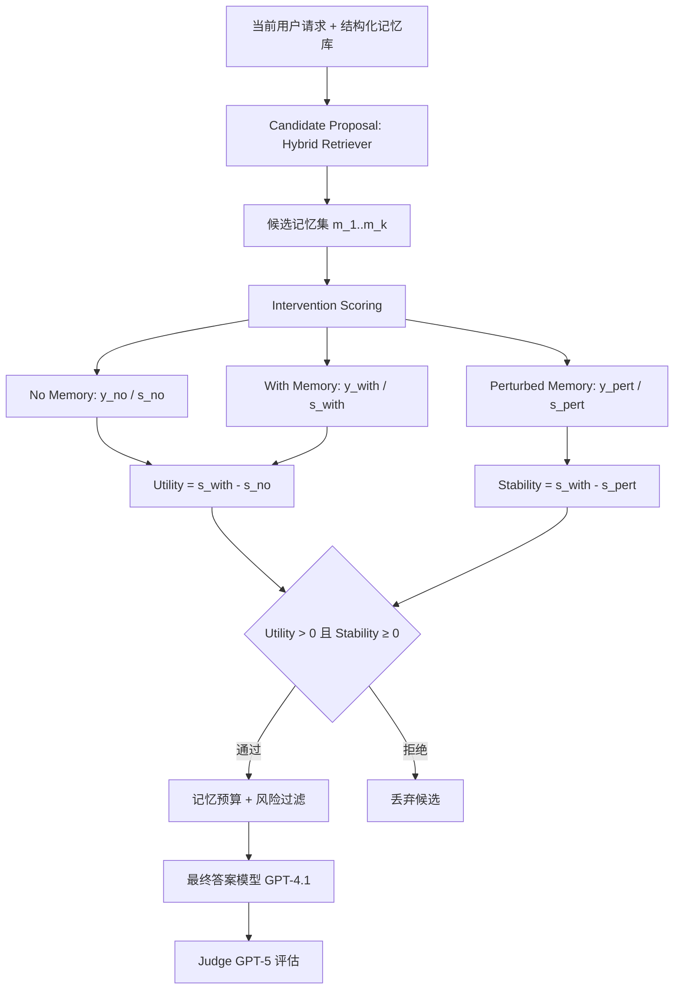

# 基于因果干预的长时程 LLM Agent 记忆选择

## 一、论文基础元数据

- **原文标题**：Causal Intervention-Based Memory Selection for Long-Horizon LLM Agents
- **中文译版**：基于因果干预的长时程 LLM Agent 记忆选择
- **发表渠道**：arXiv 预印本（未提及正式会议/期刊收录，待补充）
- **发表时间**：2025 年
- **链接**：arXiv:2605.17641
- **作者及核心机构**：Saksham Sahai Srivastava（机构信息待补充）
- **研究领域**：
  - 一级领域：人工智能 / 大语言模型
  - 二级子领域：LLM Agent 长期记忆管理、因果推理与检索增强生成（RAG）
- **关联数据集**：
  - **Causal-LoCoMo**（论文自建基准）
    - 来源：由 LoCoMo 长对话 QA 数据集转化而来
    - 规模：87 个过滤样本、432 个过去会话、491 条记忆（89 useful / 348 irrelevant / 54 harmful）
    - 语言：英文（基于 LoCoMo 原始语料）
    - 标注：每条记忆带因果角色标签（useful / irrelevant / harmful）
    - 任务分布：46 temporal、25 multi-evidence、14 inferential、2 factual

## 二、论文综合评价

### 2.1 量化评分（1-5分，5分为最优）

| 评价维度 | 评分 | 备注 |
| -------- | ---- | ---- |
| 📚 理论基础 | ⭐⭐⭐⭐ | 因果干预框架引入记忆选择，理论动机清晰但偏应用 |
| 🎯 问题核心性 | ⭐⭐⭐⭐⭐ | 直击长时程 Agent 记忆可靠性核心痛点 |
| 💡 方法创新性 | ⭐⭐⭐⭐⭐ | 从"相似度检索"跃迁到"因果效用+稳定性"筛选 |
| ⚙️ 技术壁垒 | ⭐⭐⭐ | 多轮 pre-answer 干预，算力壁垒可控但成本高 |
| 🧪 实验严谨性 | ⭐⭐⭐ | 87 例小规模受控评测，依赖 gold 角色标注 |
| 🔧 落地可行性 | ⭐⭐⭐ | 需金标角色+多次干预调用，部署成本待解决 |
| 🚀 应用前景 | ⭐⭐⭐⭐ | 对可靠长期记忆系统与 AI 安全有启发意义 |
| 📊 综合评分 | 3.9 | 创新性突出，但受限于小规模受控基准与标注依赖 |

### 2.2 定性综合评价（≤300字）

> 该论文面向长时程 LLM Agent 的记忆选择难题，提出 **Causal Memory Intervention（CMI）**，将记忆选择重新定义为因果决策问题：通过"无记忆 / 有候选记忆 / 扰动记忆"三种条件的干预对比，估计每条记忆对当前回答的**因果效用**与**扰动稳定性**，仅保留效用为正且稳定的记忆。论文同时构建了带因果角色标注的 **Causal-LoCoMo** 基准，并首次将答案质量与记忆选择行为（毒记忆采纳率、坏记忆拒绝率）纳入统一评估。实验显示 CMI 以平均仅 0.943 条记忆实现最高任务分（0.846）、最高 useful-memory F1（0.875）及零毒记忆采纳。核心价值在于揭示"上下文更多≠记忆使用更可靠"，为可靠长期记忆系统提供了可解释的筛选范式。差异化优势是因果性而非相关性。局限在于依赖 gold 角色标注、基准规模小、真实失效场景覆盖不足。

## 三、领域本体论映射

| 核心维度 | 具体内容 |
| -------- | -------- |
| 核心研究对象 | 长时程 LLM Agent 在长对话历史中的记忆选择机制 |
| 核心技术路径 | 因果干预（causal intervention）+ 混合检索候选 + 效用/稳定性打分筛选 |
| 数据/载体形态 | 结构化记忆库（文本条目 + 因果角色标签）+ 长对话会话历史 |
| 核心功能目标 | 从记忆库中选出对当前请求**因果有用且稳定**的最少记忆 |
| 验证核心指标 | Task Score、Success Rate、Useful F1、Bad Memory Rejection、Poisoned Memory Adoption、Avg Selected Memories |

## 四、核心问题与解决方案

### 4.1 待解决的核心问题

1. **领域级根本问题**：长时程 LLM Agent 的记忆检索范式将"语义相关"等价于"有用"，但语义相似性无法区分**真正支持答案**的记忆与**主题相近却误导**的记忆，导致长期记忆系统不可靠。
2. **现有方法痛点**：
   - 向量/图检索：易被"共享实体/时间表达但答案错误"的毒记忆欺骗，毒记忆采纳率高达 0.54–0.61。
   - 摘要记忆：丢失细粒度信息，任务分仅 0.723。
   - 全历史提示：上下文稀释证据，任务分仅 0.515，成功率仅 0.218。
   - 反思式记忆：机制非 LLM 自反思，且易采信干扰项。
3. **工程落地卡点**：真实部署中缺少 gold 记忆角色标注；CMI 需多次 pre-answer 干预调用，带来额外延迟与 token 成本；隐私与溯源要求高。

### 4.2 核心解决方案

- **理论框架**：将记忆选择建模为**因果干预问题**——判断一条记忆的"加入"是否真的改变答案得分，并检验该改变在扰动下是否稳定。
- **核心架构**：Candidate Proposal（混合检索宽召回）→ Intervention Scoring（三条件对比）→ Constraint Filtering（效用>0、稳定性≥0、记忆预算与风险过滤）→ Final Answer（GPT-4.1）。
- **关键技术**：
  - 混合检索构造候选记忆集；
  - 无记忆 / 有记忆 / 扰动记忆三条件对比评分；
  - 效用 $Utility(m_i)=s_{with}-s_{no}$、稳定性 $Stability(m_i)=s_{with}-s_{pert}$；
  - 干预仅用确定性任务分数，GPT-5 judge 仅用于最终报告。
- **创新机制**：把"哪些记忆最相似"替换为"哪些记忆真正改善当前回答"，并引入扰动稳定性作为鲁棒性判据，实现"高任务分 + 零毒记忆采纳"。

### 4.3 核心优势（量化+定性）

1. **性能优势**：Task Score 0.846、Success 0.816、Useful F1 0.875 均居首；Poisoned Memory Adoption = 0.000。
2. **效率优势**：平均仅选 0.943 条记忆（远低于其他方法的 3.0–5.644 条），性能提升不来自扩张上下文。
3. **工程优势**：给出可解释的记忆选用依据（因果效用 + 稳定性），并提供准确率-鲁棒性权衡视角，便于风控与审计。

## 五、方法与技术架构

### 5.1 核心架构设计

> CMI 整体流程：先以混合检索器从结构化记忆库中宽召回候选记忆；随后对每条候选记忆执行三种条件的干预评分（无记忆、有候选记忆、扰动记忆）；依据效用与稳定性阈值筛选记忆；最终交给答案模型生成响应，并由 judge 评估。

### 5.2 关键技术实现细节

| 技术模块 | 实现路径 | 工程注意事项 |
| -------- | -------- | ------------ |
| 候选提议（Candidate Proposal） | Hybrid Retriever 宽召回，避免早期漏检有用记忆 | 召回宽度与后续干预次数的成本权衡 |
| 干预评分（Intervention Scoring） | 对每个候选记忆构造 no/with/pert 三种条件，比较确定性任务分数 | 引用扰动构造细节待补充；需固定 temperature=0 保证可比 |
| 效用计算 | $Utility=s_{with}-s_{no}$ | 使用确定性评分而非 judge，避免主观偏差 |
| 稳定性计算 | $Stability=s_{with}-s_{pert}$ | 记忆预算与风险过滤联合约束 |
| 风险信号 | 实验采用 gold useful/irrelevant/harmful 标注；部署需替换为**预测**的因果角色 | 部署时角色预测准确性是最大不确定性 |
| 依赖组件 | 最终回答 GPT-4.1；Judge GPT-5；向量检索 text-embedding-3-large；temperature=0 | 多模型依赖，成本与可复现性风险 |

### 5.3 架构优缺点

- **优点**：
  - 从"相似性"转向"因果性"，天然抑制毒记忆；
  - 记忆数量极少（0.943），上下文经济；
  - 效用/稳定性可量化、可解释，便于审计。
- **缺点**：
  - 每条记忆需多次 pre-answer 干预调用，推理开销显著；
  - 依赖 gold 记忆角色标注，未解决无标签场景；
  - 扰动构造细节与确定性评分定义在所选章节未完全明确（待补充）。

## 六、实验设计与结果分析

### 6.1 实验基础设置

| 维度 | 内容 |
| ---- | ---- |
| 数据集 | Causal-LoCoMo（87 样本 / 432 会话 / 491 记忆；89 useful、348 irrelevant、54 harmful） |
| 基线方法 | No Memory、Full History、Summary Memory、Vector Memory、Graph Memory、Reflection Memory |
| 实验环境 | 最终回答：GPT-4.1；Judge：GPT-5；向量检索：text-embedding-3-large；temperature=0 |
| 评价指标 | Task Score（0.7×确定性评分 + 0.3×GPT-5 judge 评分）、Success Rate（混合分数≥0.7）、Useful F1、Bad Memory Rejection、Poisoned Memory Adoption、Avg Selected Memories |

### 6.2 核心实验结果

| 方法 | Task Score | Success Rate / Useful F1 | 工程指标（Avg Selected Memories） |
| ---- | --------- | --------- | -------------------- |
| No Memory | 0.429 | 0.034 / 0.000 | 0.000 |
| Full History | 0.515 | 0.218 / 0.308 | 5.644 |
| Summary Memory | 0.723 | 0.586 / 0.308 | 5.644 |
| Graph Memory | 0.824 | 0.759 / 0.469 | 3.000 |
| Vector Memory | 0.839 | 0.782 / 0.501 | 3.000 |
| Reflection Memory | 0.845 | 0.793 / 0.486 | 3.000 |
| **CMI（本文方法）** | **0.846** | **0.816 / 0.875** | **0.943** |

- 补充指标：CMI 的 Bad Memory Rejection = 0.990，Poisoned Memory Adoption = 0.000；Vector/Graph/Reflection 的毒记忆采纳率分别为 0.609 / 0.586 / 0.540。

### 6.3 消融实验/鲁棒性分析

| 实验变体 | 指标变化 | 核心结论 |
| -------- | -------- | -------- |
| Useful 记忆干预 | 平均效用 +0.307，稳定性 +0.027 | CMI 能识别真正有用的记忆 |
| Irrelevant 记忆干预 | 平均效用 −0.009，稳定性 0.000 | 无关记忆被有效过滤 |
| Harmful 记忆干预 | 平均效用 −0.033，稳定性 +0.001 | 有害记忆被抑制，不进入最终上下文 |
| Multi-evidence QA | CMI 0.754，最佳 | 多证据场景最能体现因果筛选优势 |
| Temporal QA | Vector 0.925 > CMI 0.901 | 时序任务向量检索仍有优势 |
| Inferential QA | Reflection 0.823 > CMI 0.808 | 推理型任务反思式记忆略占优 |
| Factual QA | CMI/Vector/Summary 均 0.985 | 仅 2 例，结论需谨慎 |

> 说明：论文未提供传统意义的组件消融表（如去掉扰动、去掉稳定性约束），上述"消融/诊断"以记忆角色分层干预效果呈现。

### 6.4 实验结论（工程视角）

- CMI 的核心增益来源于**改变记忆选择标准**，而非增加上下文；增加上下文（Full History/Summary）反而降低任务表现。
- 在**多证据 QA** 这一最需要"识别支持记忆 + 忽略干扰"的场景下 CMI 最优，符合其设计动机。
- 时序任务与推理任务仍是开放边界；在实际工程部署中，应考虑按任务族路由不同记忆策略。
- 零毒记忆采纳率是最具工程价值的指标，直接对应长期记忆系统的**安全与可信**属性。

## 七、领域贡献与创新点

| 贡献层级 | 具体内容 |
| -------- | -------- |
| 理论贡献 | 将长时程 Agent 记忆选择从"相似度检索"重新定义为"因果干预决策问题" |
| 方法/架构贡献 | 提出 CMI：no/with/pert 三条件干预，用效用与稳定性联合筛选记忆 |
| 数据/工具贡献 | 构建 Causal-LoCoMo——首个（据论文）带 useful/irrelevant/harmful 因果角色标注的长对话记忆选择基准 |
| 实验/验证贡献 | 在统一评测下同时报告答案质量与记忆选择行为（毒记忆采纳、坏记忆拒绝） |
| 工程落地贡献 | 揭示"上下文越多≠记忆使用越可靠"，指出记忆选择应兼顾因果性、稳定性与安全性 |

## 八、局限性与风险

| 维度 | 具体描述 | 应对思路 |
| ---- | -------- | -------- |
| 学术局限性 | 依赖 gold 记忆角色标注；未证明能从原始记忆推断因果角色；基准仅 87 例，覆盖 temporal/multi-evidence/inferential QA | 研发无监督/自监督的因果角色预测器；扩充更大、更真实的基准 |
| 工程落地风险 | 需多次 pre-answer 干预，延迟与 token 成本高；扰动构造与确定性评分细节待补充；对 GPT-5 judge 有依赖 | 蒸馏/近似干预；缓存不变记忆的干预结果；设计轻量扰动策略 |
| 伦理/合规风险 | 有害记忆为**合成注入**，未必代表真实攻击；长期记忆涉及敏感信息，存在隐私泄露、偏见固化、有害残留风险 | 引入同意、访问控制、保留限制、溯源、检查/纠正/删除机制；审计偏见与残留 |

## 九、未来研究/落地方向

| 方向类型 | 具体内容 | 优先级 |
| -------- | -------- | ------ |
| 科研拓展 | 从原始记忆中**预测**因果角色，摆脱 gold 标注依赖 | 高 |
| 科研拓展 | 覆盖过时偏好、错误摘要、实体链接错误、冲突更新、长期记忆漂移等失效场景 | 高 |
| 工程优化 | 降低干预调用的计算与延迟成本（缓存、蒸馏、近似干预） | 高 |
| 工程优化 | 构建可溯源、可删除、可审计的长期记忆治理机制 | 中 |
| 跨领域适配 | 迁移至医疗、金融、法律等对记忆可靠性敏感的高风险垂直领域 | 中 |
| 跨领域适配 | 适配多模态长时程记忆（图文音混合） | 低-中 |

## 十、关键词与术语表

| 语言 | 关键词 |
| ---- | ------ |
| 中文 | 长时程 LLM Agent、记忆选择、因果干预、因果效用、扰动稳定性、毒记忆、长期记忆、检索增强生成 |
| 英文 | Long-Horizon LLM Agents、Memory Selection、Causal Intervention、Causal Utility、Stability under Perturbation、Poisoned Memory、Long-Term Memory、RAG |
| 领域专属术语 | **CMI（Causal Memory Intervention）**：通过对比无记忆/有记忆/扰动记忆三种条件下的任务得分，估计记忆的因果效用与稳定性并据此筛选的记忆选择方法。 **Causal-LoCoMo**：由 LoCoMo 长对话 QA 转化、带 useful/irrelevant/harmful 因果角色标注的记忆选择基准。 **Utility**：$s_{with}-s_{no}$，衡量记忆加入后对确定性任务分数的提升。 **Stability**：$s_{with}-s_{pert}$，衡量记忆在扰动条件下保持效果的程度。 **Poisoned Memory Adoption Rate**：最终答案采纳有害记忆的比例。 **Bad Memory Rejection Rate**：被正确拒绝的坏记忆比例。 |

## 十一、参考文献与关联资源

- **核心参考文献**：
  - Maharana et al., 2024 —— LoCoMo 长对话数据集（Causal-LoCoMo 的来源）
  - 论文对比的记忆基线相关工作：Vector Memory（RAG 式）、Graph Memory、Reflection Memory、Summary Memory、Full History 对比方法
- **补充阅读**：因果推断 / 因果干预在 NLP 与 LLM 应用中的相关工作（论文参考文献待补充）
- **开源代码/工具**：待补充（论文未明确提及开源仓库）

## 十二、阅读者批注

1. **科研启发**：将"检索-排序"重新概念化为"因果决策"，是一条可迁移到工具调用、检索增强、检索路由等决策型组件的思路；扰动稳定性作为鲁棒性度量，可推广到其他上下文筛选任务。
2. **工程落地思考**：CMI 的核心瓶颈不在理论而在成本——每条记忆需多次 pre-answer 调用。可行的折中方案是先粗筛（相似度/图/规则）后精筛（因果干预），或对不敏感记忆做干预结果缓存。
3. **待验证/存疑点**：
   - 扰动记忆的具体构造方式？
   - "确定性任务分数"的定义与计算？
   - 87 例样本，尤其是 Factual QA 仅 2 例，结论是否具备统计显著性？
   - 换用不同答案模型/Judge 后结论是否可迁移？
   - 去 gold 标注后（预测因果角色）性能下降幅度如何？
4. **个人/团队应用场景**：适合长期陪伴型 Agent、企业知识助手、跨会话客服系统等场景；在团队内部的 RAG 系统中，可作为"记忆-上下文安全过滤器"的先验设计，先在离线评估中验证。

## 十三、阅读元信息

| 维度 | 内容 |
| ---- | ---- |
| 阅读日期 | 2026-09-30 21:36 |
| 阅读人 | xPaperReader AI |
| 文档编号 | arxiv-2605.17641 |
| 版本迭代 | v1.0 |