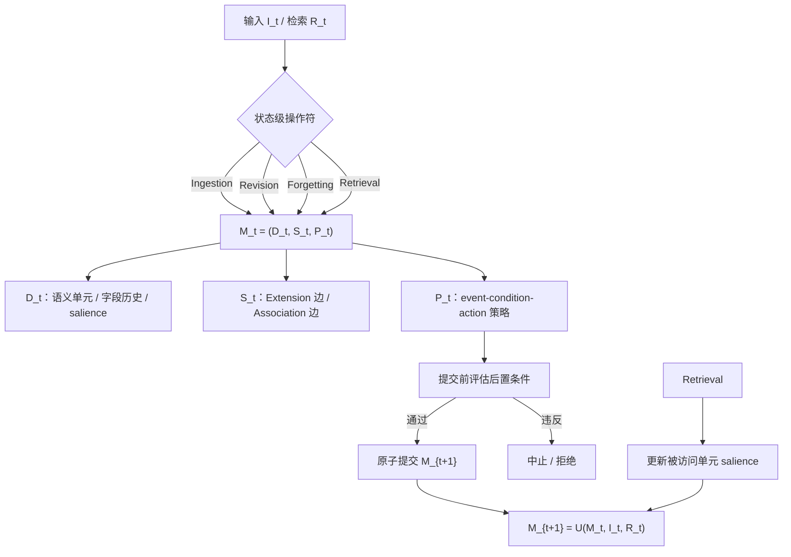

# 智能体记忆是数据库吗？重构长期 AI 智能体记忆的数据基础

## 一、论文基础元数据
- 原文标题：Is Agent Memory a Database? Rethinking Data Foundations for Long-Term AI Agent Memory
- 中文译版：智能体记忆是数据库吗？重构长期 AI 智能体记忆的数据基础
- 发表渠道：arXiv 预印本（等级：预印本，尚未见同行评审信息；待补充）
- 发表时间：2025（元数据标注；arXiv ID 前缀 2605 与年份存在不一致，待核实）
- 链接：https://arxiv.org/abs/2605.26252
- 作者及核心机构：Abdelghny Orogat, Essam Mansour；核心机构待补充
- 研究领域：一级领域：计算机科学 / 数据管理与数据库；二级子领域：AI Agent 长期记忆、数据模型、事务与一致性、属性图系统
- 关联数据集：论文未提及具体数据集；待补充

## 二、论文综合评价

### 2.1 量化评分（1-5分，5分为最优）

| 评价维度 | 评分 | 备注 |
| -------- | ---- | ---- |
| 📚 理论基础 | ⭐⭐⭐⭐ | 形式化清晰，但结构性观察非定理 |
| 🎯 问题核心性 | ⭐⭐⭐⭐⭐ | 直击 Agent 记忆数据管理空白 |
| 💡 方法创新性 | ⭐⭐⭐⭐⭐ | 提出 GEM 抽象与检索即写 |
| ⚙️ 技术壁垒 | ⭐⭐⭐ | 依赖原生引擎能力，工程复杂 |
| 🧪 实验严谨性 | ⭐⭐ | 缺少量化实验与可复现数据 |
| 🔧 落地可行性 | ⭐⭐⭐ | 原型基于 Kuzu，生产化待验证 |
| 🚀 应用前景 | ⭐⭐⭐⭐⭐ | 长期 Agent 记忆是刚需方向 |
| 📊 综合评分 | 3.9 | 愿景型论文，抽象贡献突出，实验验证不足 |

### 2.2 定性综合评价（≤300字）
> 该论文是一篇愿景/立场型研究，将长期 AI Agent 记忆从“存储 / CRUD”重新定位为独立数据管理工作负载 GEM。核心价值在于提出状态轨迹正确性、四个状态级操作符与六条正确性条件，并指出现有记录级系统在原则上难以同时满足 C5/C6 等条件。差异化优势是以 MemState 原型在属性图后端上验证抽象，并揭示原生记忆引擎应具备 bitemporal 字段历史、类型化传播边、提交时策略编译和 read-modify-write 检索原语。关键结论：Agent 记忆不是普通数据库问题；正确性属于轨迹级，检索应视为写，遗忘应分级衰减，修订应沿语义依赖传播。主要短板是缺少量化实验与完整形式化证明，落地依赖原生引擎。

## 三、领域本体论映射

| 核心维度 | 具体内容 |
| -------- | -------- |
| 核心研究对象 | 长期 AI Agent 记忆的状态轨迹与数据管理抽象 |
| 核心技术路径 | GEM 形式化、四操作符、六条正确性条件、MemState 原型、Kuzu 属性图后端 |
| 数据/载体形态 | 演化主题图 \(M_t=(D_t,S_t,P_t)\)，含字段历史、salience、类型化边、策略规则 |
| 核心功能目标 | 轨迹级正确、可审计、可演化、活跃状态有界、检索诱发适应 |
| 验证核心指标 | C1-C6 正确性条件、活跃状态上界 \(\beta(n)\)、策略提交一致性、溯源可达性 |

## 四、核心问题与解决方案

### 4.1 待解决的核心问题
1. **领域级根本问题**：长期 Agent 记忆尚未被作为一等数据管理工作负载处理；现有数据库范式默认正确性属于单条记录、嵌入或边，而非状态轨迹。
2. **现有方法痛点**：存在四类失败模式——无管制增长、缺少语义修订、容量驱动遗忘、只读检索；分别需要相关性驱动保留、依赖感知传播、分级衰减、状态修改型检索。
3. **工程落地卡点**：记录级 CRUD 难以同时强制轨迹级条件；策略需在提交时检查，检索需被视为写操作，遗忘不能破坏性删除，修订需沿语义依赖传播；现有后端多为兼容层而非原生 GEM 引擎。

### 4.2 核心解决方案
- 理论框架：Governed Evolving Memory（GEM），将记忆状态定义为 \(M_t=(D_t,S_t,P_t)\)，演化定义为 \(M_{t+1}=U(M_t,I_t,R_t)\)。
- 核心架构：内容 \(D_t\)、结构 \(S_t\)、策略 \(P_t\) 三层统一；状态轨迹 \(\{M_t\}\) 作为正确性判定单元。
- 关键技术：四个状态级操作符 Ingestion、Revision、Forgetting、Retrieval；六条正确性条件 C1-C6；声明式策略 \(\langle event, condition, action\rangle\)；类型化边传播；字段级历史。
- 创新机制：检索作为写并更新 salience；遗忘采用压缩、隐藏、归档等分级衰减；修订沿语义依赖传播；提交前评估策略后置条件，违反则中止。

### 4.3 核心优势（量化+定性）
1. **性能优势**：设计上默认返回最新非归档值，历史值仅显式请求时出现，有助于查询一致性与轨迹健全；检索访问更新 salience，重复检索降低被衰减资格（论文未提供量化性能数据）。
2. **效率优势**：自包含主题聚合一个概念的所有字段，减少跨节点重建；字段历史采用追加而非覆盖；分级遗忘控制活跃集规模，归档仍可恢复。
3. **工程优势**：策略声明式可增删改；溯源链保留；主题可提升演化；原子提交把 C2 提升为数据模型级保证；C1/C2/C4 声称由构造保证。

## 五、方法与技术架构

### 5.1 核心架构设计
> MemState 将 Agent 记忆建模为可演化主题图：内容层 \(D_t\) 由语义单元组成，维护字段值历史与 salience；结构层 \(S_t\) 包含 Extension 边和 Association 边，其中 Extension 边承载蕴含与传播语义；策略层 \(P_t\) 以事件-条件-动作规则约束状态转换。四个状态级操作符统一通过事件 dispatch 到 ingest / revise / forget / retrieve 分支，并在事务内对提议的 \(M_{t+1}\) 评估策略，原子提交或中止。

### 5.2 关键技术实现细节

| 技术模块 | 实现路径 | 工程注意事项 |
| -------- | -------- | ------------ |
| 内容数据 \(D_t\) | 语义单元含标题、摘要、稠密嵌入、字段及值历史 \(H_{i,j}=\langle(v,t,\pi)\rangle\)；默认返回最新值 \(v_k\) | 追加写而非覆盖；历史与来源显式查询；维护 salience 信号 |
| 结构 \(S_t\) | Extension 边表示存在蕴含关系的主题；Association 边表示相关但独立的主题 | 传播仅沿 Extension 边，避免沿相关性边错误传播 |
| 策略 \(P_t\) | 以 \(\langle event, condition, action\rangle\) 规则存在；提交 \(M_{t+1}\) 前评估后置条件，违反则拒绝 | 策略可增删改；事务内评估；注意策略冲突、条件可判定性与执行开销 |
| 四个操作符 | Ingestion 客户端同步；Revision / Forgetting 异步策略触发；Retrieval 客户端同步并更新 salience | Retrieval 需 read-modify-write；Forgetting 分级压缩/隐藏/归档，不破坏性删除 |
| 依赖组件 | Kuzu 嵌入式属性图引擎；事务原子提交 | Kuzu 是兼容层而非 GEM 原生表达；原生引擎需支持 bitemporal、传播语义、策略编译等 |

### 5.3 架构优缺点
- 优点：轨迹级正确性抽象清晰；检索作为写、遗忘分级、修订传播等机制贴合长期记忆需求；策略声明式且提交时校验；溯源和字段历史有利于审计。
- 缺点：原型基于 Kuzu 兼容层，非 GEM 原生引擎；缺少大规模性能、并发、策略冲突检测实验；形式化以结构性观察为主，未给出完整定理证明；多 Agent 共享显著性下的隐私问题未解。

## 六、实验设计与结果分析

### 6.1 实验基础设置

| 维度 | 内容 |
| ---- | ---- |
| 数据集 | 论文分组分析未提供具体数据集；待补充 |
| 基线方法 | 分析中提到与 Zep 的实体粒度设计对比，但未给出明确实验基线结果；待补充 |
| 实验环境 | MemState 原型基于 Kuzu 嵌入式属性图引擎；具体硬件、版本、参数待补充 |
| 评价指标 | 六条正确性条件 C1-C6、轨迹级正确性、活跃状态有界 \(\beta(n)\)、策略提交一致性、溯源可达性；量化指标待补充 |

### 6.2 核心实验结果

| 方法 | 核心指标1 | 核心指标2 | 工程指标（算力/耗时） |
| ---- | --------- | --------- | -------------------- |
| 基线1（Zep 等实体粒度方案） | 待补充 | 待补充 | 待补充 |
| 基线2 | 待补充 | 待补充 | 待补充 |
| 本文方法（MemState） | 作者声明 C1/C2/C4 由构造保证，C5/C6 在转换下成立，C3 由策略传播支持；非量化实验 | 轨迹级正确性待补充 | 基于 Kuzu，具体算力/耗时待补充 |

> 说明：以上为论文声称与原型设计目标，分组分析未提供可复现实验数据，不能视为已量化验证结果。

### 6.3 消融实验/鲁棒性分析

| 实验变体 | 指标变化 | 核心结论 |
| -------- | -------- | -------- |
| 待补充 | 待补充 | 论文未提供消融实验数据 |
| 待补充 | 待补充 | 论文未提供鲁棒性量化分析 |

### 6.4 实验结论（工程视角）
论文的核心验证偏概念与原型可行性，主要证明显式抽象层面的缺口：记录级系统难以满足 GEM 的轨迹级条件，MemState 在属性图后端上展示了 C1/C2/C4 的构造性保证思路。但尚无量化实验证明其在规模、并发、延迟、吞吐、策略冲突处理等方面的工程表现。若用于生产，需要补充性能基准、故障恢复、策略编译开销与多 Agent 共享记忆隔离实验。

## 七、领域贡献与创新点

| 贡献层级 | 具体内容 |
| -------- | -------- |
| 理论贡献 | 提出 GEM 抽象，将 Agent 记忆正确性从记录级提升到状态轨迹级；给出四操作符与六条正确性条件 C1-C6 |
| 方法/架构贡献 | 提出 MemState 数据模型：自包含主题、字段级历史、类型化边、声明式策略、检索即写机制 |
| 数据/工具贡献 | 在 Kuzu 属性图引擎上实现可行性原型；未提及公开数据集或开源工具状态 |
| 实验/验证贡献 | 通过结构性观察论证记录级系统与 GEM 条件之间的缺口；缺少量化实验 |
| 工程落地贡献 | 指出原生记忆引擎应具备的能力：bitemporal 属性、传播语义边、策略后条件编译、read-modify-write 原语 |

## 八、局限性与风险

| 维度 | 具体描述 | 应对思路 |
| ---- | -------- | -------- |
| 学术局限性 | 结构性观察非定理；缺少完整形式化证明与量化实验；正确性条件在真实负载下的可满足性未验证 | 补充形式化证明、轨迹级评估基准与大规模实验 |
| 工程落地风险 | Kuzu 只是兼容层，非 GEM 原生表达；策略提交检查、传播语义、bitemporal、检索写 salience 均增加复杂度和开销 | 设计原生存储引擎；将策略编译进提交协议；做性能与并发基准 |
| 伦理/合规风险 | 长期记忆持久化涉及隐私、删除权、遗忘合规；多 Agent 共享显著性可能泄露敏感关联 | 引入隐私保护、可验证删除、共享显著性隔离与审计机制 |

## 九、未来研究/落地方向

| 方向类型 | 具体内容 | 优先级 |
| -------- | -------- | ------ |
| 科研拓展 | 轨迹级正确性与评估标准；GEM 条件的形式化定理；共享显著性下的隐私 | 高 |
| 工程优化 | 原生记忆引擎：bitemporal 字段历史、类型化传播边、策略后条件编译、read-modify-write 检索原语 | 高 |
| 跨领域适配 | 多 Agent 系统、个性化助手、企业知识管理、长期对话代理 | 中 |

## 十、关键词与术语表

| 语言 | 关键词 |
| ---- | ------ |
| 中文 | 智能体记忆、数据管理、可治理演化记忆、状态轨迹、属性图、事务、显著性、溯源 |
| 英文 | Agent Memory, Data Management, Governed Evolving Memory, State Trajectory, Property Graph, Transaction, Salience, Provenance |
| 领域专属术语 | GEM：Governed Evolving Memory，受治理的演化记忆工作负载；MemState：论文提出的原型数据模型；\(M_t=(D_t,S_t,P_t)\)：记忆状态三元组；salience：显著性，影响遗忘与检索强化；provenance：来源/溯源；bitemporal：双时态；Extension 边：承载蕴含与传播语义的边；Association 边：仅用于检索上下文扩展的相关边；C1-C6：六条正确性条件 |

## 十一、参考文献与关联资源
- 核心参考文献：Zep（作为对比的实体粒度 Agent 记忆方案，具体文献条目待补充）；Kuzu（原型后端，具体文献/版本待补充）
- 补充阅读：数据管理中的事务与流处理工作负载、bitemporal 数据库、provenance 管理、多 Agent 记忆隐私
- 开源代码/工具：Kuzu 属性图引擎；MemState 是否开源待补充

## 十二、阅读者批注
1. **科研启发**：将 Agent 记忆从“存储检索”提升为独立数据管理工作负载，类似事务、流处理的一等公民定位，是一个有潜力的研究议程。
2. **工程落地思考**：若