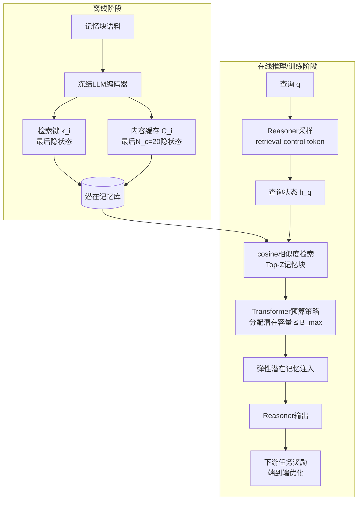

# ElasticMem：面向LLM智能体的潜在记忆作为可学习资源

## 一、论文基础元数据

- **原文标题**：ElasticMem: Latent Memory as a Learnable Resource for LLM Agents
- **中文译版**：ElasticMem：面向LLM智能体的潜在记忆作为可学习资源
- **发表渠道**：预印本（arXiv，未标注会议/期刊等级，待补充）
- **发表时间**：2025年（具体月份待补充）
- **链接**：arXiv:2605.30690（DOI待补充）
- **作者及核心机构**：Tao Feng、Chongrui Ye、Tianyang Luo、Jingjun Xu、Xueqiang Xu、Haozhen Zhang、Ge Liu、Jiaxuan You（具体机构待补充，从作者构成推测涉及高校与AI研究团队）
- **研究领域**：一级领域——人工智能/自然语言处理；二级子领域——LLM智能体记忆机制、检索增强生成（RAG）、潜在空间表示学习
- **关联数据集**：
  - MemorySuite（记忆密集型问答基准，规模/语言待补充）
  - ALFWorld（具身决策交互环境，语言为英文）
  - 标注信息：待补充

## 二、论文综合评价

### 2.1 量化评分（1-5分，5分为最优）

| 评价维度 | 评分 | 备注 |
| -------- | ---- | ---- |
| 📚 理论基础 | ⭐⭐⭐⭐ | 资源分配视角切入记忆机制，理论框架清晰 |
| 🎯 问题核心性 | ⭐⭐⭐⭐ | 直指记忆容量固定与查询效用错配的核心矛盾 |
| 💡 方法创新性 | ⭐⭐⭐⭐ | 潜在空间弹性预算分配为新颖范式 |
| ⚙️ 技术壁垒 | ⭐⭐⭐ | 需冻结编码器+可训练预算策略，中等门槛 |
| 🧪 实验严谨性 | ⭐⭐⭐ | 仅两模型规模与两条基准，泛化证据有限 |
| 🔧 落地可行性 | ⭐⭐⭐⭐ | 可复用现有LLM编码器，token开销更低 |
| 🚀 应用前景 | ⭐⭐⭐⭐ | 长时程智能体与记忆密集场景需求旺盛 |
| 📊 综合评分 | 3.7 | 视角新颖、结果一致提升，但外部泛化与基线覆盖仍待扩展 |

### 2.2 定性综合评价（≤300字）

> 本文立足LLM智能体长期记忆这一关键瓶颈，提出将记忆使用重新建模为“可学习的资源分配问题”，而非传统固定检索或固定潜在容量范式。核心贡献在于：让模型自主决定每条被检索记忆应分配多少潜在预算，并以检索控制token与下游任务奖励端到端优化。方法层面兼顾了文本空间RAG的高token开销与潜在空间方法的容量刚性问题，通过Transformer预算策略实现按查询效用的弹性分配。在Qwen2.5-3B/7B上，MemorySuite-QA准确率与ALFWorld成功率均显著超越文本与潜在空间基线，且token消耗最少。整体而言，本文提供了记忆增强智能体的新设计哲学，但验证范围受限于单一基准与两种模型规模，动态记忆库与可解释性尚待后续探索。

## 三、领域本体论映射

| 核心维度 | 具体内容 |
| -------- | -------- |
| 核心研究对象 | LLM智能体中的长期记忆使用机制与潜在容量分配 |
| 核心技术路径 | 冻结编码器构建潜在记忆库 + 查询条件检索 + 可学习弹性预算策略 |
| 数据/载体形态 | 记忆块潜在表示（检索键+内容缓存），非文本拼接 |
| 核心功能目标 | 按查询效用动态分配记忆容量，抑制噪声并强化关键证据 |
| 验证核心指标 | QA准确率、任务成功率、token开销、相对基线提升幅度 |

## 四、核心问题与解决方案

### 4.1 待解决的核心问题

1. **领域级根本问题**：
   LLM智能体在长时程交互中面临上下文窗口有限与记忆需求增长的矛盾，如何高效、自适应地利用外部记忆仍是开放问题。

2. **现有方法痛点**：
   - 文本空间记忆方法：拼接检索内容导致token开销大，且对噪声敏感；
   - 潜在空间记忆方法：虽降低文本成本，但检索刚性、容量固定，无法按查询效用动态调整记忆容量；
   - 固定top-K检索：忽略不同记忆对不同查询的差异化价值。

3. **工程落地卡点**：
   - 记忆库构建与维护成本；
   - 潜在空间记忆与现有LLM推理管线的兼容性；
   - 训练预算策略需额外监督信号与算力投入。

### 4.2 核心解决方案

- **理论框架**：将记忆使用形式化为可学习的资源分配问题，记忆容量作为可端到端优化的变量，目标是最大化下游任务奖励。
- **核心架构**：四阶段管线——离线潜在记忆库构建、查询条件检索、Transformer预算策略、端到端训练。
- **关键技术**：
  - 冻结基础LLM编码器一次性编码记忆块，最后隐状态作检索键、最后N_c=20个隐状态作内容缓存；
  - Reasoner采样retrieval-control token生成查询状态h_q，与记忆键做cosine相似度取top-Z；
  - Transformer预算策略决定每条记忆的潜在容量（最大预算B_max=20）。
- **创新机制**：记忆不再被平等对待，而是依据查询相关性效用获得差异化潜在容量分配。

### 4.3 核心优势（量化+定性）

1. **性能优势**：
   - MemorySuite-QA加权平均准确率：3B模型0.588→0.742；7B模型0.668→0.832；
   - ALFWorld平均成功率：3B模型0.270→0.449；7B模型0.416→0.529；
   - 相对最强潜在空间基线：QA准确率相对提升26.2%/24.6%；ALFWorld SR相对提升66.3%/27.2%。

2. **效率优势**：
   在所有设置中每局token消耗最少，提供更优的accuracy-efficiency权衡。

3. **工程优势**：
   冻结编码器设计降低训练成本；潜在空间操作避免文本拼接的上下文膨胀；端到端优化可与现有LLM推理框架集成。

## 五、方法与技术架构

### 5.1 核心架构设计

> ElasticMem以离线-在线分离的设计思想组织记忆使用流程：离线阶段冻结编码器构建潜在记忆库；在线阶段由Reasoner生成检索控制token形成查询状态，检索记忆后由Transformer预算策略分配弹性潜在容量，最终注入Reasoner并端到端优化。

### 5.2 关键技术实现细节

| 技术模块 | 实现路径 | 工程注意事项 |
| -------- | -------- | ------------ |
| 离线潜在记忆库构建 | 冻结基础LLM编码器，对每个记忆块编码一次，提取最后隐状态为检索键、最后N_c=20个隐状态为内容缓存 | 记忆库训练与推理固定，需保证编码器版本一致 |
| 查询条件检索 | Reasoner先采样retrieval-control token得到h_q，用cosine相似度与记忆键匹配取top-Z | 检索控制token需与Reasoner训练协同 |
| 弹性预算策略 | Transformer预算策略根据查询-记忆对决定分配多少潜在容量，B_max=20 | 预算过大会引入冗余，过小会丢失关键信息，需调参 |
| 端到端优化 | 用下游任务奖励优化完整记忆使用过程 | 奖励稀疏或延迟会影响训练稳定性 |
| 依赖组件 | Qwen2.5-3B/7B-Instruct作为基础模型 | 需兼容主流LLM推理框架 |

### 5.3 架构优缺点

- **优点**：
  - 离线构建与在线使用解耦，记忆库可复用；
  - 潜在空间操作避免文本拼接的token爆炸；
  - 预算策略端到端可学习，按查询效用自适应；
  - 跨模型规模一致性提升。

- **缺点**：
  - 记忆库静态，无法随新经验动态演化；
  - 预算分配缺乏可解释性；
  - 需额外训练预算策略与检索控制token；
  - 仅在2个模型规模与2条基准上验证，泛化性未知。

## 六、实验设计与结果分析

### 6.1 实验基础设置

| 维度 | 内容 |
| ---- | ---- |
| 数据集 | MemorySuite（记忆密集型问答）、ALFWorld（具身决策交互环境） |
| 基线方法 | 文本空间记忆方法（RAG类）、固定容量潜在空间记忆方法 |
| 实验环境 | 基础模型Qwen2.5-3B/7B-Instruct（详细硬件配置待补充） |
| 评价指标 | QA加权平均准确率、任务成功率（SR）、每局token消耗 |

### 6.2 核心实验结果

| 方法 | MemorySuite-QA准确率（3B/7B） | ALFWorld成功率（3B/7B） | 工程指标（token/局） |
| ---- | --------- | --------- | -------------------- |
| 文本空间记忆基线 | 待补充 | 待补充 | 较高（文本拼接） |
| 最强潜在空间基线 | 待补充（相对提升基准） | 待补充（相对提升基准） | 待补充 |
| ElasticMem（本文） | 0.742 / 0.832 | 0.449 / 0.529 | 最少 |

> 注：原始表格中未给出基线的绝对数值，仅以相对提升幅度呈现（QA相对提升26.2%/24.6%，ALFWorld SR相对提升66.3%/27.2%），3B模型QA基线0.588、7B模型QA基线0.668，3B模型ALFWorld基线0.270、7B模型ALFWorld基线0.416，均为最强基线结果。

### 6.3 消融实验/鲁棒性分析

| 实验变体 | 指标变化 | 核心结论 |
| -------- | -------- | -------- |
| 预算策略：Transformer vs Random/Uniform/MLP | Transformer更优 | 学习型预算策略优于随机/均匀/简单MLP |
| 检索设计：可训练reasoner-state vs Semantic/Frozen-State/Query-State | 可训练reasoner-state更优 | 检索与reasoner状态耦合是关键 |
| 每chunk最大预算B_max | B_max=20最优 | 适中容量优于过小或过大，存在权衡 |

### 6.4 实验结论（工程视角）

- 提升主要来源是“学习每条记忆应获多少容量”，而非单纯使用潜在记忆或延长探索；
- ElasticMem在准确率与token效率上同时占优，适合token成本敏感的智能体部署；
- 消融揭示了预算策略设计与检索状态耦合两大关键设计选择，为工程复现提供直接指导。

## 七、领域贡献与创新点

| 贡献层级 | 具体内容 |
| -------- | -------- |
| 理论贡献 | 将记忆使用重新形式化为可学习的资源分配问题，打破固定容量/固定检索的范式假设 |
| 方法/架构贡献 | 提出ElasticMem框架：离线潜在记忆库 + 查询条件检索 + Transformer弹性预算策略 + 端到端优化 |
| 数据/工具贡献 | 在MemorySuite与ALFWorld上验证；开源代码/工具待补充 |
| 实验/验证贡献 | 跨3B/7B两个模型规模一致提升，验证弹性分配优于固定分配与文本拼接 |
| 工程落地贡献 | 提供更优accuracy-efficiency权衡，降低记忆密集型智能体的token开销 |

## 八、局限性与风险

| 维度 | 具体描述 | 应对思路 |
| ---- | -------- | -------- |
| 学术局限性 | 仅MemorySuite基准、仅Qwen2.5-3B/7B，泛化性有限 | 扩展更多模型家族、交互环境与更大记忆语料 |
| 工程落地风险 | 记忆库静态，无法持续演进；预算策略可解释性不足 | 引入动态记忆库更新机制、开发可视化与可解释工具 |
| 伦理/合规风险 | 论文未预见特定负面社会后果，但LLM智能体部署仍需安全与可靠性保障 | 部署时遵循智能体安全规范，增加监控与回滚机制 |

## 九、未来研究/落地方向

| 方向类型 | 具体内容 | 优先级 |
| -------- | -------- | ------ |
| 科研拓展 | 扩展至更多模型家族、更大记忆语料、更开放式交互环境 | 高 |
| 工程优化 | 动态记忆库更新，支持持续进化的智能体；预算分配可解释性工具 | 中高 |
| 跨领域适配 | 将弹性潜在记忆机制迁移至多模态智能体、长文档问答、个性化助手等场景 | 中 |

## 十、关键词与术语表

| 语言 | 关键词 |
| ---- | ------ |
| 中文 | 弹性记忆、潜在记忆、可学习资源分配、智能体记忆、检索增强 |
| 英文 | Elastic Memory, Latent Memory, Learnable Resource Allocation, Agent Memory, Retrieval-Augmented |
| 领域专属术语 | Latent Memory（潜在记忆）：以隐状态形式存储的记忆表示，而非原始文本；Retrieval-Control Token（检索控制token）：Reasoner采样的用于生成查询状态的token；Budget Policy（预算策略）：决定每条记忆分配多少潜在容量的模块；B_max（最大预算）：每个记忆块可分配的最大潜在容量上限 |

## 十一、参考文献与关联资源

- **核心参考文献**：待补充（原文引用列表未完整提供）
- **补充阅读**：RAG相关记忆增强工作、潜在空间记忆方法
- **开源代码/工具**：待补充

## 十二、阅读者批注

1. **科研启发**：
   将“资源分配”视角引入记忆机制是一条可迁移的方法论，可能推广至注意力预算、工具调用预算、推理步数预算等场景。

2. **工程落地思考**：
   离线构建记忆库、在线弹性分配的设计适合生产部署；需重点评估训练预算策略的算力成本与记忆库更新频率。

3. **待验证/存疑点**：
   - 基线绝对数值未完整呈现，横向对比公平性需核对原文表格；
   - 记忆库静态假设在真实长时程场景下是否成立存疑；
   - B_max=20最优是否具有跨任务/跨模型稳定性。

4. **个人/团队应用场景**：
   适用于长文档问答、个性化对话助手、具身智能体长期记忆等token成本敏感的场景。

## 十三、阅读元信息

| 维度 | 内容 |
| ---- | ---- |
| 阅读日期 | 2026-09-30 21:40 |
| 阅读人 | xPaperReader AI |
| 文档编号 | arxiv-2605.30690 |
| 版本迭代 | v1.0 |