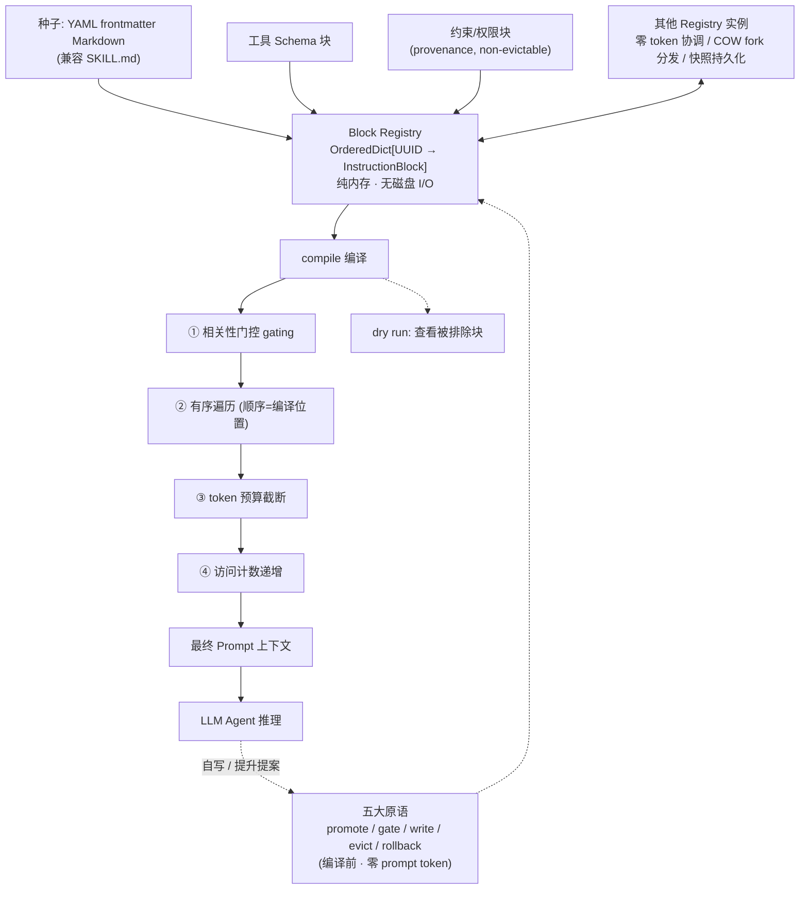

# RAMPART：基于注册表的智能体记忆与优先级感知运行时变换

> 说明：本简报基于所提供的论文元数据与 overview / conclusion 两组分析汇总生成。凡分析汇总中未明确给出的事实性信息（如机构、参考资料、具体数据集名称等），均如实标注为"待补充"，不做臆测。

## 一、论文基础元数据
- **原文标题**：RAMPART: Registry-based Agentic Memory with Priority-Aware Runtime Transformation
- **中文译版**：RAMPART：基于注册表的智能体记忆与优先级感知运行时变换
- **发表渠道**：arXiv 预印本（尚未标注同行评审/会议等级，待补充）
- **发表时间**：2025 年（具体月日待补充）
- **链接**：arXiv:2606.04628（https://arxiv.org/abs/2606.04628 ）
- **作者及核心机构**：Nikodem Tomczak（单作者；所属机构待补充）
- **研究领域**：
  - 一级领域：人工智能 / 大模型系统
  - 二级子领域：LLM Agent 上下文工程（Context Engineering）、Agent 记忆管理与多智能体协调
- **关联数据集**：
  - 未使用公开命名数据集；实验基于自建任务集（任务规模、语言、标注方式待补充）。
  - 涉及模型池：Qwen3-8B（Q4 量化）、Qwen2.5-7B、Llama-3.1-8B、Mistral-7B-v0.3、Qwen3-14B，共 5 个指令调优模型（跨 3 个独立实验室来源）。
  - 默认嵌入模型：`all-MiniLM-L6-v2`（截断 256 token），可替换为更大嵌入模型或 LLM judge。

## 二、论文综合评价

### 2.1 量化评分（1-5分，5分为最优）

| 评价维度 | 评分 | 备注 |
| -------- | ---- | ---- |
| 📚 理论基础 | ⭐⭐⭐ | 偏系统架构与工程机制，理论论证较薄 |
| 🎯 问题核心性 | ⭐⭐⭐⭐⭐ | 直击 Agent 上下文组装与记忆治理核心 |
| 💡 方法创新性 | ⭐⭐⭐⭐ | 把上下文组装升级为可编程编译原语 |
| ⚙️ 技术壁垒 | ⭐⭐⭐ | 纯内存注册表+原语，实现门槛不高 |
| 🧪 实验严谨性 | ⭐⭐⭐ | 受控设置为主，缺公开基准与完整指标表 |
| 🔧 落地可行性 | ⭐⭐⭐⭐ | 独立 Python 库，兼容 SKILL.md/CLAUDE.md |
| 🚀 应用前景 | ⭐⭐⭐⭐ | 权限控制、多智能体零 token 协调价值明确 |
| 📊 综合评分 | 3.7 | 架构思想领先，工程价值高，实证与理论深度待补强 |

### 2.2 定性综合评价（≤300字）

> RAMPART 将 LLM Agent 的上下文从"会话加载时固化的静态提示/文件"重新定义为"每次推理调用前按需编译的注册表产物"。核心价值在于三点差异化：其一，指令块、工具 schema、约束块统一为纯内存、可寻址、带优先级的注册表条目，仅 `compile` 阶段消耗 prompt token，`promote/gate/write/evict/rollback` 五原语均零 prompt 成本；其二，实验发现并复现了稳定的"内容启动/位置效应"——关键块放置位置存在约第 7 或第 12 块的性能悬崖，将关键块与相邻内容成组整体 promote 可提升数十个百分点，Mistral 上约 5 倍；其三，编译前驱逐形成"结构性遗忘"，被驱逐的工具 schema 与内容不出现在上下文中，智能体既无从调用也无拒绝信号，天然构成访问控制边界。相关性门控降低 67.8% prompt 成本并保留 83% 成功率。总体上，这是一项以运行时机制与访问控制为主贡献的系统工作，实证仍限于受控设置。

## 三、领域本体论映射

| 核心维度 | 具体内容 |
| -------- | -------- |
| 核心研究对象 | LLM Agent 的上下文记忆单元及其组装过程（Instruction Block / Block Registry） |
| 核心技术路径 | 注册表化记忆 + 优先级感知的编译时变换（门控、排序、分组、提升、驱逐、回滚） |
| 数据/载体形态 | 纯内存 `OrderedDict[UUID→IB]`；种子为 YAML frontmatter Markdown（兼容 `SKILL.md`）；IB 含 384 维默认嵌入 |
| 核心功能目标 | 按任务动态决定上下文的"包含什么、放在哪里、何时驱逐"，同时降低 token 成本并施加结构级访问控制 |
| 验证核心指标 | 任务成功率、prompt token 成本、工具调用率、compile/find-relevant 延迟、跨模型位置效应一致性 |

## 四、核心问题与解决方案

### 4.1 待解决的核心问题

1. **领域级根本问题**：Agent 上下文在会话加载时被静态固定，导致"包含什么、如何排序、何时遗忘"无法在推理时按需调整；上下文既是被动数据，也缺乏所有权、权限与可审计的表达手段。
2. **现有方法痛点**：
   - `SKILL.md` / `CLAUDE.md` 类静态文件加载：内容全量进入上下文，无法按任务选块、无法动态排序、工具 schema 恒定暴露、无结构访问控制、无法自写、需为无关内容付费、无快照语义。
   - 传统记忆检索方案：遗忘发生在检索时刻，模型仍可见"缺失信号"，且缺乏块级权限与溯源模型。
   - 多智能体协作：依赖消息传递进行约束协商，token 开销可达数十万级。
3. **工程落地卡点**：
   - 上下文长度与成本随技能库增长线性膨胀；
   - 工具权限撤销依赖策略指令与模型配合，无法保证"立即、完全"生效；
   - 长块嵌入被截断至 256 token，语义匹配失真；余弦相似度难以区分"词汇相似、意图相反"的内容；
   - 注册表写并发与冲突解决缺失。

### 4.2 核心解决方案

- **理论框架**：将上下文组装视为"编译过程"——`compile` 升格为一等原语，上下文是编译产物而非静态拼接结果；"结构性遗忘"发生在模型检查上下文之前。
- **核心架构**：Block Registry（BR）+ Instruction Block（IB）+ 编译四阶段（相关性门控 → 有序遍历 → token 预算截断 → 访问计数递增）。
- **关键技术**：
  - 五原语：`promote`（提升）、`gate`（门控）、`write`（写入）、`evict`（驱逐）、`rollback`（回滚）；
  - 权限化记忆：provenance 溯源标记、author UUID、`removable` / `non-evictable` 标志、force 强制、rollback 回滚；
  - 安全机制：会话级 UUID 随机化（类比 ASLR），阻止按名定位的间接 prompt injection；工具 schema 被排除即结构不可访问；
  - 共享协调：注册表间直接方法调用（零 token），Unix COW fork 分发与快照持久化；
  - 支持 dry run 查看被排除块，便于调试与审计。
- **创新机制**：以"顺序即优先级"（OrderedDict 顺序唯一决定编译位置）+ "分组整体提升"（集群排列而非单块放置）对抗位置敏感性。

### 4.3 核心优势（量化+定性）

1. **性能优势**：将关键块与相邻内容成组 promote，可在单块放置失败的位置提升数十个百分点；Mistral-7B-v0.3 在最难注册表规模下通过率约提升 5 倍；小模型+干预可超过无干预的大模型。
2. **效率优势**：相关性门控使 prompt 成本下降 67.8%，同时恢复 promoted 条件下 83% 的成功率；非 compile 原语零 prompt-token 成本；注册表间协调 token 可降至 0（对比消息传递的数十万 token）。
3. **工程优势**：纯内存、启动后无磁盘 I/O；compile 5.6–12.5 μs、find relevant 4.4–5.9 ms、冷启动 230 ms，占 agent loop 时间不足 0.6%；独立 Python 库、无推理后端依赖、原语可组合；现有 `SKILL.md` / `CLAUDE.md` 无需修改即可导入。

## 五、方法与技术架构

### 5.1 核心架构设计

> RAMPART 在会话启动时把技能/启发式/工具 schema/约束以 YAML frontmatter Markdown 形式装载为 Instruction Block，写入 Block Registry（`OrderedDict[UUID→IB]`），内存顺序即为编译顺序。每次推理调用前执行 `compile`：先做相关性门控过滤，再按注册表顺序遍历，随后按 token 预算截断，最后递增被包含块的访问计数，输出最终 prompt 上下文。提升、门控、写入、驱逐、回滚均在编译前完成，不消耗 prompt token。多个注册表之间可直接方法调用交换约束块与提升提案，实现零 token 协调，并通过 Unix COW fork 快照分发。

### 5.2 关键技术实现细节

| 技术模块 | 实现路径 | 工程注意事项 |
| -------- | -------- | ------------ |
| Instruction Block（IB） | 原子单元：`id/content/priority/source/author/removable/run/created/accesses/embedding`，默认 384 维嵌入 | 建议细粒度切块，避免因 256 token 嵌入截断导致长块语义丢失 |
| Block Registry（BR） | `OrderedDict[UUID→IB]`，插入顺序唯一决定编译位置；启动后纯内存 | 顺序即优先级，重排需显式操作；需为并发写预留冲突解决机制（当前缺失） |
| 五原语 | `promote`/`gate`/`write`/`evict`/`rollback`，全部作用于编译前 | 零 prompt token 成本，但需保证原语组合的幂等性与回滚一致性 |
| 编译四阶段 | 相关性门控 → 有序遍历 → 预算截断 → 访问计数递增 | 预算截断策略直接决定位置敏感性表现；提供 dry run 便于审计被排除块 |
| 权限与溯源 | provenance 标记、author UUID、`removable`/`non-evictable`、force、rollback | 权限模型是安全边界前提：schema 不进入上下文才具备"结构不可访问"性质 |
| 安全机制 | 会话级 UUID 随机化类比 ASLR；驱逐即工具结构不可访问 | 若模型可通过其他渠道获知工具或内容，边界假设失效 |
| 共享协调与分发 | Registry 间直接方法调用交换约束块/提升提案/驱逐拒绝；Unix COW fork；快照持久化 | 零 token 协调，但需信任假设与多写并发模型支撑（待补充） |
| 相关性门控与排序 | 默认 `all-MiniLM-L6-v2` + 余弦相似，可替换更大嵌入模型或 LLM judge | 余弦相似难辨"相似词汇、相反意图"，建议 cross-encoder / LLM judge |
| 依赖组件 | Python 独立库，无推理后端依赖；嵌入模型可插拔 | 部署需集成注册表与编译基础设施，存在接入成本 |

### 5.3 架构优缺点

- **优点**：
  - 上下文组装从静态拼接升级为可编程、可审计的编译过程；
  - 非 compile 原语零 prompt-token 开销，成本模型清晰；
  - 编译前驱逐天然形成"结构性遗忘"与结构级访问控制（无拒绝、无信号、无自由文本引用）；
  - 注册表间零 token 协调，显著优于消息传递式多智能体协商；
  - 兼容既有 `SKILL.md` / `CLAUDE.md` 生态，迁移成本低。
- **缺点**：
  - 假设"良序写"，不支持并发多 Agent 写同一 registry，无冲突解决机制；
  - 默认驱逐未考虑访问新近度（access recency）；
  - 嵌入截断 256 token，长块需细粒度切分或更换嵌入模型；
  - 依赖注册表/编译基础设施，实际部署有集成成本；
  - 安全性以"schema 不进入上下文"为前提，边界条件较脆弱。

## 六、实验设计与结果分析

### 6.1 实验基础设置

| 维度 | 内容 |
| ---- | ---- |
| 数据集 | 自建 Agent 任务集（规模/语言/标注方式待补充）；论文未使用公开命名数据集 |
| 基线方法 | 无干预（no-intervention）大模型；静态 `SKILL.md` / `CLAUDE.md` 全量加载；单块放置（single-block placement）；无 schema 驱逐对照 |
| 实验环境 | 5 个开源指令调优模型：Qwen3-8B（Q4）、Qwen2.5-7B、Llama-3.1-8B、Mistral-7B-v0.3、Qwen3-14B；本地推理（含 Q4 量化） |
| 评价指标 | 任务成功率（通过率）、prompt token 成本、工具调用率、compile 延迟、find relevant 延迟、冷启动耗时、占 agent loop 时间比例 |

### 6.2 核心实验结果

| 方法 | 核心指标1 | 核心指标2 | 工程指标（算力/耗时） |
| ---- | --------- | --------- | -------------------- |
| 无干预大模型基线 | 任务成功率作为对照锚点 | — | — |
| RAMPART 单块放置 | 在第 7 块（任务在 registry 后）或第 12 块（任务在前）出现成功率悬崖 | 跨 Qwen2.5-7B / Llama-3.1-8B / Mistral-7B-v0.3 / Qwen3-14B 位置效应方向一致 | compile 5.6–12.5 μs；find relevant 4.4–5.9 ms；冷启动 230 ms（< agent loop 0.6%） |
| RAMPART 分组整体 promote | 在单块失败位置提升数十个百分点 | Mistral 最难注册表规模下通过率约 5 倍 | 干预本身零 prompt token 成本 |
| RAMPART + 相关性门控 | prompt 成本降低 67.8% | 恢复 promoted 条件下 83% 的成功率 | 门控为编译前操作，不额外计 prompt token |
| schema 驱逐对照 | 工具调用率 0%（驱逐后） vs 100%（有 schema 时） | — | 驱逐为编译前操作，零 prompt token |

> 注：分析汇总未给出统一的绝对成功率数值表与完整基准对比表，上表仅呈现可确证的相对结论；绝对数值待补充。

### 6.3 消融实验/鲁棒性分析

| 实验变体 | 指标变化 | 核心结论 |
| -------- | -------- | -------- |
| 单块放置 vs 分组整体 promote | 分组后在单块失败位置提升数十个百分点；Mistral 约 5 倍 | 位置敏感可通过"集群排序"而非单块位置来规避 |
| 位置扫描（任务在 registry 后 / 前） | 悬崖分别约在第 7 块与第 12 块 | 位置效应具有稳定的绝对位置特征，非随机噪声 |
| 跨模型泛化（5 模型 / 3 来源实验室） | 内容启动效应位置一致，幅度随模型能力变化，两端不可见 | 效应是模型层面的普遍现象，强度与模型强弱相关 |
| 弱模型作为诊断工具 | 弱模型在强模型注意力有限区域可表现如更大模型 | 可在弱模型上扫描发现 priming 邻居，再部署到生产模型 |
| 相关性门控开/关 | token −67.8%，成功率恢复 83% | 门控是"成本-效果"折中的高效手段 |
| 工具 schema 驱逐 | 工具调用率 100% → 0% | 编译前驱逐构成结构级访问控制，而非策略请求 |
| 小模型 + 干预 vs 大模型无干预 | 小模型 + 干预可超过无干预大模型 | 上下文编排可部分替代模型规模收益 |

### 6.4 实验结论（工程视角）

1. **上下文"怎么放"与"放什么"同等重要**：位置敏感存在稳定悬崖，工程上应优先采用分组集群 promote 而非单点放置。
2. **成本可控**：门控带来近 68% 的 prompt 成本下降，且保留绝大部分位置收益，适合作为默认开启策略。
3. **权限边界可工程化**：schema 驱逐将工具权限从"策略约束"变为"结构不可见"，为隐私、授权、范围限制场景提供了强边界。
4. **弱模型可用于低成本诊断**：以弱模型扫描 priming 邻居，再迁移至生产模型，可降低调优成本。
5. **实验结论目前限于受控设置**：分析汇总明确指出缺少具体量化指标、公开基准与模型名称级别的完整报告，泛化到开放生产环境仍需验证。

## 七、领域贡献与创新点

| 贡献层级 | 具体内容 |
| -------- | -------- |
| 理论贡献 | 提出"上下文即编译产物"的视角，将 `compile` 升格为一等原语；形式化"结构性遗忘"（遗忘发生在模型检查上下文之前） |
| 方法/架构贡献 | Block Registry + Instruction Block 的纯内存可寻址记忆模型；五原语（promote/gate/write/evict/rollback）；编译四阶段流程；块级所有权与权限模型（provenance/author/non-evictable/rollback） |
| 数据/工具贡献 | 开源独立 Python 库 RAMPART（无推理后端依赖）；YAML frontmatter Markdown 种子格式，兼容 `SKILL.md` / `CLAUDE.md`；Unix COW fork 快照分发机制 |
| 实验/验证贡献 | 在 5 个指令调优模型、3 个独立实验室来源上验证"内容启动/位置效应"的位置一致性；量化分组 promote、门控、schema 驱逐的收益；给出 compile/find-relevant/冷启动的工程延迟数据 |
| 工程落地贡献 | 面向多智能体协调的零 token 协作范式；工具与权限的编译前撤销（无拒绝、无策略指令、无需信任假设）；性能开销低于 agent loop 的 0.6% |

## 八、局限性与风险

| 维度 | 具体描述 | 应对思路 |
| ---- | -------- | -------- |
| 学术局限性 | 结论基于受控设置，缺少具体量化指标、公开基准与完整模型名称级报告；理论形式化较薄弱 | 补充标准化基准（如 Agent 任务套件）与完整统计报告；形式化位置效应与编译语义 |
| 工程落地风险 | 假设良序写；不支持并发多 Agent 写同一 registry 且无冲突解决；默认驱逐不考虑访问新近度；依赖注册表/编译基础设施，集成有成本；长块受 256 token 嵌入截断限制 | 引入并发控制与冲突解决（如 CRDT/版本向量）；驱逐策略加入访问新近度与优先级加权；细粒度切块或更换嵌入模型/cross-encoder/LLM judge |
| 伦理/合规风险 | 安全优势以"schema 不进入上下文"为前提，若模型可通过其他渠道获知工具或内容，则边界假设失效；"无信号的遗忘"可能带来可解释性与审计上的不透明 | 明确边界假设与威胁模型；引入 dry run / 审计日志；对结构性遗忘提供显式审计与合规记录 |

## 九、未来研究/落地方向

| 方向类型 | 具体内容 | 优先级 |
| -------- | -------- | ------ |
| 科研拓展 | 位置敏感/内容启动效应的机理研究；编译语义的形式化；跨模型泛化的系统性验证与公开基准构建 | 高 |
| 工程优化 | 并发写与冲突解决机制；考虑访问新近度的驱逐策略；更大嵌入模型 / cross-encoder / LLM judge 替换默认门控；长块细粒度切分策略 | 高 |
| 跨领域适配 | 隐私、授权、范围限制等合规场景的编译前权限控制；多智能体/多工具生产系统中的零 token 协调；与现有 Agent 框架（SKILL.md / CLAUDE.md 生态）的深度集成 | 中 |

## 十、关键词与术语表

| 语言 | 关键词 |
| ---- | ------ |
| 中文 | 智能体记忆、指令块注册表、优先级感知、运行时变换、编译时上下文组装、结构性遗忘、提示注入防护、多智能体协调、上下文工程 |
| 英文 | Agentic Memory, Block Registry, Instruction Block, Priority-Aware Runtime Transformation, Compile-time Context Assembly, Structural Forgetting, Prompt Injection Defense, Multi-Agent Coordination, Context Engineering |
| 领域专属术语 | **Instruction Block (IB)**：注册表中的原子记忆单元，含 id/content/priority/source/author/removable/run/created/accesses/embedding 字段；**Block Registry (BR)**：`OrderedDict[UUID→IB]` 纯内存容器，顺序即编译位置；**五原语**：promote/gate/write/evict/rollback，均在编译前执行、零 prompt token 成本；**结构性遗忘**：在模型查看上下文之前完成驱逐，被驱逐内容不产生任何可见信号；**内容启动/位置效应**：关键块在上下文中的绝对位置影响任务成功率的稳定现象（约第 7/12 块出现悬崖）；**ASLR 类比**：会话级 UUID 随机化，防止按名定位的间接 prompt injection；**COW fork 分发**：基于 Unix 写时复制的注册表快照分发机制 |

## 十一、参考文献与关联资源

- **核心参考文献**：待补充（分析汇总未列出具体引用文献）
- **补充阅读**：
  - `SKILL.md` / `CLAUDE.md` 等静态 Agent 技能/上下文文件规范的对比阅读
  - 上下文位置敏感性（lost-in-the-middle 类）相关研究
  - 多智能体通信协议与 token 开销相关研究
- **开源代码/工具**：RAMPART 独立 Python 库（无推理后端依赖，原语可组合，兼容 `SKILL.md` / `CLAUDE.md` 导入）；默认嵌入模型 `all-MiniLM-L6-v2`；代码仓库链接待补充

## 十二、阅读者批注

1. **科研启发**：把"上下文组装"当作编译过程是一个干净的抽象，`compile` 升格为一等原语后，排序、分组、门控、驱逐都能被当作可验证的程序变换来研究。位置悬崖出现在固定绝对位置（第 7/12 块）这一发现值得进一步机理化——它可能暗示了注意力分配与上下文长度之间的结构性关系。
2. **工程落地思考**：五原语零 prompt token 成本、compile 仅微秒级、占 agent loop 不足 0.6%，意味着这是一个"几乎免费"的控制平面，很适合嵌入现有 Agent 循环。但并发写缺失与集成成本是需要提前设计的两处硬约束。
3. **待验证/存疑点**：
   - 分析汇总明确说明结论部分缺少具体量化指标、基准与完整模型名称级报告，绝对成功率数字需回原文核对；
   - "位置悬崖在第 7/12 块"是否与任务模板长度、具体 prompt 结构强耦合，跨任务形态是否稳定存疑；
   - "结构性遗忘"的可解释性与审计代价，以及"schema 不进入上下文"安全前提在其他渠道泄露情报时的鲁棒性；
   - 67.8% token 降幅与 83% 成功率恢复是否在不同任务分布下稳定。
4. **个人/团队应用场景**：
   - 大型技能库 Agent（大量 SKILL/规则文件）按任务选择性装配；
   - 多子智能体系统的权限即时撤销（编译前驱逐工具 schema）；
   - 多 Agent 约束协商的零 token 替代方案，替代高成本消息传递；
   - 以弱模型做 priming 位置扫描的诊断流水线。

## 十三、阅读元信息

| 维度 | 内容 |
| ---- | ---- |
| 阅读日期 | 2026-09-30 21:42 |
| 阅读人 | xPaperReader AI |
| 文档编号 | arxiv-2606.04628 |
| 版本迭代 | v1.0 |