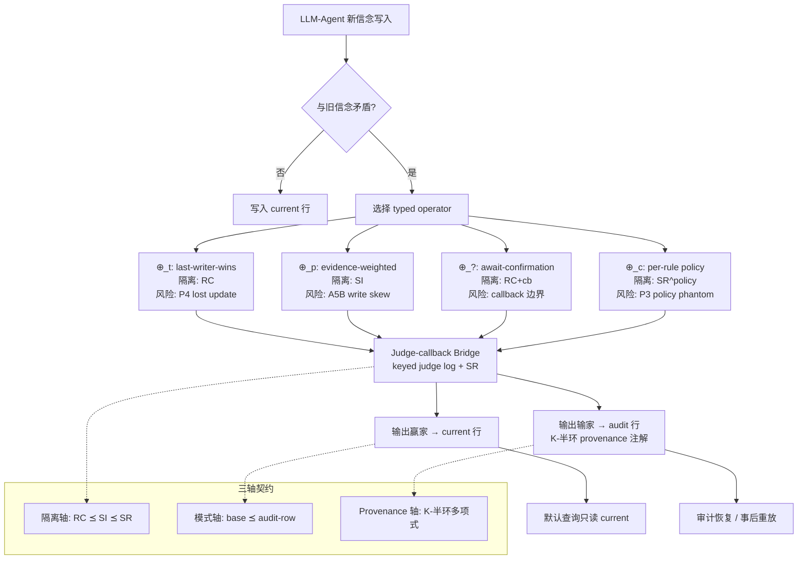

# TOKI：面向大语言模型智能体持久记忆矛盾解决的双时态算子代数

## 一、论文基础元数据
- **原文标题**：TOKI: A Bitemporal Operator Algebra for Contradiction Resolution in LLM-Agent Persistent Memory
- **中文译版**：TOKI：面向大语言模型智能体持久记忆矛盾解决的双时态算子代数
- **发表渠道**：arXiv 预印本（未标注会议/期刊等级，依据分组分析定位为理论性工作）
- **发表时间**：2025 年
- **链接**：arXiv:2606.06240
- **作者及核心机构**：Ziming Wang（单作者，核心机构信息待补充）
- **研究领域**：一级领域—人工智能/数据库系统；二级子领域—LLM Agent 记忆系统、并发控制与事务隔离
- **关联数据集**：
  - **LoCoMo**（长对话记忆基准，含 1,444 个可回答问题的子集）— 语言：英文
  - **MultiTQ**（分片可串行化切片，用于受控网格实验）— 语言：待补充
  - **HaluMem / STALE**（提及但未集成）— 因成本/许可/服务边界被推迟

## 二、论文综合评价
### 2.1 量化评分（1-5分，5分为最优）

| 评价维度 | 评分 | 备注 |
| -------- | ---- | ---- |
| 📚 理论基础 | ⭐⭐⭐⭐⭐ | 借力 Berenson-Adya 异常框架与 K-半环 provenance，理论闭合度高 |
| 🎯 问题核心性 | ⭐⭐⭐⭐⭐ | 直击 LLM-agent 记忆写密集与矛盾解决的核心契约缺失 |
| 💡 方法创新性 | ⭐⭐⭐⭐⭐ | 将矛盾解决形式化为写时并发控制，算子族统一四类启发式 |
| ⚙️ 技术壁垒 | ⭐⭐⭐⭐ | 需并发控制、双时态模型与 provenance 半环复合知识 |
| 🧪 实验严谨性 | ⭐⭐⭐ | 理论验证扎实但跨系统比较功效不足，作者诚实声明不声称优越性 |
| 🔧 落地可行性 | ⭐⭐⭐⭐ | PostgreSQL 多写者验证 + 开源代码，单进程 envelope 限制 |
| 🚀 应用前景 | ⭐⭐⭐⭐ | Agent 记忆基础设施急需此类正确性契约语言 |
| 📊 综合评分 | 4.3 | 理论贡献突出，实验范围化验证诚实，落地路径清晰但分布式能力待验证 |

### 2.2 定性综合评价（≤300字）
> TOKI 将 LLM-agent 持久记忆中的矛盾解决重新定位为**写时并发控制问题**，这是该领域从经验启发式走向可声明正确性契约的关键一步。其核心价值在于为生产系统常用的四类冲突解决策略（last-writer-wins、evidence-weighted merge、await-confirmation、per-rule policy）建立了统一的类型化算子代数，并沿**隔离轴、模式轴、provenance 轴**三轴证明异常排除的健全性。差异化优势包括：审计行模式对 N3 audit erasure 的排除证明、keyed judge log 作为 N1 replay inconsistency 的紧致刻画下界、以及基于 K-半环载体的恢复能力分层。关键结论是：K-载体在隔离轴上为装饰性，在审计恢复轴上承重；跨系统比较功效不足，作者明确不声称优越性，仅支持已声明范围内的正确性契约。

## 三、领域本体论映射
| 核心维度 | 具体内容 |
| -------- | -------- |
| 核心研究对象 | LLM-Agent 持久记忆系统中矛盾事实的写时解析与正确性契约 |
| 核心技术路径 | 双时态算子代数 + 隔离级别映射 + K-半环 provenance 注解 + 双行 audit 模式 |
| 数据/载体形态 | 双行表（11 用户可见列 + `row_kind ∈ {current, audit}`）；K-关系载体（多重度多重集/多线性/布尔） |
| 核心功能目标 | 在声明的隔离级别下排除写时异常（P3/P4/A5B/N1/N2/N3），并保留失败事实的 provenance 以供审计恢复 |
| 验证核心指标 | 异常准入率（N1 准入 ≤0.0）、审计恢复率（375/375）、LoCoMo 准确率 Δ、p50/p99 延迟、序列化失败率、写者并发拟合指数 |

## 四、核心问题与解决方案
### 4.1 待解决的核心问题
1. **领域级根本问题**：LLM-agent 记忆为写密集型，新信念与旧信念可能矛盾；生产系统采用多种冲突解决策略却**不声明隔离级别**，也不说明会暴露哪些写时异常，缺乏统一正确性契约。
2. **现有方法痛点**：
   - 四种生产启发式（LWW、evidence-weighted、await-confirmation、per-rule）缺乏类型化语义；
   - 审计擦除后 provenance 恢复依赖底层载体结构，未被形式化；
   - 判官（judge）调用与回调重放的非确定性导致 N1 模糊读，现有系统无隔离保证。
3. **工程落地卡点**：隔离级别的选择与算子语义必须映射到具体数据库（如 PostgreSQL），且在多写者并发下的异常行为需要实验确证。

### 4.2 核心解决方案
- **理论框架**：以隔离格（Iso-lattice）为轴，定义 `Prevents(L, Φ) ⟺ L ⪰ guard_iso(Φ)`，覆盖 7 个经典 Berenson–Adya 异常；以 K-半环多项式作为 provenance 载体。
- **核心架构**：双行 bitemporal schema（current + audit），四类 typed operator（⊕_t、⊕_p、⊕_?、⊕_c）构成算子族，每个算子接收两个矛盾事实并输出赢家、将输家写入 audit row。
- **关键技术**：
  1. **Judge-callback 桥**：将判官调用/回调等待映射为 keyed table 上的日志读，用 SR 序列化保证同 key 单一提交投票；
  2. **Audit-erasure schema lift**：证明 audit-row 模式排除 N3，且 schema 升级对 base 查询保守；
  3. **K-载体可恢复性分层**：多重度多重集载体全恢复（375/375），多线性部分恢复（106/375），布尔几乎不可恢复（0）。
- **创新机制**：异常三分（N1 judge-replay inconsistency、N2 belief-drift skew、N3 audit erasure）与 N1 下界定理（无 keyed judge log 时 N1 准入概率为 2p(1-p)，p=1/2 最大；keyed+SR 则归零）。

### 4.3 核心优势（量化+定性）
1. **性能优势**：audit-row defence 使 LoCoMo 准确率提升 **+0.86**（95% CI [0.76, 0.94]）；消融类型化记忆层在 1,444 个可回答问题上的 Δ = **+0.492**（0.540 vs 0.048）。
2. **效率优势**：p50 延迟稳定在 **3.88–4.15 ms**，p99 < **18.2 ms**；写者并发拟合 μ ~ c^0.86，R² = **0.992**。
3. **工程优势**：PostgreSQL 后端上操作化执行隔离映射；N1 准入率降至 **0.0**（未键控基线为 0.167–0.204）；仅 Toki 在保留写路径 judge 的同时排除 N1/N2/N3 三类异常。

## 五、方法与技术架构
### 5.1 核心架构设计
> TOKI 架构以"双行 bitemporal schema"为物理载体，以"四类 typed operator"为逻辑算子族，沿"隔离轴、模式轴、provenance 轴"三轴构建正确性契约。判官（LLM judge）调用通过 judge-callback 桥映射为 keyed table 上的日志读，SR 隔离保证重放一致性；每次矛盾解析将赢家写入 current 行、输家写入 audit 行，audit 行的 provenance 用 K-半环多项式注解，支持事后恢复与审计。

### 5.2 关键技术实现细节
| 技术模块 | 实现路径 | 工程注意事项 |
| -------- | -------- | ------------ |
| 双行 bitemporal schema | 单表 11 用户可见列 + `row_kind ∈ {current, audit}`；默认查询只读 current | schema 升级对 base 查询保守，避免破坏现有读取路径 |
| 四类 typed operator | ⊕_t / ⊕_p / ⊕_? / ⊕_c；每个声明隔离预条件与暴露异常 | 算子顺序组合取格并（RC ∨ SI = SI），回调轴与策略表按分量/表作用域合成 |
| Judge-callback 桥 | 判官调用与回调等待映射为 keyed table 日志读；SR 序列化 | 无 keyed judge log 时 N1 准入概率 2p(1-p)；有界非确定 oracle 假设下界成立 |
| K-半环 provenance | 多重度多重集/多线性/布尔三类载体；审计行恢复来源 | 多重度载体全恢复，多线性部分，布尔几乎不恢复；载体选择决定审计能力 |
| 隔离映射执行 | PostgreSQL 上 RC/RR/SI/SR 的实际行为验证 | RC 在任何多写者下都承认 P4；RR/SI 排除 lost update 与 read skew；仅 SR 额外排除 write skew 与 phantom |
| 组合健全性 | 多算子流水线隔离取格并、模式取最大 | 组合后仍排除相应异常；序列化失败率约 (w−1)/w |

### 5.3 架构优缺点
- **优点**：
  1. 为 LLM-agent 记忆提供了可声明、可验证的写时正确性契约，将矛盾解决从经验启发式提升为并发控制规范；
  2. 双行模式在不破坏 base 查询的前提下保留了失败事实的完整 provenance；
  3. 隔离轴、模式轴、provenance 轴三轴正交，支持算子组合的模块化推理；
  4. 在 PostgreSQL 上完成操作化验证，具备真实工程落地路径。
- **缺点**：
  1. 系统实验仅限单进程 envelope，**不做分布式部署声明**；
  2. 跨系统效用比较统计功效不足（0.42），不能声称优于 mem0 v3 / Graphiti / Zep 等基线；
  3. N1 下界仅适用于有界非确定 oracle 的关系调度模型，确定性 oracle 与引擎层 reconciler 不在假设内；
  4. G2 部分 off-target 控制是构造性饱和，不构成特异性证明；
  5. Graphiti-Neo4j、HaluMem、STALE 等集成因成本/许可/服务边界被推迟。

## 六、实验设计与结果分析
### 6.1 实验基础设置
| 维度 | 内容 |
| ---- | ---- |
| 数据集 | LoCoMo（1,444 个可回答问题）、MultiTQ 分片 SR 切片、PostgreSQL 多写者合成工作负载 |
| 基线方法 | mem0 v2/v3、Graphiti、Letta、Zep、MIRIX、WorldDB；TOKI 剥离消融 |
| 实验环境 | 单进程 envelope + PostgreSQL 后端；多写者并发实验；未做分布式部署 |
| 评价指标 | 异常准入率（N1/N2/N3）、LoCoMo 准确率 Δ、审计恢复率（375 组）、p50/p99 延迟、序列化失败率、写者并发拟合 R² |

### 6.2 核心实验结果
| 方法 | 核心指标1（N1 准入率） | 核心指标2（异常排除覆盖） | 工程指标（算力/耗时） |
| ---- | --------- | --------- | -------------------- |
| mem0 v2/v3 | 0.167–0.204 | 至少暴露一个异常 | 跨系统 Δ = -0.04，CI 覆盖 0 |
| Graphiti | 0.167–0.204 | 至少暴露一个异常 | 跨系统 Δ = -0.08，CI 覆盖 0 |
| Zep | 0.167–0.204 | 至少暴露一个异常 | 跨系统 Δ = +0.02，CI 覆盖 0 |
| Letta / MIRIX | 0.167–0.204 | 至少暴露一个异常 | 待补充 |
| WorldDB | — | 通过去掉 judge 排除异常 | 无法支持 evidence-weighted 写路径解析 |
| **TOKI** | **0.0** | **唯一同时排除 N1/N2/N3 并保留写路径 judge** | p50 3.88–4.15 ms，p99 < 18.2 ms |

### 6.3 消融实验/鲁棒性分析
| 实验变体 | 指标变化 | 核心结论 |
| -------- | -------- | -------- |
| Audit-row defence（LoCoMo） | 准确率 +0.86（95% CI [0.76, 0.94]） | 审计行防御对自然工作负载有显著机制增益 |
| 消融类型化记忆层（1,444 可回答问题） | 0.540 → 0.048，Δ = +0.492 | 记忆层是核心效用来源 |
| 载体消融：多重度多重集 | 恢复 375/375（1.0） | 多重度载体支持完整来源恢复 |
| 载体消融：多线性 | 106/375（0.683） | 多线性载体仅部分恢复 |
| 载体消融：布尔 | 0/375（准确率 0.345） | 布尔载体几乎不可恢复 |
| 多写者隔离：RC | Lost update admit 率 1.0 | RC 在任何多写者下都承认 P4 |
| 多写者隔离：RR/SI | 排除 lost update 与 read skew | 序列化失败率随写者数增至 (w−1)/w |
| 多写者隔离：SR | 额外排除 write skew 与 phantom | 最高隔离保障，RC 吞吐最高 |
| 组合/重放 | 所有排列返回相同赢家与合并来源 | 审计行合并来源在 ⪯_K 下支配所有成员；崩溃后按身份重放通过 |
| N2 partition 网格 | SR 下所有分区/竞争水平均为 0 | 理论预测的 0/1 边界得到验证 |
| 跨系统比较 | Δ = -0.04/-0.08/+0.02，CI 覆盖 0 | 功效不足（0.42），**不声称优越性** |

### 6.4 实验结论（工程视角）
从工程视角看，TOKI 的验证策略呈现"**机制验证优先于性能优越性声明**"的特征：结构网格（iso-matrix、schema-axis、N2 partition）验证了理论预测的 0/1 边界；PostgreSQL 多写者实验确证了算子到隔离级别的映射在真实争用下的行为；延迟与并发拟合表明系统具备可接受的工程性能。**核心工程结论**是：审计行模式以较低延迟开销换取 provenance 恢复能力；隔离级别选择存在明确的吞吐—正确性权衡（RC 吞吐最高但承认 P4，SR 排除所有异常但序列化失败率随写者数上升）。作者明确承认跨系统效用比较统计功效不足，仅报告"透明度"，这一诚实定位值得肯定。

## 七、领域贡献与创新点
| 贡献层级 | 具体内容 |
| -------- | -------- |
| 理论贡献 | ① Iso-lattice anomaly soundness：`Prevents(L, Φ) ⟺ L ⪰ guard_iso(Φ)`，覆盖 7 个经典异常；② Audit-erasure schema lift；③ 组合健全性；④ N1 下界定理（keyed judge log 是 replay consistency 的必要条件）；⑤ 异常三分（N1/N2/N3） |
| 方法/架构贡献 | 四类 typed operator 统一四类生产启发式；双行 bitemporal schema（current + audit）；K-半环 provenance 三轴正交建模 |
| 数据/工具贡献 | 公开代码与复现资料；Verdict matrix 评估 8 个系统的工件（AnomalyClaim/AnomalyWire） |
| 实验/验证贡献 | 结构网格验证理论预测的 0/1 边界；PostgreSQL 多写者并发验证；载体消融对恢复能力的分层量化 |
| 工程落地贡献 | 在 PostgreSQL 上操作化执行隔离映射；p50/p99 延迟可控；单进程 envelope 下提供可验证的正确性契约 |

## 八、局限性与风险
| 维度 | 具体描述 | 应对思路 |
| ---- | -------- | -------- |
| 学术局限性 | N1 下界仅覆盖有界非确定 oracle 的关系调度模型；G2 部分 off-target 控制是构造性饱和，不构成特异性证明；partition-SR MultiTQ 是受控网格而非自然工作负载证据 | 扩展下界至确定性 oracle 与引擎层 reconciler；补充自然工作负载验证 |
| 工程落地风险 | 系统实验仅限单进程 envelope，**不能推出分布式部署结论**；序列化失败率随写者数增至 (w−1)/w，高并发下重试成本上升 | 分布式场景需重新验证隔离语义；引入更细粒度的冲突消解机制降低重试率 |
| 伦理/合规风险 | 审计行保留失败事实的 provenance，可能涉及用户信念/敏感信息的长期留存与可追溯性；judge-prompt sensitivity 可能引入偏差 | 明确审计数据的留存策略与访问控制；对 judge 进行 pin 与敏感性测试 |

## 九、未来研究/落地方向
| 方向类型 | 具体内容 | 优先级 |
| -------- | -------- | ------ |
| 科研拓展 | ① mem0 v2 重跑；② 判官 pin 判别工作负载；③ G3 更大样本；④ 置信半环载体；⑤ BEAM 基准；⑥ 分布式部署下的隔离语义验证 | 高 |
| 工程优化 | PostgreSQL 后端确认与性能调优；降低序列化失败率的结构性方案；audit 行清理与冷归档策略 | 高 |
| 跨领域适配 | 将三轴契约语言推广到多 agent 协作记忆、分布式知识图谱、事件溯源系统等场景 | 中 |

## 十、关键词与术语表
| 语言 | 关键词 |
| ---- | ------ |
| 中文 | 双时态算子代数、矛盾解决、LLM 智能体持久记忆、写时并发控制、隔离级别、审计行、来源追踪、异常排除 |
| 英文 | Bitemporal Operator Algebra, Contradiction Resolution, LLM-Agent Persistent Memory, Write-time Concurrency Control, Isolation Level, Audit Row, Provenance, Anomaly Exclusion |
| 领域专属术语 | **N1 (judge-replay inconsistency)**：判官重放不一致，模糊读导致的矛盾；**N2 (belief-drift skew)**：信念漂移偏斜；**N3 (audit erasure)**：审计擦除，失败事实 provenance 丢失；**K-半环 (K-semiring)**：用于 provenance 注解的代数结构；**Iso-lattice**：隔离级别格（RC ⪯ SI ⪯ SR）；**guard_iso(Φ)**：异常 Φ 的隔离守卫；**⊕_t / ⊕_p / ⊕_? / ⊕_c**：四类 typed operator；**keyed judge log**：键控判官日志，N1 排除的必要条件；**Verdict matrix**：8 系统异常暴露判定矩阵；**AnomalyClaim / AnomalyWire**：异常声明工件 |

## 十一、参考文献与关联资源
- **核心参考文献**：
  - Berenson et al. 的 Adya 异常框架（经典并发控制异常分类，覆盖 7 个异常）
  - 待补充（原文参考文献列表未在分组分析中完整给出）
- **补充阅读**：
  - LoCoMo 基准论文
  - MultiTQ 数据集
  - K-半环 provenance 相关工作（Green et al. 系列）
- **开源代码/工具**：论文提及"代码与复现资料公开"，具体仓库链接待补充

## 十二、阅读者批注
1. **科研启发**：TOKI 的核心洞察——"agent memory 不应只问哪个策略更好，而应声明在什么隔离级别、什么 provenance 载体、什么审计模式下排除哪些写时异常"——提供了一种通用的契约语言。这一思路可迁移到 RAG、事件溯源、分布式状态同步等任何写密集 + 矛盾解析的场景。
2. **工程落地思考**：双行 schema 的设计非常优雅：默认查询只读 current 行保证了向后兼容，audit 行的存在使"删改"变为"追加 + 指针切换"，与事件溯源理念相通。实际落地时应关注 audit 行的存储成本与冷热分层。
3. **待验证/存疑点**：① 跨系统比较功效仅 0.42，Δ 的 CI 均覆盖零，实用性增益主要来自机制隔离而非端到端效用；② N1 下界的有界非确定 oracle 假设在实际 LLM judge（可能无界非确定）下是否仍成立；③ 布尔载体恢复率为 0 的结论是否对实际工程载体选择构成强约束。
4. **个人/团队应用场景**：适合作为 LLM-agent 记忆中间件的正确性基线；尤其在需要**审计合规**（如金融、医疗 Agent）的场景中，audit-row + K-半环 provenance 的双重保障具有直接价值。

## 十三、阅读元信息
| 维度 | 内容 |
| ---- | ---- |
| 阅读日期 | 2026-09-30 21:45 |
| 阅读人 | xPaperReader AI |
| 文档编号 | arxiv-2606.06240 |
| 版本迭代 | v1.0 |