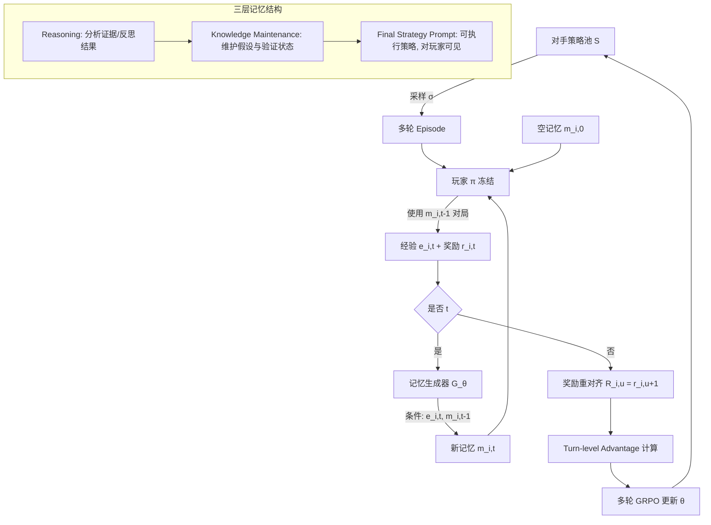

# 从玩家到大师：通过基于记忆的强化学习增强LLM智能体的测试时学习

## 一、论文基础元数据
- **原文标题**：From Player to Master: Enhancing Test-Time Learning of LLM Agents via Reinforcement Learning over Memory
- **中文译版**：从玩家到大师：通过基于记忆的强化学习增强LLM智能体的测试时学习
- **发表渠道**：arXiv 预印本（等级：待补充，未标注会议/期刊接收信息）
- **发表时间**：2025 年
- **链接**：arXiv:2606.08656
- **作者及核心机构**：Yishuo Cai, Xingyu Guo, Xuancheng Huang, Jinhua Du, Can Huang, Wenxuan Huang, Wenhan Ma, Yuyang Hu, Aohan Zeng, Jie Tang, Xu Sun（核心机构待补充，从作者列表推测涉及清华大学/智谱AI等；Xu Sun、Jie Tang 为常见清华署名）
- **研究领域**：一级领域——人工智能 / 大语言模型智能体；二级子领域——智能体测试时学习（Test-Time Learning）、基于强化学习的记忆机制
- **关联数据集**：
  - **RPS（多轮石头剪刀布）**：自建可控博弈测试台，多轮连续对局，含对手策略池，行为多样性可控
  - **LHE（限注德州扑克）**：多轮博弈测试台，含扑克策略对手池
  - **StreamBench（跨域迁移评测）**：包含 CoSQL（文本到SQL）与 DS-1000（代码生成）子任务
  - 规模/语言/标注：待补充（分析材料未给出数据规模与标注细节）

## 二、论文综合评价

### 2.1 量化评分

| 评价维度 | 评分 | 备注 |
| -------- | ---- | ---- |
| 📚 理论基础 | ⭐⭐⭐⭐ | MDP形式化记忆更新，多轮GRPO框架扎实 |
| 🎯 问题核心性 | ⭐⭐⭐⭐⭐ | 直击LLM Agent测试时学习这一关键难题 |
| 💡 方法创新性 | ⭐⭐⭐⭐⭐ | 首次将记忆更新作为可训练RL策略，范式新颖 |
| ⚙️ 技术壁垒 | ⭐⭐⭐⭐ | 多轮信用分配+轮次级优势需工程经验 |
| 🧪 实验严谨性 | ⭐⭐⭐⭐⭐ | 双测试台+多基线+完整消融+跨域验证 |
| 🔧 落地可行性 | ⭐⭐⭐⭐ | 插件式、玩家冻结、512token预算，易接入 |
| 🚀 应用前景 | ⭐⭐⭐⭐ | 跨玩家/对手/任务泛化，具备落地潜力 |
| 📊 综合评分 | 4.4 | 范式创新突出、实验完备；理论细节与更强对手泛化待补 |

### 2.2 定性综合评价（≤300字）
> 本文重新定位了LLM Agent的"记忆"角色：不再是被动存储或启发式提示，而是可训练的强化学习策略。MemoPilot冻结玩家模型，仅训练记忆生成器，将"何时、写什么记忆"建模为MDP，以多轮GRPO端到端优化，通过turn-wise reward与turn-level advantage解决延迟反馈与细粒度信用分配问题，并设计三层自适应记忆（推理—知识维护—最终策略）。差异化优势在于：不更新底层LLM参数即可实现测试时学习，且训练所得记忆策略可跨玩家模型（Qwen2.5-14B→Qwen3-235B）、跨对手、跨任务（StreamBench）迁移。关键结论：在接受控测试台上Elo双榜第一（LHE 1762、RPS 1590），显著超越Reflexion、ReasoningBank、DeepSeek-V3.2等基线，验证了"训练记忆优于提示记忆"的核心假设。

## 三、领域本体论映射
| 核心维度 | 具体内容 |
| -------- | -------- |
| 核心研究对象 | 冻结LLM智能体在多轮交互中的记忆更新策略（记忆生成器 G_θ） |
| 核心技术路径 | 多轮GRPO强化学习 + MDP建模记忆更新 + 三层结构化记忆 |
| 数据/载体形态 | 博弈轨迹（游戏记录）+ 512 token 文本记忆 + 对手策略池 |
| 核心功能目标 | 通过经验积累实现测试时学习（TTL），提升后续对局表现与跨域适应 |
| 验证核心指标 | RPS@5（每局净胜轮数）、LHE@5（每局平均筹码）、Elo 排名 |

## 四、核心问题与解决方案

### 4.1 待解决的核心问题
1. **领域级根本问题**：LLM Agent 如何在部署后通过连续交互经验持续自我改进，即实现真正的**测试时学习（TTL）**，而非依赖固定参数与静态提示。
2. **现有方法痛点**：Reflexion、ExpeL、Dynamic Cheatsheet、ReasoningBank 等记忆方法均依赖**手工规则或提示工程**更新记忆，未直接以**下游表现**为优化目标，即便使用强指令模型也难稳定提升；全量历史拼接会引入噪声。
3. **工程落地卡点**：无法在不重训底层大模型的前提下增强其适应性；记忆机制缺乏可迁移性；延迟反馈（当轮记忆的好坏要等下一局结果才知）使得信用分配困难。

### 4.2 核心解决方案
- **理论框架**：将多轮记忆更新形式化为马尔可夫决策过程（MDP）——状态=当前游戏轨迹+上一轮记忆，动作=生成文本记忆，奖励=下一局游戏结果。
- **核心架构**：插件式"记忆副驾驶"MemoPilot，玩家模型 π 全程冻结，只训练记忆生成器 G_θ。
- **关键技术**：多轮 GRPO 训练配方，含两项设计：
  1. **Turn-wise reward**：以第 u+1 局的游戏奖励作为第 u 次记忆更新动作的代理回报，解决延迟反馈；
  2. **Turn-level advantage**：将组归一化优势扩展到 `(group, turn, token)`，实现轮次级细粒度信用分配。
- **创新机制**：三层自适应记忆结构（Reasoning 分析证据 / Knowledge Maintenance 维护假设与验证状态 / Final Strategy Prompt 输出可执行策略）；仅 Final Strategy Prompt 对玩家可见，完整 cheatsheet 传给记忆模型，实现信息压缩与选择性可见。

### 4.3 核心优势（量化+定性）
1. **性能优势**：RPS@5 = 3.28、LHE@5 = 2.03（Qwen2.5-14B 玩家），对比 No Memory（0.43 / -1.36）与 DeepSeek-V3.2 记忆模型（1.64 / -0.78）大幅领先；Elo LHE 1762、RPS 1590 均列第一。
2. **效率优势**：推理时每次交互后做一次记忆更新，复杂度 O(T)，与 Reflexion/ExpeL/ReasoningBank 同级；无额外 critic、无稠密检索；记忆预算仅 512 token。
3. **工程优势**：底层 LLM 保持冻结、仅训练记忆策略，参数更新成本低；训练后记忆模型可复用于未见玩家模型（Qwen3-235B）与未见对手；跨域任务（StreamBench CoSQL 73.5 / DS-1000 56.3）亦保持优势。

## 五、方法与技术架构

### 5.1 核心架构设计

> MemoPilot 采用"冻结玩家 + 可训练记忆生成器"的解耦架构。每一轮 episode 中，玩家使用上一轮记忆与对手交互产生经验与奖励；记忆生成器根据当前经验与旧记忆生成下一轮记忆。奖励重对齐后，通过多轮 GRPO 更新记忆生成器。三层记忆结构将复杂推理过程压缩为可执行策略。

### 5.2 关键技术实现细节

| 技术模块 | 实现路径 | 工程注意事项 |
| -------- | -------- | ------------ |
| 记忆生成器 G_θ | 以 Qwen2.5-14B-Instruct 为基座，RL 微调，输入经验+旧记忆，输出 512-token cheatsheet | RPS 与 LHE 分别独立训练记忆模型；max response 6144 |
| 多轮 GRPO | batch 32、group 16、lr 1e-6、KL 1e-4，默认 rollout 含 3 连续游戏 | 组内相对优势降方差；训练 horizon 越长长期表现越稳 |
| Turn-wise reward | 以第 u+1 局奖励作为第 u 次记忆动作代理回报 | 避免累积回报不稳定（累积回报仅 0.61） |
| Turn-level advantage | 组归一化优势扩展至 (group, turn, token) 维度 | 实现轮次级信用分配，需按轮次正确对齐 |
| 三层记忆结构 | Reasoning→Knowledge Maintenance→Final Strategy，仅末层对玩家可见 | 结构化优于自由格式（LHE 2.03 vs 1.04） |
| 依赖组件 | 冻结玩家 π（Qwen2.5-14B / Qwen3-235B）、对手策略池 S、Play 环境 | 玩家参数始终不更新；记忆模型可复用 |

### 5.3 架构优缺点
- **优点**：
  - 玩家冻结降低训练成本，插件式设计便于集成到既有 Agent 系统；
  - 记忆策略可迁移：跨玩家模型、跨对手、跨任务；
  - 三层结构将推理与执行解耦，仅暴露可执行策略给玩家；
  - 训练/推理复杂度与主流记忆方法同级（O(T)）。
- **缺点**：
  - 依赖有信息量的经验与可用奖励，稀疏奖励下证据不足；
  - 记忆容量固定 512 token，长轨迹需分块/摘要；
  - 面对非平稳或自适应对手，若环境变化快于证据积累会退化（每 2 局换对手降至 1.21，对手也有记忆时 1.25）；
  - 完整算法细节（Eq.4 优势函数、Eq.6 优化目标、奖励函数、Play 环境、策略集 S 细节）在分析材料中缺失，需查正文验证。

## 六、实验设计与结果分析

### 6.1 实验基础设置

| 维度 | 内容 |
| ---- | ---- |
| 数据集 | 多轮石头剪刀布（RPS）、限注德州扑克（LHE）；跨域：StreamBench 的 CoSQL 与 DS-1000 |
| 基线方法 | No Memory、Full History、Human-Written Counter-Strategy、Reflexion、ExpeL、MemoryBank、AWM、ReasoningBank、LLM 记忆模型（DeepSeek-V3.2 等） |
| 实验环境 | 多轮对局测试台，对手池行为多样、训练/测试机制分离、Elo 校准难度；记忆预算 512 tokens |
| 评价指标 | RPS@5（平均每局净胜轮数）、LHE@5（平均每局筹码）、Elo 排名；mean@64 |

### 6.2 核心实验结果

| 方法 | RPS@5 | LHE@5 | 工程指标（算力/耗时） |
| ---- | --------- | --------- | -------------------- |
| No Memory | 0.43 | -1.36 | 最低 |
| Full History | 变差（劣于选择性记忆） | 变差 | 长上下文开销高 |
| Memory w/ Qwen2.5-14B | 0.21 | -0.23 | 与 Reflexion 同级 |
| Memory w/ DeepSeek-V3.2 | 1.64 | -0.78 | 需调用专有模型 |
| Reflexion / ExpeL / ReasoningBank | 低于本文 | 低于本文 | O(T) 记忆更新 |
| **MemoPilot (Qwen2.5-14B 玩家)** | **3.28** | **2.03** | 推理 O(T)、记忆 512 token |
| **MemoPilot (Qwen3-235B 玩家)** | **3.27** | **1.31** | 同左，记忆模型复用 |

### 6.3 消融实验/鲁棒性分析

| 实验变体 | 指标变化 | 核心结论 |
| -------- | -------- | -------- |
| 三层记忆 无 RL | LHE -0.23 | RL 训练至关重要 |
| 三层记忆 加 RL | LHE 2.03 | RL 显著提升记忆质量 |
| 自由格式记忆 加 RL | LHE 1.04 | 结构化 3-tier 优于自由格式 |
| Cumulative reward | LHE 0.61 | One-step reward 更稳定（2.03） |
| 2-turn 训练 | 长期表现较弱 | 更长训练 horizon（5-turn）更稳 |
| 跨对手（先 A 后 B） | LHE@5 3.26 vs 冷启动 2.03 | 可修正先验而非过拟合 |
| 同对手 | LHE@5 2.03 | 基线 |
| 每 5 局换对手 | LHE@5 1.76 | 非平稳性带来下降 |
| 每 2 局换对手 | LHE@5 1.21 | 高频非平稳显著退化 |
| 对手也有记忆 | LHE@5 1.25 | 仍显著优于 No Memory（-1.36） |
| 跨域 StreamBench | CoSQL 73.5 / DS-1000 56.3 | 超过 No Memory 与 Full History |

### 6.4 实验结论（工程视角）
从工程落地视角看，MemoPilot 证明了三点：(1) 用 RL 训练记忆更新策略显著优于提示式记忆与全量历史拼接，且记忆成本可控（512 token、O(T) 更新）；(2) 记忆策略具备跨玩家模型、跨对手、跨任务的迁移能力，训练一次可复用，边际成本低；(3) 主要风险来自非平稳环境——若对手变化频率高于证据积累速度，保守的记忆"维持—修正"机制会滞后，实际部署需考虑对手稳定性或加快记忆更新频率。整体上，该方案为"冻结大模型 + 可训练记忆插件"提供了一条成本可控的 TTL 路径。

## 七、领域贡献与创新点

| 贡献层级 | 具体内容 |
| -------- | -------- |
| 理论贡献 | 将 LLM Agent 的记忆更新形式化为 MDP 并作为可训练 RL 策略，提出"learning over memory"新范式 |
| 方法/架构贡献 | 提出 MemoPilot 插件式架构与多轮 GRPO 训练配方（turn-wise reward + turn-level advantage） |
| 数据/工具贡献 | 构建可控、机制分离、Elo 校准的 RPS 与 LHE 多轮博弈测试台（是否开源待补充） |
| 实验/验证贡献 | 在双测试台上系统验证记忆格式、奖励设计、训练 horizon、对手非平稳性等维度的影响 |
| 工程落地贡献 | 冻结玩家、仅训练记忆策略，实现跨玩家/对手/任务迁移，降低 TTL 落地成本 |

## 八、局限性与风险

| 维度 | 具体描述 | 应对思路 |
| ---- | -------- | -------- |
| 学术局限性 | 依赖有信息量的经验与可用奖励，稀疏奖励下证据不足；验证主要在受控博弈环境，通用任务覆盖有限 | 探索稀疏奖励下的内在奖励/好奇心机制；扩展至更多开放任务 |
| 工程落地风险 | 记忆容量固定 512 token，长轨迹需分块/摘要；面对非平稳或自适应对手时性能下降（每 2 局换对手降至 1.21） | 引入动态记忆容量与分块摘要；提高记忆更新频率或引入变化检测 |
| 伦理/合规风险 | 在博弈/对抗场景中训练"记忆副驾"可能被用于不当竞争或策略操纵 | 需评估应用场景合规性，避免用于误导性或欺诈性交互 |

## 九、未来研究/落地方向

| 方向类型 | 具体内容 | 优先级 |
| -------- | -------- | ------ |
| 科研拓展 | 稀疏奖励下的记忆学习、连续/开放任务中的 TTL、记忆容量动态化 | 高 |
| 工程优化 | 长轨迹分块摘要、记忆更新频率自适应、降低训练/推理开销 | 高 |
| 跨领域适配 | 从博弈拓展到 Agent 通用任务（工具调用、多轮对话、代码、SQL 等），验证 StreamBench 结论的普适性 | 中 |

## 十、关键词与术语表

| 语言 | 关键词 |
| ---- | ------ |
| 中文 | 测试时学习、LLM智能体、记忆更新、强化学习、多轮GRPO、信用分配、记忆副驾驶、适者生存 |
| 英文 | Test-Time Learning (TTL), LLM Agent, Memory Updating, Reinforcement Learning, Multi-Turn GRPO, Credit Assignment, MemoPilot, Adaptation |
| 领域专属术语 | **TTL（Test-Time Learning）**：模型在部署/测试阶段通过经验持续自我改进；**GRPO**：Group Relative Policy Optimization，组相对策略优化，用组内归一化优势替代 critic；**Turn-wise reward**：以下一轮奖励作为当前记忆动作的代理信号；**Turn-level advantage**：将优势计算扩展到 (group, turn, token) 维度实现轮次级信用分配；**3-tier Memory**：推理 / 知识维护 / 最终策略提示的三层结构化记忆；**Elo**：用于衡量对局实力的评级系统 |

## 十一、参考文献与关联资源
- **核心参考文献**：Reflexion、ExpeL、Dynamic Cheatsheet、ReasoningBank、MemoryBank、AWM（分析材料中列出的对比基线，具体引用信息待补充）
- **补充阅读**：GRPO 相关强化学习工作；StreamBench（跨域评测基准）
- **开源代码/工具**：待补充（分析材料未提及代码开源情况）

## 十二、阅读者批注
1. **科研启发**：将"记忆更新"从提示工程问题转化为 RL 决策问题，是范式层面的创新。该思路可推广到工具使用、多轮规划等需要跨轮信用分配的场景。
2. **工程落地思考**：玩家冻结 + 插件式记忆的设计极具落地价值，尤其适合已有大模型不便重训但需增强适应性的场景；需重点评估非平稳环境下的退化风险与记忆容量的工程权衡。
3. **待验证/存疑点**：（1）完整算法细节（Eq.4 优势函数、Eq.6 优化目标、奖励函数、Play 环境、策略集 S 的具体定义）在分析材料中缺失，需查正文核实；（2）跨域 StreamBench 的提升是否来自记忆策略本身而非偶然，需看更充分的消融；（3）论文发表渠道与代码开源情况待确认。
4. **个人/团队应用场景**：可用于多轮客服Agent、推荐/谈判Agent、游戏AI等需要跨轮次适应对手/用户行为的场景；记忆模型一次训练、多玩家复用，边际成本低。

## 十三、阅读元信息

| 维度 | 内容 |
| ---- | ---- |
| 阅读日期 | 2026-09-30 21:47 |
| 阅读人 | xPaperReader AI |
| 文档编号 | arxiv-2606.08656 |
| 版本迭代 | v1.0 |