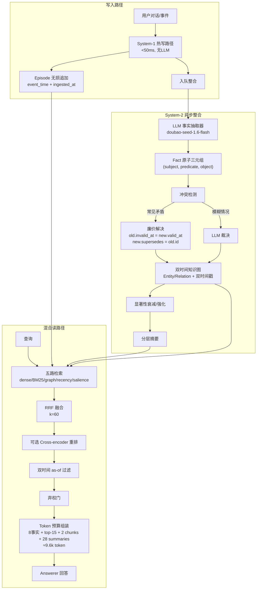

# 更少上下文，更高准确率：一种面向LLM智能体的双时间记忆引擎——精简检索上下文击败完整历史

## 一、论文基础元数据

- **原文标题**：Less Context, More Accuracy: A Bi-Temporal Memory Engine for LLM Agents Where a Lean Retrieved Context Beats the Full History
- **中文译版**：更少上下文，更高准确率：一种面向LLM智能体的双时间记忆引擎——精简检索上下文击败完整历史
- **发表渠道**：arXiv 预印本（等级：待补充，尚未标注发表于特定期刊/会议）
- **发表时间**：2025年
- **链接**：arXiv:2606.09900（https://arxiv.org/abs/2606.09900）
- **作者及核心机构**：Liuyin Wang（核心机构待补充）
- **研究领域**：
  - 一级领域：人工智能 / 大语言模型
  - 二级子领域：LLM Agent 长期记忆系统、检索增强生成（RAG）、时序知识建模
- **关联数据集**：
  - 名称：LongMemEvalS
  - 规模：500 题，每题约 50 个 session，haystack 约 115k token
  - 语言：英文
  - 标注：含 7 类问题（knowledge-update、temporal-reasoning、abstention、multi-session aggregation、single-session preference 等），采用官方分类 judge prompts 进行评判

## 二、论文综合评价

### 2.1 量化评分（1-5分，5分为最优）

| 评价维度 | 评分 | 备注 |
| -------- | ---- | ---- |
| 📚 理论基础 | ⭐⭐⭐⭐ | 双时间建模与双过程理论扎实，但核心概念源自数据库领域 |
| 🎯 问题核心性 | ⭐⭐⭐⭐⭐ | 直击Agent跨会话记忆成本-准确率权衡的领域根本痛点 |
| 💡 方法创新性 | ⭐⭐⭐⭐ | 双时间+失效保留+混合读路径组合新颖，非颠覆性突破 |
| ⚙️ 技术壁垒 | ⭐⭐⭐ | 系统集成为主，依赖现成LLM/embedder，算法壁垒中等 |
| 🧪 实验严谨性 | ⭐⭐⭐⭐ | 官方judge、0/500错误、诚实报告陷阱，但单基准单次运行 |
| 🔧 落地可行性 | ⭐⭐⭐⭐ | 开源harness、LiteLLM兼容、成本降低8倍，工程可复用 |
| 🚀 应用前景 | ⭐⭐⭐⭐⭐ | 长期记忆是Agent核心基建，需求刚性且市场广阔 |
| 📊 综合评分 | 4.1 | 系统设计扎实、结论反直觉且可信，但泛化验证尚不足 |

### 2.2 定性综合评价（≤300字）

> 本文提出 Engram——一种面向 LLM Agent 的双过程、双时间记忆引擎，核心命题反直觉：**精简检索上下文（约9.6k token）在 LongMemEvalS 上以 83.6% 对 73.2% 显著击败完整历史（约79k token），准确率提升 +10.4 点，token 减少约8倍（McNemar p<10⁻⁶）**。差异化优势在于：(1) 双时间戳（有效时间+交易时间）与非破坏性失效机制，原生支持 as-of 查询和知识更新；(2) 混合读路径（dense+BM25+graph+recency+salience 五路 RRF）证明 facts-only 会损失召回，facts+chunks 方为必要；(3) 贡献中立可复现 harness，内置官方 judge 并披露测量陷阱。局限同样明确：仅单基准、单 backbone、单次运行，无受控组件消融，多会话聚合与偏好推理仍为瓶颈。总体是一篇工程价值高、测量态度诚实的记忆系统论文。

## 三、领域本体论映射

| 核心维度 | 具体内容 |
| -------- | -------- |
| 核心研究对象 | LLM Agent 的跨会话长期记忆存储与检索机制 |
| 核心技术路径 | 双过程架构（热写+异步整合）× 双时间数据模型 × 五路混合检索 RRF 融合 |
| 数据/载体形态 | Episode（无损对话）+ Fact（原子三元组）+ Entity/Relation 图，均带双时间戳与 provenance |
| 核心功能目标 | 在有限 token 预算下实现准确的知识更新、时间推理、弃权判断与可追溯记忆 |
| 验证核心指标 | LongMemEvalS 分类准确率、平均上下文 token 数、McNemar 显著性、配对 bootstrap 置信区间 |

## 四、核心问题与解决方案

### 4.1 待解决的核心问题

1. **领域级根本问题**：LLM Agent 跨会话无状态，长期记忆面临"成本-准确率"的根本矛盾——全历史拼接成本高、延迟高，且随干扰项增多准确率反而下降（"Lost in the middle"现象）。
2. **现有方法痛点**：现有记忆系统多宣称"更便宜/更快"，但**极少在准确率上超过全上下文基线**；且基准不可复现——不同 harness、answer prompt、judge 导致同一系统得分差异巨大，缺乏可信记分牌。
3. **工程落地卡点**：如何在生产环境中以有界上下文成本支撑无限增长的历史记忆；如何处理知识更新中的矛盾事实而不丢失溯源；如何在不同 LLM 供应商间可移植地部署记忆引擎。

### 4.2 核心解决方案

- **理论框架**：双时间（bi-temporal）数据建模——区分"世界时间/有效时间"（事实何时为真）与"交易时间/系统时间"（系统何时学到/撤回），使知识更新与时间查询成为模型内在能力而非外挂逻辑。
- **核心架构**：双过程设计——**System-1 热写路径**（<50ms，无 LLM，追加无损 episode + 身份链接 + 轻量 embedding + 入队整合）与 **System-2 异步整合**（提取原子事实、构建双时间知识图、冲突检测、显著性衰减/强化、分层摘要）。
- **关键技术**：五路信号加权 RRF 检索（dense semantic w=1.0、BM25 w=0.6、graph n-hop w=0.8、recency w=0.3、salience w=0.25，k_RRF=60）+ 可选 cross-encoder 重排 + 双时间 as-of 过滤 + 弃权门 + token-budgeted 上下文组装。
- **创新机制**：**廉价优先的冲突解决**——常见矛盾无需 LLM，直接设置 `old.invalid_at = new.valid_at`、`new.supersedes = old.id`，**无效化而非覆盖**，保留完整 provenance 与 supersession 链，仅模糊情况升级 LLM 裁决。

### 4.3 核心优势（量化+定性）

1. **性能优势**：`engram_lean` 83.6% vs `full_context` 73.2%，+10.4 点（95% CI [+6.4, +14.4]），McNemar exact p<10⁻⁶；knowledge-update 达 87.5%，temporal-reasoning 81.1%，abstention 86.7%。关键对照：`engram_full`（事实+全历史）83.4%，与 lean 无显著差异（p=0.91），证明**增益来自结构化事实而非全历史**。
2. **效率优势**：上下文 token 从 79k 降至 9.6k，约 8 倍压缩；成本随历史增长保持平坦（有界检索切片）；检索本身亚秒级，端到端 p50 约 60s（主要由 answerer 生成决定）。
3. **工程优势**：模型统一以 `provider:model` 寻址，经 LiteLLM 解析，可替换任意 OpenAI-compatible 端点；embedder（bge-small-en-v1.5）本地运行无需 API key；系统、harness、逐题日志全部开源。

## 五、方法与技术架构

### 5.1 核心架构设计

Engram 采用双过程、双时间的记忆引擎架构。写入侧 System-1 以<50ms 完成无损 episode 追加；System-2 异步抽取原子事实并构建双时间知识图。读取侧通过五路混合检索 + RRF 融合 + as-of 过滤 + token 预算组装，产出约 9.6k token 的 lean slice。所有事实永不硬删除，矛盾通过 `invalid_at` + `supersedes` 链保留。

### 5.2 关键技术实现细节

| 技术模块 | 实现路径 | 工程注意事项 |
| -------- | -------- | ------------ |
| System-1 热写路径 | 追加无损 episode，身份链接，轻量 embedding，入队整合 | 必须无 LLM 调用以保证 <50ms 延迟；需保证 episode 事件时间与摄入时间双记录 |
| System-2 异步整合 | 事实抽取`(subject, predicate, object)`，构建双时间知识图，冲突检测与显著性计算 | 事实抽取 LLM 调用成本需控制；supersession 链需保持完整以免溯源断裂 |
| 冲突解决 | 廉价优先：`old.invalid_at = new.valid_at`，`new.supersedes = old.id`，无效化不覆盖 | 仅模糊矛盾才升级 LLM 裁决，避免成本爆炸；严禁硬删除旧事实 |
| 混合检索 | 五路信号加权 RRF（sem=1.0, lex=0.6, graph=0.8, rec=0.3, sal=0.25），k_RRF=60 | facts-only 会损失召回，必须混合 facts + raw chunks；权重需按任务调优 |
| 上下文组装 | lean slice：≤8 条冲突解决事实 + top-15 融合项 + 2 个原始 session chunks + 28 个 session summaries | token 预算需严格有界以支撑成本平坦扩展；as-of 过滤与弃权门需前置 |
| 依赖组件 | Embedder `BAAI/bge-small-en-v1.5`（本地）；抽取器 `doubao-seed-1.6-flash`；Answerer `doubao-seed-2.0-pro`；Judge `DeepSeek-V3.2`；LiteLLM 统一寻址 | 需 OpenAI-compatible 端点方可替换；judge 与 answerer 必须固定以免不可复现 |

### 5.3 架构优缺点

- **优点**：
  1. 双时间建模使 as-of 查询、知识更新、审计溯源成为原生能力；
  2. 失效而非删除保留完整历史与 supersession 链；
  3. 廉价优先冲突解决大幅减少 LLM 调用；
  4. 有界上下文切片实现成本随历史平坦扩展；
  5. LiteLLM 解耦使其可跨供应商移植。
- **缺点**：
  1. 双时间戳 + provenance + graph 边导致存储开销增加；
  2. 异步整合存在一致性窗口，热写与整合结果可能短暂不一致；
  3. 事实抽取质量高度依赖 LLM，抽取器误差会污染知识图；
  4. 长链 supersession 的检索与图遍历复杂度随历史增长；
  5. 多会话聚合与偏好推理类任务表现仍弱（79.3% / 73.3%）。

## 六、实验设计与结果分析

### 6.1 实验基础设置

| 维度 | 内容 |
| ---- | ---- |
| 数据集 | LongMemEvalS，500 题，每题约 50 sessions，haystack 约 115k token，覆盖 7 类问题 |
| 基线方法 | `full_context`（完整 haystack 入 prompt，约 79k token）；`engram_full`（事实+全历史，约 79k token）；对比 `engram_lean` |
| 实验环境 | Answerer: doubao-seed-2.0-pro；Judge: DeepSeek-V3.2；Extractor: doubao-seed-1.6-flash；Embedder: BAAI/bge-small-en-v1.5；官方分类 judge prompts |
| 评价指标 | 分类准确率、95% 置信区间、平均上下文 token、错误题数、McNemar exact 检验、配对 bootstrap CI |

### 6.2 核心实验结果

| 方法 | 准确率 | 平均上下文 token | 工程指标（算力/耗时） |
| ---- | --------- | --------- | -------------------- |
| `full_context`（基线1） | 73.2% [69.2, 76.9] | 79k | 全历史入 prompt，成本随历史线性增长；0/500 错误 |
| `engram_full`（基线2） | 83.4% | ~79k | 事实+全历史，1/499 错误；与 lean 无显著差异 p=0.91 |
| `engram_lean`（本文方法） | **83.6%** [80.1, 86.6] | **9.6k** | 约 8× token 压缩；检索亚秒级，端到端 p50 ≈60s；0/500 错误 |

**关键统计**：McNemar exact p<10⁻⁶；配对 bootstrap 95% CI [+6.4, +14.4]；lean 正确而 baseline 错误的题 81 道，反向仅 29 道。

### 6.3 消融实验/鲁棒性分析

| 实验变体 | 指标变化 | 核心结论 |
| -------- | -------- | -------- |
| `engram_lean` vs `engram_full` | 83.6% vs 83.4%，p=0.91 | 增益来自结构化事实，全历史只增加 token 不增加正确率 |
| facts-only（设计观察，未完整报告） | 会损失召回 | 必须混合 facts + raw chunks，facts 提供冲突解决与双时间信号 |
| 分类别表现 | knowledge-update 87.5%、temporal-reasoning 81.1%、abstention 86.7%；弱项 multi-session aggregation 79.3%、single-session preference 73.3% | 双时间建模对知识更新和时间推理最有效；多会话聚合与偏好仍是难点 |
| 测量陷阱修复 | 早期"lean"实含全历史、full-context 被截断、自创 judge 过严等 | 修正后数字显著变化，强调测量完整性的重要性 |

### 6.4 实验结论（工程视角）

1. **不要默认塞全历史**：完整上下文引入干扰项，准确率反而下降，且成本无法扩展。
2. **有界混合检索是可行路径**：9.6k token 的 lean slice 即可超越 79k 全历史，成本平坦可扩展。
3. **结构化事实是增益主源**：应结合双时间冲突解决事实与原始证据片段，二者缺一不可。
4. **可复现性优先于排行榜**：在中立 harness + 官方 judge + 完整 baseline 下报告，可信的记分牌本身就是结果。
5. **诚实报告小样本风险**：开发中 18 项切片曾达 83%，全集真值约 58%，凸显小样本误导性。

## 七、领域贡献与创新点

| 贡献层级 | 具体内容 |
| -------- | -------- |
| 理论贡献 | 将数据库领域的双时间（有效时间+交易时间）建模系统性引入 LLM Agent 记忆，区分"事实何时为真"与"系统何时知道/撤回" |
| 方法/架构贡献 | 双过程记忆引擎（热写+异步整合）；廉价优先非破坏性冲突解决（invalid_at + supersedes，永不硬删除）；五路信号加权 RRF 混合读路径 |
| 数据/工具贡献 | 开源系统 + 中立可复现 in-repo harness（内置官方 judge、每表含 full-context 基线、公开逐题日志）+ 记录并修复 5 类测量陷阱 |
| 实验/验证贡献 | 首次实证"精简检索上下文在准确率上击败全上下文"（+10.4 点，8× token 减少）；`engram_full` 对照证明增益来自结构化事实而非全历史 |
| 工程落地贡献 | LiteLLM 解耦的可移植模型寻址；本地 embedder 免 API key；有界上下文实现成本平坦扩展，为生产级 Agent 记忆提供可直接复用的架构范式 |

## 八、局限性与风险

| 维度 | 具体描述 | 应对思路 |
| ---- | -------- | -------- |
| 学术局限性 | 仅单基准（LongMemEvalS）、单 answerer backbone、单次运行；未量化 answerer 随机性方差；无受控组件消融（尤其 §5 facts-only vs hybrid 仅为观察陈述） | 扩展至 LOCOMO 及第二个 backbone（小开源+前沿）；重复运行评估方差；补做完整组件消融 |
| 工程落地风险 | 双时间戳+provenance+图存储开销大；异步整合一致性窗口；事实抽取 LLM 误差污染知识图；长链 supersession 检索复杂度增长；端到端 p50 ≈60s 延迟偏高 | 引入存储分层与图剪枝；明确一致性语义与补偿机制；抽取质量监控与回退；优化 answerer 调用或流式输出 |
| 伦理/合规风险 | 长期记忆存储用户敏感对话涉及隐私与数据留存合规；无效化而非删除的"软删除"可能不符合 GDPR 等"被遗忘权"要求；Judge/answerer 使用第三方 API 存在数据出境风险 | 提供真删除接口与留存策略；本地化部署 embedder/LLM；审计日志脱敏；明确数据治理边界 |

## 九、未来研究/落地方向

| 方向类型 | 具体内容 | 优先级 |
| -------- | -------- | ------ |
| 科研拓展 | 扩展至 LOCOMO 及第二个 backbone（小开源模型 + 前沿模型）；重复运行评估方差；完整组件消融（facts-only vs hybrid） | 高 |
| 工程优化 | 改进多跳查询规划器；优化双时间冲突解决；降低端到端延迟（answerer 调用）；存储与图遍历效率优化 | 高 |
| 跨领域适配 | 将双时间记忆引擎适配至多会话聚合、单会话偏好推理场景；迁移至非英文/多语言 Agent；结合工具调用与多模态记忆 | 中 |

## 十、关键词与术语表

| 语言 | 关键词 |
| ---- | ------ |
| 中文 | 大语言模型智能体、长期记忆、双时间建模、检索增强生成、知识更新、上下文压缩、冲突消解、可复现基准 |
| 英文 | LLM Agent, Long-term Memory, Bi-temporal Modeling, RAG, Knowledge Update, Context Compression, Conflict Resolution, Reproducible Benchmark, Engram |
| 领域专属术语 | **Bi-temporal（双时间）**：区分有效时间（valid_at/invalid_at，事实何时为真）与交易时间（created_at/expired_at，系统何时获知/撤回）。**Supersession（取代）**：新事实通过 supersedes 指针取代旧事实，旧事实设 invalid_at 但不删除。**As-of Query（时点查询）**：查询某一时间点的有效事实集合。**RRF（Reciprocal Rank Fusion，倒数排名融合）**：多路检索结果融合算法，k=60。**Lean Slice（精简切片）**：token 预算有界的混合上下文组装，约 9.6k token。**Provenance（溯源）**：事实指向来源 episode ids。**Haystack（干草堆）**：基准中供检索的全部历史材料。**Abstention（弃权）**：模型对不可回答问题主动拒答的能力。 |

## 十一、参考文献与关联资源

- **核心参考文献**：
  - LongMemEval / LongMemEvalS 基准（官方分类 judge prompts）
  - RRF（Reciprocal Rank Fusion）原始工作
  - "Lost in the middle" 长上下文干扰项现象研究
  - 双时间数据库建模经典文献（待补充具体引用）
- **补充阅读**：
  - LOCOMO 长对话记忆基准（未来工作计划）
  - 其他 LLM Agent 长期记忆系统（MemGPT、Mem0 等，论文中未明确列举，待补充）
- **开源代码/工具**：
  - Engram 系统 + 中立可复现 harness + 逐题日志（论文宣称开源，具体仓库地址待补充）
  - `BAAI/bge-small-en-v1.5`（本地 embedding）
  - LiteLLM（统一模型寻址）
  - cross-encoder 重排组件

## 十二、阅读者批注

1. **科研启发**：**"软删除/无效化而非硬删除"** 是最值得借鉴的设计——它把记忆的时间维度提升为一等公民，使 Agent 具备"当时我知道什么"的审计能力。这一思路可迁移到任何需要版本化知识的系统。"精简上下文反而更准"的结论提醒我们重新审视"更多信息=更好"的默认假设，干扰项效应在长上下文时代仍是核心矛盾。
2. **工程落地思考**：有界 token 预算 + 成本平坦扩展，对生产级 Agent 记忆是刚需。LiteLLM 解耦设计使模型可插拔，降低供应商锁定风险。但需注意：(a) 异步整合的一致性窗口在强一致场景下需补偿；(b) 端到端 p50 约 60s 的延迟偏高，实时交互场景需优化；(c) 双时间图的存储成本需评估。
3. **待验证/存疑点**：**最关键存疑是泛化性**——仅单基准、单 backbone、单次运行，结论能否跨模型/跨基准保持？`engram_full` ≈ `engram_lean`（p=0.91）虽有力支撑"事实为增益主源"，但 facts-only 消融未完整报告，混合读路径的必要性尚需严格受控实验。此外，author 自陈开发中 18 题切片曾达 83% 而全集真值 58%，提示小样本结果不可信。
4. **个人/团队应用场景**：适用于需要长期记忆的客服 Agent、个人助理、代码助手等场景，尤其是涉及知识频繁更新（如用户职位/偏好变化）和需要时间点回溯（"上周用户说的是什么"）的任务。可作为 RAG 系统的记忆层组件直接集成。

## 十三、阅读元信息

| 维度 | 内容 |
| ---- | ---- |
| 阅读日期 | 2026-09-30 21:50 |
| 阅读人 | xPaperReader AI |
| 文档编号 | arxiv-2606.09900 |
| 版本迭代 | v1.0 |

---

> **阅读提示**：本简报基于论文的 overview、method、experiment、conclusion 四部分分组分析汇总生成。需特别说明：方法分析片段自陈"仅包含 3.1 Bi-temporal data model 和 Models 两节，共约 2158 字符，不是完整论文"，因此部分实现细节（如具体检索算法公式、冲突消解的完整伪代码）来自 overview 与 experiment 分组的补充。若需引用具体数值或方法细节，建议回溯 arXiv 原文核对。