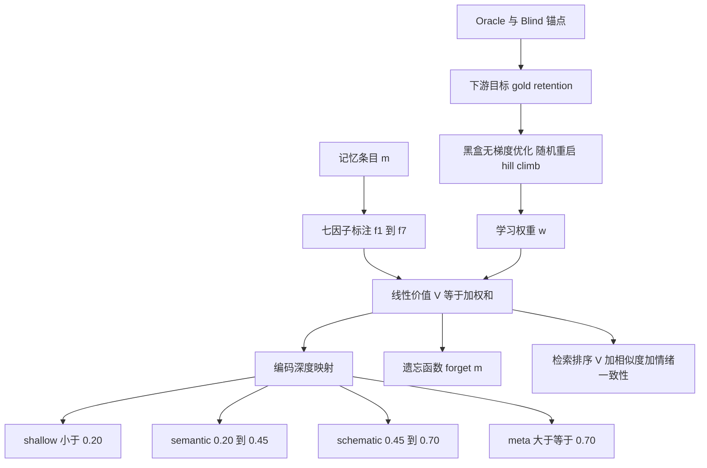

# 学习记住什么：面向智能体记忆的认知启发多因子价值模型

## 一、论文基础元数据
- 原文标题：Learning What to Remember: A Cognitively Grounded Multi-Factor Value Model for Agentic Memory
- 中文译版：学习记住什么：面向智能体记忆的认知启发多因子价值模型
- 发表渠道：arXiv 预印本（等级未标注，待补充）
- 发表时间：2025（具体日期待补充）
- 链接：arXiv:2606.12945；https://arxiv.org/abs/2606.12945
- 作者及核心机构：Zhibao Chen, Qian Cheng；核心机构待补充
- 研究领域：一级领域：人工智能；二级子领域：LLM Agent / 长程记忆管理
- 关联数据集：
  - LongMemEval-S：479 个可用案例，英语多会话聊天，约 500 轮/案例，保留预算 κ=30%，标注为 gold-evidence
  - 合成混淆研究：60 个 held-out 案例，保留 40%，植入 goal/task/reliability 信号与 value-alignment/self-relevance 混淆

## 二、论文综合评价
### 2.1 量化评分（1-5分，5分为最优）

| 评价维度 | 评分 | 备注 |
| -------- | ---- | ---- |
| 📚 理论基础 | ⭐⭐⭐⭐ | 认知retention理论与Agent记忆结合 |
| 🎯 问题核心性 | ⭐⭐⭐⭐⭐ | 遗忘与未来查询时间错配关键 |
| 💡 方法创新性 | ⭐⭐⭐⭐ | 七因子单标量统一三操作 |
| ⚙️ 技术壁垒 | ⭐⭐⭐ | 线性+黑盒优化门槛不高 |
| 🧪 实验严谨性 | ⭐⭐⭐⭐ | 全案例bootstrap但指标非QA |
| 🔧 落地可行性 | ⭐⭐⭐⭐ | CPU-only可审计易复现 |
| 🚀 应用前景 | ⭐⭐⭐⭐ | 长程记忆需求强需端到端验证 |
| 📊 综合评分 | 4.0 | 洞见突出，实验范围与QA验证待扩展 |

### 2.2 定性综合评价（≤300字）
> 本文定位为长程 LLM Agent 记忆管理中“记什么、忘什么、检索什么”的统一决策框架。核心价值在于用认知启发七因子线性价值函数，把编码深度、遗忘和检索统一为一个可学习标量，并以 oracle/blind 区分揭示遗忘评估中的时间错配。差异化优势是权重从下游目标学习、可解释可审计、CPU-only 可复现。关键结论：在 LongMemEval-S 盲遗忘设定下，学习多因子价值保留 0.770±0.011，显著优于 uniform 0.657、最佳单因子 0.518 和 recency 0.368；而 oracle 下 goal-only 高达 0.979 却盲测崩至 0.286，说明必须用查询无关指标评估遗忘。局限是尚未验证端到端 QA 收益与跨 workload 迁移。

## 三、领域本体论映射
| 核心维度 | 具体内容 |
| -------- | -------- |
| 核心研究对象 | LLM Agent 长程记忆的 retention / forgetting 策略 |
| 核心技术路径 | 认知启发七因子 → 线性价值 V → 单标量控制编码、遗忘、检索；权重通过黑盒优化学习 |
| 数据/载体形态 | 多会话聊天记忆条目、七维因子、gold evidence、合成混淆数据 |
| 核心功能目标 | 在 consolidation 时决定深度编码、遗忘、检索，最大化未来可用信息保留 |
| 验证核心指标 | gold-evidence retention（blind/oracle）、bootstrap 95% CI、保留预算 κ |

## 四、核心问题与解决方案
### 4.1 待解决的核心问题
1. **领域级根本问题**：长程 LLM Agent 历史远超上下文窗口，记忆写入与遗忘发生在未来查询已知之前，存在“遗忘决策—未来查询”的时间错配。
2. **现有方法痛点**：语义相似度、新近度等单因子信号适合检索，但不适合遗忘；生产系统分别调优写入重要性、驱逐、检索排序，规则分散难审计；用未来查询定义 gold 评估遗忘会严重高估策略。
3. **工程落地卡点**：未来查询未知时目标锚不可用；因子标注与权重学习依赖下游信号；任务效用因子在 API-free 设置下被锁死；端到端 QA 收益尚未验证。

### 4.2 核心解决方案
- 理论框架：认知心理学多因素 retention 理论；记忆价值建模为七因子线性加权函数。
- 核心架构：七因子 → 价值 V(m) → 编码深度四层映射 / 遗忘函数 / 检索排序。
- 关键技术：无梯度黑盒优化（随机重启 hill-climb）学习权重；API-free 因子标注；oracle/blind 双评估机制。
- 创新机制：一个标量统一编码、遗忘、检索；可学习权重替代手工规则；oracle/blind 分离检索与 retention。

### 4.3 核心优势（量化+定性）
1. 性能优势：blind 设定下 learned_V 达 0.770±0.011，优于 uniform 0.657、最佳单因子 0.518、recency 0.368，每对差距 bootstrap 95% CI 均排除 0。
2. 效率优势：CPU-only、无 API 调用；线性模型与 MLP 非线性模型打平（+0.003±0.013），说明轻量线性已足够。
3. 工程优势：可解释、可审计；部署仅暴露一个七维旋钮；编码层级与规则自动继承价值变化；复现成本低。

## 五、方法与技术架构
### 5.1 核心架构设计
> 记忆条目被标注为 7 个可解释因子，线性加权为单一价值 V(m)。V(m) 同时驱动编码深度、遗忘和检索。权重通过下游目标用无梯度黑盒优化学习。评估时区分 oracle（用未来查询定义目标锚，测检索上界）与 blind（仅用 consolidation 时可用信息，测真实遗忘）。

### 5.2 关键技术实现细节
| 技术模块 | 实现路径 | 工程注意事项 |
| -------- | -------- | ------------ |
| 七因子标注 | 对记忆条目提取 f1 到 f7；API-free 设置下部分因子锁定，依赖可观测文本信号 | 需保证标注一致性；API-free 下任务效用因子可能缺失 |
| 价值函数 | V 等于七因子加权和；线性模型与 MLP 非线性模型对比 | 轻量线性已足够；权重可解释、可审计 |
| 权重学习 | 以 downstream gold retention 为目标；随机重启 hill-climb 无梯度优化 | CPU-only 可复现；避免过拟合；每对差距用 bootstrap 95% CI |
| 编码深度映射 | 按 V 分四层：shallow、semantic、schematic、meta | 阈值需校准；编码层级与规则自动继承价值变化 |
| 遗忘函数 | 由 V 驱动遗忘决策，输出 forget 信号 | blind 设定仅用 consolidation 时信息；避免未来查询泄漏 |
| 检索排序 | V 加相似度加情绪一致性进行排序 | oracle 测检索上界；blind 测真实遗忘 |
| 评估机制 | oracle 与 blind 双评估；LongMemEval-S 保留预算 κ=30%；合成混淆研究保留 40% | 指标为 gold-evidence retention 非端到端 QA；需跨 workload 验证 |