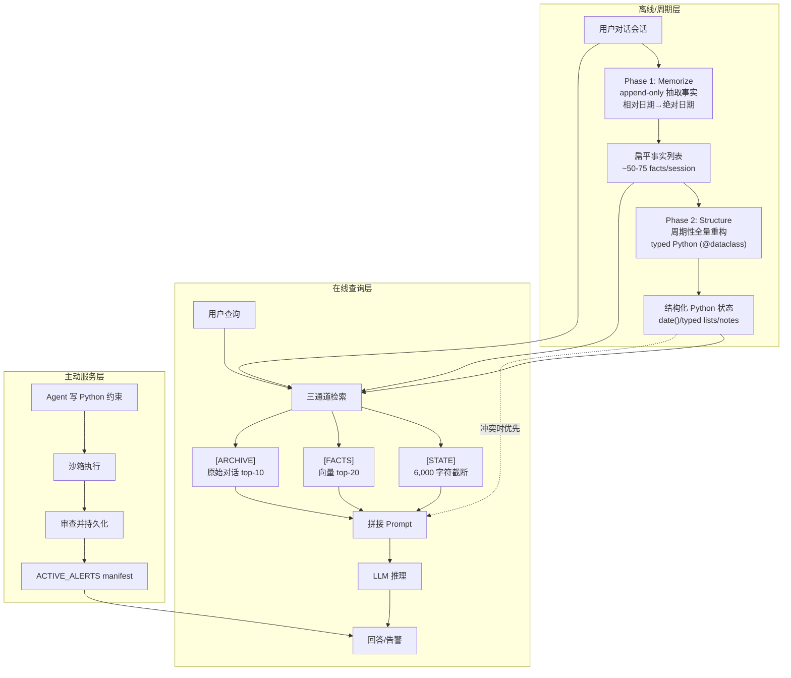

# 用户即代码：面向个性化智能体的可执行记忆

## 一、论文基础元数据

- **原文标题**：User as Code: Executable Memory for Personalized Agents
- **中文译版**：用户即代码：面向个性化智能体的可执行记忆
- **发表渠道**：arXiv 预印本（等级：待补充，未见同行评审标注）
- **发表时间**：2025 年（具体月份待补充）
- **链接**：arXiv:2606.16707（DOI 待补充）
- **作者及核心机构**：Bojie Li（单一作者；机构待补充，原文未在给定分析中明确）
- **研究领域**：
  - 一级领域：人工智能 / 大语言模型系统
  - 二级子领域：个性化 Agent 记忆系统、可执行记忆表示、Agent 长期记忆
- **关联数据集**：
  - **LOCOMO**：长对话记忆基准，本文使用完整 10 段对话（附录审计选取 5 段，单对话产出约 1.5K–2.6K 事实，最大达 2,553 条）；语言为英文；标注为问答对（QA）
  - **LongMemEval**：长期记忆评估基准（规模/语言/标注待补充）
  - **Analytical Inference 集合**：分析型聚合推理测试集（规模待补充）
  - **Active Service Benchmark**：主动服务评测集，分标准场景与困难场景，困难集 n=20
  - **模块化实验语料**：10 个领域 × 500 条记录（合成/构造，规模明确）

## 二、论文综合评价

### 2.1 量化评分（1-5分，5分为最优）

| 评价维度 | 评分 | 备注 |
| -------- | ---- | ---- |
| 📚 理论基础 | ⭐⭐⭐⭐ | 重构记忆表示范式，但形式化定义偏弱 |
| 🎯 问题核心性 | ⭐⭐⭐⭐⭐ | 直击记忆系统的检索式根本瓶颈 |
| 💡 方法创新性 | ⭐⭐⭐⭐⭐ | 记忆=可执行代码，范式级创新 |
| ⚙️ 技术壁垒 | ⭐⭐⭐ | 工程可复现，算法难度中等 |
| 🧪 实验严谨性 | ⭐⭐⭐ | 消融充分，但困难集样本偏小 |
| 🔧 落地可行性 | ⭐⭐⭐⭐ | 一次结构化多次查询，成本可摊销 |
| 🚀 应用前景 | ⭐⭐⭐⭐ | 个性化 Agent 刚需，商业价值明确 |
| 📊 综合评分 | 4.0 | 范式创新突出，实验规模与形式化仍有提升空间 |

### 2.2 定性综合评价（≤300字）

> 本文针对个性化 Agent 记忆系统“先存储后检索（store-then-retrieve）”范式的结构性缺陷——检索能召回单点事实，却难以完成矛盾消解、跨记录聚合、规则执行与主动告警——提出 **User as Code（UaC）**：将用户记忆从文本/图谱/扁平事实库升级为**类型化可执行 Python 代码**，使“表示用户”与“推理用户”共处同一可解释、可执行介质。
>
> 核心价值在于把记忆的**表示结构**而非检索算法视作性能杠杆。方法采用两阶段流水线：Phase 1 按会话 append-only 抽取扁平事实（约 50–75 facts/session）；Phase 2 周期性从完整事实语料**全量重构** typed Python 状态，规避增量覆盖的信息丢失。查询时三通道（STATE/FACTS/ARCHIVE）拼接推理，并以 Generate–Verify–Review 流水线生成持久约束与 `ACTIVE_ALERTS`。
>
> 关键结论：LOCOMO 78.8%（接近 Full Context 79.8%），LongMemEval 83.0%，分析型聚合推理达 99%（Mem0 仅 6%），主动服务标准场景 100%。消融显示 append-only 提取（+19.0pp）与两阶段分离（+12.3pp）为决定性架构选择。

## 三、领域本体论映射

| 核心维度 | 具体内容 |
| -------- | -------- |
| 核心研究对象 | 个性化 Agent 的用户记忆表示与推理机制 |
| 核心技术路径 | 可执行代码记忆（typed dataclass + Python 函数）+ 两阶段流水线 + 三通道检索 + 约束生成流水线 |
| 数据/载体形态 | 结构化 Python 状态（`@dataclass`）、扁平事实列表、原始对话归档、`ACTIVE_ALERTS` manifest |
| 核心功能目标 | 支持基本回忆、分析推理（聚合/矛盾消解）、主动约束检查三类能力于同一介质 |
| 验证核心指标 | LOCOMO 准确率、LongMemEval 准确率、分析型推理准确率、Active Service 通过率、延迟、token 成本 |

## 四、核心问题与解决方案

### 4.1 待解决的核心问题

1. **领域级根本问题**：
   现有 Agent 记忆普遍采用「store-then-retrieve」范式——先存储事实，再按语义相似度检索。该范式能召回单点事实，但记忆的**表示结构**与**推理需求**脱节，导致：
   - 矛盾消解（新事实与旧事实冲突时无法自动裁决）
   - 跨记录聚合（平均值、排序、枚举等需要遍历全量而非 top-k 检索）
   - 逻辑规则/约束执行（时间约束、行为约束无法表达）
   - 主动告警（无法在用户不提问时触发判断）

2. **现有方法痛点**：
   - 检索召回是「排序」问题，而聚合是「枚举」问题——即使召回 46/50 条事实，平均值仍会算错
   - Full Context 虽保留原始文本，但多步算术与复合约束仍难处理（困难场景仅 55%）
   - Mem0 在分析型推理上仅 6%，MemMachine 43%，检索式记忆在聚合任务上结构性崩溃
   - 增量代码覆盖会破坏召回（−10.0pp），因为新代码会覆盖旧状态

3. **工程落地卡点**：
   - Phase 2 一次性全量重构在约 100 会话后受 500K 字符输入上限截断
   - UaC 单查询成本（约 1.4m$）与延迟（中位 3.62s）高于普通检索，不适合单查询场景
   - Phase 2 内容丢失虽小（0.18%）但集中于最长输入，规模扩展时风险上升

### 4.2 核心解决方案

- **理论框架**：
  用户记忆应是「活着的软件项目」而非「事实袋」。论文援引中文「记忆」由「记」与「忆」构成的语义——**能回忆的范围受限于记录方式**，因此真正杠杆不在检索侧，而在记录与召回之间的**表示结构**。类型化、可执行代码被视为理想结构，让记忆与回忆在同一介质中相遇并由解释器执行。

- **核心架构**：两阶段流水线（Memorize + Structure）
  1. **Phase 1 Memorize（按会话、append-only）**：LLM 从每段对话抽取扁平事实，写入只增不减的事实列表；相对日期解析为绝对日期（如「昨天失业」+ 2023-01-20 → 2023-01-19）；产出约 50–75 facts/session。
  2. **Phase 2 Structure（周期性、全量重构）**：从完整事实语料**重新生成** typed Python 状态，而非增量修改；使用 `@dataclass`、`date()`、typed lists、`notes: list[str]` 等结构；容忍主性能差距归因于检索层而非结构化失败。

- **关键技术**：
  - **查询时三通道检索**：`[STATE]`（结构化 Python 状态，截断 6,000 字符）+ `[FACTS]`（向量检索 top-20）+ `[ARCHIVE]`（原始对话检索 top-10），三通道拼接至 prompt，冲突时以结构化状态优先。
  - **主动服务流水线 Generate–Verify–Review**：Agent 写 Python 约束 → 沙箱执行 → 审查并持久化 → 告警写入 `ACTIVE_ALERTS` manifest，每次对话开始即可见，支持无需用户提问的主动告警。
  - **模块化/渐进披露**：按需加载领域模块，而非 Monolithic 全量加载。

- **创新机制**：
  - 将「记忆」与「结构化」显式分离，避免增量覆盖导致的信息丢失
  - 用代码类型系统统一基本回忆、分析推理、主动约束检查三种能力
  - Safe-net `notes` 字段兜底不匹配 typed 字段的自由事实

### 4.3 核心优势（量化+定性）

1. **性能优势**：
   - 分析型聚合推理：UaC 99% vs MemMachine 43%、Mem0 6%（决定性优势）
   - Active Service 标准场景：UaC 100% vs Mem0 live 90%；去掉预计算告警后降至 52.5%
   - Active Service 困难场景：UaC 85% vs Full Context 55%
   - LOCOMO 78.8%、LongMemEval 83.0%，与最强记忆基线统计持平或领先

2. **效率优势**：
   - 多查询摊销：N=500 时结构化一次性约 102m$，之后每查询约 1.4m$，对比 Full Context+REPL 每查询约 38m$；约第 3 次查询回本，100 次摊销后便宜约 15.5×
   - Phase 2 输出 token 有界在 3.1–3.8K，墙钟 30–40 秒
   - 模块化/渐进披露：10 域 500 记录下 prompt token 降 24×，成本从 $3.64 降至 $0.25

3. **工程优势**：
   - 三通道检索消融证明结构化状态对分析推理与约束告警关键（FACTS 通道 −9.3pp，p=0.0008；ARCHIVE 通道 −7.3pp，p=0.008）
   - 跨家族 judge 重判后排名完全一致、κ 高，说明同家族 judge 偏差未扭曲结论
   - Phase 2 解析可靠性 5/5，日期类型化 44/44，内容丢失仅 0.18%

## 五、方法与技术架构

### 5.1 核心架构设计

> UaC 采用两阶段离线/周期流水线 + 三通道在线检索 + 约束生成流水线的整体架构。离线阶段（Phase 1）以 append-only 方式从每段会话抽取扁平事实，保证覆盖度；周期阶段（Phase 2）从完整事实语料全量重构 typed Python 状态，提供解释器可读的结构化表面；在线阶段查询时拼接 STATE/FACTS/ARCHIVE 三通道送入 LLM，冲突以 STATE 优先；主动服务由 Generate–Verify–Review 流水线写入 `ACTIVE_ALERTS`，每次对话开始即可见。

### 5.2 关键技术实现细节

| 技术模块 | 实现路径 | 工程注意事项 |
| -------- | -------- | ------------ |
| Phase 1 Memorize | LLM 逐会话抽取扁平事实，append-only 写入，日期相对→绝对解析 | 保证覆盖度，禁止覆盖；最大单项提升来源（+19.0pp） |
| Phase 2 Structure | 从完整事实语料全量重生成 typed Python，`@dataclass`/`date()`/typed lists/`notes` | 周期性触发；避免增量覆盖；~100 会话后需分层结构化防截断；16,384 token 思考预算足够日期类型化 |
| 三通道检索 | STATE（截断 6,000 字符）+ FACTS（向量 top-20）+ ARCHIVE（对话 top-10）拼接 | STATE 对纯召回中性（−1.3pp，p=0.67），但对分析推理与约束关键 |
| 约束生成流水线 | Generate（写 Python 约束）→ Verify（沙箱执行）→ Review（审查并持久化）→ ACTIVE_ALERTS | 标准场景去掉预计算告警从 100% 降到 52.5%；困难场景需多步算术 |
| 模块化/渐进披露 | 按需加载领域模块，替代 Monolithic 加载 | 10 域 500 记录下准确率相当或更好，prompt token 降 24× |
| 跨家族 Judge 重判 | Claude 对结果重判验证 | 排名完全一致，κ 高，缓解同家族自偏风险 |

### 5.3 架构优缺点

- **优点**：
  1. 表示与推理统一：类型化代码同时支持回忆、推理、约束检查，无需为不同任务维护多套机制
  2. 抗信息丢失：append-only 提取 + 全量重构，避免增量覆盖破坏召回
  3. 可解释可审计：Python 状态可人工阅读、可执行验证
  4. 摊销经济性：一次结构化、多次查询，N=500 时较 Full Context+REPL 便宜约 15.5×
  5. 主动服务能力：`ACTIVE_ALERTS` 机制支持无需用户提问的告警

- **缺点**：
  1. Phase 2 一次性全量重构在约 100 会话后受 500K 字符输入上限截断
  2. 单查询成本与延迟偏高（中位 3.62s，约 2× Full Context）
  3. 结构化状态对纯 LOCOMO 召回不显著，价值集中在聚合/约束/告警
  4. 依赖 LLM 生成合法 Python，需沙箱与审查机制兜底
  5. Phase 2 内容丢失虽小（0.18%）但集中于最长输入，规模扩展风险上升

## 六、实验设计与结果分析

### 6.1 实验基础设置

| 维度 | 内容 |
| ---- | ---- |
| 数据集 | LOCOMO（完整 10 段对话；附录审计 5 段）、LongMemEval、Analytical Inference 集合、Active Service Benchmark（标准 + 困难 n=20）、模块化实验语料（10 域 × 500 记录） |
| 基线方法 | Full Context（全上下文）、Full Context + REPL、MemMachine、Mem0、Mem0 live、A-MEM、Hindsight；UaC + MemMachine 风格 episode 检索（加性实验） |
| 实验环境 | 同一较弱 backbone 下重实现基线（原文未给出具体模型/硬件，待补充）；Phase 2 思考预算 16,384 token |
| 评价指标 | QA 准确率（%）、聚合推理准确率、Active Service 通过率、延迟（中位/p95，秒）、token 成本（m$）、丢弃率（%） |

### 6.2 核心实验结果

| 方法 | LOCOMO | LongMemEval | 工程指标（算力/耗时） |
| ---- | --------- | --------- | -------------------- |
| Full Context | 79.8% | 85.4% | 每查询约 38m$（+REPL），无摊销 |
| MemMachine | 72.7% | 84.8% | 待补充 |
| Mem0 | 分析型推理 6% | — | 待补充 |
| **UaC（本文）** | **78.8%** | **83.0%** | 结构化一次性约 102m$（N=500），后每查询约 1.4m$；中位延迟 3.62s，p95 6.6s |

**分任务对比补充**：

| 任务 | UaC | Full Context | 最强记忆基线 | 关键结论 |
| ---- | --- | --- | --- | --- |
| Analytical Inference | **99%** | 100%（+REPL） | MemMachine 43% / Mem0 6% | 检索式崩溃，代码执行近完美 |
| Active Service 标准 | **100%** | — | Mem0 live 90% | 约束流水线决定性 |
| Active Service 困难 | **85%** | 55% | Mem0 live 80% | n=20，与 Mem0 不显著 |

### 6.3 消融实验/鲁棒性分析

| 实验变体 | 指标变化 | 核心结论 |
| -------- | -------- | -------- |
| 去掉 append-only 提取 | LOCOMO −19.0pp | 最大单项提升来源，保证覆盖度 |
| 增量代码覆盖（替代全量重构） | 召回 −10.0pp | 增量覆盖破坏召回 |
| 两阶段分离 vs 增量代码 | +12.3pp | 分离保留 append-only 覆盖 + typed 结构 |
| 约束流水线开关 | Active Service 67.5% → 100%（LOCOMO QA 不变） | 约束流水线对主动服务决定性，对普通 QA 中性 |
| 去掉 FACTS 通道 | −9.3pp（p=0.0008） | 事实向量检索显著贡献召回 |
| 去掉 ARCHIVE 通道 | −7.3pp（p=0.008） | 原始对话检索显著贡献召回 |
| 去掉 STATE 通道 | −1.3pp（p=0.67） | 结构化状态对 LOCOMO 召回中性，但对分析推理/约束告警关键 |
| 去掉预计算告警 | Active Service 标准 100% → 52.5% | 预计算告警是主动服务关键机制 |
| 加性：UaC + MemMachine episode 检索 | 5-conv 子集 81.7% vs 78.0%（+3.7pp，p=0.14） | 方向性信号，未达显著 |
| 跨家族 judge 重判 | 排名完全一致 | 同家族 judge 偏差未扭曲结论 |
| Phase 2 审计（10,273 事实） | 解析 5/5 通过；日期 44/44 typed；丢弃 18/10,273 = 0.18% | 解析与类型高度可靠，内容丢失集中最长输入（conv-43） |

### 6.4 实验结论（工程视角）

1. **表示结构 > 检索算法**：真正的性能杠杆是把记忆从「检索对象」变为「可执行对象」，而非优化相似度检索。
2. **两阶段不可合并**：append-only 提取与周期性全量结构化需显式分离，合并成增量代码会带来 −10.0pp 的召回损失。
3. **聚合任务必须代码执行**：检索召回即使 46/50 仍算错平均值，证明枚举型任务无法靠排序型检索解决。
4. **主动服务依赖约束流水线**：Generate–Verify–Review + `ACTIVE_ALERTS` 使标准场景达 100%，去掉后腰斩至 52.5%。
5. **成本模型适配多查询场景**：单查询贵，但「结构一次、查询多次」的生产形态下，约第 3 次查询即回本。
6. **扩展需分层结构化**：Phase 2 约 100 会话后截断，是规模化首要工程瓶颈。

## 七、领域贡献与创新点

| 贡献层级 | 具体内容 |
| -------- | -------- |
| 理论贡献 | 提出「用户即代码」记忆范式，将记忆表示从检索对象重构为可执行程序；援引「记/忆」语义阐明「回忆范围受记录方式限制」，把杠杆定位在表示结构而非检索算法 |
| 方法/架构贡献 | 两阶段流水线（append-only 抽取 + 周期性全量结构化）；三通道检索（STATE/FACTS/ARCHIVE）；Generate–Verify–Review 主动约束流水线 + `ACTIVE_ALERTS` manifest；模块化/渐进披露 |
| 数据/工具贡献 | 论文未发布新数据集；贡献在于利用现有基准的评测方法学；未提及开源代码（待补充） |
| 实验/验证贡献 | 系统消融分离出「记忆」与「结构化」的可加性贡献（+19.0pp、+12.3pp）；跨家族 judge 重判验证排名稳健；Phase 2 失败模式审计（解析/类型/内容三轴） |
| 工程落地贡献 | 成本摊销模型（100 次摊销便宜约 15.5×）；模块化渐进披露降低 prompt token 24×；为「结构一次、查询多次」生产形态提供架构范式 |

## 八、局限性与风险

| 维度 | 具体描述 | 应对思路 |
| ---- | -------- | -------- |
| 学术局限性 | ① 同家族 judge 有自偏风险；② 结构化状态对纯 LOCOMO 召回不显著；③ Active Service 困难集仅 n=20，与 live Mem0 差距不显著；④ Phase 2 审计仅 5 段对话、单次运行、无方差报告；⑤ 只检测显式 token 丢失，可能漏语义改写/语义错误；⑥ 日期只验证类型不验证算术正确性 | 引入跨家族 judge；扩大困难集样本；多次采样报告方差；引入语义级审计与日期算术校验 |
| 工程落地风险 | ① Phase 2 约 100 会话后受 500K 字符上限截断；② 单查询成本与延迟偏高；③ 依赖 LLM 生成合法 Python，需沙箱；④ 基线在较弱 backbone 下重实现，绝对分数是下限 | 采用分层/增量结构化；限定多查询场景；强化沙箱与审查；在统一强 backbone 上重测 |
| 伦理/合规风险 | ① 用户记忆以可执行代码形式持久化，可能扩大隐私泄露面；② 主动告警可能触发误报或越权干预；③ 约束代码的自动生成与持久化需用户知情同意 | 记忆加密与访问审计；告警需可解释、可撤销；约束升级需用户确认；明确的隐私边界设计 |

## 九、未来研究/落地方向

| 方向类型 | 具体内容 | 优先级 |
| -------- | -------- | ------ |
| 科研拓展 | RL 训练约束生成——学习哪些临时检查应升级为持久约束 | 高 |
| 科研拓展 | 集成 SOTA 情节检索机制（加性已证 +3.7pp，p=0.14） | 中 |
| 工程优化 | 分层/增量结构化，突破 Phase 2 一次性全量再生成的扩展瓶颈 | 高 |
| 工程优化 | 降低单查询延迟与成本，优化 STATE 截断策略 | 中 |
| 工程优化 | 强化沙箱执行与约束审查机制，防范代码注入/越权 | 高 |
| 跨领域适配 | 将 UaC 范式迁移至企业知识 Agent、医疗健康档案、教育个性化等场景 | 中 |

## 十、关键词与术语表

| 语言 | 关键词 |
| ---- | ------ |
| 中文 | 用户即代码、可执行记忆、个性化智能体、类型化状态、两阶段流水线、三通道检索、主动服务、约束生成 |
| 英文 | User as Code (UaC), Executable Memory, Personalized Agents, Typed State, Two-Phase Pipeline, Three-Channel Retrieval, Active Service, Constraint Generation |
| 领域专属术语 | **User as Code (UaC)**：把用户记忆表示为可执行的类型化 Python 代码，而非文本/图谱/扁平事实库 **Executable Memory**：可被解释器执行、可读可验证的记忆载体 **Memorize（Phase 1）**：按会话 append-only 抽取扁平事实的阶段 **Structure（Phase 2）**：周期性从全量事实语料重构 typed Python 状态的阶段 **三通道检索**：STATE（结构化状态）+ FACTS（向量检索）+ ARCHIVE（原始对话） **ACTIVE_ALERTS**：持久化的告警 manifest，每次对话开始即可见 **Generate–Verify–Review**：Agent 写约束→沙箱执行→审查并持久化的主动服务流水线 **渐进披露（Progressive Disclosure）**：按需加载领域模块而非全量加载 |

## 十一、参考文献与关联资源

- **核心参考文献**：
  - LOCOMO 基准（长对话记忆评测）
  - LongMemEval 基准
  - Mem0、MemMachine、A-MEM、Hindsight 等记忆系统（具体引用条目待补充）
- **补充阅读**：
  - 检索增强生成（RAG）相关工作
  - Agent 长期记忆系统综述
  - 沙箱代码执行与约束验证相关工作
- **开源代码/工具**：论文中未明确提及开源仓库（待补充）；涉及工具链包括 Python `@dataclass`、`date()`、向量检索、沙箱执行环境

## 十二、阅读者批注

1. **科研启发**：
   - 「表示结构是杠杆」这一视角可迁移到其他领域——例如代码库记忆、企业知识记忆，同样面临「排序 vs 枚举」的错配。
   - 两阶段分离思想（append-only 抽取 + 周期性全量重构）对小样本、易过拟合的增量学习也有借鉴意义。
   - 注意审慎：困难集 n=20、Phase 2 审计 5 段对话等小样本结论不宜过度外推；单查询成本劣势需在具体产品形态下重新评估。

2. **工程落地思考**：
   - 「结构一次、查询多次」是明确的经济性边界条件，单查询高频低复用场景不适用。
   - 需提前规划分层/增量结构化，否则约 100 会话后即触顶。
   - 沙箱、约束审查、`ACTIVE_ALERTS` 的可撤销性是不可省略的安全工程。
   - 模块化/渐进披露带来 24× prompt token 降幅，值得优先实现。

3. **待验证/存疑点**：
   - 基线在较弱 backbone 下重实现，绝对分数是否为下限？与各基线的原论文数字不可比，横向结论需谨慎。
   - Phase 2 内容丢失 0.18% 集中于最长输入，规模扩展时是否线性恶化？
   - Active Service 困难场景与 live Mem0 差距不显著，是否受 n=20 限制？
   - 跨家族 judge 重判虽排名一致，但 κ 具体数值未在给定材料中给出。
   - 加性实验 p=0.14，仅方向性信号，需更大样本验证。

4. **个人/团队应用场景**：
   - 长期陪伴型/助理型 Agent 的个人档案与偏好记忆
   - 企业客户服务 Agent 的账户历史、约束与主动预警
   - 教育与健康场景的长期跟踪与规则化提醒（需重点评估隐私合规）

## 十三、阅读元信息

| 维度 | 内容 |
| ---- | ---- |
| 阅读日期 | 2026-09-30 21:56 |
| 阅读人 | xPaperReader AI |
| 文档编号 | arxiv-2606.16707 |
| 版本迭代 | v1.0 |