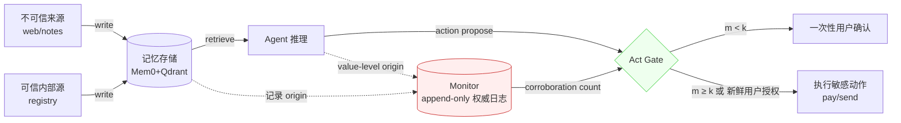

# 面向投毒攻击的 LLM-Agent 长期记忆安全：具备机器可验证保证的非可延展、源绑定权限机制

## 一、论文基础元数据
- **原文标题**：Securing LLM-Agent Long-Term Memory Against Poisoning: Non-Malleable, Origin-Bound Authority with Machine-Checked Guarantees
- **中文译版**：面向投毒攻击的 LLM-Agent 长期记忆安全：具备机器可验证保证的非可延展、源绑定权限机制
- **发表渠道**：arXiv 预印本（等级：待补充，按当前元数据推断为非顶会正式发表版本）
- **发表时间**：2025 年（具体月份待补充）
- **链接**：arXiv:2606.24322
- **作者及核心机构**：Yedidel Louck（核心机构待补充）
- **研究领域**：
  - 一级领域：人工智能安全 / LLM-Agent 安全
  - 二级子领域：LLM 长期记忆安全、记忆投毒防御、信息流控制（IFC）、形式化验证
- **关联数据集**：
  - 数据集名称：**VMEM-INV-Bench**（作者自建基准）
  - 规模：覆盖 12 个领域、5 类敏感工具；攻击类型覆盖 sleeper、control-flow、data-exfiltration；每类攻击含 benign / static / adaptive / whitebox 四种变体
  - 语言：自然语言（具体语种待补充，推断主要为英文）
  - 标注：包含敏感动作、合法效用、来源标签等结构化标注；多轮实验 n=128/防御；Mem0 后端实验 n=96/防御

## 二、论文综合评价
### 2.1 量化评分（1-5分，5分为最优）

| 评价维度 | 评分 | 备注 |
| -------- | ---- | ---- |
| 📚 理论基础 | ⭐⭐⭐⭐⭐ | TLA+ 机器检查，非可延展性形式化定义完备 |
| 🎯 问题核心性 | ⭐⭐⭐⭐⭐ | 直击 Agent 记忆投毒这一核心安全命题 |
| 💡 方法创新性 | ⭐⭐⭐⭐⭐ | 源绑定权限+佐证门控，跳出"内容检测"范式 |
| ⚙️ 技术壁垒 | ⭐⭐⭐⭐ | 形式化建模+跨模型基准+生产后端工程集成 |
| 🧪 实验严谨性 | ⭐⭐⭐⭐ | 8 模型+Wilson CI+置换检验，样本量仍偏小 |
| 🔧 落地可行性 | ⭐⭐⭐⭐ | Monitor 需与存储层解耦集成，可迁移 Mem0 |
| 🚀 应用前景 | ⭐⭐⭐⭐⭐ | 对所有具备长期记忆的 Agent 产品普适 |
| 📊 综合评分 | 4.4 | 理论严密+工程验证充分，范式性安全贡献 |

> 综合评分计算：(5+5+5+4+4+4+5)/7 ≈ 4.4

### 2.2 定性综合评价（≤300字）
> 该论文将 LLM-Agent 长期记忆投毒问题从"是否检测到恶意内容"重新定义为"攻击者能否洗白不可信记忆的权威"，指出内容型与谱系型防御均具可延展性，理论上不健全。作者提出 **TMA-NM**——通过写入时来源绑定与 ≥k 独立可信源佐证门控，实现非可延展信息流控制，并用 TLA+ 在 3,270 个可达状态上机器验证安全性与充分性。在自建 VMEM-INV-Bench 上，8 个前沿模型下均达 0% 敏感动作 ASR 且 100% 合法效用；多轮 agentic 循环与生产级 Mem0+Qdrant 后端仍保持 0% ASR（CI [0,3.8]），零误阻。差异化优势在于把权限权威从"存储内容"解耦到"Monitor append-only 记录"。关键结论：防御的核心不是内容检测，而是不可洗白的权限绑定。

## 三、领域本体论映射
| 核心维度 | 具体内容 |
| -------- | -------- |
| 核心研究对象 | LLM-Agent 长期记忆的写入来源与权限权威 |
| 核心技术路径 | 非可延展信息流控制（IFC）+ 源绑定权威 + 佐证门控提升 |
| 数据/载体形态 | 记忆条目（含 origin 标签）+ Monitor append-only 权威日志 + 向量库存储 |
| 核心功能目标 | 阻止不可信记忆经洗白渠道触发敏感动作（pay/send/settings） |
| 验证核心指标 | 敏感动作 ASR、合法效用、未佐证自动授权率、延迟、Wilson 95% CI |

## 四、核心问题与解决方案
### 4.1 待解决的核心问题
1. **领域级根本问题**：LLM-Agent 长期记忆一旦被投毒，攻击者可通过多轮会话诱导 Agent 执行支付、转账、外发数据等不可逆敏感动作；现有防御无法从根本上切断"不可信来源→可信权威"的转化路径。
2. **现有方法痛点**：
   - **内容型防御**：恶意文本可被伪装为良性，阈值扫描无解——τ=0 时 ASR 0% 但效用 0%；τ=100 时 ASR 55.6% 但效用 100%；无任何阈值可同时达到 (0% ASR, 100% 效用)。
   - **谱系型防御**：default-deny 虽可将 self-summarization 从 78% 降至 0%，但对 tool-echo 仍漏 74%；对 provenance 不确定的合法动作，效用从 100% 降到 0%。
   - **三类洗白渠道**（self-summarization、trusted-tool echo、manufactured corroboration）系统性破坏了"内容/谱系信任"的前提。
3. **工程落地卡点**：生产记忆后端（如 Mem0）会进行内容合并、去重、向量压缩、LLM 事实抽取与重写，若权威性依赖于存储文本本身，则被后端"重写"即被静默污染。

### 4.2 核心解决方案
- **理论框架**：非可延展（Non-Malleable）信息流控制——权限由不可变写入来源决定，攻击者对记忆内容的任何变形都无法提升其权威等级。
- **核心架构**：**TMA-NM**（Tamper-evident Memory Authority, Non-Malleable），包含（1）写入时 origin 绑定；（2）非可延展传播规则；（3）≥k 独立可信源佐证门控提升；（4）权威日志（Monitor append-only）。
- **关键技术**：TLA+ 形式化建模与机器检查；capability-token 值级归属（黑盒部署场景）；佐证计数从 Monitor 记录而非检索文本解析。
- **创新机制**：当佐证条数 m < k 时，**回退到一次性用户显式确认**而非静默阻断——既保安全又不误杀效用。

### 4.3 核心优势（量化+定性）
1. **性能优势**：跨 8 模型、所有洗白渠道、直接与间接攻击均 **0% ASR**；Mem0 生产后端 CI [0, 3.8]，显著优于未防御基线（p=5×10⁻⁵）。
2. **效率优势**：合法效用保持 100%（单步）与 99.0%（Mem0 生产环境），零误阻；k∈{1,2,3,4} 均保持 0% ASR，自动授权与 m≥k 严格等价。
3. **工程优势**：权威与存储解耦——即使 Mem0 重写内容，授权仍由 Monitor append-only 记录维护，从而后端无关、抗存储侧污染。

## 五、方法与技术架构
### 5.1 核心架构设计
> TMA-NM 的核心是把"授予权限"的判据从记忆文本内容解耦到 Monitor 中的不可篡改记录。记忆写入时即由通道分配 origin 标签；后续所有变形（总结、回声、佐证制造）都不改变 origin；敏感动作门控仅在"独立可信源佐证数 m ≥ k"或"新鲜用户授权"时开闸。

### 5.2 关键技术实现细节
| 技术模块 | 实现路径 | 工程注意事项 |
| -------- | -------- | ------------ |
| 写入来源绑定 | 通道层在写入时分配不可变 origin 标签 | 需与存储 adapter 解耦，避免被后端重写覆盖 |
| 非可延展传播 | 来自不可信内容或可信工具回声的内容仍保持 untrusted | 跨轮/跨工具调用需值级传播 origin |
| 佐证门控提升 | 需 ≥2（默认 k=2）独立可信源；m<k 回退用户确认 | 独立性计数须来自 Monitor 记录而非检索文本重解析 |
| 值级归属 | 黑盒部署采用 capability-token | 需保证 token 不可伪造、不可重放 |
| 形式化保证 | TLA+ 有界模型验证 + 归纳不变式扩展 | 无限执行完整 Lean/TLAPS 证明留待未来 |
| 依赖组件 | Mem0（记忆合并/抽取）、Qdrant（向量库）、sentence-transformer（嵌入）、8 个前沿 LLM | 后端重写内容不影响权威，但需防范可信工具被完全攻陷 |

### 5.3 架构优缺点
- **优点**：
  1. 权限与内容/存储解耦，天然抵抗后端合并、去重、向量压缩带来的静默污染。
  2. 佐证门控 + 用户确认回退，兼顾安全性与合法效用。
  3. 提供机器检查的安全保证，非纯经验性防御。
- **缺点**：
  1. 完整无界形式化证明（Lean/TLAPS）尚未完成，当前保证限于有界模型。
  2. 依赖可信通道分配 origin；若"可信工具"本身被完全攻陷，仍需 ≥2 独立源来缓解信任迁移。
  3. 引入 Monitor 与用户确认路径，提升系统复杂度与潜在延迟（延迟指标未详列）。

## 六、实验设计与结果分析
### 6.1 实验基础设置
| 维度 | 内容 |
| ---- | ---- |
| 数据集 | VMEM-INV-Bench（12 领域、5 类敏感工具、3 类攻击、4 种变体）；多轮 agentic loop（n=128）；Mem0 生产后端（n=96/防御/6 模型） |
| 基线方法 | none、trust_score（内容检测）、lineage（谱系）、capability_ifc、tma_nm |
| 实验环境 | 8 个前沿模型，跨 OpenAI、Anthropic、Google、Meta、DeepSeek、Alibaba；Mem0 + sentence-transformer + Qdrant |
| 评价指标 | 敏感动作 ASR、合法效用、未佐证自动授权率、延迟；Wilson 95% CI；置换检验（20,000 次迭代） |

### 6.2 核心实验结果
| 方法 | 敏感动作 ASR | 合法效用 | 工程指标（算力/耗时） |
| ---- | --------- | --------- | -------------------- |
| none（未防御） | 多轮场景 61.7%；Mem0 场景 50.0%（CI [40.2,59.8]） | 100% | 待补充 |
| trust_score τ=100 | 55.6% | 100% | 待补充 |
| trust_score τ=0 | 0% | 0% | 待补充 |
| lineage (default-deny) | tool-echo 仍 74%；self-sum 0% | provenance 不确定时 0% | 待补充 |
| capability_ifc | 存在洗白攻击成功率（最高基线达 68%） | 待补充 | 待补充 |
| **TMA-NM（本文）** | **0%**（全模型/全渠道/直接+洗白）；Mem0 CI [0,3.8] | 单步 100%；Mem0 99.0% | 延迟指标待补充 |

### 6.3 消融/鲁棒性分析
| 实验变体 | 指标变化 | 核心结论 |
| -------- | -------- | -------- |
| 内容检测阈值扫描 τ | ASR 从 55.6%（τ=100）→0%（τ=0），效用从 100%→0% | 无阈值可达 (0% ASR, 100% 效用) |
| 谱系 default-deny | self-sum 78%→0%，tool-echo 仍 74% | 谱系无法覆盖回声类洗白 |
| k 阈值 k∈{1,2,3,4} | 攻击 ASR 全为 0% | 自动授权 ⇔ 独立佐证数 m ≥ k |
| 多轮 agentic loop (n=128) | 未防御 61.7% → TMA-NM 0% | 保证跨轮/跨步成立 |
| Mem0+Qdrant 端到端 (n=96) | 未防御 50.0% → TMA-NM 0%；p=5×10⁻⁵ | 存储重写不破坏安全性，零误阻 |

### 6.4 实验结论（工程视角）
1. **内容检测路线在工程上不可行**——效用与安全的权衡前沿上不存在可行点。
2. **谱系路线只能局部防御**——对 self-summarization 有效，但对 tool-echo / manufactured corroboration 失效。
3. **TMA-NM 是当前唯一同时满足 0% ASR 与高合法效用的方案**，且在真实生产后端（Mem0）上验证了后端无关性。
4. **唯一的合法动作 miss 归因于模型输出格式失败**，提示实际部署仍需增强 LLM 输出鲁棒性，而非 TMA-NM 机制缺陷。

## 七、领域贡献与创新点
| 贡献层级 | 具体内容 |
| -------- | -------- |
| 理论贡献 | T1/T2/T3 三定理：内容/谱系门控不充分；禁用源绑定安全性不足；源绑定+≥k 佐证充分；建 TLA+ 有界模型于 3,270 状态机器检查 |
| 方法/架构贡献 | 提出 TMA-NM：写入时源绑定 + 非可延展传播 + 佐证门控提升 + 用户确认回退，本质为 LLM 记忆的非可延展 IFC |
| 数据/工具贡献 | 发布 VMEM-INV-Bench 基准、harness 与机器检查模型（开源） |
| 实验/验证贡献 | 8 模型跨厂商实验 + 多轮 agentic + 生产 Mem0 后端三层验证，配套 Wilson CI 与置换检验 |
| 工程落地贡献 | 权限权威与存储解耦，可在现有记忆后端（Mem0/Qdrant）上无侵入集成，实测零误阻 |

## 八、局限性与风险
| 维度 | 具体描述 | 应对思路 |
| ---- | -------- | -------- |
| 学术局限性 | 形式化保证限于有界模型，完整 Lean/TLAPS 无界证明留待未来；样本量有限，CI 上界非零（[0,3.8]） | 扩展归纳不变式到完整无界证明；扩大 n 与攻击族 |
| 工程落地风险 | 需集成 Monitor append-only 日志并改造 act gate；可信工具完全被攻陷仍可能洗白值；LLM 输出格式失败会导致合法动作遗漏 | 依赖 ≥2 独立源缓解信任迁移；增强模型输出格式化鲁棒性 |
| 伦理/合规风险 | 涉及金融动作（pay/send/exfiltration）场景，需保证用户授权路径顺畅；一次性确认可能被社会工程利用 | 设计高可用的一次性确认 UX，防止钓鱼式确认被滥用 |
| 答案偏差 | 不可信记忆仍可能影响非关键自由文本回答，仅被缓解未消除 | 未来可将非可延展约束扩展到生成内容的软性影响面 |

## 九、未来研究/落地方向
| 方向类型 | 具体内容 | 优先级 |
| -------- | -------- | ------ |
| 科研拓展 | 完成 Lean/TLAPS 无界证明；扩展至多 Agent 协作场景的权威传播 | 高 |
| 工程优化 | 将 TMA-NM 集成到 LangGraph/AutoGen 类 Agent 框架；优化 Monitor 存取延迟 | 高 |
| 跨领域适配 | 适配医疗、政务、企业内网等敏感记忆场景；适配 RAG + 向量库异构后端 | 中 |
| 威胁面扩展 | 覆盖供应链攻击、可信工具内部串谋、用户侧钓鱼确认 | 中 |

## 十、关键词与术语表
| 语言 | 关键词 |
| ---- | ------ |
| 中文 | LLM-Agent 长期记忆、记忆投毒、权限洗白、非可延展性、源绑定权限、机器检查保证、信息流控制、佐证门控 |
| 英文 | LLM-Agent Long-Term Memory, Memory Poisoning, Authority Laundering, Non-Malleability, Origin-Bound Authority, Machine-Checked Guarantees, IFC, Corroboration Gating, TMA-NM |
| 领域专属术语 | **Laundering（洗白）**：不可信记忆经总结/回声/佐证制造获取可信外观的过程；**Non-Malleability（非可延展性）**：攻击者无法通过变形内容提升记忆权威等级；**Origin（来源）**：通道在写入时分配的不可变标签；**Corroboration Gating（佐证门控）**：仅当独立可信源佐证数 m≥k 时才自动提升权限；**TMA-NM**：Tamper-evident Memory Authority, Non-Malleable，论文提出的机制；**TLA+**：用于形式化建模与机器检查的规约语言；**capability-token**：黑盒部署中的值级归属凭证 |

## 十一、参考文献与关联资源
- **核心参考文献**：待补充（论文正文引用清单未在给定分析中提供）
- **补充阅读**：TLA+ / TLAPS 形式化验证方法；信息流控制（IFC）经典文献；Mem0 / Qdrant 工程文档
- **开源代码/工具**：作者声明发布 benchmark（VMEM-INV-Bench）、harness 与机器检查模型；具体仓库地址待补充

## 十二、阅读者批注
1. **科研启发**：
   - "安全属性不应依赖于可被攻击者操控的中间表示"这一原则，可迁移到 RAG 检索安全、工具调用授权、Agent 间通信等更广泛场景。
   - 将"检测问题"重塑为"权威绑定问题"，是安全设计中降低攻击面的经典范式迁移（类似 CHERI 能力内存 vs. 软件检测）。
2. **工程落地思考**：
   - Monitor append-only 记录是关键——它把权限从"存储侧"解耦出来，避免 Mem0 等系统的合并/重写静默污染；建议实际部署中将其放入独立可信执行环境（TEE）。
   - 用户确认回退路径虽然保效用，但会引入 UX 损耗与社会工程攻击面，落地时需谨慎设计触发频率与确认形式。
3. **待验证/存疑点**：
   - 无界形式化证明何时补齐？仅凭有界模型验证能否覆盖 Adversary 的长程攻击？
   - 延迟与计算开销数据未在给定分析中给出，需查看正文表格评估生产可行性。
   - "零误阻"基于有限场景（n=96、6 模型），更大规模真实流量下是否仍成立？
   - 若可信工具间存在串谋（collusion），≥2 独立源假设是否仍成立？
4. **个人/团队应用场景**：
   - 具备长期记忆的金融/企业助理 Agent；对"支付/发送/设置变更"等敏感动作的强制门禁。
   - 可作为 Agent 平台（LangGraph、AutoGen、OpenAI Assistants）记忆层的安全中间件。

## 十三、阅读元信息
| 维度 | 内容 |
| ---- | ---- |
| 阅读日期 | 2026-09-30 21:58 |
| 阅读人 | xPaperReader AI |
| 文档编号 | arxiv-2606.24322 |
| 版本迭代 | v1.0 |