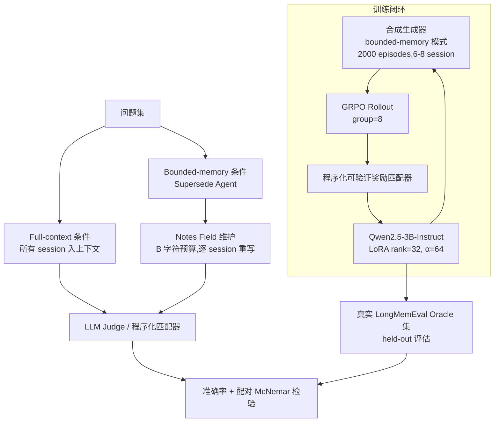

# Supersede：诊断与训练 LLM Agent 的记忆更新缺口

## 一、论文基础元数据
- **原文标题**：Supersede: Diagnosing and Training the Memory-Update Gap in LLM Agents
- **中文译版**：Supersede：诊断与训练 LLM Agent 的记忆更新缺口
- **发表渠道**：arXiv 预印本（等级：待补充，未标注会议/期刊）
- **发表时间**：2025 年（arXiv ID 前缀标注为 2606，年份字段标注为 2025，二者存在不一致，以原文为准）
- **链接**：arXiv:2606.27472
- **作者及核心机构**：Vedant Patel（核心机构：待补充）
- **研究领域**：
  - 一级领域：人工智能 / 大语言模型
  - 二级子领域：LLM Agent 记忆机制、长上下文多轮交互、Agent 强化学习训练
- **关联数据集**：
  - **LongMemEval（knowledge-update 子集）**：真实多轮对话基准
    - Oracle split：78 个问题，约 2 个 evidence session/问题，语言为英文，LLM judge（gpt-4.1-mini）按 LongMemEval 协议评分，并以程序化匹配器交叉验证
    - 长 _s split：约 48 个 session，约 122k tokens/问题，程序化匹配器评分
  - **合成生成器（Synthetic Generator）**：程序生成的 bounded-memory 训练数据，2000 episodes，6–8 个 session 时间线，事实先引入后被取代，更新埋于干扰 session 中

## 二、论文综合评价

### 2.1 量化评分（1-5分，5分为最优）

| 评价维度 | 评分 | 备注 |
| -------- | ---- | ---- |
| 📚 理论基础 | ⭐⭐⭐⭐ | 将 supersession 明确界定为 memory-policy 问题 |
| 🎯 问题核心性 | ⭐⭐⭐⭐⭐ | 直击 Agent 长程记忆维护的核心瓶颈 |
| 💡 方法创新性 | ⭐⭐⭐⭐ | 诊断+基准+训练闭环，训练算法本身非全新 |
| ⚙️ 技术壁垒 | ⭐⭐⭐⭐ | 需严格配对实验与可验证奖励环境构建 |
| 🧪 实验严谨性 | ⭐⭐⭐⭐⭐ | 配对 McNemar、交叉验证评分、held-out 评估 |
| 🔧 落地可行性 | ⭐⭐⭐⭐ | 3B 模型+LoRA 在 4×A10G 可复现 |
| 🚀 应用前景 | ⭐⭐⭐⭐⭐ | 生产级 Agent 记忆系统普遍需求 |
| 📊 综合评分 | 4.4 | 诊断扎实、结论可靠，训练方案部分有效待扩展 |

### 2.2 定性综合评价（≤300字）

> 本文聚焦 LLM Agent 在长多轮交互中的“记忆更新/取代”（supersession）缺口。作者通过严格控制的全上下文 vs 有界记忆配对实验，证明该缺口显著、可复现，且无法仅靠扩大模型规模或记忆容量闭合，其本质是记忆维护策略问题而非语言理解问题。差异化优势在于：拒绝已饱和的合成模板诊断，改用真实隐式更新的 LongMemEval knowledge-update 数据；以可验证奖励环境为基础设施，用 GRPO 训练 Qwen2.5-3B 的 bounded-memory agent，使其 held-out 准确率近乎翻倍，实现合成到真实的技能迁移。关键结论：supersession 不是下一代模型自然获得的能力，而是必须被显式优化训练的行为。整体为 Agent 记忆研究提供了可信基准、开放环境与首个缩小该缺口的训练证据。

## 三、领域本体论映射

| 核心维度 | 具体内容 |
| -------- | -------- |
| 核心研究对象 | LLM Agent 在有限记忆（bounded memory）下的事实更新与取代机制 |
| 核心技术路径 | 配对诊断实验（full-context vs bounded-memory）+ 可验证奖励强化学习（GRPO）训练 |
| 数据/载体形态 | 多轮会话文本；notes field（字符预算 B，默认 300 字符）作为记忆载体 |
| 核心功能目标 | 在有限记忆中正确维护并保留最新事实，覆盖过期旧值 |
| 验证核心指标 | 准确率（全上下文/有界记忆）、配对 McNemar p 值、held-out 迁移准确率 |

## 四、核心问题与解决方案

### 4.1 待解决的核心问题

1. **领域级根本问题**：LLM Agent 在长多轮交互中，当新信息取代旧信息时，能否在有限记忆约束下正确更新并保留新事实（supersession），该能力是否随模型规模自然涌现。
2. **现有方法痛点**：
   - 合成模板数据（显式“XX now YY”式更新）对前沿模型已饱和（近 100%），无法暴露真实失败；
   - 生产记忆系统中的启发式 update/delete 策略脆弱；
   - 让记忆随对话无限增长在规模化时不可持续。
3. **工程落地卡点**：前沿模型不可微调，难以直接训练记忆策略；且模型变大、记忆变大两种直觉解法经验证均无法闭合缺口。

### 4.2 核心解决方案

- **理论框架**：将 supersession 重新定义为**有界记忆下的记忆策略问题（memory-policy problem）**，而非理解或规模问题。
- **核心架构**：Supersede Agent —— 维护 B 字符 notes field（默认 B=300），逐 session 重写，原始 session 不再重新输入上下文；并设 full-context 条件作为能力上限参照。
- **关键技术**：
  - 真实对话数据（LongMemEval knowledge-update）诊断；
  - 程序化、可验证的奖励匹配器；
  - 合成生成器作为控制组与训练课程；
  - GRPO 算法 + LoRA 微调开源模型 Qwen2.5-3B-Instruct。
- **创新机制**：合成到真实的技能迁移验证（训练集与 held-out 评估集完全分离），证明在合成环境学到的“保持最新性”策略可迁移至真实数据。

### 4.3 核心优势（量化+定性）

1. **性能优势**：诊断出全上下文与有界记忆之间稳定 15–19 个百分点的差距（如 gpt-4.1：91%→64%），且配对 McNemar 检验 p 值均 < 0.005，统计成立；训练后 bounded-memory agent held-out 准确率几乎翻倍。
2. **效率优势**：使用 3B 小模型 + LoRA（rank=32，α=64，lr=10⁻⁵，batch=32，group=8）在 4×A10G GPU 上即可完成训练，工程门槛相对低。
3. **工程优势**：提供开放环境、可验证奖励基础设施，验证了“优化可训练记忆策略”优于“等待更大模型/更大记忆”的工程路线。

## 五、方法与技术架构

### 5.1 核心架构设计

> Supersede 环境由三条并行的处理路径构成：**(1) 诊断路径**——同一批问题分别在 full-context 与 bounded-memory 条件下运行，做配对对比；**(2) 训练路径**——在合成生成器的 bounded-memory 模式下用 GRPO 训练 Qwen2.5-3B；**(3) 评估路径**——在真实 LongMemEval oracle 集上用程序化匹配器进行 held-out 评估。Supersede Agent 在每轮读入单个 session，重写 notes field，丢弃原始 session。

### 5.2 关键技术实现细节

| 技术模块 | 实现路径 | 工程注意事项 |
| -------- | -------- | ------------ |
| Supersede Agent（有界记忆） | 维护 B 字符 notes field（默认 300），逐 session 重写，原始 session 不再输入 | 预算 B 需与历史长度做 constant-ratio 对照（每 session 150 字符匹配 oracle 比例） |
| 诊断实验 | 同批问题跑 full-context 与 bounded-memory，温度 0，配对比较 | 采用配对 McNemar 检验（连续性校正 χ²）确保统计显著性 |
| 评分与防偏见 | LLM judge（gpt-4.1-mini）+ 程序化匹配器交叉验证 | judge 本身是被评模型，必须用无 judge 的程序化匹配器交叉验证，避免自评偏差 |
| 合成生成器 | 程序生成 bounded-memory 模式训练数据，事实先引入后被取代，更新埋于干扰 session | 固定 2000 episodes，6–8 session 时间线，用于 stale-penalty 消融与训练课程 |
| GRPO 训练 | prime-rl 框架，LoRA rank=32、α=64、lr=10⁻⁵、batch=32、group=8 | 前沿模型不可微调，改用开源可训练模型 Qwen2.5-3B-Instruct；4×A10G GPU |
| 依赖组件 | prime-rl、LoRA、Qwen2.5-3B-Instruct、LongMemEval、gpt-4.1/4.1-mini/5.4 API | 评估用 greedy decoding（temperature=0），唯一随机因素为训练种子 |

### 5.3 架构优缺点

- **优点**：
  1. bounded-memory 强制模型维护而非重读历史，逼近真实 Agent 记忆瓶颈；
  2. 程序化可验证奖励可自动、无偏地评估，适合 group rollout baseline；
  3. 合成生成器与真实数据双轨设计，兼顾可控性与真实性；
  4. 评估与训练数据完全分离，迁移结论可信。
- **缺点**：
  1. notes field 为单一字符预算机制，未探索更结构化的记忆表示；
  2. 训练仅在 3B 小模型上验证，前沿模型不可微调，结论外推受限；
  3. 诊断数据集中于 knowledge-update 单一子集，覆盖面有限。

## 六、实验设计与结果分析

### 6.1 实验基础设置

| 维度 | 内容 |
| ---- | ---- |
| 数据集 | LongMemEval knowledge-update 子集（Oracle split 78 问题；长 _s split 约 48 session / 约 122k tokens）；合成生成器 2000 episodes |
| 基线方法 | full-context 条件（上限参照）、bounded-memory（Supersede Agent）；模型基线：gpt-4.1-mini、gpt-4.1、gpt-5.4；训练基线：Qwen2.5-3B-Instruct base |
| 实验环境 | gpt-4.1-mini/gpt-4.1（temperature=0）；gpt-5.4（reasoning_effort=low，无温度）；训练：prime-rl + LoRA，4×A10G GPU |
| 评价指标 | 准确率（full-context / bounded-memory）、配对 McNemar 检验 p 值、held-out 迁移准确率 |

### 6.2 核心实验结果

| 方法 | 核心指标1（全上下文准确率） | 核心指标2（有界记忆准确率） | 工程指标（配对结果/p 值） |
| ---- | --------- | --------- | -------------------- |
| gpt-4.1-mini | 82% | 63% | 19 题全上下文对、有界错；反向仅 4；p=0.0035 |
| gpt-4.1 | 91% | 64% | —（原文未给配对明细） |
| gpt-5.4 | 92% | 77% | 13 vs 1；p=0.0033 |
| **本文方法（Supersede + GRPO 训练）** | —（训练针对 bounded-memory） | **held-out 准确率几乎翻倍**（绝对数值待补充） | 随学习单调提升，部分有效 |

跨模型趋势：全上下文准确率 82%→91%→92%，已接近饱和；有界记忆准确率 63%→64%→77%，提升明显更慢，差距稳定在 15–19 个百分点。

### 6.3 消融实验/鲁棒性分析

| 实验变体 | 指标变化 | 核心结论 |
| -------- | -------- | -------- |
| 模型规模扩大（mini → 4.1 → 5.4） | 全上下文近饱和，有界记忆仍远低 | 缺口不随模型变大而闭合 |
| 记忆预算扩大（Section 5.2） | 缺口不闭合 | 缺口不随记忆变大而闭合，无限增长不可持续 |
| 历史长度变化（oracle vs. _s） | 对话增长缺口加深 | 缺口随对话增长而加剧 |
| 合成模板 vs. 真实隐式更新 | 前沿模型在合成模板近 100%，真实数据显著下降 | 合成模板已饱和，无法暴露真实失败 |
| 预算 B 设定（constant-ratio，每 session 150 字符） | 匹配 oracle 比例做对照 | 排除预算比例本身造成的偏差 |
| 监督/评分方式（LLM judge vs. 程序化匹配器） | 交叉验证一致 | 排除自评偏差，评分内部精确 |

### 6.4 实验结论（工程视角）

从工程角度，本研究表明：生产级 Agent 记忆系统不应寄望于“更大模型”或“无限记忆”来自然解决事实更新问题；缺口在统计上稳定成立且随对话增长而加深。可行的工程路线是**显式优化可训练的 update/delete/保留策略**，并借助程序化可验证奖励环境进行训练。同时，即使在全上下文条件下仍有约 13% 问题答错，提示部分错误源于更新逻辑本身，工程实现中需对更新链路单独设计校验。

## 七、领域贡献与创新点

| 贡献层级 | 具体内容 |
| -------- | -------- |
| 理论贡献 | 将 supersession 重新定义为有限记忆下的 memory-policy 问题，而非理解或规模问题 |
| 方法/架构贡献 | 提出 Supersede 环境与 bounded-memory Agent（notes field 机制）；构建合成生成器作为训练课程与消融对照 |
| 数据/工具贡献 | 发布 Supersede 开放环境、诊断方法与可验证奖励基础设施 |
| 实验/验证贡献 | 通过严格配对实验证明缺口显著、可复现、随对话增长加深；提供合成到真实的迁移证据 |
| 工程落地贡献 | 首个缩小该缺口的训练结果，验证“训练保持最新性的策略”优于扩大模型/记忆的工程路线 |

## 八、局限性与风险

| 维度 | 具体描述 | 应对思路 |
| ---- | -------- | -------- |
| 学术局限性 | 训练仅在 Qwen2.5-3B 小模型验证，前沿模型不可微调；提升为部分有效；诊断数据限于 knowledge-update 单一子集 | 扩展到更大可训练模型与多类型记忆任务；补充更多基准 |
| 工程落地风险 | notes field 为固定字符预算的简单机制，可能不适配结构化记忆；合成训练策略在真实复杂场景的泛化性待验证 | 探索结构化/分层记忆表示；引入真实数据持续训练与在线评估 |
| 伦理/合规风险 | 记忆更新策略若失效可能导致 Agent 保留过期或错误事实，影响决策可靠性 | 部署前对 update/delete 策略做专项审计与回退机制 |

## 九、未来研究/落地方向

| 方向类型 | 具体内容 | 优先级 |
| -------- | -------- | ------ |
| 科研拓展 | 在更大可训练模型上验证训练方法；扩展至多类型记忆任务（非仅 knowledge-update） | 高 |
| 工程优化 | 优化可训练的 update/delete/保留策略；设计结构化记忆载体替代固定字符 notes field | 高 |
| 跨领域适配 | 将该诊断与训练范式适配到多模态 Agent、工具调用与长期个性化场景 | 中 |

## 十、关键词与术语表

| 语言 | 关键词 |
| ---- | ------ |
| 中文 | 记忆更新缺口、有界记忆、全上下文、事实取代、记忆策略、强化学习、Agent 记忆 |
| 英文 | Memory-Update Gap, Supersession, Bounded Memory, Full-Context, Memory Policy, GRPO, LLM Agent Memory |
| 领域专属术语 | **Supersession（取代）**：新事实覆盖旧事实的记忆更新过程；**Bounded Memory（有界记忆）**：以固定预算（B 字符 notes field）维护记忆，原始输入不再重读；**Memory-Update Gap（记忆更新缺口）**：有界记忆与全上下文条件下的准确率差距；**Full-Context（全上下文）**：所有 session 入上下文作为能力上限；**GRPO（Group Relative Policy Optimization）**：基于 group rollout 的可验证奖励强化学习算法；**Oracle split**：含约 2 个 evidence session/问题的精标注子集 |

## 十一、参考文献与关联资源

- **核心参考文献**：LongMemEval（knowledge-update 子集来源）；LongMemEval 官方评分协议
- **补充阅读**：GRPO 相关强化学习文献（待补充具体引用）；LLM Agent 长期记忆综述（待补充）
- **开源代码/工具**：prime-rl 训练框架；Qwen2.5-3B-Instruct；Supersede 开放环境（论文发布，仓库链接待补充）

## 十二、阅读者批注

1. **科研启发**：将“记忆失败”从能力问题重构为策略问题，是一个方法论层面的范式转换；合成生成器作为“教师课程”实现合成到真实迁移，为其他 Agent 技能训练提供了可借鉴范式。
2. **工程落地思考**：生产记忆系统应优先设计可训练、可验证的 update/delete 策略，并配备程序化校验，而非依赖模型规模或无限记忆；字符预算式 notes field 是轻量但粗糙的起点。
3. **待验证/存疑点**：
   - 训练后 “held-out 准确率几乎翻倍” 的绝对数值未在提供片段中给出，需核对原文 Table；
   - arXiv ID 前缀（2606）与年份字段（2025）存在不一致，需核实；
   - 单作者论文，实验广度与前沿模型（gpt-5.4）配置细节需进一步确认；
   - 训练方法细节（目标函数、干预设计）在提供片段中未展开，标题含“Training”但训练方案描述有限。
4. **个人/团队应用场景**：适用于长会话客服/助理 Agent 的事实时效维护、个人化记忆系统的 update/delete 策略训练，以及将可验证奖励环境用于 Agent 记忆策略的持续优化。

## 十三、阅读元信息

| 维度 | 内容 |
| ---- | ---- |
| 阅读日期 | 2026-09-30 22:01 |
| 阅读人 | xPaperReader AI |
| 文档编号 | arxiv-2606.27472 |
| 版本迭代 | v1.0 |