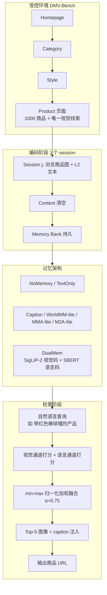

# DMV-Bench：以附带线索注入诊断长时程多模态智能体的视觉记忆

## 一、论文基础元数据

- **原文标题**：DMV-Bench: Diagnosing Long-Horizon Multimodal Agents' Visual Memory with Incidental Cue Injection
- **中文译版**：DMV-Bench：以附带线索注入诊断长时程多模态智能体的视觉记忆
- **发表渠道**：预印本（arXiv），等级待补充（未提供接收会议/期刊信息）
- **发表时间**：2025 年
- **链接**：arXiv:2606.27499
- **作者及核心机构**：Yujin Tang、Chenming Shang、Ruize Xu、Nikhil Singh（具体机构待补充）
- **研究领域**：一级领域——人工智能 / 多模态大模型；二级子领域——多模态智能体记忆（Multimodal Agent Memory）、长时程交互评测基准
- **关联数据集**：DMV-Bench（自建合成家具电商目录：10 类别 × 10 风格 × 10 变体 = 1,000 个产品；每个产品注入 1 个唯一视觉线索，线索词汇表为 100 对象 × 10 颜色；语言：英文；标注：ground-truth 产品 URL + 附带线索标签 + L2 文本契约字段审计 13,140 个文本字段）

## 二、论文综合评价

### 2.1 量化评分（1-5分，5分为最优）

| 评价维度 | 评分 | 备注 |
| -------- | ---- | ---- |
| 📚 理论基础 | ⭐⭐⭐⭐ | 基于双编码理论构建 DualMem，理论支撑扎实 |
| 🎯 问题核心性 | ⭐⭐⭐⭐⭐ | 直击多模态 Agent 长时程视觉记忆评测空白 |
| 💡 方法创新性 | ⭐⭐⭐⭐ | Incidental Cue Injection 与 L2 泄漏契约设计新颖 |
| ⚙️ 技术壁垒 | ⭐⭐⭐ | 核心为基准设计+双通道融合，实现门槛适中 |
| 🧪 实验严谨性 | ⭐⭐⭐⭐⭐ | cluster bootstrap+配对置换检验，统计严谨 |
| 🔧 落地可行性 | ⭐⭐⭐⭐ | 合成环境可控，易复现，但跨域迁移待验证 |
| 🚀 应用前景 | ⭐⭐⭐⭐ | 为多模态记忆系统评测提供标准化坐标系 |
| 📊 综合评分 | 4.3 | 问题定位精准、方法稳健、统计严谨，跨域与人类上限待补 |

### 2.2 定性综合评价（≤300字）

> DMV-Bench 是首个面向交互式、多会话、长时程多模态 Agent 视觉记忆的评测基准。其核心洞察在于：文本记忆基准无法诊断"偶然看到但从未被主动记录"的视觉线索——把观察压缩成语言会丢失关键信息。论文通过 Incidental Cue Injection（在 1,000 个商品图中注入唯一"小彩物"如"红色棒球帽"）与 L2-leakage contract（所有文本通道封顶在粗粒度类别/集合层，扫 13,140 字段确认线索零泄露），构造了必须依赖视觉记忆才能完成的任务。作者同时提出 DualMem，基于双编码理论并行保留 SigLIP-2 视觉码与 SBERT 语言码，以 α=0.75 视觉主导权重融合。在 Gemini 2.5 Flash 与 Qwen2.5-VL-7B 上，DualMem 在 J∈{5,10,15} 全部单元领先（如 Gemini J=5: 82.7 vs M2A-lite 65.7），配对置换检验 p≤0.0059。消融表明视觉通道主导召回（纯视觉 79.7 vs 纯语言 65.1），captioner 仅 16.5% 的 cued caption 真正说出线索。该工作为多模态记忆系统提供了统一的 encode/retrieve/inject 评测坐标系。

## 三、领域本体论映射

| 核心维度 | 具体内容 |
| -------- | -------- |
| 核心研究对象 | 长时程交互式多模态智能体的视觉记忆，尤其是对"偶发/附带视觉线索"的跨会话保留与召回能力 |
| 核心技术路径 | 受控合成环境 + 附带线索注入 + 文本泄漏契约隔离 → 统一 encode/retrieve/inject 框架下比较 7 种记忆架构；DualMem 采用视觉-语言双编码混合检索 |
| 数据/载体形态 | 合成家具电商网站（4 层导航：Homepage → Category → Style → Product），1,000 个产品 PNG 图像（各含唯一视觉线索），L2 粒度文本字段，跨会话记忆库 |
| 核心功能目标 | 检验 Agent 在上下文反复清空后，能否依据自然语言描述（如"带红色棒球帽的产品"）精确召回曾偶然瞥见的商品并命中唯一 URL |
| 验证核心指标 | 任务成功率 TSR（按 recall reach r 分层）、精确 URL 匹配、簇 bootstrap 95% CI、配对符号翻转置换检验精确 p 值 |

## 四、核心问题与解决方案

### 4.1 待解决的核心问题

1. **领域级根本问题**：现有 Agent 记忆评测多为文本或显式记录导向，无法衡量"智能体被动看过、未主动编码"的视觉信息在长时程、多次上下文清空后的保留能力；多模态智能体的"视觉记忆"缺乏独立、无泄漏的诊断工具。
2. **现有方法痛点**：
   - 文本基准存在语言捷径，Agent 可通过文本描述绕过视觉记忆；
   - 现有外部多模态记忆系统接口不统一，难以公平对比；
   - 长时程评测样本依赖生成，历史观察易通过 UI（如"Recently reviewed"）或文本字段泄漏；
   - 探针在同一 seed 链内共享轨迹与记忆状态，非独立，常规 i.i.d. bootstrap 低估不确定性。
3. **工程落地卡点**：
   - 如何构造既可控又可大规模复用的交互环境；
   - 如何确保线索只存在于像素中（无文本/UI 泄漏）；
   - 如何在扩展 horizon 时避免重复浏览带来的方差与算力浪费；
   - 如何为不同记忆架构提供统一、可归因的比较接口。

### 4.2 核心解决方案

- **理论框架**：双编码理论（Dual Coding Theory）——视觉与语言作为两条并行编码通道；配合受控实验设计原则（单一变量、跨架构重放缓存）。
- **核心架构**：
  - DMV-Bench：受控家具电商环境 + Incidental Cue Injection + L2-leakage contract + No-cross-page-persistence 不变式；
  - DualMem：SigLIP-2 视觉编码 + SBERT 语言编码，双通道 min-max 归一化后加权融合（α=0.75），注入阶段返回 top-5 原始图像 + caption。
- **关键技术**：
  - 附带线索注入（100 对象 × 10 颜色，身份绑定、不预告、不可文本获知）；
  - 13,140 个文本字段扫描的 L2 泄漏契约；
  - "Recently viewed" 跨 session 重置；
  - memoryless 编码 Agent，轨迹仅由 (seed, j) 决定，使 J=5 轨迹为 J=15 前缀，支持缓存复用；
  - 簇 bootstrap（10,000 次重采样）与链级配对符号翻转置换检验。
- **创新机制**：将"视觉记忆"从"主动记录"重新定义为"被动瞥见后的保留与召回"；用统一 encode/retrieve/inject 坐标系审计 7 种架构。

### 4.3 核心优势（量化+定性）

1. **性能优势**：DualMem 在 J∈{5,10,15} 全部六个 exhaustive 单元领先。Gemini J=5 82.7% vs M2A-lite 65.7%；Qwen J=5 81.2% vs 69.0%；Qwen J=15 74.6% vs 62.6%；Gemini J=15 71.3% vs 61.9%。J=50 试点在 Qwen 上领先 8.5 分。
2. **效率优势**：memoryless 编码 + 轨迹缓存复用，扩展 horizon 只需跑新增 session；跨架构重放同一观测与探针集，显著降低浏览方差。
3. **工程优势**：统一 encode/retrieve/inject 接口，可嵌入不同外部记忆系统；NoMemory/TextOnly 全 0 验证了语言捷径不成立，任务纯净度高；统计方法适配非独立探针结构，结论更可信。

## 五、方法与技术架构

### 5.1 核心架构设计

> **环境侧**：合成家具电商网站，四层导航 Homepage → Category → Style → Product，10 类别 × 10 风格 × 10 变体 = 1,000 个产品。每个产品图注入唯一附带视觉线索（如"红色棒球帽"）；所有文本字段封顶在 L2 粒度（类别、集合名、粗属性），不含可区分变体的 L3+ 文本。UI 的 "Recently viewed" 只保留当前 session，跨 session 重置。
>
> **任务侧**：编码阶段 Agent 在 J 个 session 中连续比较购物，session 间上下文清空，仅 memory bank 持久；检索阶段用自然语言描述（如"带红色棒球帽的产品"）召回目标商品；评分依据最终 URL 精确匹配，以 recall reach r 分层。
>
> **架构对比侧**：7 种记忆架构统一映射到 encode / retrieve / inject 三段坐标系。
>
> **DualMem**：视觉通道 SigLIP-2 编码图像，语言通道 SBERT 编码 VLM caption，双通道独立打分 → min-max 归一化 → 加权融合（α=0.75），注入 top-5 原始图像 + caption。

### 5.2 关键技术实现细节

| 技术模块 | 实现路径 | 工程注意事项 |
| -------- | -------- | ------------ |
| 附带线索注入 | 100 对象 × 10 颜色，每产品图绑定唯一 cue，不预告、不可从文本获知 | 需确保 cue 与 L2 文本、UI 元素完全解耦 |
| L2-leakage contract | 扫描 13,140 个文本字段，cue 词汇零出现 | 任何 L3+ 文本都可能成为捷径，需自动化审计 |
| No-cross-page-persistence | "Recently viewed" 跨 session 重置 | 防止 UI 泄漏历史观察，破坏长时程评估 |
| Memoryless 编码 Agent | 轨迹仅由 (seed, j) 决定，与总链长 J 无关 | J=5 轨迹为 J=15 前缀，可缓存复用 |
| 跨架构重放 | 所有架构在同一观测、顺序、探针集上比较 | 降低浏览方差，使差异可归因于记忆架构 |
| DualMem 视觉通道 | SigLIP-2 编码图像，跨模态检索 | 视觉编码可区分性关键（换 CLIP 损失 9.9 分） |
| DualMem 语言通道 | SBERT 编码 VLM caption | captioner 固定 Gemini 2.5 Flash，跨块含义一致 |
| 双通道融合 | min-max 归一化后加权求和，主实验 α=0.75 | Qwen 直接沿用 0.75，未做独立扫参（局限） |
| 统计检验 | 簇 bootstrap 10,000 次；配对符号翻转置换检验枚举 2^K | 探针非独立，naive bootstrap 会低估不确定性 |
| 任务评分 | 最终 URL 精确匹配，y_p ∈ {0,1}，TSR = 平均 y_p | 按 reach r 分层揭示长时程保留能力 |

### 5.3 架构优缺点

- **优点**：
  - 环境高度可控、无文本泄漏，任务纯净依赖视觉记忆；
  - memoryless 编码 + 缓存复用使长时程评测高效；
  - 统一 encode/retrieve/inject 坐标系支持跨系统公平对比；
  - DualMem 直接落地双编码理论，结构简洁、可解释性强；
  - 统计方法适配非独立探针结构，结论可靠。
- **缺点**：
  - 仅覆盖合成家具目录，视觉域单一，跨域迁移未测；
  - captioner 固定为 Gemini 2.5 Flash，导致 Qwen 流程非完全开放权重；
  - α 主要在 Gemini 上扫，Qwen 直接沿用 0.75，融合策略自适应不足；
  - J=50 试点仅 5 条链，统计功效低；
  - 未设人类上限对照；
  - 主要覆盖 Gemini 2.5 Flash 与 Qwen2.5-VL-7B 两个 VLM，跨 VLM 覆盖有限。

## 六、实验设计与结果分析

### 6.1 实验基础设置

| 维度 | 内容 |
| ---- | ---- |
| 数据集 | DMV-Bench 自建合成家具电商环境：10 类别 × 10 风格 × 10 变体 = 1,000 产品；每条产品图 1 个附带视觉线索；13,140 个 L2 文本字段审计 |
| 基线方法 | NoMemory、TextOnly、Caption、WorldMM-lite、MMA-lite、M2A-lite；DualMem（本文方法） |
| 实验环境 | 后端 VLM：Gemini 2.5 Flash、Qwen2.5-VL-7B；Captioner 固定 Gemini 2.5 Flash；链长 J ∈ {5,10,15}；J=50 蒙特卡洛试点 |
| 评价指标 | 任务成功率 TSR（按 recall reach r 分层）、URL 精确匹配、簇 bootstrap 95% CI、配对符号翻转置换检验精确 p 值 |

### 6.2 核心实验结果

| 方法 | TSR (Gemini J=5) | TSR (Qwen J=5) | 工程指标（算力/耗时） |
| ---- | --------- | --------- | -------------------- |
| NoMemory | ≈0% | ≈0% | 待补充 |
| TextOnly | ≈0% | ≈0% | 待补充 |
| WorldMM-lite | 43.5% | 37.3% | 待补充 |
| MMA-lite | 46.1% | 47.7% | 待补充 |
| Caption | 58.9% | 67.9% | 待补充 |
| M2A-lite | 65.7% | 69.0% | 待补充 |
| **DualMem（本文）** | **82.7%** | **81.2%** | 待补充 |

**中长程补充数据**：
| 设置 | DualMem | M2A-lite | Caption | WorldMM-lite | MMA-lite |
| ---- | ------- | -------- | ------- | ------------ | -------- |
| Gemini J=15 | **71.3** | 61.9 | — | — | — |
| Qwen J=15 | **74.6** | 62.6 | — | — | — |
| Gemini J=50 | 65.1 | 64.7（持平，p=0.6875） | — | — | — |
| Qwen J=50 | **+8.52 点** | — | — | — | —（p=0.0625，最小可达双侧值） |

### 6.3 消融实验/鲁棒性分析

| 实验变体 | 指标变化 | 核心结论 |
| -------- | -------- | -------- |
| 纯视觉检索 vs 纯语言检索 | 79.7 vs 65.1 | 视觉通道主导召回信号 |
| 融合权重 α 扫描 | α=0.75 最优；完全丢弃语言信号损失约 2.3 分 | 视觉权重高，语言通道提供辅助 grounding |
| Captioner 说出 cue 比例 | 仅 16.5% 的 cued caption 真正说出 cue | 视觉→文本压缩大量丢失附带线索 |
| 注入形态：image-only vs caption-only | 79.9 vs 72.0 | 图像注入显著优于 caption 注入 |
| 视觉编码器：SigLIP-2 vs CLIP | -9.9 分 | 视觉编码可区分性是关键 |
| 统计方法：cluster vs naive CI | 如 Gemini J=15 MMA-lite：naive [35.2,36.4] vs cluster [31.3,39.4] | cluster bootstrap 更诚实反映不确定性 |
| 显著性检验 J∈{5,10,15} | 六个 exhaustive 单元均 p≤0.0059 | DualMem 优势稳健显著 |

### 6.4 实验结论（工程视角）

- **任务纯净性验证有效**：NoMemory 与 TextOnly 在所有单元均为 0%，证明 L2-leakage contract 成功封堵语言捷径，任务必须依赖视觉记忆。
- **视觉码不可替代**：captioner 仅 16.5% 成功编码 cue，说明"先压缩再记忆"会系统性丢失附带视觉信息；工程上应避免过早的视觉→文本压缩。
- **DualMem 优势稳健但非普适**：短中链长（J≤15）在两个后端均显著领先；但 J=50 Gemini 上与 M2A-lite 持平，提示超长时程下视觉码的优势可能被稀释，需更长链验证。
- **统计严谨性达标**：簇 bootstrap 与配对置换检验适配非独立探针结构，J≤15 的结论支撑充分；J=50 因仅 5 条链，p=0.0625 为最小可达双侧值，统计功效不足，结论应谨慎。
- **可区分视觉编码是关键**：SigLIP-2→CLIP 损失 9.9 分，工程选型时应优先保证视觉编码器的可区分性。

## 七、领域贡献与创新点

| 贡献层级 | 具体内容 |
| -------- | -------- |
| 理论贡献 | 提出"附带视觉记忆"（incidental visual memory）作为多模态 Agent 记忆的独立评测维度，区分于主动记录导向的文本记忆评测；将双编码理论引入 Agent 外部记忆设计 |
| 方法/架构贡献 | 提出 DualMem：并行保留未压缩视觉码（SigLIP-2）与语言码（SBERT）的双通道混合检索与注入架构，α=0.75 视觉主导融合 |
| 数据/工具贡献 | 构建 DMV-Bench：1,000 产品、1,000 唯一附带线索、13,140 字段审计的受控评测环境；提供统一的 encode/retrieve/inject 架构审计框架 |
| 实验/验证贡献 | 系统审计 7 种记忆架构；引入簇 bootstrap 与链级配对符号翻转置换检验适配非独立探针；验证 NoMemory/TextOnly 全 0 的任务纯净性 |
| 工程落地贡献 | memoryless 编码 + 轨迹缓存复用实现高效长时程评测；统一接口便于接入不同外部记忆系统；为多模态记忆系统选型提供可量化参考 |

## 八、局限性与风险

| 维度 | 具体描述 | 应对思路 |
| ---- | -------- | -------- |
| 学术局限性 | 仅合成现代家具目录，视觉域单一，跨视觉域迁移未测；主要覆盖 Gemini 2.5 Flash 与 Qwen2.5-VL-7B；无人类上限对照；α 主要在 Gemini 上扫，Qwen 直接沿用；J=50 仅 5 条链，统计功效低 | 扩展多领域目录、多 VLM 覆盖；增设人类对照；对每个后端独立扫 α；扩大 J=50 链数 |
| 工程落地风险 | captioner 固定 Gemini 2.5 Flash 导致 Qwen 流程非完全开放权重；合成环境与真实电商/浏览器 UI 存在差异；线索设计为单一物体+颜色，真实场景视觉线索更复杂 | 开源 captioner 替代方案；迁移至真实网站做影子测试；设计更复杂、多属性的附带线索 |
| 伦理/合规风险 | 附带线索注入可能被类比为"隐式追踪/暗模式"；合成商品数据无隐私问题，但方法若迁移到真实用户行为分析需注意知情同意与数据合规 | 明确告知式设计；真实场景部署前做伦理审查与合规评估 |

## 九、未来研究/落地方向

| 方向类型 | 具体内容 | 优先级 |
| -------- | -------- | ------ |
| 科研拓展 | 跨视觉领域迁移验证（工业、医疗、文档等）；更自适应、可学习的视觉/语言融合权重；更长 horizon（J≫50）与更多链的统计验证；人类上限对照实验 | 高 |
| 工程优化 | 开源 captioner 替代方案以支持完全开放权重流程；记忆库压缩与检索加速；视觉编码器可区分性系统选型 | 中 |
| 跨领域适配 | 迁移至真实电商推荐/比价 Agent、GUI Agent 长期记忆、具身智能多会话环境记忆 | 中 |

## 十、关键词与术语表

| 语言 | 关键词 |
| ---- | ------ |
| 中文 | 长时程多模态 Agent、视觉记忆、附带线索注入、双编码理论、记忆架构评测、跨会话保留、文本泄漏契约、双通道混合检索 |
| 英文 | Long-Horizon Multimodal Agent, Visual Memory, Incidental Cue Injection, Dual Coding Theory, Memory Architecture Benchmark, Cross-Session Retention, L2-Leakage Contract, Dual-Channel Hybrid Retrieval |
| 领域专属术语 | **Incidental Cue Injection（附带线索注入）**：在商品图中注入不预告、身份绑定、不可从文本获知的唯一视觉线索，用于检验被动视觉记忆；**L2-leakage contract（L2 泄漏契约）**：所有文本通道限制在类别/集合/粗属性粒度，禁止出现可区分变体的 L3+ 文本；**No-cross-page-persistence**：UI 不跨 session 保留浏览历史，防止历史观察泄漏；**Recall Reach（召回触达深度）**：探针距编码起点的会话距离，用于分层衡量长时程保留；**TSR（Task Success Rate）**：URL 精确匹配的任务成功率；**Cluster Bootstrap**：以链为簇重采样以适配非独立探针的统计方法；**DualMem**：并行保留 SigLIP-2 视觉码与 SBERT 语言码并加权融合的记忆架构 |

## 十一、参考文献与关联资源

- **核心参考文献**：待补充（分组分析中未列出正文引用列表）
- **补充阅读**：双编码理论（Dual Coding Theory）原始文献、SigLIP-2、SBERT、M2A、WorldMM、MMA 等被审计记忆系统原文
- **开源代码/工具**：待补充（未提及代码库地址）

## 十二、阅读者批注

1. **科研启发**：DMV-Bench 的核心洞察——"被动瞥见 vs 主动记录"是两类不同的记忆能力——可迁移到 GUI Agent、具身智能、代码 Agent 等多会话场景。L2-leakage contract 是一种可复用的"隔离捷径"方法论，值得在其他基准设计中借鉴。
2. **工程落地思考**：DualMem 的极简双通道结构具备工程可行性；但真实系统若直接用 VLM caption 做语言通道，需注意 captioner 本身的线索丢失率（本文仅 16.5% 命中）。视觉编码器的可区分性（SigLIP-2 vs CLIP 差 9.9 分）应作为选型首要指标。memoryless 编码 + 轨迹缓存的评测设计是长时程 Agent 评测的高效范式。
3. **待验证/存疑点**：
   - J=50 Gemini 上 DualMem 与 M2A-lite 持平，仅 5 条链不足以定论，视觉码优势是否随 horizon 稀释需进一步验证；
   - α=0.75 在 Qwen 上未独立扫参，是否存在后端依赖的最优融合策略存疑；
   - 合成家具目录的视觉线索为"单一物体+颜色"，真实场景中线索多属性、多模态，迁移性待验证；
   - 无人类上限对照，无法判断 82.7% 是否接近该任务的性能天花板。
4. **个人/团队应用场景**：多模态 RAG 记忆库设计、长期运行的电商/比价 Agent、跨会话个人助理记忆模块、GUI Agent 长期上下文管理；也可作为团队内部多模态记忆系统选型的标准评测套件。

## 十三、阅读元信息

| 维度 | 内容 |
| ---- | ---- |
| 阅读日期 | 2026-09-30 22:03 |
| 阅读人 | xPaperReader AI |
| 文档编号 | arxiv-2606.27499 |
| 版本迭代 | v1.0 |